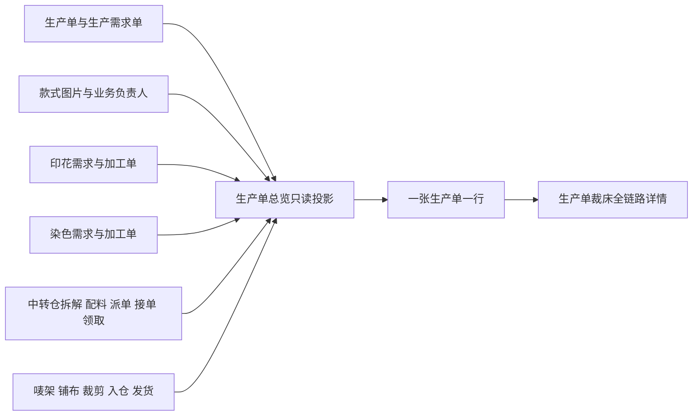

# 裁床总览－生产单总览产品设计

## 1. 设计目标

在「工艺工厂运营系统－裁床厂管理－裁床总览」中，重构现有「生产单总览」，形成一张以生产单为主线的只读状态总览。

页面覆盖全部存在裁床需求的生产单，包括：

- 尚未派单的生产单。
- 派给中央裁床厂的生产单。
- 派给第三方裁床厂的生产单。

页面帮助裁床主管和业务运营人员同时查看下单、印染、中转仓、裁床和发货状态。页面只展示各业务模块已经产生的客观事实，不判断阻塞、异常、风险或处理优先级。

## 2. 角色与使用方式

### 2.1 主要角色

- 裁床主管。
- 裁床运营人员。
- 需要了解裁床全量生产单状态的业务人员。

### 2.2 页面性质

- 页面属于 Web 管理端 / 主管端。
- 页面是只读总览，不是一线执行页。
- 页面不提供修改业务状态、批量处理或人工补状态能力。
- 所有状态均由来源业务事实自动汇总。

## 3. 核心业务口径

### 3.1 一张生产单一行

主表始终以生产单为唯一行粒度。一张生产单即使关联多个印染加工单、配料单、裁片单或多家裁床厂，也不能拆成多条生产单记录。

多个子单的状态在生产单行中汇总；需要查看子单差异时进入生产单详情。

### 3.2 多工厂在单元格内逐行对齐

同一生产单派给多家裁床厂时，「派单工厂、接单状态、领取状态」必须按照同一工厂顺序逐行对齐。例如：

| 派单工厂 | 接单状态 | 领取状态 |
| --- | --- | --- |
| 泗水中央裁床厂｜中央工厂 | 已接单 | 部分领取 |
| 宏达裁片厂｜第三方工厂 | 未接单 | 未领取 |

多行展示不改变一张生产单一行的业务粒度。

### 3.3 只展示业务事实

页面不得根据状态组合推断：

- 当前阻塞。
- 是否异常。
- 风险等级。
- 是否超时。
- 责任归因。
- 下一步处理建议。

是否需要关注或处理，由业务人员根据各节点的实际状态自行判断。

## 4. 页面结构

页面采用横向全链路宽表：

1. 顶部为常用筛选和已选条件。
2. 主表采用两层分组表头。
3. 「生产单」「款式」两列固定在左侧。
4. 印染、中转仓和裁床状态区域支持横向滚动。
5. 表格底部提供分页。

主表按以下模块分组：

| 模块 | 列 |
| --- | --- |
| 下单模块 | 生产单、款式 |
| 印染模块 | 印花状态、染色状态 |
| 中转仓 | 拆解状态、配料状态、派单工厂 / 接单 / 领取 |
| 裁床厂 | 唛架状态、铺布状态、裁剪状态、入仓状态、发货状态 / 接收工厂 |

页面不保留「当前阻塞」列，也不增加异常、风险或建议类列。

## 5. 主表字段

### 5.1 生产单列

生产单列展示：

- 生产单号。
- 生产单生成时间。
- 生产需求单号。
- 生产需求单创建时间。

生产单号可进入该生产单的裁床全链路详情。

### 5.2 款式列

款式列展示：

- 真实款式图片。
- 款式名称。
- 款式编号。
- 跟单。
- 买手。

图片必须使用生产单实际关联款式的图片，不使用与款式无关的占位图。图片加载失败时显示中性图片占位，不推断商品资料异常。

### 5.3 状态列

状态列只展示中文业务状态，不直接展示英文状态码。

当来源业务事实无法提供可展示值，且系统不能确认业务尚未开始时，显示「—」。

## 6. 状态计算规则

### 6.1 通用汇总原则

对于存在多个子单且采用三段式状态的节点：

- 所有应处理子单均未开始：显示未开始。
- 至少一个子单已推进，但尚未全部完成：显示进行中或部分完成。
- 所有应处理子单均完成：显示已完成。

对于采用两段式状态的节点：

- 只有全部应处理子单完成后，才显示完成。
- 其余情况显示该节点的未完成状态。

明确没有印花或染色需求时，必须显示「无需印花」或「无需染色」，不能显示「—」、未开始或已完成。

「—」只表示当前没有可确认的展示事实，不表示未开始、异常或数据待补。

### 6.2 各节点状态

| 节点 | 展示状态 | 来源事实 |
| --- | --- | --- |
| 印花 | 无需印花、未开始、进行中、已完成 | 印花需求及关联印花加工单 |
| 染色 | 无需染色、未开始、进行中、已完成 | 染色需求及关联染色加工单 |
| 拆解 | 未拆解、已拆解 | 是否已经形成裁床执行所需裁片单 |
| 配料 | 未配料、部分配料、配料完成 | 中转仓需求数量与实际配料数量 |
| 派单 | 未派单、已派单 | 是否存在有效裁床派单记录 |
| 接单 | 未接单、已接单 | 每家承接工厂的接单记录 |
| 领取 | 未领取、部分领取、领取完成 | 每家承接工厂的应领数量与实领数量 |
| 唛架 | 未完成、已完成 | 是否形成有效唛架方案 |
| 铺布 | 未开始、铺布中、铺布完成 | 关联铺布单的执行记录 |
| 裁剪 | 裁剪未完成、裁剪完成 | 实际裁剪产出记录 |
| 入仓 | 未入仓、待交出 | 裁片是否进入待交出仓 |
| 发货 | 未发货、发货完成 | 裁片交出 / 发货记录 |

裁床后段状态在主表按生产单汇总。各工厂、裁片单或铺布单的具体执行差异进入详情查看。

## 7. 筛选与排序

### 7.1 常用筛选

顶部提供：

- 生产单号 / 生产需求单号 / 款式关键词。
- 生产单生成时间。
- 跟单。
- 买手。
- 派单工厂名称。
- 工厂类型：中央工厂、第三方工厂。
- 接收工厂。

### 7.2 状态筛选

每个状态列支持多选筛选。例如配料状态可以同时选择「未配料」和「部分配料」。

已选条件统一显示在筛选区域，可逐项取消或全部清空。

页面不提供当前阻塞、异常、风险或处理建议筛选。

### 7.3 默认排序

默认按照生产单生成时间倒序，最新生成的生产单排在前面。

页面不根据状态组合改变排序优先级。

## 8. 页面交互

- 点击生产单号，进入该生产单的裁床全链路详情。
- 点击印花、染色、配料、铺布等状态，进入详情并定位到对应节点。
- 点击款式图片查看大图。
- 点击款式名称或款式编号进入款式资料。
- 筛选、排序和分页只改变当前展示结果，不修改任何业务状态。
- 页面不提供行内状态编辑、批量改状态、人工标记异常或人工标记阻塞。

## 9. 详情边界

详情继续承接主表无法展开的信息，包括：

- 来源业务单号。
- 来源状态。
- 业务数量。
- 承接工厂与接收工厂。
- 操作人。
- 操作时间。
- 关联加工单、裁片单、铺布单、入仓与交出记录。

详情仍然只展示来源事实，不形成异常结论、风险判断、阻塞判断、责任归因或处理建议。

## 10. 数据组织

页面以生产单 ID 汇总各模块事实：

只读投影不得反向修改生产单、加工单、仓储记录或裁床执行记录。

## 11. 空值与展示降级

- 明确无需印花 / 染色：显示对应「无需」状态。
- 来源事实存在且业务尚未开始：显示该节点未开始状态。
- 没有足够来源事实确认状态：显示「—」。
- 款式图片加载失败：显示中性图片占位，同时保留款式名称和编号。
- 多家工厂数量较多时仍保持工厂、接单和领取逐行对齐，不把状态与工厂拆散。

以上展示只描述当前可用事实，不给出异常或缺失判断。

## 12. 分页与响应

- 列表必须分页。
- 默认每页 20 张生产单。
- 分页口径使用「张生产单」，不使用笼统的「条」。
- 筛选、分页、横向滚动、图片预览和详情跳转不得触发不必要的整页重绘。
- 轻交互响应目标不超过 200 毫秒。

## 13. 不在本次范围

- 新建生产单、加工单或仓储单据。
- 修改现有业务对象身份。
- 人工维护总览状态。
- 异常判断、阻塞判断、风险评分、责任归因和处理建议。
- 批量操作、批量改状态和导出能力。
- 真实后端、接口或权限体系建设。
- 无关裁床页面、全局菜单或系统架构重构。

## 14. 验收标准

1. 页面覆盖全部有裁床需求的生产单，包括未派单、中央工厂和第三方工厂生产单。
2. 一张生产单始终只占一条主表记录。
3. 「生产单」「款式」两列固定，其他状态列横向滚动。
4. 生产单列完整展示生产单号、生产单生成时间、生产需求单号和需求单创建时间。
5. 款式列展示真实图片、名称、编号、跟单和买手。
6. 多工厂名称、工厂类型、接单和领取状态逐行对齐。
7. 各状态与来源业务事实一致，多个子单按本规格汇总。
8. 无印花 / 染色需求与未开始、无可用事实能够明确区分。
9. 各状态筛选支持多选，默认按生产单生成时间倒序。
10. 列表默认每页 20 张生产单，并显示明确的生产单分页口径。
11. 页面和详情均不展示系统推断的异常、阻塞、风险、责任或建议。
12. 筛选、分页、预览和详情跳转不修改业务状态。
13. 页面中文状态准确，不出现英文状态码或乱码。
14. 在桌面管理端常用分辨率下，固定列、横向滚动、多行工厂信息均可正常阅读。

## 15. 现有页面关系

本设计在现有「生产单总览」路由和详情能力上收口，不新建平行业务页面。

现有页面已经具备生产单维度汇总、裁片单概况、配料 / 领取数量、唛架 / 铺布、裁剪 / 入仓及详情能力。本次调整重点是：

- 主表改为截图所表达的跨模块状态主线。
- 增加印花、染色和明确的中转仓派单链路展示。
- 拆分并固定生产单、款式两列。
- 删除主表中不属于本需求的异常、风险、阻塞和处理建议表达。
- 复用现有详情承接单据、数量和执行记录。
