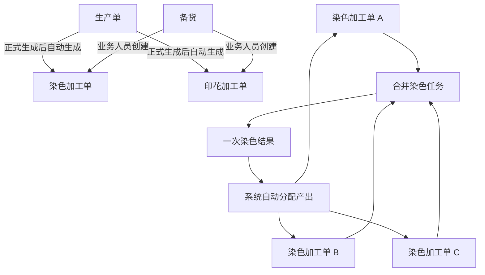

# 染色 / 印花需求单取消与合并染色产品设计

## 1. 设计目的

本设计解决两个相互关联的问题：

1. 取消染色需求单、印花需求单这两个独立业务对象，让染色加工单、印花加工单直接承接生产单或备货来源。
2. 在不合并染色加工单的前提下，支持染厂主管把多张相互兼容的染色加工单组织成一次合并染色。

设计原则：

- 一张染色 / 印花加工单只对应一个生产单，或者一次备货创建。
- 一个生产单的同类工艺只生成一张加工单，不允许拆成多张。
- 多张加工单共同染色时，合并的是现场染色动作，不是加工单。
- 系统自动完成数量计算与产出分配，主管不手工调整生产单满足顺序。
- 页面和对象保持简单，不增加不必要的中间单据和执行层级。

## 2. 已确认的核心结论

### 2.1 取消染色 / 印花需求单

- 删除染色需求单、印花需求单的独立菜单、列表、详情和业务单号。
- 生产单正式生成后，系统根据正式技术包快照和 BOM 自动生成对应的染色加工单、印花加工单。
- 加工单直接保存生产单来源和技术资料快照，不再通过需求单间接追溯。
- 按备货创建加工单的方式继续保留。

### 2.2 加工单不合并

- 一张加工单不能关联多个生产单。
- 一个生产单不能拆成多张同类加工单。
- 合并染色不生成父加工单，不改变原加工单号、来源、计划数量、执行结果和结算归属。

### 2.3 新增合并染色任务

- 合并染色任务是染厂主管组织多张染色加工单共同染色的现场协同对象。
- 一个合并染色任务只执行一次染色、登记一次实际投入和一次实际产出。
- 任务创建后成员立即锁定，不能增加、移除或替换加工单。
- 主管可以删除整个合并染色任务，但不能只删除其中一张加工单。

## 3. 业务对象关系



各对象职责：

| 对象 | 业务职责 |
| --- | --- |
| 生产单 | 表达正式生产需求，并提供下单时间、技术包、BOM、颜色、工艺、数量和交期 |
| 染色 / 印花加工单 | 承接单个生产单或备货来源，作为工厂执行、交出、质检、回写和结算的主体 |
| 合并染色任务 | 组织多张染色加工单共同完成一次染色，不替代加工单，不独立承接生产需求和结算 |
| 染色结果 | 记录本次合并染色的实际投入总量和实际产出总量 |
| 产出分配结果 | 记录系统按生产单下单时间自动计算出的加工单满足数量 |

## 4. 加工单自动生成

### 4.1 生成时点

生产单正式生成后，系统读取正式技术包快照和 BOM：

- 存在染色工艺时，自动生成一张染色加工单。
- 存在印花工艺时，自动生成一张印花加工单。
- 同一生产单、同一工艺类型重复触发时返回已有加工单，不重复生成。

### 4.2 来源快照

自动生成的加工单保存：

- 生产单号和生产单下单时间。
- 正式技术包版本。
- BOM 面料。
- 目标颜色。
- 染色或印花工艺。
- 计划加工数量和单位。
- 染色是否需先水溶及对应工艺路线。
- 交期等生产要求。

### 4.3 工厂分配

- 生产单已经确定工艺工厂时，加工单直接关联对应工厂。
- 生产单尚未确定工艺工厂时，加工单仍然生成，状态为“待分配工厂”。
- 业务人员后续分配工厂，并确认计划完成时间和派单价格。

### 4.4 按备货创建

- 染色加工单、印花加工单列表继续保留“按备货创建”。
- 业务人员选择备货物料，填写计划加工数量、工厂、计划完成时间和工艺要求。
- 来源类型明确显示为“备货”，不伪造生产单或需求单编号。
- 按备货创建的染色加工单不允许参加合并染色。

## 5. 合并染色任务创建

### 5.1 角色与入口

- 主要角色：染厂主管。
- 在“染厂管理”下新增独立的“合并染色”菜单。
- 主管从合并染色页面发起创建，手工选择染色加工单。
- 系统不主动替主管决定哪些加工单合并，只负责校验明显不兼容的选择。

### 5.2 可选范围

- 只允许选择来源于生产单的染色加工单。
- 按备货创建的染色加工单不进入可选范围。
- 已参加其他未删除合并染色任务的加工单不可重复选择。
- 至少选择两张染色加工单。

### 5.3 四项兼容性校验

所选加工单必须满足：

1. 同一染厂。
2. 同一面料。
3. 同一目标颜色。
4. 同一染色工艺。

加工单不要求已经完成备料，也不要求已经达到可投缸状态。业务可根据现场实际面料数量提前决定是否一起染，系统不增加更多前置限制。

### 5.4 创建结果

- 系统生成合并染色任务号。
- 任务状态为“待染色”。
- 成员创建后立即锁定，不能增加、移除或替换。
- 创建时不填写投入和产出数量。
- 各加工单显示“已加入合并染色”和对应任务号。

## 6. 完成染色与自动分配

### 6.1 完成登记

合并染色任务只发生一次染色。主管点击“完成染色”后填写：

- 实际投入总量。
- 实际产出总量。
- 备注，可选。

操作人和完成时间由系统自动记录。面料、颜色、工艺、染厂和单位直接取自任务，不重复填写。

### 6.2 分配顺序

系统按以下顺序排列成员加工单：

1. 生产单下单时间从早到晚。
2. 下单时间相同时，按生产单号升序。

主管不能调整顺序，也不能填写或修改加工单分配数量。

### 6.3 分配算法

系统从排序第一的加工单开始依次满足：

```text
本单分配数量 = 当前剩余产出与本加工单未满足数量中的较小值
```

只有上一张加工单全部满足后，剩余产出才开始满足下一张加工单。

示例：

| 分配顺序 | 加工单需求 | 实际产出 800 Yard 的分配 | 结果 |
| --- | ---: | ---: | --- |
| 生产单 A 对应加工单 | 600 Yard | 600 Yard | 已满足 |
| 生产单 B 对应加工单 | 400 Yard | 200 Yard | 部分满足，未满足 200 Yard |
| 合计 | 1000 Yard | 800 Yard | 合并染色任务已完成 |

本次未满足的数量不再继续染色。对应加工单保留“部分满足”或“未满足”结果，不能直接参加其他合并染色任务。

### 6.4 超出数量

实际产出超过成员加工单未满足总量时：

- 各加工单最多满足到自身需求数量。
- 超出部分记录为合并染色任务的“超出数量”。
- 超出数量不强行分配给任何生产单或加工单。
- 首版只记录超出数量，不扩展转备货、余料入库或报损流程。

## 7. 删除合并染色任务

### 7.1 删除规则

- 待染色任务和已完成任务始终允许删除。
- 不允许单独移除某张成员加工单。
- 删除采用业务删除，不物理清除数据。

### 7.2 删除后的结果

永久保留：

- 原任务成员。
- 实际投入和实际产出。
- 自动分配结果。
- 删除人、删除时间和删除记录。

删除不撤销已经产生的有效满足数量：

- 已满足的加工单保持已满足。
- 部分满足或未满足的加工单解除合并染色占用，可以重新参加新的合并染色任务。
- 未执行任务中的全部加工单解除占用。

已删除任务默认不在当前任务列表展示，可通过“查看已删除任务”筛选查看。

## 8. 更正染色结果

已完成任务允许发起“更正染色结果”：

- 只能修改实际投入总量和实际产出总量。
- 不能修改成员、生产单排序、面料、颜色或工艺。
- 系统仍按原生产单下单时间重新计算全部分配。
- 原分配结果停止作为当前有效结果，但永久保留在更正历史中。
- 新分配结果成为当前有效结果。
- 加工单满足状态和超出数量随新结果重新计算。

系统保存更正前后投入、产出、各加工单分配结果、更正人、更正时间和更正说明。

更正只允许修正现场事实数量，不允许主管借更正功能手工改变分配顺序或分配结果。

## 9. 生产单变更

### 9.1 尚未执行

加工单尚未执行且未加入合并染色时，自动同步生产单最新数据，包括面料、颜色、工艺、数量和技术包版本。

### 9.2 已加入合并染色或已执行

- 已加入合并染色的加工单不自动修改，保留加入任务时的来源快照。
- 已经开始或完成执行的加工单不覆盖实际执行快照。
- 生产单、加工单和合并染色详情同时展示变更前后内容、受影响对象和建议动作。

合并染色尚未完成时，业务人员可以删除整个任务。删除后，加工单解除占用并同步生产单最新内容，再决定是否重新创建合并染色。

已经发生实际染色的任务不回写篡改原执行事实，只保留变更影响提示和处理记录。

## 10. 菜单与页面设计

### 10.1 染厂管理菜单

建议顺序：

1. 染色加工单。
2. 合并染色。
3. 染色待加工仓。
4. 染色待交出仓。
5. 染色统计。

### 10.2 合并染色列表

展示：

- 合并染色任务号。
- 染厂、面料、目标颜色、染色工艺。
- 关联加工单数量和需求总量。
- 实际投入、实际产出、未满足数量、超出数量。
- 状态、创建时间、完成时间。

主要操作：

- 创建合并染色。
- 查看详情。
- 完成染色。
- 更正染色结果。
- 删除任务。

列表保留分页，不提供编辑成员入口。

### 10.3 创建页面或抽屉

加工单选择项展示：

- 染色加工单号。
- 生产单号和下单时间。
- 面料、目标颜色、染色工艺。
- 加工单需求数量。
- 是否已参加其他合并染色任务。

页面实时展示已选加工单数量和需求总量。提交时执行四项兼容性校验。

### 10.4 合并染色详情

详情分为：

1. 基本信息：任务号、染厂、面料、颜色、工艺、状态。
2. 加工单明细：加工单号、生产单号、下单时间、需求数量、分配数量、未满足数量和结果。
3. 染色结果：实际投入、实际产出、超出数量、操作人、完成时间和备注。
4. 历史记录：创建、完成、更正、删除及对应操作人和时间。

加工单明细按系统分配顺序展示，不允许拖动排序。

### 10.5 染色加工单联动

参加合并染色的加工单增加：

- “合并染色”标识。
- 合并染色任务号及详情入口。
- 分配数量。
- 未满足数量。
- 最终结果：已满足、部分满足、未满足。

### 10.6 需求单页面清理

删除：

- 染色需求单、印花需求单菜单和页面。
- “按需求创建加工单”入口。
- 加工单中的需求单号、需求满足明细和需求单跳转。

调整：

- 加工单创建方式改为“生产单自动生成 / 按备货创建”。
- 生产单详情展示系统生成的染色加工单、印花加工单及当前状态。
- 加工单详情直接展示生产单来源和技术资料快照。
- 回货数量直接满足对应加工单，不再经过需求单分配层。

## 11. 状态设计

合并染色任务当前状态只保留：

```text
待染色 → 已完成
   └──→ 已删除

已完成 → 已删除
```

“已更正”不作为任务状态，只作为操作记录展示。

加工单在合并染色结果中的满足状态只保留：

- 已满足。
- 部分满足。
- 未满足。

## 12. 防错与异常提示

系统只做必要防错：

- 非同一染厂、面料、目标颜色或染色工艺时，阻止创建并明确指出不一致项。
- 按备货创建的加工单不能加入合并染色。
- 已参加其他未删除任务的加工单不能重复加入。
- 创建后不提供成员编辑入口。
- 实际投入和实际产出必须填写有效数量。
- 分配顺序和分配数量不提供人工修改入口。
- 更正结果时只开放投入、产出和更正说明。

系统不增加备料完成、打样完成、可投缸等创建前限制。

## 13. 验收标准

### 13.1 加工单生成

- 生产单正式生成后按技术资料自动生成染色 / 印花加工单。
- 重复触发不会重复生成。
- 未确定工厂时加工单状态为“待分配工厂”。
- 系统不再生成或展示染色 / 印花需求单。

### 13.2 合并染色创建

- 主管可以手工选择来源于生产单的染色加工单。
- 四项兼容性校验准确。
- 备货加工单不可选择。
- 创建后成员锁定。

### 13.3 产出分配

- 800 Yard 产出面对 600 Yard、400 Yard 两张加工单时，严格分配为 600 Yard、200 Yard。
- 排序完全由生产单下单时间和生产单号决定。
- 主管不能修改排序或分配数量。
- 1020 Yard 面对 1000 Yard 总需求时，1000 Yard 满足加工单，20 Yard 记录为超出数量。

### 13.4 删除与更正

- 待染色、已完成任务均可业务删除，历史记录完整保留。
- 删除后未满足加工单解除占用，可重新参加新的合并染色。
- 更正投入或产出后，系统按原顺序重新计算有效分配。
- 更正前后结果均可追溯。

### 13.5 生产单变更

- 未执行加工单自动同步生产单最新数据。
- 已加入合并染色或已执行加工单保留原快照并展示变更影响。
- 未完成合并染色删除后，加工单可以同步最新数据并重新组织染色。

### 13.6 页面与治理

- 染厂管理下存在独立“合并染色”菜单。
- 合并染色列表、创建、详情、完成、更正和删除路径完整。
- 列表保留分页。
- 页面状态、提示和数量单位全部使用中文业务语义。
- 页面改动实施时需补充原型审查记录，并通过项目原型设计治理检查。

## 14. 本次不做

- 不建立合并加工单或父子加工单。
- 不把印花加工单纳入合并染色。
- 不让备货染色加工单参加合并染色。
- 不支持一个生产单拆成多张同类加工单。
- 不支持一张加工单关联多个生产单。
- 不支持一个合并染色任务多次投缸或多次产出登记。
- 不支持主管手工调整生产单满足顺序和分配数量。
- 不扩展超出数量的入库、转备货或报损流程。
- 不引入真实后端、复杂状态管理或新的基础设施。
