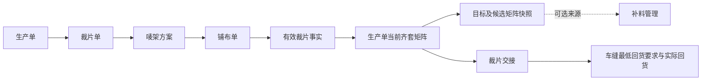
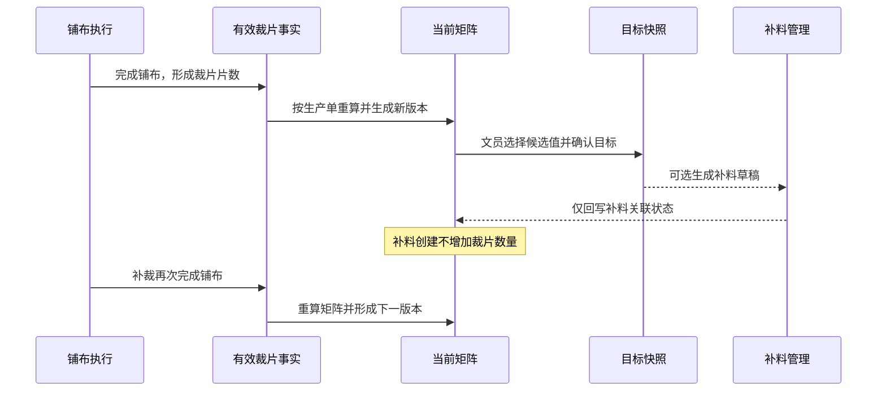

# 裁片放行管理矩阵设计

## 1. 背景

裁床在一个生产单下，会通过多个裁片单、唛架方案和铺布单逐步形成实际裁片。不同物料、不同裁片部位的实际数量并不总是一致，因此“已经裁了多少片”不能直接回答“现在至少能做出多少件完整成衣”。

当前“裁片放行管理”页面采用通用判断项和手工放行数量，数据主要来自演示投影，未按生产单的实际裁片部位计算齐套数量；当前“补料管理”虽然支持按生产单或裁片单独立创建补料，但其自动比较仍带有固定物料基准和演示兜底，不能直接承担裁片齐套判断。

本设计将“裁片放行管理”定位为生产单级的裁片齐套决策台：系统持续把有效裁片事实换算成“颜色 × 尺码 × 物料”的可做成衣数量矩阵，裁床文员从矩阵中的实际候选值选择目标，再识别每种物料的缺口、刚好和多余，并可把缺口作为补料管理的一个可选来源。

## 2. 目标

- 每个生产单维护一张当前裁片矩阵，并保留多次更新历史。
- 任一有效铺布完成后，按实际裁片部位重新计算相关生产单矩阵。
- 让裁床文员一眼识别各颜色、尺码当前齐套数量，以及每种物料的可做数量。
- 目标数量只能从当前矩阵已有候选值中选择，不允许任意填写。
- 按目标自动标识每种物料“需补、刚好、多余”。
- 主矩阵保持紧凑，裁片部位、用片数、实际片数和来源在点击或聚焦后展示。
- 支持从已确认目标快照进入补料管理，同时保留补料管理的独立创建能力。
- 保留多余裁片、冻结贡献、作废冲销、重新开启和车缝实际利用的完整追溯。
- 将已确认的矩阵信息结构和视觉表达作为后续页面实现的强制验收基准。

## 3. 非目标

- 不让系统判断面辅料是否适合补料；该判断仍由裁床业务人员结合需求、裁片和面辅料情况作出。
- 不承诺车缝工厂一定能把多余裁片转换成更多成衣。
- 不在裁片放行页面内直接完成补料单确认、物料需求计算或印染后续业务。
- 不要求补料必须从裁片放行管理发起。
- 不将已创建补料单直接计入当前裁片数量。
- 不删除已经形成的铺布、裁片和矩阵历史事实。
- 不引入第二套“关闭唛架”终态；具体唛架方案继续统一使用“作废”。
- 本仓库仍为产品原型，不建设真实后端、消息总线或数据库；事件、版本和追溯关系使用可演示的 Mock 数据表达。

## 4. 角色、端类型与业务任务

| 项目 | 设计口径 |
| --- | --- |
| 系统 | FCS 裁床管理端 |
| 主要角色 | 裁床办公室文员，以印尼本地业务人员为主 |
| 协作角色 | 裁床主管、补料人员、车缝工厂跟单人员 |
| 上游对象 | 生产单、裁片单、唛架方案、铺布单、有效裁片事实 |
| 当前任务 | 判断当前实际裁片能组成多少完整成衣，并选择补料比较目标 |
| 下游对象 | 补料管理、裁片交接、车缝最低回货要求、实际回货记录 |
| 页面模式 | 标准列表页 + 生产单矩阵详情 |

页面文案必须直接、中文化，突出“当前齐套、目标、需补、刚好、多余、已冻结”等业务词，不展示英文状态码或技术事件名称。

## 5. 业务对象与职责边界

各对象职责如下：

- **铺布单**：形成、修正或冲销实际裁片事实，是矩阵数量变化的主要来源。
- **裁片放行管理**：负责齐套换算、目标比较、历史快照和放行决策展示，不代替补料单。
- **补料管理**：负责创建和确认补料业务，以及后续面辅料、印花、染色等需求链路；既可独立创建，也可引用放行快照。
- **裁片交接**：记录实际交给车缝工厂的完整套数和一并交出的多余裁片。
- **车缝回货**：分别记录最低应回数量和实际回货数量，不反向篡改原始裁片事实。

## 6. 矩阵计算口径

### 6.1 矩阵维度

一张矩阵只属于一个生产单。详情按成衣颜色分组：

- 横向列为成衣尺码。
- 纵向行为该颜色成衣所需的物料。
- 每个“物料 × 颜色 × 尺码”单元格展示该物料当前最多可支持的成衣件数。
- 计划数量作为参考行展示，但不参与齐套最小值计算，也不能作为目标候选值。

同一物料可能包含多个必需裁片部位。例如某面料需要前片、后片和袖片；每个部位每件成衣所需片数可能不同。

### 6.2 单个裁片部位可做数量

对某一物料、颜色、尺码下的每个必需裁片部位：

> 部位可做成衣数量 = 向下取整（该部位有效实际片数 ÷ 每件成衣所需片数）

只累计有效裁片事实。已被作废冲销的数量不进入当前值，但保留在历史中。

### 6.3 单个物料可做数量

> 物料可做成衣数量 = 该物料所有必需裁片部位可做数量的最小值

例如前片 `400 ÷ 2 = 200` 件，后片 `220 ÷ 1 = 220` 件，则该物料当前可做 `200` 件。多出的后片仍记录为余量，不提高该物料可做数量。

### 6.4 当前齐套数量

> 当前齐套数量 = 同一成衣颜色、尺码下所有必需物料可做数量的最小值

该数量表示当前实际裁片已经能够组成的最低完整套数，是当前交接时可保证的基础，不包含车缝工厂对多余裁片的灵活利用。

### 6.5 数据不完整

出现以下任一情况时，对应单元格显示“数据不完整”，不得默认为 0 或齐套：

- 缺少必需物料映射。
- 缺少必需裁片部位。
- 缺少每件成衣所需片数。
- 裁片事实无法映射到生产单、成衣颜色或尺码。

只要某颜色尺码存在必需单元格不可计算，该颜色尺码的当前齐套数量也必须显示“不可计算”，并禁止选择目标。

## 7. 目标选择与差异计算

### 7.1 候选值规则

对每个成衣颜色、尺码，系统从当前列所有可计算的“物料可做成衣数量”生成候选集合：

- 计划数量不是候选值。
- 裁床文员不能手工输入任意目标。
- 文员只能点击当前列某个物料的已有数值作为该颜色尺码的目标。
- 相同数值只保存一次；如果多个物料具有相同值，选择后所有相同单元格同时标记“刚好”。
- 不同颜色、不同尺码分别选择目标，互不代替。

### 7.2 差异状态

对每个物料单元格：

> 差异 = 物料可做数量 - 目标数量

| 差异 | 状态 | 页面表达 |
| --- | --- | --- |
| 小于 0 | 需补 | 红色，显示“需补 N 件” |
| 等于 0 | 刚好 | 黄色高亮，显示“目标 / 刚好” |
| 大于 0 | 多余 | 绿色，显示“多 N 件” |

“需补 N 件”是物料层的成衣等价值，用于快速判断。进入补料管理时，还要进一步展开到具体裁片部位。

### 7.3 已确认示例

Black 成衣需要四种物料：

| 布料属性 | M | L | XL |
| --- | ---: | ---: | ---: |
| 计划数量，仅供参考 | 215 | 344 | 482 |
| 面料 A · 净色 | 220 | 358 | 532 |
| 面料 B · 白色条 | 200 | 350 | 500 |
| 面料 C · 兰色条 | 208 | 364 | 520 |
| 面料 D · 灰色条 | 200 | 350 | 500 |
| **当前齐套数量** | **200** | **350** | **500** |

文员选择目标 `M 208、L 350、XL 520`：

- M：B、D 各需补 8 件；C 刚好；A 多 12 件。
- L：B、D 同为 350，均显示刚好；A 多 8 件；C 多 14 件。
- XL：B、D 各需补 20 件；C 刚好；A 多 12 件。

目标不是任意计划，也不代表这些数量已经齐套；它是文员基于实际情况，从矩阵候选值中选定的补料比较基准。

### 7.4 目标快照

保存目标时只保存每个颜色尺码的目标数值，同时保存确认当时的完整候选矩阵快照，包括：

- 生产单和矩阵版本。
- 成衣颜色、尺码。
- 各物料可做数量。
- 当前齐套数量。
- 目标数量和差异结果。
- 裁片部位计算明细及有效来源摘要。
- 冻结裁片单状态。
- 确认人和确认时间。

快照不可被后续矩阵刷新覆盖。

## 8. 当前矩阵与版本历史

每个生产单只有一张“当前矩阵”，但可以有多个历史版本。以下事实触发新版本：

- 有效铺布完成并形成新的裁片数量。
- 已完成铺布被批准作废并形成冲销。
- 裁片数据被批准修正并形成正向或反向调整。
- 裁片单关闭或完成，贡献转为冻结。
- 裁片单重新开启，贡献恢复可继续更新状态。

同一次铺布完成或冲销事件必须具有唯一来源标识。重复接收时只保留一次，不得重复累计。

目标确认后，若有效裁片事实发生变化：

- 当前矩阵继续更新。
- 原目标快照保持不变。
- 页面标记“目标确认后数据已变化”。
- 新发起补料前必须基于当前矩阵重新确认目标。
- 已经创建或确认的补料单不得被自动改写。

## 9. 裁片单关闭、完成与重新开启

### 9.1 关闭与完成的共同规则

裁片单“关闭”表示人工终止后续执行；“完成”表示计划执行正常结束。两者业务原因不同，但对放行矩阵的处理一致：

- 保留该裁片单已经形成的最后有效裁片贡献。
- 将贡献标记为“已冻结，不再更新”。
- 主矩阵继续计入该冻结贡献。
- 页面展示裁片单状态、冻结时间、操作人和原因。
- 关闭或完成之后到达的迟到铺布数据不得直接计入矩阵，应进入异常提示等待处理。

### 9.2 是否允许关闭

关闭前必须展示影响摘要：

- 尚未完成的唛架方案或铺布单。
- 当前已形成的有效裁片数量。
- 关闭后将被冻结的矩阵单元格。
- 是否存在进行中的铺布或待处理修正。

存在进行中铺布时，不允许直接关闭；必须先完成、作废或通过异常修正流程处理该铺布。不存在进行中执行时，允许填写原因后关闭。

### 9.3 重新开启

如果关闭或完成后确需继续裁剪，必须执行显式“重新开启”：

- 记录操作人、时间和原因。
- 保留原冻结记录。
- 生成新的矩阵版本。
- 恢复接收该裁片单后续有效铺布事实。
- 页面提示“已重新开启”，不能让用户误认为历史冻结从未发生。

## 10. 唛架方案与铺布作废

### 10.1 唛架方案统一使用“作废”

不新增“关闭唛架”概念，避免与“作废唛架方案”形成含义重叠的终态：

- 草稿唛架方案可以删除，因为尚未形成正式执行依据。
- 已确认唛架方案只能“作废”，必须记录原因、时间和操作人。
- 存在有效的待执行、进行中或已完成铺布单时，不能直接作废唛架方案；必须先按铺布状态处理关联铺布。
- 唛架方案作废后，不得再作为新建铺布的候选来源。
- 已经形成的裁片事实不因唛架方案作废而物理删除。

### 10.2 铺布作废规则

| 铺布状态 | 是否允许普通作废 | 处理方式 | 对放行矩阵影响 |
| --- | --- | --- | --- |
| 待铺布，尚未形成裁片 | 允许 | 记录原因并作废 | 无数量影响，仅形成历史版本或来源状态更新 |
| 铺布中 | 不允许直接作废 | 先停止现场执行，核对已形成裁片，再走异常修正 | 只按核实后的有效裁片事实计算 |
| 已完成 | 不允许普通删除 | 通过批准后的作废冲销或数据修正处理 | 生成反向调整和新矩阵版本，保留原事实 |
| 已作废 | 不允许重复作废 | 只读展示 | 不重复冲销 |

已完成铺布的作废必须保留原数量、冲销数量、原因、审批或确认信息，以及更新前后的矩阵差异。不得直接覆盖或删除原记录。

## 11. 补料管理衔接

### 11.1 三条并行创建路径

补料管理保留三种入口，最终都生成相同类型的补料单：

1. 按生产单独立创建。
2. 按裁片单独立创建。
3. 从裁片放行目标快照创建。

第三条是可选快捷来源，不是补料单成立的前置条件。补料人员仍可根据现场判断自行创建补料。

### 11.2 从快照进入补料

从放行页面点击“去补料管理”时，传递不可变的目标快照标识，而不是只传生产单号或重新使用某一固定物料作为基准。补料草稿预填：

- 生产单、关联裁片单。
- 成衣颜色和尺码。
- 目标数量。
- 缺口物料。
- 物料层成衣等价缺口。
- 具体缺口裁片部位及其实际缺片数量。
- 来源矩阵版本和目标确认时间。

对具体裁片部位：

> 实际缺片数量 = 最大值（目标数量 × 每件所需片数 - 当前有效片数，0）

如果补料明细以成衣件数录入，则该部位预填补料件数为：

> 向上取整（实际缺片数量 ÷ 每件所需片数）

已有足够片数的部位不生成补料明细，即使同一物料的其他部位构成了物料层瓶颈。

### 11.3 补料状态回显

裁片放行矩阵可回显关联状态：未发起、草稿、已确认、补裁中、已形成有效裁片。状态只用于追踪：

- 创建或确认补料单不会增加物料可做数量。
- 只有后续补裁完成铺布并形成有效裁片事实，矩阵才重新计算。
- 手工创建的补料单如果能够按生产单、颜色、尺码、物料和裁片部位匹配，可以回显到矩阵；不能可靠匹配的补料单保持独立，不强行关联。

## 12. 裁片交接、最低回货与多余裁片

当前齐套数量表示“现在实际已经齐套的最低数量”；目标数量表示“文员选择的补料比较基准”，两者不得混为一项承诺。

实际交给车缝工厂时，交接记录应冻结：

- 本批交出的生产单、颜色和尺码。
- 本批实际交出的完整齐套数量。
- 由该齐套数量形成的最低回货要求。
- 一并交出的多余裁片，按物料、裁片部位、颜色、尺码和数量记录。
- 多余裁片的来源裁片单和铺布单。

车缝工厂可能灵活使用多余部位裁片，最终做出超过最低回货要求的成衣。系统处理原则：

- 最低回货要求不因事后灵活利用而提高或改写。
- 实际回货数量按真实结果记录。
- 超出最低要求的数量作为实际多回记录。
- 可记录车缝工厂使用多余裁片的结果，但不把其转化效率纳入系统事前承诺。

## 13. 页面信息架构

### 13.1 列表页

列表页一张生产单一条记录，使用项目标准列表页组件和分页。展示字段：

- 生产单号。
- SPU / 款式。
- 颜色数和尺码数。
- 当前矩阵状态。
- 目标状态。
- 补料状态或缺口数量。
- 已冻结裁片单数量。
- 最近一次铺布更新。
- 固定在右侧的“查看矩阵”操作。

矩阵状态必须包含：可计算、数据不完整、暂无有效裁片。目标状态必须包含：待确认、已确认、目标后数据已变化。后续如增加状态，也不能取代这六个基础状态。不得继续使用“可以做、部分可以做、暂时不能做”等缺乏具体数量依据的通用人工判断作为主操作。

列表必须支持标准筛选、分页、列显示、列顺序、冻结、排序和固定操作列；宽表只允许在表格容器内横向滚动。

### 13.2 矩阵详情页

详情页按成衣颜色分组，每组使用以下固定结构：

1. 计划数量参考行。
2. 各必需物料行。
3. 当前齐套数量汇总行。
4. 目标和差异状态。
5. 来源状态列。

物料行不得展开成大量裁片部位行。物料名称需要同时体现业务识别信息，例如“面料 B · 白色条”。来源状态显示“持续更新”“已冻结”“数据异常”等中文状态。

### 13.3 强制视觉验收基准

后续实现必须保持以下视觉语义：

- 计划数量行使用浅蓝色，仅作为需求参考。
- 目标值和与目标相等的单元格使用黄色高亮。
- 低于目标的单元格使用红色文字，并显示“需补 N 件”。
- 高于目标的单元格使用绿色文字，并显示“多 N 件”。
- 当前齐套数量在表尾单独加粗展示。
- 冻结状态使用中性灰色，并明确写出“已冻结，不再更新”。
- 目标选择模式只允许点击当前尺码列已有候选单元格。
- 页面不得退化为手工填写放行数量，也不得把所有裁片部位直接铺在主矩阵中。

已确认的 Black 示例矩阵就是后续页面的内容结构、层级顺序、颜色语义和目标交互验收样式，不是仅供参考的草图。

### 13.4 单元格详情

点击单元格，或通过键盘聚焦后按 Enter，以右侧详情抽屉展示：

- 物料、成衣颜色和尺码。
- 该物料当前可做数量。
- 每个必需裁片部位名称。
- 有效实际片数。
- 每件成衣所需片数。
- 除法和取整计算过程。
- 来源裁片单、唛架方案和铺布单。
- 来源是否冻结或被修正。
- 最后更新时间。

关闭详情后应保持当前颜色分组、横向滚动位置和目标选择状态。

### 13.5 目标操作区

- 默认查看模式展示当前目标状态和最近确认信息。
- 点击“选择目标”进入目标模式。
- 只有可选候选单元格出现明确的可点击状态。
- 每个颜色尺码选中目标后，局部刷新该列的需补、刚好和多余状态。
- 保存前展示目标、缺口数量、余量数量和矩阵版本摘要。
- 保存成功后提供“去补料管理”；没有缺口时不把该按钮作为主动作。

## 14. 页面交互与性能

- 列表筛选输入不得在每次输入时触发整页重绘。
- 打开单元格详情、切换颜色分组、选择目标和关闭浮层只更新必要区域。
- 目标选择后不得重置表格横向滚动位置。
- 轻交互应在 200 ms 内产生可见反馈。
- 图标只在新插入区域初始化，不重新扫描整页。
- 列表、矩阵版本历史、来源明细和操作日志均需分页。
- 1366 × 768 为标准验收分辨率，1280 × 720 为最低可用分辨率。
- 页面主体不得横向溢出；矩阵宽表只能在内容容器内部滚动。

## 15. 状态与异常反馈

| 场景 | 页面处理 |
| --- | --- |
| 尚无有效铺布 | 显示“暂无有效裁片”，不生成虚假默认数量 |
| 缺少必需配置 | 显示具体缺失项，阻断齐套和目标选择 |
| 重复铺布完成事件 | 忽略重复累计，历史标记重复来源 |
| 裁片单关闭后的迟到数据 | 不进入当前矩阵，显示待处理异常 |
| 目标确认后矩阵变化 | 标记“目标后数据已变化”，新补料前要求重新确认 |
| 快照已生成补料单 | 保留原补料单，不随新矩阵自动改写 |
| 铺布中要求作废 | 阻断普通作废，引导停止执行并核对实际裁片 |
| 已完成铺布作废 | 通过冲销或修正生成新版本，不删除原事实 |
| 补料已创建但尚未补裁 | 只显示处理状态，不增加矩阵数量 |
| 补裁完成并形成有效裁片 | 生成新矩阵版本并重新计算 |

## 16. 历史与审计

每个矩阵版本至少记录：

- 版本号和生成时间。
- 触发类型和触发来源。
- 操作人。
- 来源生产单、裁片单、唛架方案和铺布单。
- 本次增加、冻结、恢复、冲销或修正的片数。
- 更新前后的物料可做数量和当前齐套数量。
- 目标快照及确认人。
- 关联补料单及其状态。
- 裁片单关闭、完成、重新开启原因。
- 唛架方案作废、铺布作废或数据修正原因。

历史版本只读。任何修正必须通过新事实形成下一版本，不允许直接编辑旧版本。

## 17. 数据投影设计

原型数据拆成以下职责清晰的投影：

- **有效裁片事实**：来源铺布、裁片单、物料、部位、成衣颜色、尺码、有效片数、正负方向和有效状态。
- **当前矩阵投影**：生产单、当前版本、各物料可做数量、当前齐套数量和来源状态。
- **目标快照**：生产单、矩阵版本、目标值、完整候选矩阵、差异结果和确认信息。
- **补料关联投影**：目标快照、补料单、缺口部位和处理状态。
- **交接快照**：交接批次、最低齐套数量、多余裁片和最低回货要求。

页面不能把列表缓存或手工输入当作裁片事实权威来源。独立创建补料与引用快照补料共享同一补料单结果，但来源字段必须区分。

## 18. 典型业务场景

### 场景一：连续完成铺布

生产单 PO14671 的某裁片单第一次铺布完成后，面料 B 的 Black/M 前片支持 120 件，后片支持 140 件，系统显示该物料可做 120 件。第二次铺布完成又增加前片 160 片；若每件需要 2 片，则前片累计可支持 200 件，系统生成下一矩阵版本并自动把物料可做数量更新为 200 件。文员无需手工叠加。

### 场景二：选择高于当前齐套的目标

系统计算 Black 的当前齐套为 M 200、L 350、XL 500。文员根据需求、现场裁片和面辅料情况，选择矩阵中已有的 M 208、L 350、XL 520。系统不是宣称已齐套 208/350/520，而是立即显示面料 B、D 在 M 各缺 8 件、XL 各缺 20 件，并允许将这些缺口带入补料管理。

### 场景三：同值候选

Black/L 下，面料 B 和 D 都只能做 350 件。文员选择 350 后，系统只保存一个 L 目标值，同时将 B、D 两个单元格都标记“刚好”，避免用户误以为目标绑定某一种物料。

### 场景四：裁片单关闭

裁片单 CUT-01 已形成一批有效裁片，但因后续不再生产而关闭。系统继续把既有裁片计入 PO14671 当前矩阵，来源状态显示“CUT-01 已关闭，数量已冻结”。之后到达的迟到铺布完成数据不自动累计。主管确认需要继续生产时，明确重新开启 CUT-01，系统记录原因并从新版本开始接收后续数据。

### 场景五：已完成铺布作废

铺布单 PB-32 完成后发现数据录入错误。系统不允许删除 PB-32，而是由业务人员提交作废冲销或修正：保留原裁片数量，新增反向调整，重新计算矩阵，并在历史中展示更新前后齐套数量差异。

### 场景六：补料不等于已有裁片

文员从目标快照创建补料单，矩阵只显示“已发起补料”，数量仍保持原值。补料裁片重新完成铺布后，新的有效裁片事实进入矩阵，系统才重新计算；如果目标快照已经过期，原补料单仍按原快照留存。

### 场景七：车缝灵活使用多余裁片

裁床向车缝工厂交接 500 套完整裁片，同时记录某些部位多出 12 件等价裁片。最低回货要求固定为 500 件。车缝工厂通过灵活配片最终回货 507 件，系统记录实际回货 507 和多回 7 件，但不把原最低回货要求改成 507，也不删除多余裁片的来源记录。

## 19. 验收标准

1. 列表页一张生产单一条记录，使用标准列表页、固定操作列和分页。
2. 详情能够按多个成衣颜色分组，并展示多个尺码和多种必需物料。
3. 物料可做数量正确取该物料所有必需裁片部位的最小值。
4. 当前齐套数量正确取同一颜色尺码所有必需物料的最小值。
5. 缺少必需配置时明确阻断计算，不使用默认 1000、固定比例或其他演示兜底。
6. 计划数量只作参考，不能被选为目标。
7. 目标只能从当前尺码列的物料可做数量中选择。
8. Black 示例选择 `208/350/520` 后，缺口、刚好和多余结果与本设计一致。
9. 重复候选值只保存一个目标值，并同时高亮所有相同值单元格。
10. 点击或聚焦单元格能够查看裁片部位、片数公式和来源，主矩阵不直接展开全部部位。
11. 任一有效铺布完成后生成新的生产单矩阵版本，重复来源不重复累计。
12. 裁片单关闭或完成后保留并冻结最后有效贡献，迟到数据不自动进入矩阵。
13. 裁片单重新开启保留冻结历史并恢复后续更新。
14. 唛架方案统一使用“作废”，页面不存在含义重叠的“关闭唛架”。
15. 待铺布、铺布中、已完成和已作废状态分别执行正确的作废规则。
16. 目标确认时保存目标值和完整候选矩阵快照，后续变化不覆盖快照。
17. 从目标快照可以进入补料管理，并按具体缺口裁片部位预填草稿。
18. 补料管理继续支持按生产单或裁片单独立创建，不依赖放行管理。
19. 创建补料单不增加矩阵数量，补裁形成有效裁片后才更新矩阵。
20. 交接时分别记录完整齐套数量、多余裁片和最低回货要求。
21. 车缝实际利用多余裁片可以记录，但不修改原最低回货承诺。
22. 页面严格使用黄色目标/刚好、红色需补、绿色多余和灰色冻结的已确认视觉语义。
23. 目标选择、单元格详情和状态切换使用局部更新，无明显整页闪烁或滚动位置丢失。
24. 在 1366 × 768 和 1280 × 720 下可用，宽表仅在内容容器内滚动。
25. 实现完成后通过列表页治理、原型设计治理、相关页面检查和项目构建。

## 20. 实现范围

后续实现计划应限制在本需求直接相关模块：

- 重做裁片放行列表和生产单矩阵详情的演示数据与页面交互。
- 为补料管理增加“引用目标快照”的可选创建入口，同时保留现有独立创建入口。
- 补足裁片单冻结、重新开启、铺布作废冲销和矩阵版本历史的演示状态。
- 复用现有标准列表页和字符串模板 UI 组件，不迁移到 React，不建设真实后端。
- 不顺带重构无关裁床、车缝、仓库或印染模块。

如调整 `src/pages/`、`src/data/`、`src/router/` 或交互处理，必须新增原型审查记录，并按《HiGood 印尼工厂现场协同系统产品设计规范》和《原型审查清单》检查角色、现场表达、防错、分页、低分辨率和局部交互性能。

## 21. 现状代码核查附录

本节仅用于说明设计为什么需要调整，业务验收不依赖代码路径。

### 21.1 当前裁片放行管理

- 页面入口：`/fcs/craft/cutting/cut-piece-release`。
- 页面实现：`src/pages/process-factory/cutting/cut-piece-release.ts`。
- 数据投影：`src/data/fcs/cut-piece-release.ts`。
- 当前记录由车缝派工工作台任务投影生成，采用通用判断项、手工 SKU 放行数量和演示比例，未读取实际裁片部位事实。
- 存在演示默认数量和比例兜底，不能作为正式齐套依据。

### 21.2 当前补料管理

- 页面实现：`src/pages/process-factory/cutting/supplement-management.ts`。
- 已支持按生产单或裁片单选择来源，并生成同一类补料记录。
- 补料明细可覆盖颜色、尺码、物料别名、物料和纸样，并能继续计算面辅料、印花和染色需求。
- 当前自动比较带有固定物料基准和演示数据兜底，只表达缺口，不完整表达刚好与多余。
- 当前创建路由缺少正式目标快照的直接载入，因此需增加可选快照来源，而不是替换独立创建。

### 21.3 当前唛架与铺布边界

- 已确认唛架方案已有“作废”语义，且存在有效铺布时应阻断直接作废。
- 铺布展示中已有“已作废”状态口径，但执行模型对铺布中、已完成后的作废冲销仍不完整。
- 后续实现应按本设计补齐演示链路，不能用删除完成数据代替冲销历史。

## 22. 原型审查要求

实现时的原型审查记录至少覆盖：

- 印尼裁床文员能否在低培训成本下理解矩阵和主动作。
- 生产单、裁片单、物料、裁片部位和铺布来源是否表达正确。
- 齐套、目标、缺口、余量和最低回货要求是否避免混淆。
- 关闭、冻结、重新开启、作废和冲销是否具有明确防错提示。
- 补料独立创建与快照创建是否保持并行，不形成错误依赖。
- 页面是否严格遵循本规格的矩阵视觉验收基准。
- 列表页治理、分页、横向滚动和固定操作列是否合规。
- 输入、目标选择、详情和弹层是否避免整页重绘并在 200 ms 内反馈。
- 1366 × 768 与 1280 × 720 是否满足可用性要求。

交付前必须运行 `npm run check:list-page-governance`、`npm run check:prototype-design-governance`、相关页面检查和 `npm run build`。
