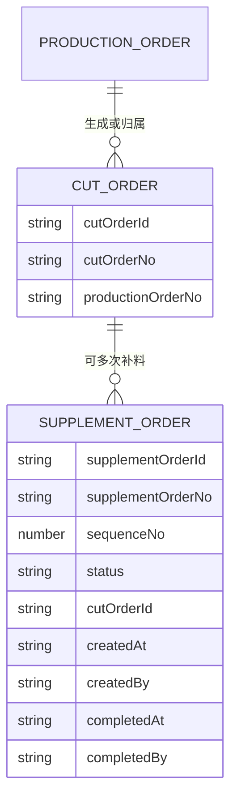
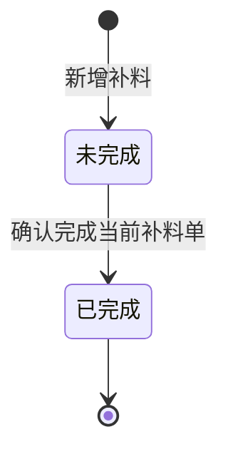
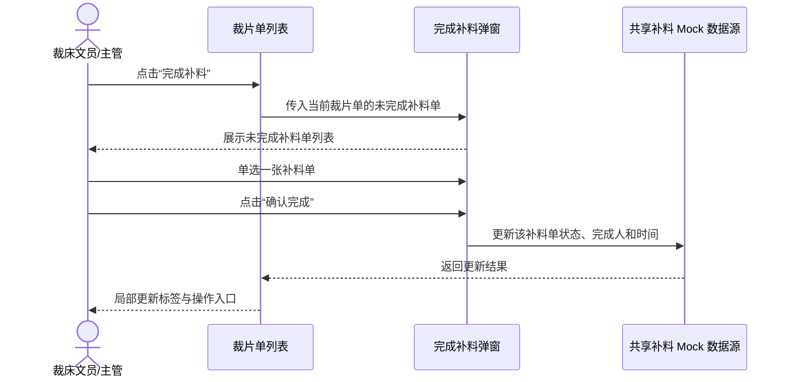

# 裁片单补料关联与完成闭环设计

## 1. 文档信息

| 项目 | 内容 |
|---|---|
| 设计日期 | 2026-07-22 |
| 适用系统 | 工艺工厂运营系统 |
| 涉及菜单 | 裁后处理 / 补料管理；裁片准备 / 裁片单 |
| 主要角色 | 裁床办公室文员、裁床主管、补料业务人员 |
| 端类型 | Web 管理端、Web 主管端 |
| 交付类型 | 产品原型，使用本地 Mock 数据和轻交互 |

## 2. 背景与当前问题

当前“补料管理 / 新增补料”同时允许按生产单或裁片单选择补料对象，补料单的页面状态以“已确认”为主；“裁片准备 / 裁片单”列表没有展示所属补料单，也不能直接筛选或完成补料。

本次需要把业务对象边界收紧为：

- 补料单直接挂在裁片单下。
- 一张裁片单可以多次补料，每次创建一张独立补料单。
- 补料单只保留“未完成”和“已完成”两个业务状态。
- 裁片单列表成为查看补料、筛选补料和完成补料的快捷入口。

本次只实现可演示原型，不建设真实后端、接口、数据库、权限体系或复杂状态机。

## 3. 目标与非目标

### 3.1 目标

1. 让使用人员从任意一张裁片单快速识别是否补过料、补了几次及每次状态。
2. 让每张补料单保持独立身份、独立状态和独立详情，不使用一个汇总标签替代明细。
3. 让补料人员能从补料管理新增补料，也能从裁片单列表或补料详情完成补料。
4. 保持一次只完成一张补料单，避免批量误操作。
5. 以最小必要范围完成可交给研发理解和实现的原型。

### 3.2 非目标

- 不支持按生产单直接新增补料。
- 不支持部分完成、撤销完成、重新打开或批量完成。
- 不因补料单完成而自动改变裁片单主状态。
- 不建设补料审批、领料、采购、印染或库存的真实状态流转。
- 不改造与本需求无关的裁床页面。

## 4. 业务对象与关系

关系规则：

- 一张补料单必须且只能归属一张裁片单。
- 一张裁片单可以有零张、一张或多张补料单。
- `sequenceNo` 在同一张裁片单内按创建顺序递增，用于展示“第 N 次”。
- 生产单号从裁片单继承，只作为来源信息展示，不是补料单的直接归属对象。
- 删除补料单不是本次原型范围；历史补料标签始终保留。

## 5. 状态模型

补料单仅有两个中文业务状态：

| 状态 | 进入方式 | 可执行动作 |
|---|---|---|
| 未完成 | 新增补料成功后默认进入 | 查看详情、完成该补料单 |
| 已完成 | 从裁片单操作栏或补料详情确认完成 | 查看详情 |

约束：

- 一次操作只能完成一张未完成补料单。
- 已完成补料单不能重复完成。
- 完成时记录完成人和完成时间。
- 完成补料单不会自动修改裁片单的待配料、已领料、已关闭等主状态。

## 6. 方案比较与决策

### 6.1 方案 A：商品信息区域内展示补料标签

在现有“商品信息”区域下方展示补料标签，不增加表格列。

优点：符合参考截图；不增加宽表列数；标签与款式关系直观；交付范围最小。

缺点：补料次数较多时会增加单行高度。

### 6.2 方案 B：新增独立“补料”列

优点：补料信息更容易纵向扫读。

缺点：裁片单已经是宽表，会增加横向滚动压力，不利于 1280×720 的最低分辨率。

### 6.3 方案 C：表格行内展开补料详情

优点：无需弹窗即可看到明细。

缺点：会改变行高和滚动位置，交互复杂度高，也偏离用户要求的详情弹窗。

### 6.4 决策

采用方案 A。每张补料单一个标签，标签放在“商品信息”区域下方；点击标签打开对应补料单详情弹窗。

## 7. 补料管理 / 新增补料弹窗

### 7.1 保留内容

- 保留现有“新增补料”弹窗。
- 保留选择裁片单、填写补料明细、确认创建的主要步骤。
- 保留颜色、尺码、物料、纸样及补料数量等既有明细能力。

### 7.2 删除内容

- 删除截图标注的顶部“新增补料”标题说明区。
- 删除“生产单”页签、生产单数量及按生产单选择的逻辑。
- 删除“先选择生产单或裁片单”等双对象说明文案。

### 7.3 调整后的交互

1. 打开弹窗后直接展示“选择裁片单”。
2. 搜索支持裁片单号、生产单号、款号和 SPU。
3. 候选列表展示裁片单、所属生产单、商品、补料参考数据。
4. 每次只能选择一张裁片单。
5. 已关闭或当前不允许继续执行的裁片单不可选择，并显示具体原因。
6. 进入下一步后填写补料原因、补料明细和数量。
7. 确认创建后生成该裁片单的下一张补料单，状态默认为“未完成”。
8. 创建成功后关闭弹窗并局部更新补料列表。

## 8. 裁片准备 / 裁片单列表

### 8.1 补料标签

标签位于“商品信息”区域下方。一张补料单对应一个标签，格式为：

`补 · 第 N 次 · 未完成`

或：

`补 · 第 N 次 · 已完成`

展示规则：

- 按 `sequenceNo` 从小到大排列。
- 多张补料单展示多个标签，允许在单元格内自动换行。
- 不展示“总共几张”的汇总标签。
- 不把多张补料单合并成一个汇总状态。
- 未完成使用克制的橙色提示，已完成使用绿色或中性完成态。
- 点击任一标签，只打开该标签对应补料单的详情弹窗。
- 无补料单时不展示占位标签。

### 8.2 筛选条件

新增两个筛选项：

| 筛选项 | 选项 | 判断规则 |
|---|---|---|
| 是否有补料 | 全部、有补料、无补料 | 判断裁片单下补料单数量是否大于 0 |
| 补料是否完成 | 全部、有未完成、全部已完成 | 仅判断已有补料单的裁片单 |

边界规则：

- “有未完成”表示至少存在一张状态为“未完成”的补料单。
- “全部已完成”表示至少有一张补料单，并且所有补料单均为“已完成”。
- 无补料的裁片单不进入“有未完成”和“全部已完成”的筛选结果。
- 重置筛选后两个字段均回到“全部”。

### 8.3 操作栏

- 裁片单存在至少一张未完成补料单时，显示“完成补料”。
- 裁片单没有补料单，或所有补料单均已完成时，不显示“完成补料”。
- 现有查看详情、打印、唛架和关闭裁片单等操作保持原有业务边界。

## 9. 补料单详情弹窗

详情弹窗展示：

- 补料单号。
- 所属裁片单号。
- 所属生产单号。
- 第几次补料。
- 当前状态。
- 补料原因。
- 补料明细、物料及数量。
- 创建人和创建时间。
- 完成人和完成时间；未完成时显示“尚未完成”。

动作规则：

- 未完成补料单显示主按钮“完成该补料单”。
- 已完成补料单不显示完成按钮。
- 点击“完成该补料单”后，直接确认当前补料单，不再重复选择。
- 确认信息必须包含补料单号、第几次、所属裁片单和补料数量。
- 完成成功后，详情弹窗状态和裁片单标签同步变为“已完成”。

## 10. 从裁片单操作栏完成补料

弹窗规则：

- 仅列出当前裁片单下状态为“未完成”的补料单。
- 每行展示补料单号、第几次、创建时间、补料原因、明细摘要和补料数量。
- 使用单选框，一次只能选择一张。
- 未选择时“确认完成”不可提交。
- 如果完成后仍有其他未完成补料单，继续显示“完成补料”。
- 如果完成的是最后一张未完成补料单，关闭弹窗后隐藏“完成补料”。

## 11. 共享 Mock 数据与页面职责

为避免两个页面各自维护一套补料状态，使用一个轻量共享 Mock 数据源作为原型事实源。

### 11.1 建议数据字段

| 字段 | 用途 |
|---|---|
| `id` | 补料单内部标识 |
| `recordNo` | 补料单号 |
| `cutOrderId` / `cutOrderNo` | 直接归属裁片单 |
| `productionOrderNo` | 从裁片单继承的来源生产单 |
| `sequenceNo` | 同一裁片单下第几次补料 |
| `status` | 未完成 / 已完成 |
| `reason` / `reasonDetail` | 补料原因 |
| `lines` / `materialDemands` | 补料明细与物料需求 |
| `createdAt` / `createdBy` | 创建记录 |
| `completedAt` / `completedBy` | 完成记录 |

### 11.2 页面职责

- “补料管理”负责新增、列表查看、详情查看和完成补料。
- “裁片单”负责读取关联补料单，并提供筛选、标签详情和完成快捷入口。
- 两个页面共用新增和完成写入函数，避免产生两套状态更新规则。
- 页面事件处理保持局部，不引入全局状态管理框架。

## 12. 异常与防错

| 场景 | 处理方式 |
|---|---|
| 新增补料未选择裁片单 | 禁用下一步并提示“请选择一张裁片单” |
| 裁片单已关闭或不可继续 | 禁止选择并展示具体原因 |
| 完成补料未选择补料单 | 禁用确认完成 |
| 已完成补料单重复完成 | 阻止操作并提示“该补料单已完成，无需重复操作” |
| 补料单与裁片单不匹配 | 阻止完成并提示重新打开当前裁片单的补料记录 |
| 打开标签后找不到补料单 | 关闭空弹窗并提示“未找到对应补料单，请刷新后重试” |
| 状态更新后仍存在未完成单 | 保留“完成补料”入口，不影响其他标签 |

所有页面文案使用中文业务语义，不显示英文状态码。

## 13. 页面性能与组件约束

- 弹窗、标签详情、完成动作使用局部 DOM 更新，不触发整页 `root.innerHTML` 重绘。
- 完成补料后只更新当前行标签、操作区及已打开弹窗的必要区域。
- 轻交互目标响应时间不超过 200ms。
- 裁片单列表按项目硬门禁接入标准列表页组件契约：`renderStandardListPage`、`renderStandardListTable`、`renderTablePagination`。
- 保留分页、列显示、列排序、普通列冻结和右侧固定操作栏。
- 以 1366×768 为标准验收分辨率，1280×720 为最低可用分辨率；宽表仅在表格容器内横向滚动。
- 本次只迁移和调整裁片单列表，不批量改造其他历史页面。

## 14. Mock 演示场景

至少准备以下裁片单：

1. 无补料单：不展示标签，不显示“完成补料”。
2. 一张未完成补料单：展示“补 · 第 1 次 · 未完成”，两个完成入口均可用。
3. 两张均已完成：展示两张已完成标签，不显示“完成补料”。
4. 三张混合状态：第 1 次已完成，第 2、3 次未完成；操作栏可单选完成其中一张。
5. 最后一张未完成单被完成：所有标签变为已完成，操作栏入口消失。
6. 已关闭裁片单：可查看历史补料标签，但不能新增补料。

## 15. 验收标准

### 15.1 功能验收

- 新增补料弹窗只允许选择裁片单。
- 一张裁片单可以连续创建多张补料单，次数递增正确。
- 每张补料单独立展示标签和状态。
- 点击标签打开正确补料单详情。
- 两个筛选项及组合筛选结果正确。
- 操作栏“完成补料”只列出未完成补料单，且只能单选一张。
- 补料详情可直接完成当前补料单。
- 两个完成入口产生一致结果。
- 完成一张补料单不会改变其他补料单和裁片单主状态。

### 15.2 视觉与交互验收

- 标签位于商品信息区域，多个标签可换行且不遮挡内容。
- 操作栏固定在右侧，横向滚动后仍可操作。
- 弹窗在 1280×720 下可见主要内容和底部按钮。
- 弹窗开关和状态更新不引起整页闪烁或滚动位置丢失。

### 15.3 工程验收

- 更新对应原型审查记录。
- 运行并通过 `npm run check:list-page-governance`。
- 运行并通过 `npm run check:prototype-design-governance`。
- 运行并通过 `npm run build`。
- 使用浏览器验证新增补料、筛选、标签详情、两个完成入口及低分辨率表现。

## 16. 受影响范围

预计只涉及：

- 补料管理页面及其新增、详情、完成交互。
- 裁片单列表、筛选和操作交互。
- 裁片单列表筛选模型。
- 一个共享补料 Mock 数据源。
- 对应测试和原型审查记录。

不修改全局导航、其他裁床模块、真实接口或部署配置。
