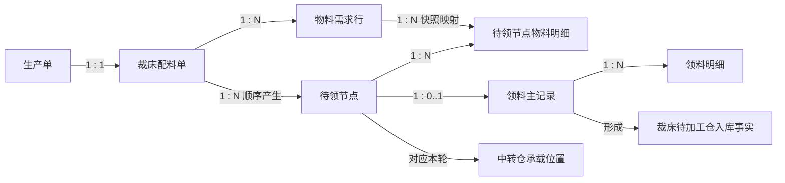
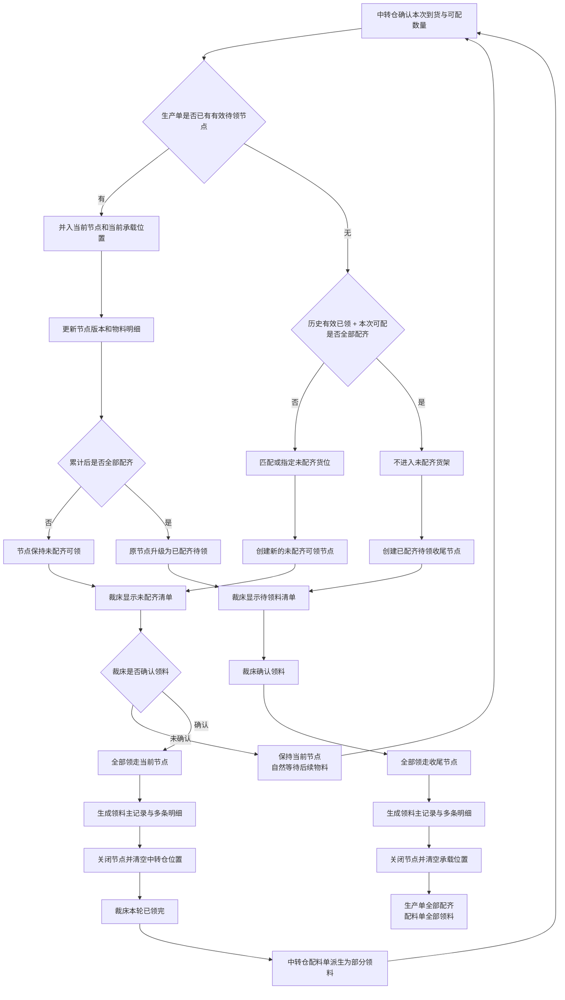

# 中转仓配料与裁床领料完整关系设计

## 1. 文档状态

- 设计日期：2026-07-22
- 设计结论：已确认
- 适用页面：工艺工厂运营系统 > 裁床厂管理 > 裁前准备 > 领料管理
- 主要角色：裁床仓管、裁床领料人员
- 上游系统：仓储管理系统 > 中转仓配料

## 2. 背景与目标

同一生产单的物料可能分多次到达中转仓。中转仓每次收货、分拣和配料后，裁床可以把当前生产单货位上的全部物料领走；剩余物料后续到达后，还可能再次形成新的领料。

本设计需要明确：

1. 一个生产单对应几张配料单。
2. 多次到货、多个待领节点和多次领料记录之间的关系。
3. 未配齐物料被领走后，后续到货如何重新判断齐套。
4. 裁床本次领料状态与中转仓整张配料单汇总状态如何区分。
5. 领料管理应按什么业务对象展示和记录。

## 3. 设计范围

### 3.1 本次范围

- 生产单、裁床配料单、物料需求行、待领节点、领料主记录和领料明细的基数关系。
- 首次到货与后续到货的节点归并规则。
- 累计齐套判断规则。
- 未配齐节点和已配齐节点的裁床领料流程。
- 裁床领料事实与仓储侧配料单汇总状态的关系。
- 领料管理页面需要承接的业务对象和状态口径。

### 3.2 不在本次范围

- 中转仓内部的调拨入仓、收货、分拣、上架、打印任务单、盘点和一键完成等页面及操作。
- 仓储管理系统的真实接口、数据库和状态机实现。
- 现有打回中转仓、领后退回、差异领料和按实完结流程的重新设计。
- 裁床待加工仓后续向铺布执行发料的流程。

上述异常能力继续保留现状。本设计只定义正常配料与正常领料主关系，不改变异常流程规则。

## 4. 核心结论

1. 在“中转仓配料给裁床”的业务场景内，一个生产单始终只有一张有效裁床配料单。
2. 分批到货、分批放入货位和多次领料，不新建新的主配料单。
3. 同一生产单可以顺序产生多个待领节点，但同一时刻最多只有一个有效待领节点。
4. 裁床一次确认领料，必须把当前待领节点中的全部物料领走，不能只领取节点内的一部分。
5. 一次确认生成一条领料主记录；主记录下包含本次全部物料的多条领料明细。
6. “本轮已领完”描述裁床本次实物交接结果；“部分领料”描述中转仓整张配料单的累计进度，两者不能混用。
7. 后续物料到达时，必须将“历史有效已领物料”与“当前可领物料”合并后重新判断整张生产单是否配齐。

## 5. 业务对象与基数关系



### 5.1 生产单

生产单是物料总需求的业务归属对象。生产数量、技术包 BOM 和物料需求均以生产单为计算边界。

### 5.2 裁床配料单

裁床配料单是跨到货批次、跨待领节点和跨领料记录的持续汇总对象。它累计维护：

- 各物料需求数量。
- 历史有效已领数量。
- 当前待领数量。
- 剩余缺口。
- 当前是否配齐。
- 是否已经全部领料。

分批到货和多次领料不会生成新的主配料单。

### 5.3 物料需求行

每条物料需求行按以下组合独立计算：

- 物料 SKU。
- 颜色。
- 规格。
- 单位。

不同物料、颜色、规格或单位的数量不得相互抵扣。

### 5.4 待领节点

待领节点表示裁床当前可以一次性全部领走的物料集合。

节点分为：

- 未配齐可领：当前已有物料可领，但生产单累计仍未配齐。
- 已配齐待领：历史有效已领物料加当前节点物料，已经覆盖生产单全部需求。

待领节点包含：

- 生产单和配料单。
- 节点版本。
- 节点类型。
- 当前承载位置。
- 当前全部可领物料明细快照。
- 历史有效已领汇总。
- 累计齐套结果。

同一生产单同一时刻最多只有一个有效待领节点。

### 5.5 领料主记录与领料明细

裁床确认领料后：

- 当前待领节点整体关闭。
- 生成一条领料主记录。
- 节点内每条物料生成一条领料明细。
- 中转仓当前承载位置被清空。
- 物料进入裁床待加工仓。

领料主记录代表一次完整的现场交接，不应按物料行拆成多条主记录。

## 6. 待领节点生成与归并规则

### 6.1 当前已有有效待领节点

如果裁床尚未领取当前节点，后续物料再次到达：

1. 本次物料并入当前节点和当前承载位置。
2. 更新节点物料明细快照和节点版本。
3. 重新执行累计齐套判断。
4. 如果仍未配齐，节点继续保持“未配齐可领”。
5. 如果已经配齐，原节点直接升级为“已配齐待领”。

该场景不得创建第二个并行待领节点。

### 6.2 当前没有有效待领节点

如果上一节点已经被裁床全部领走并清空，后续物料再次到达：

1. 先使用历史有效已领数量和本次可配数量计算累计齐套。
2. 如果累计后仍未配齐，才匹配或指定生产单未配齐货位，并创建新的“未配齐可领”节点。
3. 如果累计后已经配齐，不进入未配齐货架，直接创建“已配齐待领”收尾节点。

是否形成未配齐货位批次，取决于累计齐套结果，而不是取决于是否发生一次新到货。

## 7. 累计齐套判断

对每一条必需物料需求行分别计算：

```text
累计覆盖数量 = 历史有效已领数量 + 当前节点可领数量
```

只有所有必需物料行均满足以下条件，生产单才算已经配齐：

```text
累计覆盖数量 >= 该物料需求数量
```

判断要求：

- 必须逐物料 SKU、颜色、规格和单位计算。
- 不同单位不得直接加总。
- 已作废、已退回或无效的历史领料不得计入“历史有效已领数量”。
- 当前存在有效节点时，使用节点内全部可领数量参与计算。
- 当前不存在有效节点时，使用本次可配数量参与计算。

## 8. 完整业务流转



“未确认领料”不是裁床操作，不提供“暂不领”或“继续等待”按钮。裁床没有确认领料，就自然保持等待状态。

## 9. 裁床确认领料的原子结果

一次确认领料必须同时形成以下结果：

1. 校验待领节点仍是最新有效版本。
2. 锁定当前节点，避免重复确认。
3. 生成一条领料主记录。
4. 生成节点内全部物料的领料明细。
5. 生成裁床待加工仓入库事实。
6. 关闭当前待领节点。
7. 清空中转仓当前承载位置。
8. 更新物料需求行的历史有效已领数量。
9. 重新派生整张配料单状态。

上述结果必须作为一次完整业务提交处理，不能出现已经生成领料记录但货位未清空，或货位已清空但领料记录未生成的中间结果。

## 10. 状态关系与页面表达

| 业务阶段 | 待领节点 | 裁床领料管理 | 领料主记录 | 中转仓配料单 |
| --- | --- | --- | --- | --- |
| 累计仍未配齐，尚未领取 | 未配齐可领 | 未配齐清单 | 尚未生成 | 未配齐 |
| 某轮未配齐节点已领完 | 已关闭 | 等待后续物料 | 本轮已领完 | 部分领料 |
| 累计已配齐，收尾节点尚未领取 | 已配齐待领 | 待领料清单 | 尚未生成 | 已配齐待领 |
| 收尾节点已领完 | 已关闭 | 已领料完结 | 收尾轮已领完 | 全部领料 |

状态使用约束：

- 裁床本次领料记录只表达“本轮已领完”，不能表达为“部分领料”。
- “部分领料”只用于描述中转仓整张生产单配料单的累计进度。
- “部分领料”和“全部领料”由有效领料明细与剩余需求自动派生，裁床不能手工选择。
- 生产单可能存在多条“本轮已领完”的领料记录，直到最后一条收尾记录完成后才整体“全部领料”。

## 11. 领料管理页面职责

### 11.1 列表对象

领料管理的当前待办应按“当前有效待领节点”展示，而不是按单条物料行展示。

每个待领节点展示：

- 生产单与配料单。
- 节点类型：未配齐可领或已配齐待领。
- 当前承载位置。
- 当前可领物料明细。
- 当前可领总卷数及各物料数量。
- 历史有效已领摘要。
- 仍缺物料摘要。
- 节点最近更新时间。

### 11.2 主要操作

- 查看当前节点全部物料。
- 确认领料。
- 使用现有异常入口打回中转仓。

页面不得提供“暂不领”“继续等待”或“标记部分领料”操作。

### 11.3 历史记录

同一生产单详情下按时间展示多条领料主记录。每条主记录展开后展示该次全部领料明细、领取人、领取时间、中转仓来源位置和裁床入库位置。

## 12. 跨系统同步约束

### 12.1 待领节点发布

仓储管理系统向裁床领料管理提供：

- 节点编号和节点版本。
- 生产单与配料单编号。
- 节点类型。
- 当前承载位置。
- 当前全部可领物料明细。
- 历史有效已领摘要。
- 仍缺物料摘要。
- 累计齐套结果。

### 12.2 领料确认回写

裁床向仓储管理系统回写：

- 节点编号和确认时节点版本。
- 领料主记录编号。
- 本次全部领料明细。
- 领取人和领取时间。
- 裁床接收库区和库位。

### 12.3 防重与版本校验

- 节点物料更新后必须生成新版本。
- 裁床使用旧版本确认时必须阻断，并提示重新核对最新物料。
- 同一节点重复确认必须返回已有领料结果，不能生成第二条领料主记录。
- 已关闭节点不得再次确认。

## 13. 异常与防错

### 13.1 节点已更新

如果裁床核对期间中转仓又并入新物料，提交时提示：

> 当前待领物料已更新，请重新核对全部物料后再确认领料。

不得沿用旧快照继续提交。

### 13.2 实物与节点不一致

如果现场实物的物料、数量、卷数或位置与节点不一致，不允许只领取其中一部分。应进入现有“打回中转仓”异常流程，由中转仓重新核对。

### 13.3 重复提交

重复点击、弱网重试或重复回写只返回原领料记录，不重复累计已领数量。

### 13.4 位置未清空

如果领料记录已经形成但仓储侧位置清空失败，应将本次同步标记为异常待重试，不能再次生成新的领料记录。

## 14. 典型业务场景

### 14.1 首次到货即全部配齐

- 历史有效已领为 0。
- 本次可配已经覆盖全部物料需求。
- 直接创建已配齐待领节点，不进入未配齐货架。
- 裁床领走后形成第一条也是最后一条领料记录。
- 配料单进入全部领料。

### 14.2 首次到货未配齐，裁床暂未领取

- 创建未配齐可领节点。
- 裁床看到未配齐清单但不执行任何操作。
- 后续到货并入原节点。
- 如果累计配齐，原节点直接升级为已配齐待领。

### 14.3 首次到货未配齐，裁床领走

- 裁床把当前节点全部物料领走。
- 形成领料记录 1。
- 当前货位清空。
- 配料单进入部分领料。
- 后续继续等待剩余物料。

### 14.4 后续到货后仍未配齐

- 使用历史有效已领加本次可配重新计算。
- 累计仍未配齐。
- 创建新的未配齐可领节点。
- 裁床领走后形成领料记录 2。
- 配料单仍为部分领料。

### 14.5 后续到货后全部配齐

- 使用历史有效已领加本次可配重新计算。
- 累计已经配齐。
- 不进入未配齐货架，直接创建已配齐待领收尾节点。
- 裁床领走后形成收尾领料记录。
- 生产单全部配齐，配料单全部领料。

## 15. 验收标准

1. 同一生产单在本场景内只能找到一张有效裁床配料单。
2. 同一生产单同一时刻不能出现两个有效待领节点。
3. 一个有效节点可以因后续到货更新物料明细和节点版本。
4. 节点累计配齐后可以从未配齐可领升级为已配齐待领。
5. 上一节点关闭后，后续到货可以形成下一待领节点。
6. 一次确认只生成一条领料主记录，并包含当前节点全部物料明细。
7. 未配齐节点确认后，裁床本轮显示已领完，中转仓配料单显示部分领料。
8. 收尾节点确认后，生产单显示全部配齐，中转仓配料单显示全部领料。
9. 未确认领料不会生成操作记录，也不需要“暂不领”按钮。
10. 旧节点版本、重复提交和已关闭节点均不能生成新的领料记录。

## 16. 当前页面与目标关系的主要差异

当前领料管理已具备配料记录核对、领料入库、打回中转仓和历史领料查看等基础能力，但目标关系需要进一步统一：

- 当前待办需要从“配料记录/物料行”提升为“生产单当前待领节点”。
- 一次现场领料需要形成一条主记录及多条物料明细，而不是按物料拆成多条主记录。
- 页面需要明确区分“未配齐清单”和“已配齐待领料清单”。
- 页面需要展示历史有效已领、当前可领和剩余缺口的累计关系。
- 裁床本次状态与中转仓整张配料单状态必须分开显示。

本设计仅确认上述产品关系，不在本阶段实施页面或数据结构改造。
