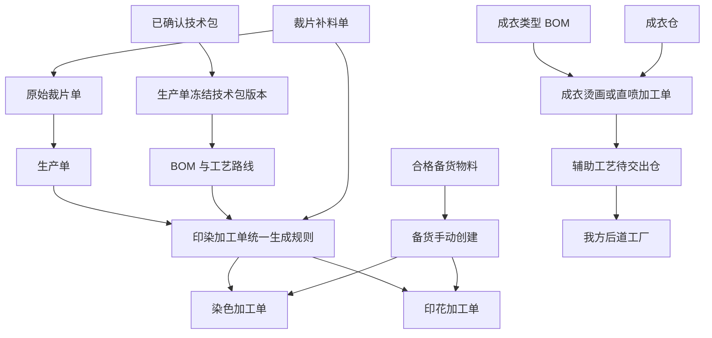

# 烫画双作用对象与印染加工单清理设计

## 1. 设计背景

本次设计同时收口两组已经发生交叉影响的业务问题：

1. 辅助工艺新增并完善“烫画”，使烫画与直喷一样支持“裁片部位”和“成衣”两种作用对象。
2. 已经取消的染色需求单、印花需求单仍残留在数据类型、生成器、页面、Mock 和检查脚本中，需要彻底删除；染色加工单、印花加工单继续保留并直接承接三种业务来源。

当前原型已经存在烫画字典、成衣烫画演示数据和部分成衣执行能力，但字典、技术包、BOM、加工单、仓库和验收脚本之间没有形成一致模型。当前代码也仍存在“先生成需求单，再生成加工单”的旧链路，与已经确认的业务事实冲突。

本设计目标是用最小必要范围完成业务模型收口，不引入新的中间单据、兼容层或通用工作流框架。

## 2. 已确认结论

### 2.1 烫画和直喷的作用对象

- 烫画属于辅助工艺。
- 烫画支持“裁片部位”和“成衣”两种作用对象。
- 直喷同样支持“裁片部位”和“成衣”两种作用对象。
- “完整面料”不再作为烫画、直喷的可选作用对象。
- 作用对象在技术包工序工艺中明确选择，并进入生产单冻结技术包快照。

### 2.2 BOM 新增成衣类型

- BOM 物料类型新增“成衣”。
- 成衣类型 BOM 用于表达需要在成衣上执行的辅助工艺对象。
- 成衣类型 BOM 不进入普通面辅料采购、裁床用料和裁片齐套计算。
- 成衣类型 BOM 的数量单位固定为“件”，单件用量默认为 1。

### 2.3 成衣辅助工艺流转

成衣烫画、成衣直喷统一采用以下现场链路：

```text
成衣仓出库
→ 辅助工艺工厂接收入待加工仓
→ 烫画或直喷加工
→ 辅助工艺待交出仓
→ 发起交出
→ 我方后道工厂收货
→ 进入现有后道、质检和复检链路
```

### 2.4 取消印花和染色需求单

- 染色需求单、印花需求单不是停用状态，而是已经取消的业务对象。
- 所有需求单类型、字段、编号、页面、路由、生成器、查询、转换、Mock、兼容判断和检查代码必须删除。
- 不允许保留“需求单产物”“需求单转加工单”或用历史字段回退展示需求单号的逻辑。
- 染色加工单、印花加工单继续保留，直接承接业务来源。

### 2.5 印染加工单的三种来源

染色加工单、印花加工单支持以下三种生成路径：

1. 生产单结合冻结技术包版本和 BOM 自动生成。
2. 业务人员从合格备货物料手动创建。
3. 裁片单补料确认后，根据所属生产单冻结技术包版本中的 BOM 要求生成。

### 2.6 染色和印花顺序

- 同一 BOM 物料同时需要染色和印花时，固定为先染色、后印花。
- 技术包工艺路线允许人工排序，但不得把同一物料排成先印花、后染色。
- 两张加工单同时生成、独立执行，不建立加工单状态依赖或“前置染色未完成”锁定。
- 印花是否能够开工由正常物料收货和库存可用性决定。
- 已经提前染好的备货物料可以直接用于印花加工，不要求关联某张染色加工单。

## 3. 版本覆盖关系

本设计延续并修订以下既有设计：

- 延续 `2026-07-15-print-dye-requirement-removal-and-combined-dyeing-design.md` 中取消染色、印花需求单，保留加工单和合并染色任务的结论。
- 延续 `2026-07-16-dye-work-order-online-alignment-design.md` 中加工单号唯一、加工单直接展示来源、不回退需求单号的结论。
- 新增“裁片补料生成”作为第三种加工单来源。
- 既有“一张加工单只对应一个生产单或一次备货创建”的表述，修订为“一张加工单只对应一个明确来源事件”；裁片补料属于独立来源事件，可以在同一生产单下生成新的补料加工单。
- 既有“一个生产单不能拆成多张同类加工单”的规则，只适用于生产单首次自动生成，不约束后续独立补料加工单。
- 旧文档中任何染色需求单、印花需求单的数据结构、页面或产物描述均停止适用。

## 4. 业务对象边界

| 业务对象 | 职责 | 不承担的职责 |
| --- | --- | --- |
| 技术包工艺路线 | 表达标准工艺、作用对象和先染后印顺序 | 不判断某批物料当前库存是否已染好 |
| BOM | 表达物料或成衣对象、适用 SKU、用量及印染要求 | 不生成需求单，不承担加工执行状态 |
| 生产单技术包快照 | 冻结本生产单实际采用的技术包版本 | 不跟随后续最新技术包静默变化 |
| 染色加工单 | 承接一次明确染色执行 | 不作为印花加工单的运行时锁 |
| 印花加工单 | 承接一次明确印花执行 | 不判断关联染色加工单是否完成 |
| 备货库存 | 证明当前可领用物料及数量 | 不伪造生产单或补料单来源 |
| 补料单 | 表达某生产单或裁片单的补料事实 | 不拼接虚假需求单和加工单 |
| 辅助工艺仓库 | 管理烫画、直喷对象的接收、待加工和待交出 | 不生成工艺任务或改变技术包定义 |
| 我方后道工厂 | 接收成衣辅助工艺完成品并继续后道执行 | 不接收裁片菲票链路 |

## 5. BOM 成衣类型设计

### 5.1 可选类型

BOM 物料类型调整为：

- 面料。
- 辅料。
- 包装材料。
- 成衣。
- 其他。

### 5.2 成衣类型字段规则

选择“成衣”后：

- BOM 名称显示为“成衣”，允许业务补充必要备注。
- 单位固定为“件”。
- 单件用量默认为 1，不按面料损耗公式计算。
- 必须选择适用颜色、尺码或 SKU；选择全部 SKU 时明确展示范围。
- 不要求填写面料编码、幅宽、克重、供应商或纸样关联。
- 不允许勾选面料染色要求、面料印花要求、水溶、缩水或洗水等物料准备字段。
- 可以被成衣烫画或成衣直喷工序引用。

### 5.3 下游隔离

成衣类型 BOM 不进入：

- 面辅料采购和仓库配料。
- 裁片单用料、铺布、唛架和裁片齐套。
- 面料印染加工单数量计算。
- BOM 物料颜色与纸样裁片映射。

成衣类型 BOM 进入：

- 技术包成衣辅助工艺关联。
- 生产单成衣辅助工艺任务生成。
- 成衣仓出库和辅助工艺收货。
- 成衣件数口径的执行、交出和后道收货。

## 6. 技术包工序工艺设计

### 6.1 作用对象选择

新增烫画或直喷时必须选择：

- 裁片部位。
- 成衣。

同一工艺可以按不同作用对象分别存在。例如同一技术包可以同时维护“烫画—前片”和“烫画—成衣”，两者作为不同工艺配置处理。

### 6.2 裁片部位校验

选择“裁片部位”时：

- 必须在纸样管理中关联至少一个具体裁片部位。
- 每个关联部位必须具有适用颜色、尺码和每件用片数。
- 技术包发布前如果没有有效裁片关联，阻止发布。
- 生产单生成后按裁片部位、颜色、尺码和片数形成任务明细。

### 6.3 成衣校验

选择“成衣”时：

- 必须关联至少一条类型为“成衣”的 BOM 行。
- 不能要求关联纸样裁片部位。
- 适用范围来自成衣 BOM 的适用 SKU。
- 技术包发布前如果缺少成衣 BOM 或适用 SKU，阻止发布。
- 页面统一显示业务名称“成衣”，不向用户暴露“成衣半成品”等旧口径。

### 6.4 先染后印校验

同一 BOM 物料同时存在染色和印花要求时：

- 工艺路线必须先出现染色，再出现印花。
- 人工拖动、调整步骤或确认路线时均执行校验。
- 反向排序时阻止保存或确认，提示“同一物料必须先染色、后印花，请调整工艺顺序”。
- 该校验只约束标准工艺路线，不创建加工单之间的运行时依赖。

## 7. 辅助工艺任务生成

### 7.1 裁片部位任务

裁片烫画、裁片直喷按以下口径生成：

```text
计划片数 = 适用 SKU 生产数量 × 每件用片数
```

任务明细包含：

- 生产单和技术包快照。
- 工艺和作用对象。
- 纸样、裁片部位、颜色和尺码。
- 每件用片数、计划片数和单位“片”。
- 菲票和裁片流转关联。

完成后进入裁片待交出及回裁床链路，不进入我方后道工厂。

### 7.2 成衣任务

成衣烫画、成衣直喷按以下口径生成：

```text
计划成衣件数 = 成衣 BOM 适用 SKU 的生产数量合计
```

任务明细包含：

- 生产单和技术包快照。
- 成衣 BOM 行。
- 工艺和作用对象。
- 颜色、尺码、SKU、计划件数和单位“件”。
- 成衣仓出库来源。

不生成纸样占位记录、虚拟裁片部位或菲票。

### 7.3 按作用对象决定规则

是否需要菲票、是否回裁床、数量单位和下游去向必须由本张任务选择的作用对象决定，不能继续固化为整个工艺的一组布尔配置。

| 作用对象 | 数量单位 | 菲票 | 上游 | 下游 |
| --- | --- | --- | --- | --- |
| 裁片部位 | 片 | 需要 | 裁片仓或裁床链路 | 裁片待交出并回裁床 |
| 成衣 | 件 | 不需要 | 成衣仓 | 辅助工艺待交出仓后交我方后道工厂 |

## 8. 成衣辅助工艺现场链路


### 8.1 成衣仓出库

- 依据成衣辅助工艺加工单生成出库任务。
- 按颜色、尺码、SKU 和件数拣货。
- 保存应出、实出、差异、出库人和出库时间。

### 8.2 辅助工艺收货与加工

- 辅助工艺工厂确认实收件数。
- 少收、多收、错码和破损进入统一差异记录。
- 执行过程中记录合格、报废和货损成衣件数。
- 不展示裁片数量、裁片部位、菲票或回裁床动作。

### 8.3 待交出和后道收货

- 加工完成的合格成衣进入辅助工艺待交出仓。
- 从待交出仓发起交出，接收方固定为我方后道工厂。
- 我方后道工厂按 SKU 确认实收并记录差异。
- 收货后接入现有后道任务、质检和复检链路，不新建平行后道模型。

## 9. 印染加工单统一生成设计

### 9.1 生成入口

印花和染色保留各自加工单、页面和执行领域，但共用最小统一生成规则。统一生成规则负责：

- 解析来源。
- 读取冻结技术包和 BOM。
- 判断需要生成的工艺。
- 计算数量和单位。
- 形成来源快照。
- 生成稳定幂等标识。
- 调用现有印花或染色加工单创建能力。

统一规则不合并印花、染色执行页面，不引入通用状态机。

### 9.2 来源一：生产单自动生成

生产单正式生成并冻结技术包版本后：

1. 读取该生产单冻结技术包版本。
2. 按 BOM 行识别染色、印花要求。
3. 计算适用 SKU 生产数量、BOM 单位用量和损耗后的计划加工数量。
4. 直接生成染色加工单或印花加工单。
5. 同一物料同时需要染色和印花时，同时生成两张独立加工单。
6. 未分配工厂时仍生成加工单，显示“待分配工厂”。

不得先生成需求单产物，也不得通过需求单对象再转换加工单。

### 9.3 来源二：备货手动创建

- 业务人员从对应工厂正常入待加工仓、无待处理差异的备货物料中选择物料。
- 创建时填写计划数量、单位、工厂、计划完成时间和工艺要求。
- 来源显示“备货手动创建”。
- 不关联或伪造生产单、补料单和需求单。
- 可用数量、单位和工厂归属继续由现有库存规则校验。

### 9.4 来源三：裁片补料生成

补料单确认时按以下链路追溯：

```text
补料单
→ 原始裁片单
→ 所属生产单
→ 生产单冻结技术包版本
→ 物料与 BOM 行
→ 染色、印花要求
→ 真实加工单
```

生成规则：

- 只读取该生产单冻结技术包版本，不读取当前最新技术包。
- 补料物料必须匹配明确 BOM 行；无法唯一匹配时阻止生成并要求人工确认物料关系。
- 加工数量按补料数量、BOM 单位用量、损耗率和物料原单位计算。
- 需要染色时生成补料染色加工单。
- 需要印花时生成补料印花加工单。
- 同时需要两种工艺时同时生成两张加工单，不建立状态锁定。
- 加工单来源显示“裁片补料生成”，并保留补料单、裁片单、生产单、技术包版本和 BOM 行。
- 补料页面直接展示真实加工单号、状态和详情入口。

## 10. 先染后印与执行解耦

### 10.1 固定标准顺序

先染后印是技术包路线的固定业务约束。任何人工排序都必须遵守该顺序。

### 10.2 不建立加工单依赖

染色和印花加工单同时生成，但不保存以下运行时逻辑：

- 前置染色加工单 ID。
- 前置染色未完成锁定。
- 染色完成后自动解锁印花。
- 根据另一张加工单状态判断本单能否开工。

### 10.3 通过物料事实自然控制

- 印花加工单是否可领料、开工，继续使用正常收货和可用库存规则。
- 新生产的待染物料尚未完成染色和交接时，自然不存在可领用的已染物料。
- 以前已完成染色并形成合格备货的物料，可以直接用于印花加工单。
- 工艺路线表达标准顺序，仓库表达物料事实，加工单只负责本工艺执行。

## 11. 加工单来源与幂等规则

### 11.1 来源类型

加工单来源统一为：

- 生产单自动生成。
- 备货手动创建。
- 裁片补料生成。

页面不得用“非备货即生产单”的二分判断推断来源。

### 11.2 来源快照

生产单自动生成的加工单保存：

- 生产单。
- 技术包冻结版本。
- BOM 行。
- 物料、适用 SKU、数量、单位和工艺要求。

裁片补料生成的加工单额外保存：

- 补料单。
- 原始裁片单。
- 补料批次或补料记录。

备货手动创建的加工单保存：

- 备货物料和库存记录。
- 创建人和创建时间。
- 手工确认的工艺、数量和计划时间。

### 11.3 幂等标识

建议业务幂等标识由以下事实组成：

| 来源 | 幂等事实 |
| --- | --- |
| 生产单自动生成 | 生产单 + 技术包冻结版本 + BOM 行 + 工艺 |
| 备货手动创建 | 本次明确提交产生的创建记录 ID |
| 裁片补料生成 | 补料记录 + 原始裁片单 + 技术包冻结版本 + BOM 行 + 工艺 |

重复创建生产单产物、重复确认补料或页面重复提交时，返回已有加工单，不重复建单。

## 12. 需求单代码彻底清理

### 12.1 必须删除

- 染色需求单、印花需求单业务类型。
- 需求单 ID、编号、状态、数量和满足明细字段。
- 需求单生成、查询、列表和聚合函数。
- 需求单转加工单服务。
- 生产产物中的染色、印花需求单产物。
- 任务拆解和生产准备时效对需求单的读取。
- 印花、染色加工单对需求单 ID 或需求产物的依赖。
- 补料记录中的印花需求单号、染色需求单号。
- 补料页面虚构需求单号、需求状态和“需求单与加工单”展示。
- 字典中染色、印花的“默认单据为需求单”配置。
- 需求单菜单、路由、页面、跳转、导出、打印和详情入口。
- 需求单 Mock、测试夹具和仅用于需求单的检查脚本。
- 需求单历史字段回退、兼容适配器、兜底分支和死代码。

### 12.2 不得误删

- 生产需求单这一上游正式业务对象不在本次删除范围。
- 染色加工单、印花加工单及其仓库、PDA、交出、回写、统计和结算能力继续保留。
- BOM 中的染色要求、印花要求继续保留，它们直接触发加工单。
- 水溶与染色连续加工的既有有效规则继续保留，但不得依赖染色需求单对象。

### 12.3 零残留验收

业务代码、检查脚本和配置中不得再出现：

- “染色需求单”。
- “印花需求单”。
- 仅服务于这两类需求单的类型、字段、函数、编号前缀和产物分支。

不能通过修改检查脚本、改名保留同一旧对象或留下未调用死代码绕过清理。

## 13. 页面调整

### 13.1 技术包 BOM

- 物料类型增加“成衣”。
- 成衣类型显示适用 SKU 和成衣辅助工艺关联。
- 隐藏与成衣无关的面料准备字段。

### 13.2 技术包工序工艺

- 烫画、直喷的作用对象只提供“裁片部位、成衣”。
- 列表明确展示本次选择的作用对象。
- 路线编辑阻止同一物料先印后染。

### 13.3 补料管理

- “印染需求”调整为“印染加工单”。
- 不再展示需求单号和需求状态。
- 展示真实染色、印花加工单号、来源、工厂和执行状态。
- 加工单号可进入现有加工单查看入口。

### 13.4 印花和染色加工单

- 来源筛选和详情支持三种来源。
- 补料加工单展示补料单、原始裁片单和生产单。
- 备货加工单不显示空生产单或伪造生产单号。
- 所有端使用平台唯一加工单号。

### 13.5 辅助工艺加工单和仓库

- 同一烫画或直喷页面可以展示裁片任务和成衣任务。
- 数量字段、表头、操作和详情按作用对象切换。
- 成衣任务不出现菲票区块；裁片任务保留菲票区块。
- 辅助工艺仓库记录不得把成衣任务硬编码为裁片。

## 14. 异常与防错

| 场景 | 处理规则 |
| --- | --- |
| 成衣烫画或直喷未关联成衣 BOM | 阻止技术包确认和发布 |
| 裁片烫画或直喷未关联裁片部位 | 阻止技术包确认和发布 |
| 同一物料路线先印后染 | 阻止保存或确认，并提示调整为先染后印 |
| 生产单没有可用冻结技术包 | 不生成加工单，给出明确阻断原因 |
| 补料物料无法匹配 BOM 行 | 不生成加工单，要求确认物料关系 |
| 补料物料匹配多个 BOM 行 | 不猜测，要求人工选择唯一 BOM 行 |
| 重复确认补料 | 返回已有加工单，不重复生成 |
| 备货库存不足或有差异 | 阻止手动创建加工单 |
| 成衣仓实出与辅助工艺实收不一致 | 进入统一差异记录，不静默改数 |
| 成衣辅助工艺交出与后道实收不一致 | 进入统一差异和异议处理 |
| 页面仍读取需求单号 | 视为清理失败，阻止交付 |

## 15. 数据流总览



## 16. 实施边界

### 16.1 本次包含

- 工序工艺字典中烫画、直喷作用对象收口。
- BOM 成衣类型及其技术包交互。
- 技术包先染后印路线校验。
- 裁片和成衣两套辅助工艺生成与流转。
- 成衣仓到辅助工艺再到我方后道工厂的完整链路。
- 印染加工单第三种补料来源。
- 生产单、备货、补料三种加工单生成路径。
- 染色、印花需求单代码彻底清理。
- 相关 Web、PDA、仓库、交接、进度、打印和检查更新。

### 16.2 本次不包含

- 不合并染色加工单和印花加工单页面。
- 不建设通用加工单状态机或新的基础设施。
- 不给染色和印花加工单增加运行时前置依赖。
- 不改变合并染色任务的既有业务规则，除非需求单清理造成直接引用需要移除。
- 不扩展真实后端、接口、数据库或权限体系。
- 不批量重构与本次无关的生产、仓库和结算模块。

## 17. 验收标准

### 17.1 技术包与 BOM

1. BOM 可以选择“成衣”，单位为件，单件用量默认为 1。
2. 成衣 BOM 不进入采购、配料、铺布、裁片和齐套计算。
3. 烫画、直喷均只能选择裁片部位或成衣。
4. 裁片作用对象必须关联具体裁片部位。
5. 成衣作用对象必须关联成衣 BOM 和适用 SKU。
6. 同一物料先印后染时无法保存或确认技术包路线。

### 17.2 辅助工艺

1. 裁片烫画、直喷按片生成并保留菲票和回裁床链路。
2. 成衣烫画、直喷按件生成，不出现裁片部位和菲票。
3. 成衣任务从成衣仓出库进入辅助工艺待加工仓。
4. 加工完成后进入辅助工艺待交出仓。
5. 交出接收方为我方后道工厂，收货后进入现有后道链路。
6. 差异、报废、货损、交出和实收数量可完整追溯。

### 17.3 印染加工单

1. 生产单可直接生成染色、印花加工单。
2. 备货物料可继续手动创建加工单。
3. 裁片补料确认可生成真实染色、印花加工单。
4. 补料加工单可追溯补料单、裁片单、生产单、技术包版本和 BOM 行。
5. 同一物料需要染色和印花时同时生成两张独立加工单。
6. 加工单之间没有染色完成锁定字段或解锁逻辑。
7. 重复操作不产生重复加工单。

### 17.4 需求单清理

1. 系统不生成、查询、展示或跳转染色需求单、印花需求单。
2. 业务代码、检查脚本和配置中不存在两类需求单的残留代码。
3. 补料页面不再拼接需求单号或需求状态。
4. 加工单不再读取需求单 ID、需求产物或需求满足明细。
5. 生产需求单、水溶加工和现有印染执行链路不被误删。

### 17.5 原型与工程治理

1. 所有页面文案和状态使用中文业务语义。
2. 列表调整遵循标准列表页治理，保留分页、排序、列显示、列顺序、冻结和右侧固定操作栏。
3. 页面、数据、路由或交互改动必须新增或更新原型审查记录。
4. 通过原型设计治理、列表治理、TypeScript、构建和相关专项检查。
5. 在 1366×768 和 1280×720 下验证技术包、补料、印染加工单、辅助工艺仓库和 PDA 关键路径。
6. Web 和 PDA 的轻交互不得因本次改造退化为整页重绘。

## 18. 设计自检结论

- 无待定项、TODO 或占位符。
- 烫画、直喷作用对象与 BOM、纸样、数量单位和下游流向一致。
- 先染后印只约束技术包路线，不与加工单库存执行耦合。
- 三种加工单来源边界明确，补料来源不会伪装成生产单首次生成。
- 已取消需求单按物理删除处理，没有兼容层设计。
- 本设计可以由一份实现计划覆盖，但实现时应按“领域清理、技术包与 BOM、三种生成路径、辅助工艺流转、页面与验收”分批执行。
