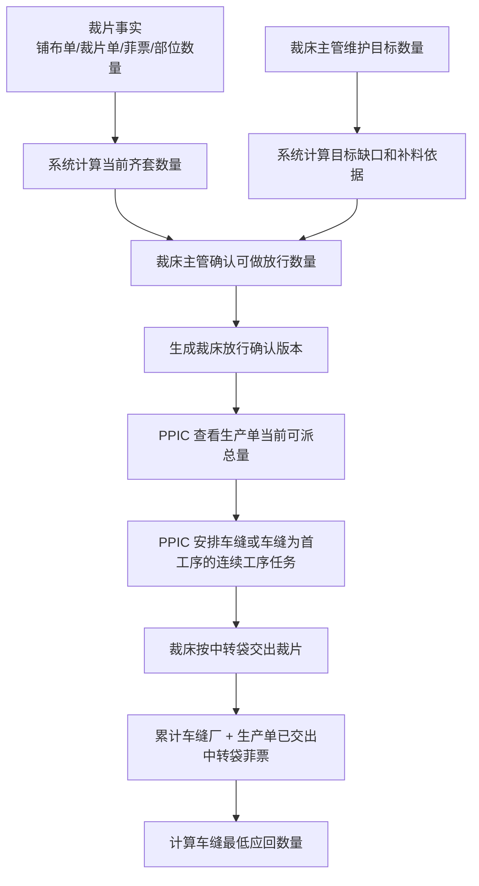
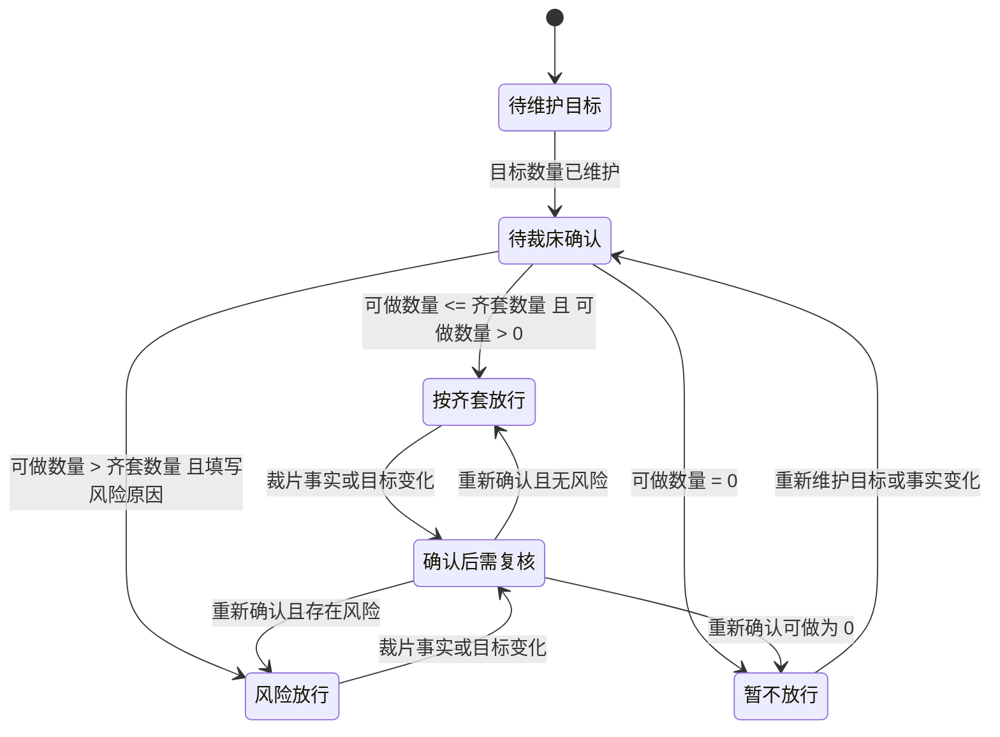
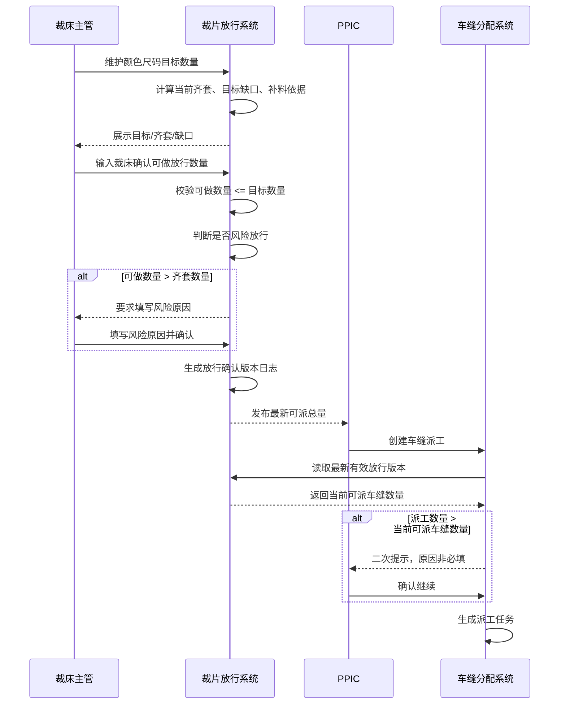
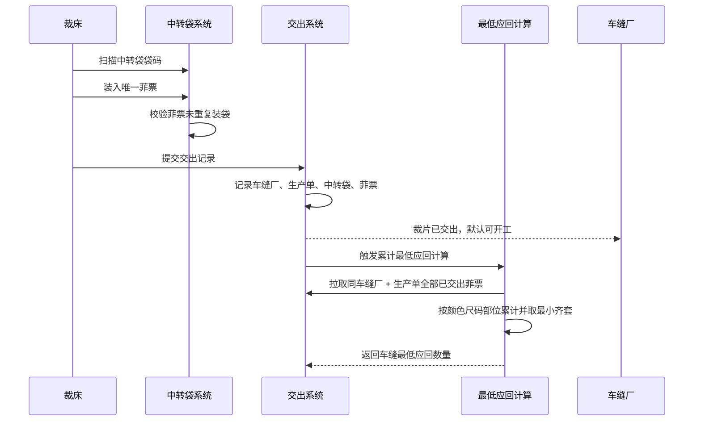

# 裁片放行、PPIC 可派总量与车缝最低应回产品设计

## 1. 文档信息

| 项目 | 内容 |
| --- | --- |
| 文档日期 | 2026-07-25 |
| 适用系统 | FCS / PFOS |
| 相关页面 | `/fcs/craft/cutting/cut-piece-release`、PPIC 车缝分配页面、中转袋交出页面 |
| 主要角色 | 裁床主管、PPIC、裁床交出人员、车缝厂 |
| 文档目的 | 明确裁片放行、PPIC 可派总量、目标数量、齐套数量、车缝最低应回数量之间的业务定义、计算关系、状态和操作规则 |

## 2. 当前代码核查结论

已核查以下现有代码：

- `src/data/fcs/cut-piece-release.ts`
- `src/data/fcs/cut-piece-release-domain.ts`
- `src/pages/process-factory/cutting/cut-piece-release.ts`
- `src/pages/sewing-dispatch-workbench.ts`
- `src/data/fcs/cutting/handover-orders.ts`
- `src/pages/process-factory/cutting/handover-orders.ts`
- `src/pages/process-factory/cutting/transfer-bags/list.ts`

现有能力：

- 已有裁片事实模型 `CutPieceFact`。
- 已有裁片矩阵模型 `CutPieceReleaseMatrix`。
- 已有颜色尺码齐套计算 `completeKitBySize`。
- 已有目标快照 `CutPieceReleaseTargetSnapshot`。
- 已有裁片矩阵版本日志 `CutPieceReleaseMatrixVersion`。
- 已有中转袋交出模型 `HandoverTransferBagUse`。
- 已有交出菲票明细 `HandoverFeiTicketItem`。
- 已有交出记录的累计交出汇总 `cumulativeHandedOverSummary`。

当前主要偏差：

- 现有 `releaseQty` 实际更接近目标快照数量，不是本设计定义的“裁床确认可做放行数量”。
- 现有 `confirmCutPieceReleaseTarget()` 保存的是目标数量快照，不是放行确认版本。
- 现有 PPIC 车缝分配候选逻辑仍偏向 `completeKitQty >= remainingQty`，未体现“可做数量优先”。
- 现有交出快照中的最低应回口径偏向交接时齐套快照；本设计要求按“车缝厂 + 生产单累计已交出中转袋菲票”计算。
- 现有 `saveCutPieceReleaseDecision()` 已废弃，提示旧放行判断入口不再写入权威数据。

产品结论：

**不能把目标快照复用成放行结果。必须新增“裁床放行确认版本”这一业务层。**

## 3. 核心业务定义

裁片放行管理的准确定义：

**裁片放行管理 = 裁床基于当前裁片事实、目标数量和现场判断，告知 PPIC 当前生产单可以拿去安排车缝的总量。**

裁片放行管理只回答一个问题：

**这个生产单当前最多可以安排多少件去车缝？**

裁片放行管理不回答以下问题：

- 派给哪个车缝厂。
- 每个车缝厂派多少。
- 车缝厂最终应该回多少件。
- 中转袋实际交出了多少。
- 结算、扣款或异常责任如何处理。

最终业务边界：

```text
裁片放行数量 = 计划协作口径
PPIC 派工数量 = 派工决策口径
车缝最低应回数量 = 实物交接口径
```

## 4. 总体业务流程



## 5. 三段责任链路

### 5.1 裁床放行判断

```text
裁片事实 / 目标数量
→ 系统计算当前齐套数量、目标缺口、补料依据
→ 裁床主管确认可做放行数量
→ 生成裁床放行确认版本
→ PPIC 获取生产单当前可派总量
```

责任方：裁床主管。

核心输出：`裁床确认可做放行数量`。

业务意义：裁床告诉 PPIC 当前这个生产单最多可以拿多少件去安排车缝。

### 5.2 PPIC 派工决策

```text
PPIC 查看当前可派总量
→ PPIC 判断是否派工
→ PPIC 安排车缝任务或车缝为首工序的连续工序任务
```

责任方：PPIC。

核心输入：最新有效放行版本中的 `裁床确认可做放行数量`。

业务边界：PPIC 具体派给哪个车缝厂、每个车缝厂派多少，不在裁片放行管理中定义。

### 5.3 中转袋交出与车缝最低应回

```text
裁床按中转袋交出裁片
→ 系统记录中转袋和菲票
→ 按车缝厂 + 生产单累计已交出菲票
→ 计算车缝最低应回数量
```

责任方：裁床交出人员、车缝厂。

核心输出：`车缝最低应回数量`。

业务边界：车缝最低应回数量不来自裁片放行数量，也不来自 PPIC 派工数量，而来自实际已交出的中转袋菲票。

## 6. 角色与责任

| 角色 | 核心责任 | 不负责 |
| --- | --- | --- |
| 裁床主管 | 维护目标数量，确认可做放行数量，填写风险原因，生成放行版本 | 不决定具体派给哪个车缝厂 |
| PPIC | 根据最新有效放行版本判断生产单可派总量，安排车缝任务 | 不维护目标数量，不修改裁床放行数量 |
| 裁床交出人员 | 按中转袋和菲票交出裁片 | 不决定 PPIC 派工策略 |
| 车缝厂 | 基于实际交出的裁片开工并回货 | 不参与裁片放行确认 |
| 系统 | 计算齐套、缺口、风险数量、版本日志、最低应回 | 不替代主管风险判断 |

## 7. 关键字段定义

### 7.1 生产单维度字段

| 字段 | 中文名 | 定义 | 来源 / 维护方 | 是否可编辑 |
| --- | --- | --- | --- | --- |
| `productionOrderId` | 生产单 ID | 生产单唯一标识 | 系统 | 否 |
| `productionOrderNo` | 生产单号 | 面向用户展示和搜索的生产单编号 | 系统 | 否 |
| `spuCode` | 款式编码 | 当前生产单对应款式编码 | 系统 | 否 |
| `spuName` | 款式名称 | 当前生产单对应款式名称 | 系统 | 否 |
| `matrixVersion` | 当前矩阵版本 | 当前裁片事实矩阵版本 | 系统 | 否 |
| `latestReleaseVersion` | 最新放行版本 | 最新有效裁床放行确认版本 | 系统 | 否 |
| `releaseStatus` | 放行状态 | 当前生产单裁片放行结论 | 系统 | 否 |

### 7.2 颜色尺码维度字段

| 字段 | 中文名 | 定义 | 来源 / 维护方 | 是否可编辑 |
| --- | --- | --- | --- | --- |
| `colorName` | 颜色 | 成衣颜色 | 系统 | 否 |
| `sizeCode` | 尺码 | 成衣尺码 | 系统 | 否 |
| `targetQty` | 目标数量 | 裁床计划要裁到的数量，核心用于补料/补裁判断 | 裁床主管 | 是 |
| `completeKitQty` | 当前齐套数量 | 当前裁片事实能完整组成的最低成衣数 | 系统 | 否 |
| `releaseConfirmQty` | 裁床确认可做放行数量 | 裁床确认当前可告知 PPIC 安排车缝的数量 | 裁床主管 | 是 |
| `riskReleaseQty` | 风险放行数量 | 可做放行数量超过当前齐套数量的部分 | 系统 | 否 |
| `targetGapQty` | 目标缺口数量 | 当前齐套距离目标还差多少 | 系统 | 否 |
| `releaseGapToTargetQty` | 放行距目标缺口 | 可做放行数量距离目标还差多少 | 系统 | 否 |
| `surplusKitQty` | 超目标齐套数量 | 当前齐套超过目标的数量 | 系统 | 否 |

### 7.3 放行确认版本字段

| 字段 | 中文名 | 定义 | 来源 / 维护方 | 是否可编辑 |
| --- | --- | --- | --- | --- |
| `releaseVersionId` | 放行版本 ID | 放行版本唯一标识 | 系统 | 否 |
| `releaseVersionNo` | 放行版本号 | 生产单内递增版本号，如 `V1`、`V2` | 系统 | 否 |
| `basisMatrixVersion` | 依据矩阵版本 | 本次确认依据的裁片事实矩阵版本 | 系统 | 否 |
| `basisTargetVersion` | 依据目标版本 | 本次确认依据的目标数量版本 | 系统 | 否 |
| `totalTargetQty` | 汇总目标数量 | 所有颜色尺码目标数量合计 | 系统 | 否 |
| `totalCompleteKitQty` | 汇总当前齐套数量 | 所有颜色尺码当前齐套数量合计 | 系统 | 否 |
| `totalReleaseConfirmQty` | 汇总裁床确认可做放行数量 | PPIC 当前可派总量 | 系统 | 否 |
| `totalRiskReleaseQty` | 汇总风险放行数量 | 所有颜色尺码风险放行数量合计 | 系统 | 否 |
| `riskReason` | 风险原因 | 风险放行时裁床主管填写的原因 | 裁床主管 | 条件必填 |
| `confirmedBy` | 确认人 | 生成放行版本的裁床主管 | 系统 | 否 |
| `confirmedAt` | 确认时间 | 放行版本生成时间 | 系统 | 否 |
| `isLatestEffective` | 是否最新有效版本 | PPIC 默认读取的版本标记 | 系统 | 否 |

### 7.4 PPIC 派工参考字段

| 字段 | 中文名 | 定义 | 来源 | 备注 |
| --- | --- | --- | --- | --- |
| `ppicAvailableDispatchQty` | PPIC 当前可派总量 | PPIC 当前可用于安排车缝的生产单总量 | 最新有效 `totalReleaseConfirmQty` | PPIC 第一优先级字段 |
| `ppicDispatchQty` | PPIC 派工数量 | PPIC 本次安排给车缝任务的数量 | PPIC 操作 | 可以超过可派总量 |
| `overDispatchQty` | 超可派数量 | 派工数量超过裁床确认可做数量的部分 | 系统 | 超过时二次提示 |
| `overDispatchConfirmed` | 是否已确认超派 | PPIC 是否已确认继续超派 | PPIC 操作 | 原因非必填 |

### 7.5 中转袋、菲票与最低应回字段

| 字段 | 中文名 | 定义 | 来源 | 备注 |
| --- | --- | --- | --- | --- |
| `transferBagCode` | 中转袋袋码 | 中转袋唯一编码 | 中转袋系统 | 实物载体 |
| `feiTicketNo` | 菲票号 | 菲票唯一编号 | 菲票系统 | 裁片事实最小单元 |
| `partCode` | 部位编码 | 裁片部位编码 | 菲票 | 用于齐套计算 |
| `partName` | 部位名称 | 裁片部位中文名称 | 菲票 | 页面展示 |
| `pieceQty` | 裁片数量 | 菲票对应裁片数量 | 菲票 | 单位为片 |
| `receiverFactoryId` | 接收车缝厂 ID | 裁片交出的接收对象 | 交出记录 | 最低应回累计维度 |
| `handoverAt` | 交出时间 | 裁床交出时间 | 交出记录 | 当前业务中等同车缝开工时间 |
| `cumulativeHandoverPieceQty` | 累计已交出裁片数量 | 按车缝厂 + 生产单累计 | 系统 | 基于交出事实 |
| `minimumReturnQty` | 车缝最低应回数量 | 已交出中转袋菲票按部位齐套后的最低成衣数 | 系统 | 不来自放行数量 |

## 8. 计算公式

### 8.1 部位可成衣数量

```text
partAvailableGarmentQty(color, size, part)
= floor(sum(validPieceQty[color, size, part]) / piecesPerGarment[part])
```

解释：

- `validPieceQty` 是当前有效裁片事实数量。
- 冲销、作废、已排除的裁片事实不参与计算。
- `piecesPerGarment[part]` 是单件衣服所需该部位裁片数量。

### 8.2 当前齐套数量

```text
completeKitQty(color, size)
= min(partAvailableGarmentQty(color, size, requiredPart))
```

解释：

- 对同一颜色尺码，所有必需部位都要具备。
- 取各必需部位可成衣数量的最小值。
- 任一必需部位不可计算时，该颜色尺码齐套数量为“待计算”。

### 8.3 汇总当前齐套数量

```text
totalCompleteKitQty
= sum(completeKitQty(color, size))
```

约束：

- `null` 或“待计算”不能当作可放行数量。
- 页面应明确显示“待计算”，不能默默按 0 展示为业务结论。

### 8.4 目标缺口

```text
targetGapQty(color, size)
= max(targetQty(color, size) - completeKitQty(color, size), 0)
```

解释：

- 目标缺口服务于补料/补裁。
- 目标缺口不是 PPIC 可派缺口。

### 8.5 缺口裁片数量

```text
missingPieceQty(color, size, part)
= max(targetQty(color, size) * piecesPerGarment(part) - actualPieceQty(color, size, part), 0)
```

解释：

- 用于反算需要补多少裁片或多收多少物料。
- 这是目标数量最核心的业务用途。

### 8.6 裁床确认可做放行数量

裁床主管按颜色尺码输入：

```text
0 <= releaseConfirmQty(color, size) <= targetQty(color, size)
```

汇总：

```text
totalReleaseConfirmQty
= sum(releaseConfirmQty(color, size))
```

PPIC 当前可派总量：

```text
ppicAvailableDispatchQty = totalReleaseConfirmQty
```

硬约束：

```text
releaseConfirmQty(color, size) 不允许大于 targetQty(color, size)
```

### 8.7 风险放行数量

```text
riskReleaseQty(color, size)
= max(releaseConfirmQty(color, size) - completeKitQty(color, size), 0)
```

汇总：

```text
totalRiskReleaseQty = sum(riskReleaseQty(color, size))
```

风险原因必填条件：

```text
if totalRiskReleaseQty > 0 then riskReason 必填
```

### 8.8 放行距目标缺口

```text
releaseGapToTargetQty(color, size)
= max(targetQty(color, size) - releaseConfirmQty(color, size), 0)
```

解释：

- 用于说明裁床虽然计划裁到目标，但当前只确认可放行一部分。

### 8.9 PPIC 超派数量

```text
overDispatchQty
= max(ppicDispatchQty - ppicAvailableDispatchQty, 0)
```

当 `overDispatchQty > 0`：

- 不阻断派工。
- 必须二次提示确认。
- 确认原因非必填。

### 8.10 车缝最低应回数量

计算维度：

```text
车缝厂 + 生产单
```

部位累计裁片数量：

```text
factoryProductionPartQty(factory, productionOrder, color, size, part)
= sum(已交出给该车缝厂的该生产单该颜色尺码该部位菲票数量)
```

部位可成衣数量：

```text
factoryProductionPartGarmentQty
= floor(factoryProductionPartQty / piecesPerGarment(part))
```

颜色尺码最低应回：

```text
minimumReturnQty(factory, productionOrder, color, size)
= min(所有必需部位 factoryProductionPartGarmentQty)
```

生产单汇总最低应回：

```text
totalMinimumReturnQty(factory, productionOrder)
= sum(minimumReturnQty(factory, productionOrder, color, size))
```

重要边界：

```text
车缝最低应回数量 ≠ 裁床确认可做放行数量
车缝最低应回数量 ≠ PPIC 派工数量
车缝最低应回数量 = 已交出中转袋菲票累计齐套数量
```

## 9. 状态设计

### 9.1 放行状态图



### 9.2 放行状态定义

| 状态 | 定义 | PPIC 是否可见 | PPIC 使用方式 |
| --- | --- | --- | --- |
| `待维护目标` | 尚未维护颜色尺码目标数量 | 可见 | 不建议派工，派工需二次确认 |
| `待裁床确认` | 已维护目标，但未生成放行版本 | 可见 | 不建议派工，派工需二次确认 |
| `按齐套放行` | 可做数量小于等于当前齐套数量 | 可见 | 可按可做数量派工 |
| `风险放行` | 可做数量大于当前齐套数量，且已填写风险原因 | 可见 | 可派工，但必须显示风险数量和原因 |
| `暂不放行` | 裁床确认当前不可派车缝 | 可见 | PPIC 派工需强提示确认 |
| `确认后需复核` | 放行后目标或裁片事实发生变化 | 可见 | 不自动失效，但强提示需复核 |

### 9.3 PPIC 派工提示状态

| 状态 | 条件 | 处理 |
| --- | --- | --- |
| `正常派工` | `ppicDispatchQty <= ppicAvailableDispatchQty` | 直接继续 |
| `超可派派工` | `ppicDispatchQty > ppicAvailableDispatchQty` | 二次提示，不阻断 |
| `无放行版本派工` | 无最新有效放行版本 | 二次提示，不阻断 |
| `放行需复核派工` | 最新放行版本状态为确认后需复核 | 二次提示，不阻断 |

## 10. 操作设计

### 10.1 裁床主管维护目标数量

目的：

维护每个颜色尺码的目标数量，用于补料/补裁判断，并作为裁床计划告知 PPIC 的背景。

前置条件：

- 生产单存在。
- 已存在颜色尺码维度。
- 当前用户为裁床主管。
- 目标数量必须按颜色尺码维护。

输入：

- `targetQtyByColorSize`
- `operator`
- `operatedAt`

校验：

```text
targetQty(color, size) >= 0
targetQty 必须覆盖当前生产单全部颜色尺码
targetQty 必须为有效数字
```

响应：

- 生成目标版本。
- 计算目标缺口。
- 计算需补物料/裁片。
- 页面展示目标数量、当前齐套、目标缺口。

后续：

- 若没有放行版本，进入 `待裁床确认`。
- 若已有放行版本，标记为 `确认后需复核`。

### 10.2 裁床主管确认可做放行数量

目的：

裁床向 PPIC 发布当前生产单可安排车缝的总量。

前置条件：

- 已维护目标数量。
- 当前用户为裁床主管。
- 当前矩阵可以读取颜色尺码维度。
- 汇总可做放行数量由颜色尺码明细汇总。

输入：

- `releaseConfirmQtyByColorSize`
- `riskReason`
- `operator`
- `operatedAt`
- `basisMatrixVersion`
- `basisTargetVersion`

校验：

```text
0 <= releaseConfirmQty(color, size) <= targetQty(color, size)
```

风险校验：

```text
if sum(max(releaseConfirmQty - completeKitQty, 0)) > 0
then riskReason 必填
```

响应：

- 生成新的放行确认版本。
- 记录版本日志。
- 计算汇总可做数量。
- 计算风险放行数量。
- 更新 PPIC 可读摘要。

后续：

- PPIC 页面读取最新有效版本。
- 旧版本保留。
- 若之后裁片事实或目标变化，当前版本标记为 `确认后需复核`。

### 10.3 裁片事实变化

触发场景：

- 新铺布完成。
- 裁片单冻结。
- 裁片单恢复。
- 铺布冲销。
- 菲票数量变化。

前置条件：

- 存在生产单裁片矩阵。
- 事实来源有稳定 ID。

响应：

- 生成矩阵新版本。
- 重新计算当前齐套数量。
- 重新计算目标缺口。
- 如果已有放行版本，标记为 `确认后需复核`。

后续：

- 裁床主管可重新确认放行版本。
- PPIC 页面展示“裁床放行后裁片事实已变化，请关注”。

### 10.4 PPIC 查看可派数量

目的：

PPIC 在分配车缝任务或车缝为首工序的连续工序任务时，优先查看当前可派总量。

前置条件：

- PPIC 进入车缝分配页面。
- 页面可根据生产单读取最新有效裁床放行版本。

显示优先级：

1. `当前可派车缝：N 件`
2. `系统齐套：N 件`
3. `风险放行：N 件`
4. `裁床目标：N 件`
5. `距目标还差：N 件`
6. `裁床确认人 / 时间 / 风险原因`

响应：

- 若有最新有效版本，展示可派数量。
- 若无版本，展示“未取得裁床确认可做数量”。
- 若版本需复核，展示“裁片事实/目标已变化，需关注”。

后续：

- PPIC 可继续派工。
- 若超可派数量，则进入二次确认。

### 10.5 PPIC 超可派派工确认

目的：

允许 PPIC 在特殊情况下超过裁床确认可做放行数量派工，但必须看到风险提示。

前置条件：

```text
ppicDispatchQty > ppicAvailableDispatchQty
```

提示文案：

```text
当前派工数量超过裁床确认可做放行数量，可能导致车缝缺裁片开工，请确认是否继续。
```

输入：

- `confirmOverDispatch = true`
- `operator`
- `operatedAt`
- `reason` 可选

响应：

- 不阻断派工。
- 记录二次确认。
- 派工继续。

后续：

- 派工记录保存当时引用的放行版本快照。
- 后续追溯时可看到 PPIC 超派确认事实。

### 10.6 裁床按中转袋交出裁片

目的：

将裁片实物按中转袋交给车缝厂。

前置条件：

- 已有 PPIC 派工或允许例外交出。
- 中转袋有唯一袋码。
- 袋内菲票唯一。
- 菲票包含生产单、颜色、尺码、部位、数量。
- 接收对象为车缝厂。

输入：

- `handoverOrderId`
- `handoverRecordId`
- `receiverFactoryId`
- `transferBagCodes`
- `feiTicketItems`
- `handoverAt`
- `handoverBy`

响应：

- 生成交出记录。
- 更新中转袋状态为已交出。
- 累计该车缝厂 + 生产单已交出菲票。
- 重新计算车缝最低应回数量。

后续：

- 车缝最低应回数量基于累计已交出计算。
- 不依赖车缝厂 PDA 收货。

### 10.7 计算车缝最低应回数量

目的：

根据已交出的中转袋菲票，计算车缝厂最终最低应回数量。

前置条件：

- 存在车缝厂。
- 存在生产单。
- 已有交出记录。
- 交出记录中有中转袋与菲票明细。

计算维度：

```text
车缝厂 + 生产单
```

响应：

- 汇总所有已交出给该车缝厂的该生产单菲票。
- 按颜色、尺码、部位累计。
- 按 BOM 部位用量折算。
- 得出最低应回数量。

后续：

- 用于车缝回货、欠货、异常判断。
- 不反写裁片放行数量。

## 11. 时序图

### 11.1 裁床放行到 PPIC 派工



### 11.2 中转袋交出到最低应回



## 12. 页面信息优先级

### 12.1 裁床放行页面

裁床页面关注：目标、齐套、缺口、补料、确认。

推荐展示顺序：

1. 目标数量。
2. 当前齐套数量。
3. 目标缺口。
4. 需补物料 / 裁片。
5. 裁床确认可做放行数量。
6. 风险放行数量。
7. 风险原因。
8. 版本日志。

主操作：

- 维护目标数量。
- 确认可做放行数量。
- 查看版本日志。
- 查看补料依据。

### 12.2 PPIC 车缝分配页面

PPIC 页面关注：当前可派多少。

推荐展示顺序：

1. 当前可派车缝。
2. 系统齐套。
3. 风险放行。
4. 裁床目标。
5. 距目标还差。
6. 裁床确认人 / 时间。
7. 风险原因。

推荐摘要示例：

```text
当前可派车缝：500 件
系统齐套：320 件
风险放行：180 件
裁床目标：600 件
距目标还差：100 件
裁床确认：王敏 · 2026-07-25 10:20
风险说明：袖口裁片现场已裁未点收入仓，裁床主管确认可先发车缝。
```

### 12.3 中转袋交出页面

交出页面关注：实际交了什么。

推荐展示顺序：

1. 车缝厂。
2. 生产单。
3. 中转袋袋码。
4. 袋内菲票。
5. 本次交出裁片数量。
6. 累计已交出裁片数量。
7. 累计最低应回数量。

## 13. 放行版本日志设计

每次放行确认必须生成版本日志。

| 字段 | 说明 |
| --- | --- |
| `releaseVersionNo` | 放行版本号 |
| `basisMatrixVersion` | 依据矩阵版本 |
| `basisTargetVersion` | 依据目标版本 |
| `beforeTotalReleaseConfirmQty` | 上一版本可做数量 |
| `afterTotalReleaseConfirmQty` | 本版本可做数量 |
| `beforeTotalRiskReleaseQty` | 上一版本风险数量 |
| `afterTotalRiskReleaseQty` | 本版本风险数量 |
| `changedColorSizeLines` | 发生变化的颜色尺码 |
| `riskReason` | 风险原因 |
| `confirmedBy` | 确认人 |
| `confirmedAt` | 确认时间 |

版本规则：

- 新版本生成后，旧版本保留。
- PPIC 默认读取最新有效版本。
- 如果目标或裁片事实变化，不自动删除版本，而是标记为 `确认后需复核`。
- PPIC 历史派工保留当时引用的放行版本快照。

## 14. 与现有代码的映射建议

### 14.1 可复用现有模型

| 现有模型 / 字段 | 建议用途 |
| --- | --- |
| `CutPieceFact` | 裁片事实 |
| `CutPieceReleaseMatrix` | 当前齐套矩阵 |
| `completeKitBySize` | 当前齐套数量 |
| `CutPieceReleaseTargetSnapshot` | 目标数量版本 |
| `CutPieceReleaseMatrixVersion` | 裁片事实版本日志 |
| `HandoverTransferBagUse` | 中转袋交出事实 |
| `HandoverFeiTicketItem` | 已交出菲票明细 |
| `cumulativeHandedOverSummary` | 累计交出基础汇总 |

### 14.2 需要新增或重定义

| 需求 | 说明 |
| --- | --- |
| 放行确认版本模型 | 不应复用 `CutPieceReleaseTargetSnapshot` |
| `releaseConfirmQtyByColorSize` | 裁床确认可做放行数量 |
| `riskReason` | 风险放行原因 |
| `releaseVersionLog` | 放行版本日志 |
| PPIC 放行摘要 | 可做数量优先 |
| 车缝最低应回累计计算 | 按车缝厂 + 生产单 + 已交出中转袋菲票 |

### 14.3 应避免的错误映射

- 不要把 `targetQty` 当作 PPIC 可派数量。
- 不要把 `completeKitQty` 当作 PPIC 可派数量。
- 不要继续把 `releaseQty` 解释为目标数量。
- 不要在裁片放行管理中定义车缝最低应回数量。
- 不要按单次交接单独立计算车缝最终应回。

## 15. 关键业务规则汇总

| 规则 | 结论 |
| --- | --- |
| 可做放行数量是否可大于目标数量 | 不允许 |
| 可做放行数量是否可大于齐套数量 | 允许，属于风险放行 |
| 风险放行是否必须填原因 | 必须 |
| 风险原因是否结构化 | 暂不结构化 |
| 目标数量由谁维护 | 裁床主管 |
| 可做放行数量是否版本化 | 必须版本化 |
| PPIC 是否只能按可做数量派工 | 不强制限制 |
| PPIC 超派如何处理 | 二次提示确认，原因非必填 |
| 放行粒度 | 生产单汇总 + 颜色尺码明细 |
| 车缝最低应回计算范围 | 车缝厂 + 生产单累计 |
| 车缝最低应回计算依据 | 已交出中转袋内唯一菲票 |
| 是否等车缝厂 PDA 收货后才算最低应回 | 不需要，按已交出算 |

## 16. 最终确认版业务链路

```text
裁片事实 / 目标数量
→ 系统计算当前齐套数量、目标缺口、补料依据
→ 裁床主管确认可做放行数量
→ 生成裁床放行确认版本
→ PPIC 按最新有效放行版本判断生产单可派总量
→ PPIC 安排车缝或车缝为首工序的连续工序任务
→ 裁床按中转袋交出裁片
→ 系统按车缝厂 + 生产单累计已交出中转袋菲票
→ 计算车缝最低应回数量
```

最终核心句：

**裁片放行管理管“PPIC 当前可派多少”；中转袋交出管理管“实际交了什么”；车缝最低应回管“按已交出实物至少该回多少”。**
