# 裁床待交出仓与中转袋流转产品设计

## 1. 文档信息

| 项目 | 内容 |
| --- | --- |
| 文档日期 | 2026-07-25 |
| 适用系统 | FCS / PFOS / WLS |
| 相关页面 | `/fcs/craft/cutting/warehouse-management/wait-handover`、`/fcs/pda/warehouse/wait-handover`、`/fcs/pda/cutting/inbound/*`、`/fcs/pda/cutting/handover/*`、`/fcs/craft/cutting/transfer-bags` |
| 主要角色 | 裁床工位工人、待交出仓工人、交出仓工人、特种工艺工人、文员、主管、PPIC |
| 文档目标 | 统一裁床待交出仓、中转袋、交出、特种工艺回收入仓四类动作的业务定义、状态、流程、页面和数据边界 |

## 2. 背景与目标

裁床完成铺布裁剪后，裁片会进入一条连续但要分段管理的现场事实链：先打菲、打编、装袋，再把中转袋拉入待交出仓，之后按 PPIC 分配或工艺需求交给车缝 / 辅助工艺 / 特种工艺工厂；特种工艺完成后，还要把裁片回收到裁床待交出仓继续流转。

当前代码已经具备这条链路的雏形，但存在一个核心问题：**动作边界还没有按真实现场收口**。现有页面和事件把“装袋”和“入仓”揉在一起，交出对象虽然在数据层已经有区分，但页面语义仍偏车缝中心，特种工艺回收入仓也没有完整拆成“整袋回仓”和“逐菲票回仓”两个可选模式。

本设计目标是把裁床侧四个动作清晰定义为：

1. 菲票装袋
2. 中转袋入仓
3. 交出
4. 特种工艺回收入仓

并确保 Web 和 PDA 使用同一套事实口径。

## 3. 当前代码核查结论

已核查以下关键实现：

- `src/pages/process-factory/cutting/warehouse-hub.ts`
- `src/pages/pda-cutting-inbound.ts`
- `src/pages/pda-cutting-handover.ts`
- `src/pages/pda-warehouse-wait-handover.ts`
- `src/pages/process-factory/cutting/wait-handover-runtime.ts`
- `src/pages/process-factory/cutting/transfer-bags-model.ts`
- `src/data/fcs/cutting/sewing-dispatch.ts`
- `src/data/fcs/cutting/handover-orders.ts`
- `src/data/fcs/cutting/cutting-runtime-event-ledger.ts`
- `src/data/fcs/cutting/special-craft-fei-ticket-flow.ts`

核查结论：

- 裁床待交出仓、装袋、交出、特殊工艺回仓都已有基础实现。
- `wait-handover-runtime.ts` 是裁床待交出仓的运行时事实核心。
- `warehouse-hub.ts` 是 Web 端聚合入口。
- `pda-cutting-inbound.ts`、`pda-cutting-handover.ts`、`pda-warehouse-wait-handover.ts` 是 PDA 端入口。
- `sewing-dispatch.ts` 已把裁床待交出仓库存、车缝任务分配、交出单、回写连接起来。
- `handover-orders.ts` 已区分车缝交出、特殊工艺交出、仓库交出，以及车缝厂 / 辅助工艺厂 / 特种工艺厂接收对象。
- 但“装袋与入仓分离”“特殊工艺与普通菲票装袋分流”“特种工艺回仓整袋 / 逐票二选一”还未完整显式建模。

## 4. 业务口径

### 4.0 术语约定

本文档统一使用以下术语：

| 术语 | 定义 | 说明 |
| --- | --- | --- |
| 裁床待交出仓 | 裁床侧暂存已裁裁片、待交给下游的仓位事实 | 页面或代码中出现“待交出仓”时，本文默认指裁床待交出仓 |
| 菲票装袋 | 裁床工位把菲票对应裁片装入中转袋 | 不等于入仓 |
| 中转袋入仓 | 已装袋的中转袋进入裁床待交出仓并绑定库区库位 | 不等于交出 |
| 交出装袋确认 | 按接收任务把待交出仓库存从来源暂存袋分拣到目标交出中转袋 | 是交出前置动作 |
| 交出确认 | 确认哪些中转袋交给哪个接收对象，并生成交出记录 | 是真正责任转移动作 |
| 特种工艺回收入仓 | 辅助 / 特种工艺完成后，把裁片回到裁床待交出仓 | 代码里部分位置使用“特殊工艺回仓”，本文将其视为同一业务域 |

说明：代码中同时存在“特殊工艺”和“特种工艺”表述。产品口径上，本文将“辅助工艺 / 特种工艺”作为工艺分类；当说“特殊工艺菲票”时，泛指需要辅助工艺或特种工艺处理的菲票。

### 4.1 菲票装袋

定义：裁床工位在打菲、打编后，把裁片部位装入中转袋的动作。

规则：

- 先扫中转袋，再扫菲票。
- 普通菲票不能与辅助工艺 / 特种工艺菲票混装。
- 辅助工艺和特种工艺菲票允许互混。
- 同一袋内可按单尺码、多尺码、`L + 颜色` 或现场允许的组合装袋。
- 装袋完成不等于入仓完成。

### 4.2 中转袋入仓

定义：把已装好的中转袋放入裁床待交出仓，并绑定库区和库位。

规则：

- 中转袋必须先完成装袋。
- 必须绑定库区、库位、入仓人、入仓时间。
- Web 端允许文员根据本子记录补录。
- PDA 端允许扫码录入。

### 4.3 交出

定义：把裁床待交出仓中的中转袋交给下游接收对象。

接收对象：

- 车缝厂
- 辅助工艺厂
- 特种工艺厂
- 仓库
- 其他对象

规则：

- 交出必须明确接收对象。
- 交出必须基于已入仓的中转袋。
- 交出后必须保留回写、差异、异议追踪入口。

### 4.3.1 交出双阶段模型

交出不是一个单动作，而是两个连续动作：

| 阶段 | 中文动作 | 业务含义 | 结果 |
| --- | --- | --- | --- |
| 阶段一 | 交出装袋确认 | 按接收任务从来源暂存袋中扫描菲票，装入目标交出中转袋 | 形成已装袋待交出的袋级事实 |
| 阶段二 | 交出确认 | 确认目标中转袋交给接收对象 | 生成交出记录，进入接收回写与差异链路 |

交出装袋确认的业务规则：

- 必须扫描交出装袋确认任务。
- 必须扫描来源入仓暂存袋。
- 必须扫描菲票。
- 必须扫描目标中转袋。
- 菲票必须属于当前任务。
- 菲票必须在已扫描来源袋内。
- 目标中转袋同一时刻只能绑定一个接收任务。
- 需要辅助 / 特种工艺但未回仓的菲票不能交给车缝任务。

交出确认的业务规则：

- 必须来自已完成交出装袋确认的中转袋。
- 必须明确接收对象类型和接收对象名称。
- 必须生成交出记录。
- 交出后库存从裁床待交出仓转出。
- 交出后进入待接收回写、差异或异议处理。

### 4.3.2 接收对象口径

接收对象类型必须同时覆盖业务真实场景和现有代码模型：

| 接收对象类型 | 典型场景 | 是否核心 |
| --- | --- | --- |
| 车缝厂 | PPIC 分配车缝生产单后，裁床交出裁片给车缝 | 是 |
| 辅助工艺厂 | 裁片需要印花、绣花、模板、辅工处理 | 是 |
| 特种工艺厂 | 裁片需要激光、压褶等特种处理 | 是 |
| 仓库 | 临时转仓或特殊业务调拨 | 兼容 |
| 其他对象 | 原型兜底或异常交接 | 兼容 |

页面默认突出车缝厂、辅助工艺厂、特种工艺厂；仓库和其他对象作为主管或文员兜底选项，不应出现在一线 PDA 首屏主选项中。

### 4.4 特种工艺回收入仓

定义：特种工艺完成后，把裁片回收到裁床待交出仓。

模式：

- 有中转袋时，按整袋回仓。
- 没有中转袋时，按菲票逐张回仓。

规则：

- Web 和 PDA 都支持。
- Web 补录时二选一，不混合提交。
- 回仓后重新进入裁床待交出仓库存。
- 回仓后可再次参与后续装袋 / 交出。

### 4.5 特种工艺前向流转

特种工艺回收入仓不是孤立动作，它的前置链路是：

```text
裁床待交出仓库存
→ 特种工艺交出
→ 特种工艺厂接收
→ 特种工艺加工
→ 特种工艺完成
→ 特种工艺待回仓
→ 裁床待交出仓回收入仓
```

业务规则：

- 只有已从裁床待交出仓交出的特殊工艺菲票，才能进入特种工艺回仓候选。
- 特种工艺未完成时，不能回收入仓。
- 特种工艺未回仓时，相关菲票不能交给车缝任务。
- 回仓后，菲票重新变成裁床待交出仓可用库存。
- 回仓差异必须保留来源交出记录和承接工厂。

## 5. 角色与职责

| 角色 | 目标 | 主要动作 |
| --- | --- | --- |
| 裁床工位工人 | 把裁片做成可流转的袋 | 菲票装袋 |
| 待交出仓工人 | 让袋进入仓位事实 | 中转袋入仓 |
| 交出仓工人 | 把袋交给正确对象 | 交出 |
| 特种工艺工人 | 把工艺完成的裁片送回裁床 | 特种工艺回收入仓 |
| 文员 | 线下补录 | Web 录入 |
| 主管 | 处理异常与兜底 | 复核、退回、差异处理 |
| PPIC | 看可交出能力并安排工厂 | 读取交出侧事实 |

## 6. 现状与目标差距

### 6.1 当前已具备

- Web / PDA 都有待交出仓入口。
- 装袋、入仓、交出、特殊工艺回仓都能写入运行时事实。
- 数据层能区分车缝厂、辅助工艺厂、特种工艺厂。
- 特种工艺回仓已具备按菲票记录的基础。

### 6.2 仍需收口

- “菲票装袋”和“中转袋入仓”仍是一个合并动作。
- 现在的装袋规则更接近“允许混装”，普通与特殊工艺分流不够硬。
- 交出对象虽然模型区分了，但页面动作闭环仍偏车缝。
- 特种工艺回收入仓没有明确的“整袋 / 逐票”二选一主模型。

## 7. 总流程图

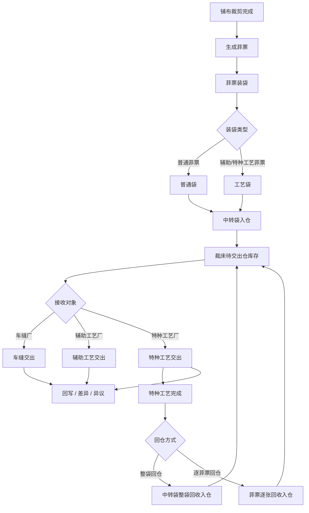

## 8. 状态图

### 8.1 中转袋状态图

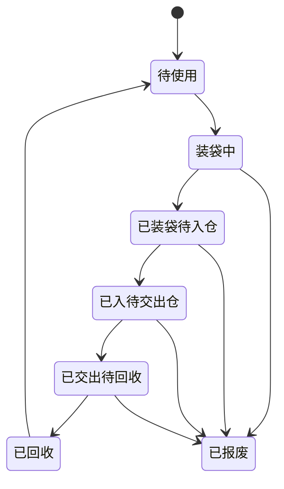

### 8.2 菲票状态图

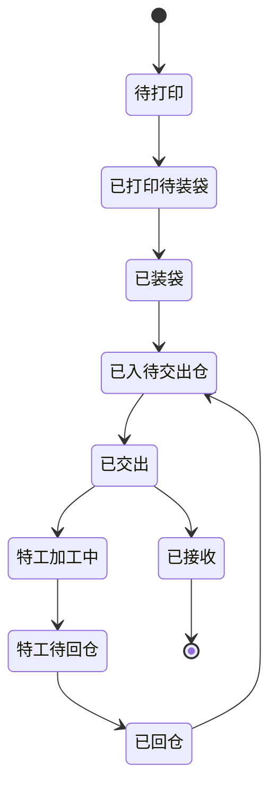

### 8.3 特种工艺回仓状态图

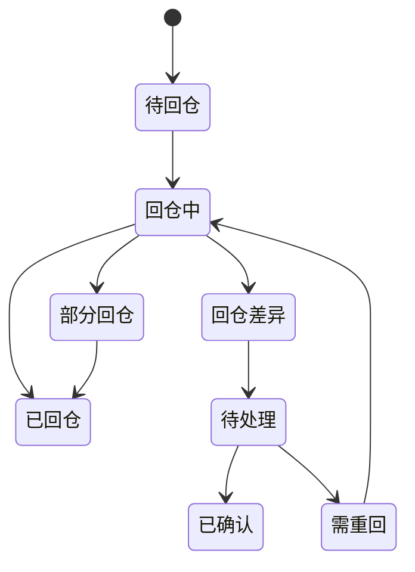

### 8.4 交出单状态图

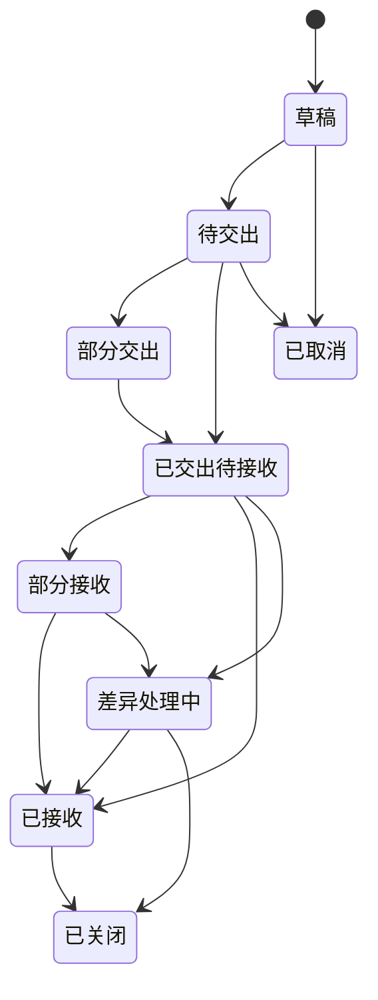

### 8.5 交出记录状态图

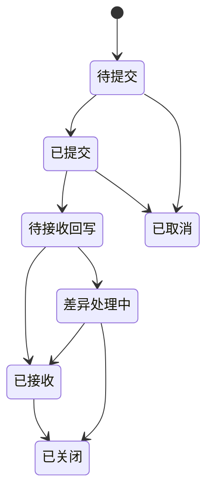

### 8.6 特种工艺全链路状态图

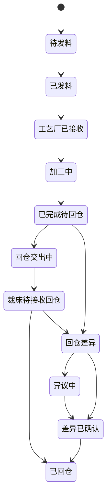

### 8.7 回写与异议状态图

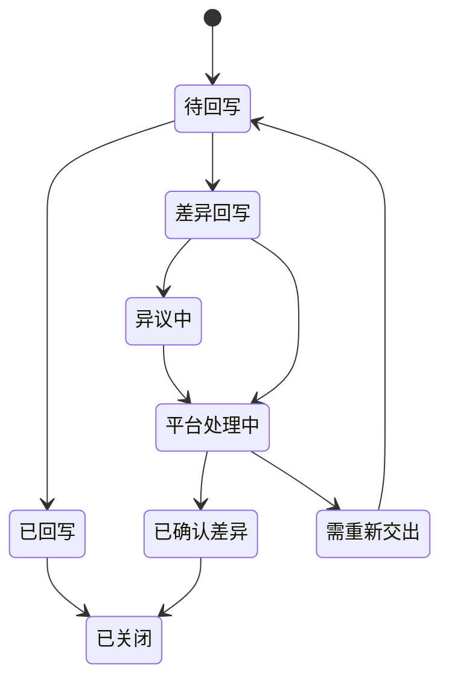

## 9. 时序图

### 9.1 菲票装袋 + 中转袋入仓

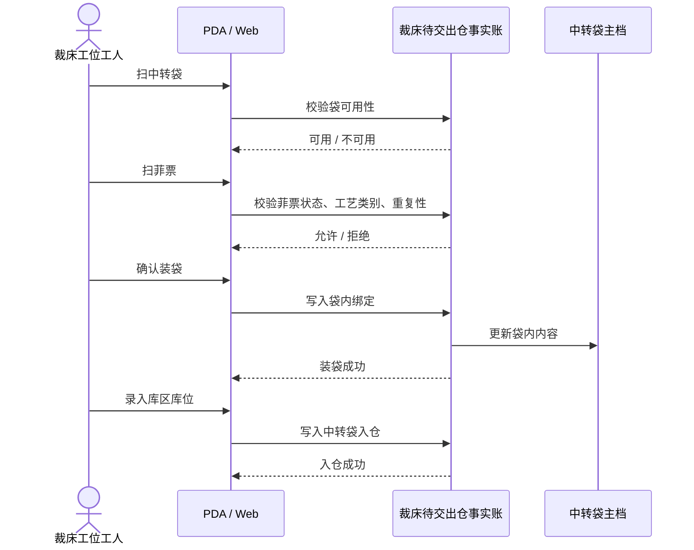

### 9.2 交出

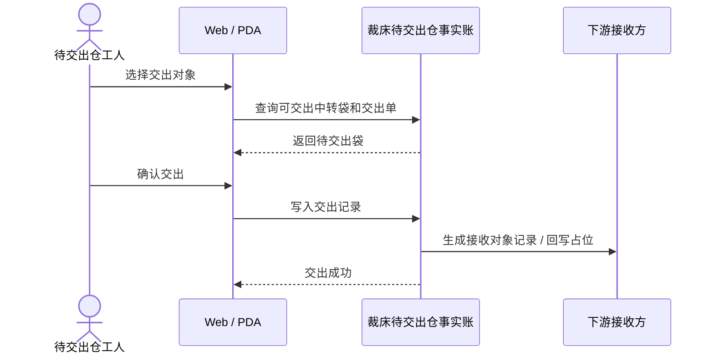

### 9.3 特种工艺回收入仓

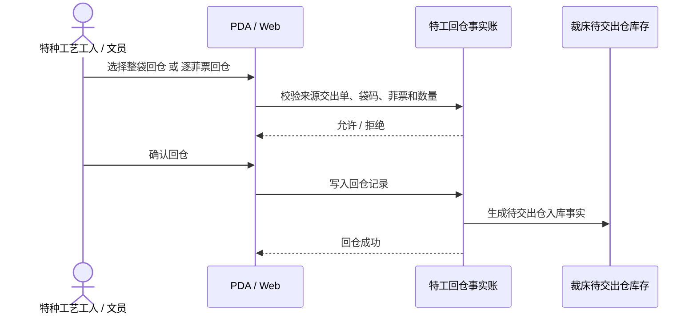

### 9.4 特种工艺全链路时序

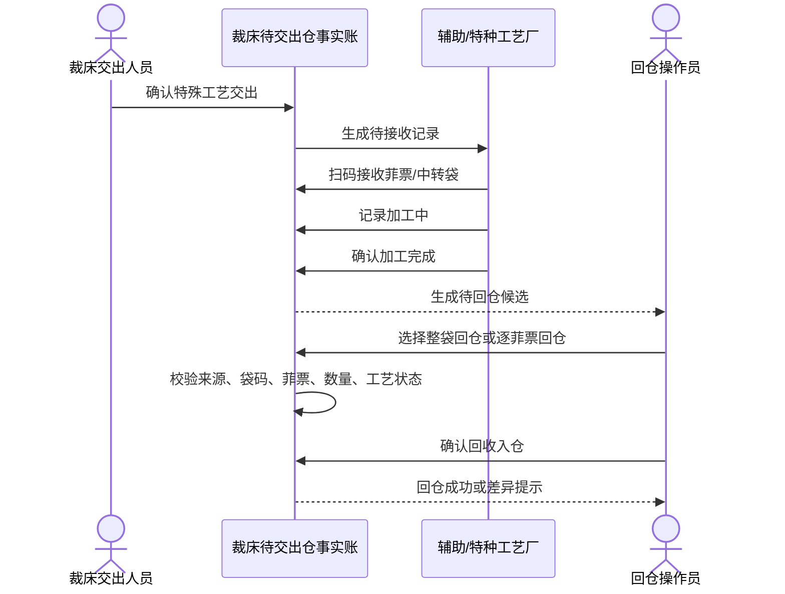

### 9.5 接收回写与差异时序

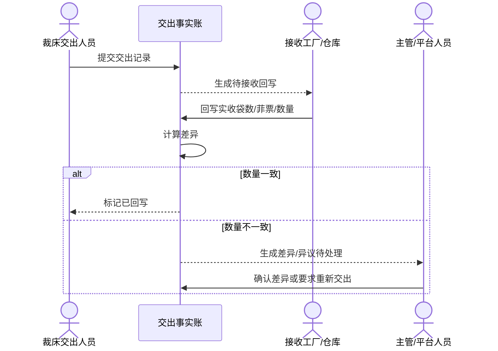

## 10. 页面设计

### 10.1 Web 端首页

页面路径：`/fcs/craft/cutting/warehouse-management/wait-handover`

Tab：

- 库存明细
- 菲票装袋
- 中转袋入仓
- 交出
- 特种工艺回仓
- 库区库位

首屏必须展示：

- 当前待交出仓库存。
- 当前中转袋状态。
- 当前交出对象。
- 当前特殊工艺回仓待处理数量。

### 10.2 Web 动作弹窗

#### 菲票装袋

必须包含：

- 中转袋码
- 菲票扫描区
- 该袋可否混装提示
- 当前袋内结果预览

#### 中转袋入仓

必须包含：

- 库区
- 库位
- 入仓人
- 入仓时间
- 绑定的中转袋和菲票摘要

#### 交出

必须包含：

- 接收对象类型
- 接收对象名称
- 交出单号 / 交出记录号
- 中转袋列表
- 菲票列表

#### 特种工艺回收入仓

必须包含：

- 回仓模式：整袋 / 逐菲票（二选一）
- 来源交出记录
- 回仓袋码或回仓菲票
- 库区
- 库位
- 实回数量

### 10.3 PDA 端页面

PDA 的页面目标是“马上知道扫什么”，因此每个页面只能突出一个主动作：

- 菲票装袋
- 中转袋入仓
- 交出
- 特种工艺回收入仓

PDA 不展示管理统计，不堆叠复杂日志，不让一线员工判断状态机。

## 11. 数据设计

### 11.1 事实账分层

建议保持三层事实：

1. 现场事件层：记录每次扫码、提交、回仓、交出。
2. 运行时投影层：生成当前待交出仓库存、中转袋状态、交出候选。
3. 业务单据层：承载交出单、回写、差异、异议、特殊工艺主对象。

### 11.2 关键字段

| 字段 | 含义 |
| --- | --- |
| `bagCode` | 中转袋码 |
| `feiTicketNo` | 菲票号 |
| `hasSpecialCraft` | 是否有特殊工艺 |
| `specialCraftCategory` | 辅助工艺 / 特种工艺 |
| `warehouseArea` | 库区 |
| `locationCode` | 库位 |
| `receiverType` | 车缝厂 / 辅助工艺厂 / 特种工艺厂 |
| `receiverName` | 接收对象名称 |
| `returnMode` | 整袋回仓 / 逐票回仓 |
| `sourceHandoverRecordNo` | 来源交出记录 |
| `pieceQty` | 片数 |
| `operatorName` | 操作人 |
| `occurredAt` | 时间 |

### 11.3 特殊工艺在库分类

裁床待交出仓库存中，特殊工艺相关菲票必须明确分类展示：

| 分类 | 含义 | 后续动作 |
| --- | --- | --- |
| 无特殊工艺 | 不需要辅助 / 特种工艺的普通裁片 | 可直接参与车缝交出 |
| 未做特殊工艺 | 需要辅助 / 特种工艺，但尚未完成并回仓 | 不能交给车缝，需先交给工艺厂或等待回仓 |
| 特殊工艺加工中 | 已交给辅助 / 特种工艺厂，尚未回到裁床 | 不能交给车缝，等待回仓 |
| 已做特殊工艺 | 已完成辅助 / 特种工艺并回到裁床待交出仓 | 可参与车缝交出 |

### 11.4 整袋回仓与逐菲票回仓字段

特种工艺回收入仓必须显式记录回仓模式：

| 字段 | 含义 | 整袋回仓 | 逐菲票回仓 |
| --- | --- | --- | --- |
| `returnMode` | 回仓模式 | `整袋回仓` | `逐菲票回仓` |
| `transferBagCode` | 回仓中转袋 | 必填 | 可为空 |
| `returnedFeiTicketItems` | 回仓菲票明细 | 由袋内明细展开 | 手工逐票扫描 |
| `sourceHandoverRecordNo` | 来源交出记录 | 必填 | 必填 |
| `warehouseArea` | 回仓库区 | 必填 | 必填 |
| `locationCode` | 回仓库位 | 必填 | 必填 |
| `returnStatus` | 回仓结果 | 已回仓 / 部分回仓 / 回仓差异 | 已回仓 / 部分回仓 / 回仓差异 |

Web 端补录时必须先选 `returnMode`，再展示对应字段，避免既录袋又录散票造成重复入仓。

## 12. 业务规则

### 12.1 菲票装袋规则

- 先扫袋，后扫票。
- 普通菲票不能与特殊工艺菲票混装。
- 辅助工艺和特种工艺菲票之间允许互混。
- 同袋菲票必须可追溯到同一袋码。

### 12.2 中转袋入仓规则

- 已装袋后才可入仓。
- 入仓必须绑定库区库位。
- 入仓后必须能查到谁、何时、放到哪里。

### 12.3 交出规则

- 交出必须有明确接收对象。
- 接收对象必须落到车缝 / 辅助工艺 / 特种工艺之一。
- 交出必须保留回写、差异和异议线索。
- 交出装袋确认和交出确认必须分开记录。
- 交出装袋确认后才允许交出确认。
- 对车缝交出，特殊工艺未回仓的菲票必须阻断。

### 12.4 特种工艺回收入仓规则

- 有袋时按整袋回仓。
- 无袋时按菲票逐张回仓。
- Web 补录必须二选一。
- 回仓后重新进入裁床待交出仓库存。

## 13. 异常与防错

| 场景 | 系统处理 |
| --- | --- |
| 扫到未打印菲票 | 阻断 |
| 扫到作废菲票 | 阻断 |
| 重复入仓 | 阻断 |
| 普通菲票与特殊工艺菲票混装 | 阻断 |
| 目标中转袋已占用 | 阻断 |
| 交出对象不明确 | 阻断 |
| 特种工艺未回仓却交出 | 阻断 |
| 回仓袋与来源记录不符 | 阻断 |
| 回仓数量 <= 0 | 阻断 |

## 14. 代码现状映射

| 目标动作 | 现有代码承载 | 现状判断 |
| --- | --- | --- |
| 菲票装袋 | `wait-handover-runtime.ts`、`warehouse-hub.ts`、`pda-cutting-inbound.ts` | 已有，但与入仓合并 |
| 中转袋入仓 | `wait-handover-runtime.ts`、`transfer-bags-model.ts` | 已有，但未独立成动作 |
| 交出 | `handover-orders.ts`、`pda-cutting-handover.ts`、`warehouse-hub.ts` | 已有，但对象闭环未完全覆盖 |
| 特种工艺回收入仓 | `special-craft-fei-ticket-flow.ts`、`wait-handover-runtime.ts` | 已有雏形，但未明确整袋 / 逐票二选一 |

## 15. 现状遗漏风险清单

| 风险 | 当前表现 | 产品要求 |
| --- | --- | --- |
| 装袋和入仓合并 | 现有“入仓暂存装袋”一次完成装袋与库位绑定 | 拆成菲票装袋、中转袋入仓 |
| 交出阶段压缩 | 当前文档容易把交出装袋确认与交出确认合并理解 | 双阶段必须明确 |
| 接收对象不完整 | 页面主语偏车缝 | 车缝 / 辅助工艺 / 特种工艺是核心，仓库 / 其他对象兜底 |
| 特殊工艺状态缺失 | 只描述回仓，未描述发料、接收、加工、待回仓 | 特种工艺前向链路必须完整 |
| 回写异议弱化 | 交出后只写“回写/差异/异议” | 必须有交出单、交出记录、回写、差异、异议状态 |
| 整袋回仓不显式 | 现有结构偏逐菲票回仓 | 必须有回仓模式二选一 |

## 16. 设计结论

建议正式对外只使用这四个动作名：

1. 菲票装袋
2. 中转袋入仓
3. 交出
4. 特种工艺回收入仓

不建议继续把“菲票装袋 + 中转袋入仓”合并为一个动作名，因为这会遮蔽真实现场分工，也会让 Web 补录和 PDA 扫码边界不清。

## 17. 验收标准

- 任一菲票可追溯到生产单、裁片单、部位、尺码、工艺类型、袋码、库位、交出对象、回仓记录。
- 普通菲票与特殊工艺菲票不会混装。
- 辅助工艺和特种工艺菲票可互混。
- 交出对象支持车缝 / 辅助工艺 / 特种工艺。
- 特种工艺回仓支持整袋和逐票二选一。
- Web 和 PDA 对同一事实产生同一结果。
- 线下手写后，文员可完整补录。
- 交出装袋确认与交出确认可分别追溯。
- 特种工艺前向交出、加工、回仓、差异可追溯。
- 接收回写、差异、异议状态可追溯。

## 18. 结论

裁床待交出仓应被看成一条完整的现场事实闭环，而不是几个零散入口：

- `菲票装袋` 负责袋内事实。
- `中转袋入仓` 负责仓位事实。
- `交出` 负责对象交接事实。
- `特种工艺回收入仓` 负责回流事实。

现有代码已经具备底座，但必须按以上四动作重新收口，业务边界才会与真实现场一致。
