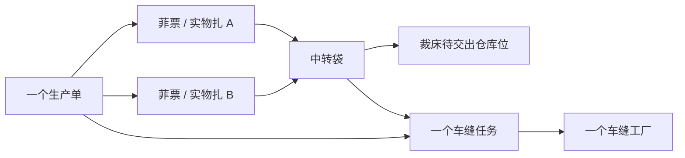
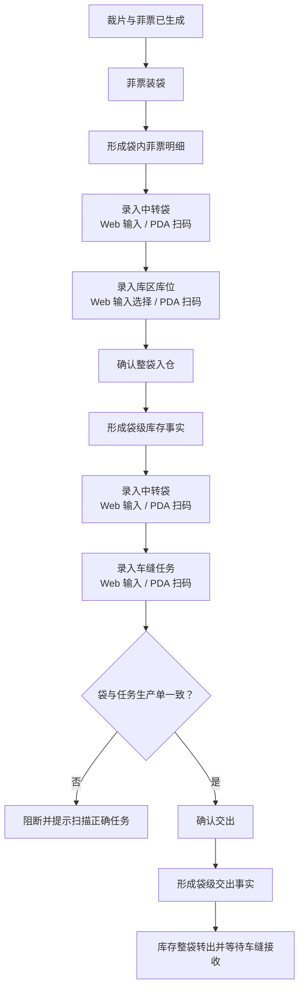

# 裁床中转袋整袋流转产品设计

## 1. 文档信息

| 项目 | 内容 |
| --- | --- |
| 文档日期 | 2026-07-27 |
| 文档状态 | 已完成业务方案确认，待书面规格复核 |
| 适用系统 | PFOS / WLS / FCS |
| 相关入口 | 裁床中转袋装袋、中转袋入仓、中转袋交出 PDA 与管理页面 |
| 主要角色 | 裁床装袋人员、待交出仓人员、裁床交出人员、裁床主管、车缝工厂接收人员 |
| 文档目的 | 把中转袋定义为入仓和交出的最小实物单位，取消入仓重复扫票与交出拆袋 |
| 实施优先级 | 第一阶段，优先实施 |

## 2. 本期结论

1. 装袋、入仓和交出是三个不同动作。
2. 菲票只在装袋环节与中转袋建立关系。
3. 中转袋入仓只登记「哪个袋进入哪个库区库位」。
4. 中转袋交出只建立「一个完整中转袋与一个车缝任务」的关系。
5. 接收车缝工厂由车缝任务自动带出，不由现场人员再次选择。
6. 一个中转袋可以包含多张菲票，但所有菲票必须属于同一个生产单。
7. 一个车缝任务可以接收多个中转袋。
8. 一个中转袋一次只能完整交给一个车缝任务。
9. 不允许勾选袋内部分菲票交出。
10. 不允许先交出袋内一部分，再交出剩余部分。
11. Web 端以编号输入、查询选择和表单确认为主要录入方式。
12. PDA 端以扫描条码 / 二维码为主要录入方式。
13. PDA 裁床中转袋区域只保留 3 个操作：「菲票装袋」「中转袋入仓」「中转袋交出」。
14. 现有「交出装袋确认」统一更名为「中转袋交出」。
15. PDA 不再展示「待入仓菲票」列表或以菲票卡片作为操作入口。
16. 点击任一操作后直接进入对应扫码操作页，不经过候选列表、任务详情或信息总览页。

本规格取代
`docs/superpowers/specs/2026-07-25-cutting-wait-handover-transfer-bag-flow-design.md`
中与以下内容冲突的设计：

- 交出前从来源暂存袋逐张扫描菲票并重新分装到目标交出袋。
- 同一个中转袋按菲票、按数量或按次数部分交出。
- 中转袋入仓时再次扫描袋内菲票。
- 通过「待入仓菲票」列表选择菲票后再进入装袋。
- 使用「交出装袋确认」作为页面名称、动作名称或新事件名称。

原设计中不冲突的特种工艺交出、特种工艺回仓和异常处理内容仍可继续沿用。

## 3. 实施边界

本规格可以先于生产单合并功能独立实施。

当前阶段使用以下前置约束：

- 中转袋必须已经具有唯一生产单归属。
- 生产单可以是普通生产单，也可以是未来生成的合并生产单。
- 本期不负责创建合并生产单，也不修改生产单编号规则。
- 本期不改造唛架、铺布和生产单台账。
- 当前 Mock 数据应使用单一生产单的中转袋。
- 若发现历史袋内存在多个生产单，不自动拆袋、不自动分摊，直接阻断入仓和交出，并交由主管处理。

因此，先实施整袋流转不会依赖生产单合并功能上线。

## 4. 目标与非目标

### 4.1 目标

- 明确装袋、入仓、交出的动作边界。
- 让中转袋成为库存位置变化和责任转移的最小单位。
- 入仓时不再重复扫描菲票。
- 交出时不再扫描或选择袋内菲票。
- 通过车缝任务自动确定生产单和接收工厂。
- 阻断跨生产单装袋、跨生产单交出和重复提交。
- Web、PDA、仓储库存及交出记录使用同一袋级事实。
- PDA 三个操作从入口直接进入扫码页，不经过待办或候选列表。

### 4.2 非目标

- 不实现生产单合并。
- 不调整印花、染色、唛架和铺布业务。
- 不允许拆袋交出。
- 不支持中转袋部分交出。
- 不支持一个袋绑定多个车缝任务。
- 不让员工手工选择接收车缝工厂。
- 不在入仓或交出页面维护袋内菲票。
- 不保留「待入仓菲票」PDA 列表。
- 不扩展特种工艺回仓流程。
- 不实现真实后端、真实数据库事务或真实扫码硬件接口。

## 5. 核心对象

| 对象 | 定义 | 本期规则 |
| --- | --- | --- |
| 菲票 | 标识一扎裁片的现场票据 | 只在装袋环节扫描 |
| 实物扎 | 菲票对应的整扎裁片 | 现场不拆分 |
| 中转袋 | 装载一张或多张菲票的可扫码实物载体 | 入仓和交出的最小单位 |
| 库区库位 | 中转袋在裁床待交出仓中的物理位置 | 入仓时绑定 |
| 车缝任务 | 某个生产单分配给某个车缝工厂的执行任务 | 交出时与袋绑定 |
| 中转袋流转周期 | 中转袋从本次开始装袋到交出、回收并清空的一个完整使用周期 | 同一袋码可重复使用，但不同周期的事实不能混用 |
| 袋级库存事实 | 证明哪个袋在什么库位、由谁保管 | 入仓后生成 |
| 袋级交出事实 | 证明哪个完整袋交给哪个任务和工厂 | 交出后生成 |

## 6. 对象关系



关系约束：

- 一张菲票同一时刻只能在一个中转袋流转周期内。
- 一个中转袋在一个流转周期内可以包含多张菲票。
- 一个中转袋在一个流转周期内的所有菲票必须属于同一个生产单。
- 一个中转袋在一个流转周期内同一时刻只有一个有效库位。
- 一个车缝任务可以接收多个中转袋。
- 一个中转袋在一个流转周期内只能产生一次有效整袋交出。
- 一个中转袋在一个流转周期内只能绑定一个车缝任务。
- 中转袋和车缝任务的生产单必须一致。
- 接收车缝工厂由车缝任务唯一确定。
- 中转袋完成既有回收并清空后可以开始新的流转周期；新周期具有新的袋内菲票、生产单、库位和交出事实。

## 7. 总体流程



三个动作的边界：

| 动作 | 输入 | 输出 | 不做什么 |
| --- | --- | --- | --- |
| 菲票装袋 | 中转袋、菲票 | 袋内菲票明细和唯一生产单归属 | 不绑定库位，不交给车缝 |
| 中转袋入仓 | 中转袋、库区库位 | 袋级库存位置事实 | 不重新扫描或修改菲票 |
| 中转袋交出 | 中转袋、车缝任务 | 袋级责任转移事实 | 不选择菲票，不输入部分数量 |

## 8. 菲票装袋

### 8.1 业务定义

装袋是菲票与中转袋建立关系的唯一环节。

### 8.2 规则

- Web 端先输入中转袋编号，再逐张输入菲票编号。
- PDA 端先扫描中转袋，再逐张扫描要装入的菲票。
- 同一袋可以装多张菲票。
- 第一张菲票确定当前袋的生产单归属。
- 后续菲票必须与当前袋属于同一生产单。
- 已入仓的袋不得继续装票。
- 已交出的袋不得再次装票。
- 完成装袋后，系统保存袋内菲票明细和数量汇总。
- 装袋完成不等于入仓完成。

### 8.3 防错

录入不同生产单的菲票时必须阻断：

> 这张菲票属于 PO000124，当前袋属于 PO000123，不能装入同一袋。

若历史数据中的袋已包含多个生产单：

> 这个袋包含多个生产单，不能继续入仓或交出。请叫主管处理。

系统不能自动拆袋，也不能把数量自动分配到不同生产单。

## 9. 中转袋入仓

### 9.1 业务定义

中转袋入仓只回答：

> 哪个中转袋进入了哪个库区库位？

它不是装袋动作，也不是菲票复核动作。

### 9.2 最小输入

Web 和 PDA 使用不同的主要录入方式，但写入同一个袋级入仓事实。

Web 端：

- 输入中转袋编号。
- 输入或查询选择库区、库位。
- 核对系统带出的袋信息后确认入仓。

PDA 端：

- 扫描中转袋条码 / 二维码。
- 扫描库区库位码。
- 核对扫描结果后确认入仓。

必需字段：

- 中转袋编号。
- 库区。
- 库位。

系统自动带出：

- 生产单号。
- 袋内菲票数量。
- 袋内裁片数量。
- 入仓人。
- 入仓时间。

### 9.3 校验

以下情况必须阻断：

- 中转袋不存在。
- 中转袋未完成装袋或袋内为空。
- 袋内包含多个生产单。
- 中转袋已经在仓。
- 中转袋已经交出。
- 库区或库位无效、停用或不属于裁床待交出仓。
- 重复提交同一入仓动作。

### 9.4 结果

入仓成功后形成袋级库存事实：

- 中转袋 ID 和袋号。
- 生产单 ID 和单号。
- 库区和库位。
- 袋内菲票数量和裁片数量快照。
- 入仓人和入仓时间。

入仓不得新增、删除或改写菲票装袋关系。

### 9.5 PDA 页面

首屏只保留一个主动作「确认入仓」：

1. 扫中转袋。
2. 扫库区库位，系统显示袋号、生产单和袋内数量。
3. 确认入仓。

页面不展示生产单选择器，不要求扫描菲票，不要求输入或计算数量。

PDA 的手工编号输入只作为扫码失败时的主管兜底入口，不与扫码入口同等突出。

### 9.6 Web 页面

Web 端使用表单录入：

1. 在中转袋编号输入框录入袋号。
2. 系统查询并显示生产单和袋内数量。
3. 输入或查询选择库区、库位。
4. 点击「确认入仓」。

Web 页面不要求调用摄像头或扫描设备，也不把扫码设计成主要入口。

## 10. 中转袋交出

### 10.1 业务定义

中转袋交出只回答：

> 这个完整的中转袋交给了哪个车缝任务？

车缝任务已经归属于一个生产单，并分配给一个车缝工厂。系统通过任务自动确定生产单、接收工厂和任务信息。

### 10.2 最小输入

- 中转袋编号。
- 车缝任务编号。

Web 端：

- 输入中转袋编号。
- 输入或查询选择车缝任务编号。
- 系统查询并带出生产单和接收车缝工厂。

PDA 端：

- 扫描中转袋码。
- 扫描车缝任务码。
- 系统识别并带出生产单和接收车缝工厂。

现场人员不选择车缝工厂，也不输入交出数量。

### 10.3 整袋原则

- 交出最小单位是一个中转袋。
- 一次交出自动包含袋内全部菲票。
- 不提供菲票勾选。
- 不提供本次交出数量输入。
- 不允许先交出袋内一部分菲票，再交出剩余菲票。
- 不允许同一个袋在当前流转周期同时绑定多个车缝任务。
- 不允许同一个袋在当前流转周期先后绑定不同车缝任务。

「不能先交出部分、再交出余下部分」的准确含义是：

> 系统不能把中转袋当成可以分次数扣减的数量容器。袋一旦确认交出，袋内全部菲票在同一时刻整体转给同一个车缝任务，袋状态直接从「已入待交出仓」变为「已交出」。

### 10.4 校验

以下情况必须阻断：

- 中转袋未入裁床待交出仓。
- 中转袋为空、已交出、已作废或处于其他不可交出状态。
- 袋内包含多个生产单。
- 车缝任务不存在、已取消、已关闭或不允许接收。
- 中转袋生产单与车缝任务生产单不一致。
- 中转袋已绑定其他车缝任务。
- 袋内任一菲票不属于该生产单。
- 重复提交同一交出动作。

生产单不一致时，PDA 提示：

> 这个袋属于 PO000123，当前车缝任务属于 PO000124，不能交出。请扫描 PO000123 下的车缝任务。

Web 提示：

> 这个袋属于 PO000123，所选车缝任务属于 PO000124，不能交出。请输入或选择 PO000123 下的车缝任务。

### 10.5 结果

交出成功后形成不可拆分的袋级交出事实：

- 中转袋 ID 和袋号。
- 中转袋流转周期 ID。
- 袋内菲票快照。
- 生产单 ID 和单号。
- 车缝任务 ID 和任务号。
- 接收车缝工厂 ID 和名称。
- 交出人和交出时间。
- 交出时库区库位。
- 袋内菲票数量和裁片数量快照。

袋内菲票快照用于保证历史交出事实不受后续基础数据变化影响。

新产生的页面名称、动作名称和运行时事件统一使用「中转袋交出」。历史「交出装袋确认」记录只做兼容读取和名称映射，不再作为新记录类型写入，也不继续展示旧名称。

系统同时：

- 将中转袋从裁床待交出仓整袋转出。
- 将袋状态更新为「已交出」。
- 进入既有的待接收、差异或异议处理链路。

### 10.6 PDA 页面

首屏只保留一个主动作「确认交出」：

1. 扫中转袋。
2. 扫车缝任务，系统显示袋号、生产单、接收工厂和袋内数量。
3. 确认交出。

页面不要求再次扫描菲票，不展示菲票勾选，不让员工选择车缝工厂。

PDA 的手工编号输入只作为扫码失败时的主管兜底入口。

### 10.7 Web 页面

Web 端使用表单录入：

1. 输入中转袋编号。
2. 系统显示袋的生产单、库位和袋内数量。
3. 输入或查询选择车缝任务编号。
4. 系统带出接收车缝工厂并完成一致性校验。
5. 点击「确认交出」。

Web 页面不要求逐张录入菲票，也不把扫码设计成主要入口。

## 11. 状态

```text
待使用
→ 装袋中
→ 已装袋待入仓
→ 已入待交出仓
→ 已交出
→ 按既有接收和回收规则继续
→ 已回收并清空
→ 待使用（新流转周期）
```

规则：

- 「已装袋待入仓」说明袋内关系已经确定，但尚无仓位事实。
- 「已入待交出仓」说明袋已在有效库位，可以交出。
- 从「已入待交出仓」到「已交出」是一次整袋状态变化。
- 不存在「部分交出」状态。
- 袋完成回收并清空后才能开始新流转周期；新周期不得复用上一周期的生产单、菲票、库位或任务关系。
- 本期不新增特种工艺回仓状态。

## 12. 异常、幂等与弱网

### 12.1 录入异常

- 扫错袋、扫错库位、扫错任务必须阻断。
- Web 输入不存在或不匹配的袋号、库位、任务编号时同样必须阻断。
- 提示必须说明对象不匹配的原因和下一步操作。
- Web 提示下一步输入或选择什么；PDA 提示下一步扫描什么。
- 无法判断历史多生产单袋时，提供「叫主管处理」，不允许员工继续。

### 12.2 重复提交

- 入仓、交出必须使用袋级业务幂等键。
- 幂等键必须包含中转袋流转周期，避免袋码复用后误判为历史重复提交。
- 已成功的重复请求返回原成功结果。
- 重复点击不得重复增加库存、重复扣减库存或生成第二条交出事实。

### 12.3 弱网

- 页面必须区分「尚未保存」和「已经保存但结果回显失败」。
- 结果不明确时先查询袋当前状态，再决定是否重试。
- 不得让员工因为网络回执慢而重复交出。

### 12.4 操作反馈

- 成功只显示「入仓成功」或「整袋交出成功」及必要对象编号。
- 失败只显示失败原因和下一步操作。
- 不使用长篇成功说明、规则复述或流程总结。
- 完成反馈后，页面直接进入下一袋的录入状态。

## 13. 审计与协作

### 13.1 入仓审计

保留：

- 袋号。
- 生产单。
- 库区库位。
- 袋内数量快照。
- 入仓人和入仓时间。

### 13.2 交出审计

保留：

- 袋号。
- 生产单。
- 车缝任务。
- 接收车缝工厂。
- 袋内菲票快照。
- 交出人和交出时间。
- 交出前库位。

交出记录必须表达「谁把哪个完整袋交给哪个任务和工厂」，不能只记录一个抽象状态。

## 14. 页面设计

### 14.1 操作页面极简硬约束

Web 和 PDA 的操作页面都必须聚焦当前动作，不能因为 Web 屏幕较大就增加说明和管理信息。

操作页面只允许出现：

- 当前动作标题。
- 当前动作必需的输入框或扫码位。
- 防止选错所需的识别结果。
- 一个主确认按钮。
- 操作发生后的短错误或成功反馈。

操作页面禁止出现：

- 业务规则说明、流程说明、操作说明等解释性段落。
- 无业务动作的提示卡片、帮助卡片和说明卡片。
- KPI、统计卡片、趋势、历史流水和全链路信息。
- 多个同级主按钮。
- 要求用户阅读后才能判断下一步的长文案。
- 为填满页面而增加的字段、图标、颜色或装饰模块。

必要文案只用于字段名、按钮、即时错误和即时结果。规则由系统直接校验，不在页面上提前讲解。

### 14.2 PDA 操作页面

#### 14.2.1 操作入口

PDA 裁床中转袋区域只显示 3 个并列操作按钮：

1. 菲票装袋。
2. 中转袋入仓。
3. 中转袋交出。

入口按钮只显示操作名称，不显示副标题、说明段落、待处理数量或说明卡片。

点击后直接进入对应扫码操作页：

```text
菲票装袋 → 菲票装袋扫码页
中转袋入仓 → 中转袋入仓扫码页
中转袋交出 → 中转袋交出扫码页
```

不得经过：

- 「待入仓菲票」列表。
- 菲票候选卡片。
- 生产单、铺布单或面料信息总览。
- 当前情况、当前阶段或最近记录卡片。
- 交出任务列表或交出装袋确认详情。

「菲票打编号」「特种工艺回收入仓」不与这 3 个中转袋操作混排；如需保留，进入各自独立业务入口。

#### 14.2.2 菲票装袋

固定为 3 步：

1. 扫中转袋二维码或条码。
2. 扫菲票。
3. 点击「确认装袋」。

规则：

- 第 2 步可以连续扫描一张或多张菲票。
- 进入页面后直接等待扫描中转袋；袋码识别成功后，扫码位自动切换为等待扫描菲票。
- 每扫入一张有效菲票，只更新已扫数量和最后扫描结果，不新增菲票详情卡片。
- 未扫描任何有效菲票前，「确认装袋」不可点击。
- 页面只显示当前袋号、已扫菲票数量、最后扫描结果和「确认装袋」按钮。
- 第一张菲票确定当前袋的生产单，后续不同生产单菲票直接阻断。
- 不展示待入仓菲票列表。
- 不展示生产单卡片、铺布单卡片、面料卡片、当前情况卡片、流向卡片或操作说明。
- 确认成功后显示短反馈并重置，直接等待下一袋。

#### 14.2.3 中转袋入仓

固定为 3 步：

1. 扫中转袋二维码或条码。
2. 扫库区库位码。
3. 点击「确认入仓」。

页面只显示当前袋号、库区库位、必要核对数量和主按钮，不扫描菲票，不展示袋内菲票列表。

#### 14.2.4 中转袋交出

现有「交出装袋确认」统一更名为「中转袋交出」。

固定为 3 步：

1. 扫中转袋二维码或条码。
2. 扫车缝任务码。
3. 点击「确认交出」。

页面只显示当前袋号、车缝任务、接收工厂、必要核对数量和主按钮，不扫描菲票，不展示交出任务列表，不允许部分交出。

#### 14.2.5 通用交互

- 一页一个主动作。
- 扫描后立即显示结果并自动进入下一步。
- 手工编号输入只作为扫码失败时的主管兜底，不与扫码入口同等突出。
- 不让员工心算或填写交出数量。
- 扫错时只显示简短原因和下一步动作。
- 成功后直接进入下一袋处理。

### 14.3 Web 操作页面

- 输入框、查询选择和表单确认是主要录入方式。
- 输入后由系统自动查询和校验，不要求用户阅读规则。
- 页面不依赖摄像头、二维码组件或扫码设备。
- 输入过程采用局部更新，不因每次输入触发整页重绘。

Web 入仓页只保留：

- 中转袋编号输入框。
- 库区库位输入或选择框。
- 袋号、生产单、袋内数量的核对结果。
- 「确认入仓」按钮。

Web 交出页只保留：

- 中转袋编号输入框。
- 车缝任务编号输入或选择框。
- 袋号、生产单、接收工厂、袋内数量的核对结果。
- 「确认交出」按钮。

### 14.4 查询页面

记录查询与现场操作分开表达，不能把宽表、统计和操作表单堆在同一个操作区。

- 查询列表按中转袋一行展示。
- 支持按袋号、生产单、库区库位、状态、车缝任务和接收工厂查询。
- 详情可以查看袋内菲票，但不能在入仓或交出动作中勾选菲票。
- 数据列表必须分页。
- 调整现有列表页时必须遵循标准列表页治理规则。

Web 与 PDA 使用相同的业务校验和袋级事实。

## 15. 典型场景

### 15.1 PDA 正常装袋

员工进入「菲票装袋」后直接扫描袋 `BAG-0008`，随后连续扫描本次要装入的菲票。页面只累计已扫数量并显示最后一张的扫描结果；员工点击「确认装袋」后完成，不选择待办，不阅读生产单、铺布或面料说明卡片。

### 15.2 PDA 正常入仓

员工扫描袋 `BAG-0008` 和库位 `CUT-A-03`。系统带出生产单、8 张菲票和袋内裁片数量；员工确认后完成袋级入仓，不再扫描 8 张菲票。

### 15.3 Web 正常入仓

文员输入袋号 `BAG-0008`，选择库位 `CUT-A-03`。系统带出生产单、8 张菲票和袋内裁片数量；文员确认后完成与 PDA 相同的袋级入仓。

### 15.4 PDA 正常交出

员工扫描 `BAG-0008` 和车缝任务 `SEW-TASK-0102`。系统确认两者属于同一生产单，并带出接收工厂；确认后整袋一次性交出。

### 15.5 Web 正常交出

文员输入 `BAG-0008`，查询选择车缝任务 `SEW-TASK-0102`。系统带出接收工厂并完成一致性校验；文员确认后形成与 PDA 相同的整袋交出事实。

### 15.6 袋与任务生产单不一致

袋属于 `PO000123`，任务属于 `PO000124`。系统阻断；Web 要求重新输入或选择正确任务，PDA 要求扫描正确任务，不允许通过修改数量或选择部分菲票继续。

### 15.7 重复录入已交出袋

用户在 PDA 再次扫描或在 Web 再次输入 `BAG-0008`。系统显示该袋已于具体时间交给具体车缝任务，不新增交出记录。

### 15.8 历史多生产单袋

系统发现袋内菲票来自多个生产单。页面阻断入仓和交出，提示叫主管处理；不自动拆袋，也不要求一线员工现场拆扎。

## 16. 验收标准

### 16.1 装袋

- [ ] 菲票只在装袋环节录入。
- [ ] Web 端以输入袋号和菲票号为主。
- [ ] PDA 端以扫描袋码和菲票码为主。
- [ ] 同一袋不能装入不同生产单的菲票。
- [ ] 已入仓或已交出的袋不能继续装票。
- [ ] 历史多生产单袋不能继续入仓或交出。

### 16.2 入仓

- [ ] Web 端只需输入袋号并输入或选择库区库位。
- [ ] PDA 端只需扫描袋码和库区库位码。
- [ ] 不再次扫描菲票。
- [ ] 生产单和袋内数量由系统带出。
- [ ] 无效库位、空袋、重复入仓必须阻断。
- [ ] 入仓不改写袋内菲票关系。

### 16.3 交出

- [ ] Web 端只需输入袋号并输入或选择车缝任务号。
- [ ] PDA 端只需扫描袋码和车缝任务码。
- [ ] 接收车缝工厂由任务自动带出。
- [ ] 一个袋只能完整交给一个车缝任务。
- [ ] 页面没有菲票勾选、交出数量和部分交出入口。
- [ ] 袋与任务生产单不一致时必须阻断。
- [ ] 交出后袋内全部菲票同时转出。
- [ ] 重复交出不产生第二条事实。
- [ ] 袋回收并清空后可以开始新流转周期，且不复用上一周期关系。

### 16.4 页面与协作

- [ ] PDA 裁床中转袋区域只显示「菲票装袋」「中转袋入仓」「中转袋交出」3 个操作。
- [ ] 「交出装袋确认」在页面、动作和新事件中统一更名为「中转袋交出」。
- [ ] 点击 3 个操作均直接进入对应扫码页。
- [ ] PDA 不再展示「待入仓菲票」列表或菲票候选卡片。
- [ ] PDA 菲票装袋严格为扫中转袋、扫菲票、确认装袋 3 步。
- [ ] PDA 三个操作均为一页一个主动作。
- [ ] PDA 扫描成功后自动进入下一步扫码。
- [ ] Web 使用输入框、查询选择和表单确认完成录入。
- [ ] Web 不依赖扫码设备即可完成装袋、入仓和交出。
- [ ] Web 和 PDA 操作页都只保留必需输入、核对结果和一个主按钮。
- [ ] PDA 操作页不展示生产单、铺布单、面料、当前情况、当前阶段或最近记录卡片。
- [ ] 操作页不展示规则说明、流程说明、帮助卡片、KPI、统计或历史流水。
- [ ] 查询列表与现场操作区分开，不在操作区堆叠宽表。
- [ ] 成功和失败反馈均简短、直接，并自动进入下一袋处理。
- [ ] 扫错提示说明原因和修正动作。
- [ ] 弱网时能够判断是否已经保存。
- [ ] Web、PDA、库存和交出记录读取同一袋级事实。
- [ ] 入仓、交出均保留操作人、时间和对象快照。

## 17. 当前代码影响范围

第一阶段实施重点：

- `src/pages/pda-warehouse.ts`
  - 把当前合并入口拆成「菲票装袋」「中转袋入仓」「中转袋交出」3 个直接入口。
  - 入口只显示操作名称，不显示说明副标题。
- `src/pages/pda-warehouse-wait-handover.ts`
  - 删除「待入仓菲票」列表、候选卡片和最近记录等操作前中间层。
  - 将「交出装袋确认」入口改为「中转袋交出」。
  - 3 个入口直接跳转对应扫码页面。
- `src/pages/pda-cutting-inbound.ts`
  - 菲票装袋页删除生产单、铺布单、面料、当前情况和阶段说明卡片。
  - 菲票装袋收口为扫袋、扫菲票、确认装袋 3 步。
  - 中转袋入仓移除菲票扫描和菲票事实重写，收口为扫袋、扫库位、确认入仓。
- `src/pages/pda-cutting-handover.ts`
  - 页面和操作统一更名为「中转袋交出」。
  - 从任务、来源袋、菲票和目标袋的多层扫描改为扫袋、扫车缝任务、确认交出。
  - 接收车缝工厂由任务带出。
- `src/data/fcs/cutting/cutting-runtime-event-ledger.ts`
  - 新事件统一使用「中转袋交出」。
  - 历史「交出装袋确认」只做兼容读取，不再新增。
- 裁床待交出仓运行时事实
  - 增加或收口袋级入仓、袋级出仓和幂等处理。
- 中转袋模型
  - 强制唯一生产单归属、袋内菲票快照和整袋状态。
- 车缝任务与交出记录
  - 校验袋与任务生产单一致，记录袋级责任转移。
- Web 中转袋和待交出仓页面
  - 统一显示袋级库存与交出结果，不提供部分交出。
- 相关 Mock 数据
  - 第一阶段使用单生产单袋，并覆盖错任务、重复入仓、重复交出和历史多生产单袋阻断场景。
- 相关检查脚本
  - 把「交出装袋确认」断言更新为「中转袋交出」。
  - 增加 PDA 只有 3 个直达入口、无「待入仓菲票」、菲票装袋仅 3 步和无冗余信息卡片的门禁。

实施时必须先用 CodeGraph 确认实际符号、调用链和影响面。

## 18. 设计治理自查

- 角色与端类型：PDA 面向现场装袋、待交出仓和交出人员，以扫码录入为主；Web 面向文员和主管，以输入录入为主。
- 任务清晰度：PDA 只保留 3 个直达操作；装袋、入仓、交出各自只有一个主动作。
- 扫码与识别：PDA 入仓扫袋和库位，交出扫袋和任务；Web 输入相同编号并查询识别。
- 防错：跨生产单、状态错误、重复提交均阻断。
- 数量表达：袋内数量由系统计算，不让员工输入部分数量。
- 协作关系：交出记录明确袋、任务、工厂、交出人和时间。
- 异常追溯：历史多生产单袋交由主管，不要求现场拆扎。
- 信息负荷：删除 PDA「待入仓菲票」列表以及生产单、铺布单、面料、当前情况、当前阶段和最近记录卡片；Web 和 PDA 操作页只保留必需输入、核对结果和一个主按钮。
- 现场设备：按钮动作化，扫码优先，并考虑弱网重复提交。

自查结论：设计层面通过，无业务例外。

本次仅拆分产品设计文档，尚未修改原型代码，因此不新增原型审查记录。后续第一阶段实施涉及原型目录时，必须新增对应审查记录并运行原型设计治理检查。

## 19. 明确留待未来处理

以下事项不进入本期，不视为待定需求：

- 生产单合并。
- 一个中转袋拆分给多个车缝任务。
- 中转袋部分交出后再交余量。
- 历史多生产单袋的自动拆分或自动分摊。
- 特种工艺回仓流程改造。
