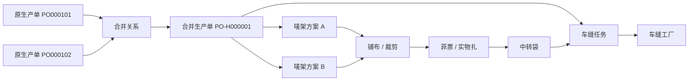

# 生产单合并与裁床中转袋整袋流转产品设计

## 1. 文档信息

| 项目 | 内容 |
| --- | --- |
| 文档日期 | 2026-07-27 |
| 文档状态 | 已完成业务方案确认，待书面规格复核 |
| 适用系统 | FCS / PFOS / WLS |
| 管理端入口 | FCS 工厂生产协同系统「生产单台账」`/fcs/production/orders` |
| 现场端入口 | 裁床中转袋入仓、裁床中转袋交出 PDA 页面 |
| 主要角色 | 裁床人员、裁床主管、跟单、PPIC、车缝工厂接收人员、系统管理员 |
| 文档目的 | 固化生产单合并的业务边界，并据此统一唛架、铺布、裁片、菲票、中转袋入仓及中转袋交出的对象关系 |

## 2. 决策摘要

本次业务讨论形成以下最终结论：

1. **一个唛架方案只能对应一个生产单。**
2. 多个生产单确实需要共同排唛时，必须先在生产单台账中整单合并，生成新的合并生产单。
3. 普通生产单编号为 `PO` 加 6 位流水号；合并生产单编号为 `PO-H` 加 6 位流水号。
4. 合并前已发生的印花、染色、领料等事实仍归属于原生产单，不复制、不改写。
5. 从合并生效开始，裁床及之后的新任务、新事实统一归属于合并生产单。
6. 一个裁剪出来的实物扎不可拆分；一个中转袋也不可拆袋交出。
7. 中转袋入仓只登记「哪个袋进入哪个库区库位」，不再次扫描菲票。
8. 中转袋交出只建立「中转袋与一个车缝任务」的关系，车缝工厂由车缝任务带出。
9. 合并由有权限的裁床人员直接在生产单台账操作，不设审批流，也不在裁床模块另设快捷入口。
10. 合并成功后通知相关跟单；通知失败不回滚合并。
11. 本期不支持撤销合并。

本文档取代
`docs/superpowers/specs/2026-07-25-cutting-wait-handover-transfer-bag-flow-design.md`
中与以下内容冲突的设计：

- 一个唛架方案关联多个生产单。
- 交出前把来源袋内菲票拆出并重装至不同目标袋。
- 同一中转袋分批、分票或部分交出。

未发生冲突的特种工艺回仓、差异处理等内容仍可沿用原设计。

## 3. 背景与问题

### 3.1 现场事实

铺布裁剪完成后，同一唛架产生的裁片在现场形成实物扎。现场不会为了系统里的生产单关系把这一扎裁片重新拆开。若系统允许一个唛架方案直接包含多个生产单，则后续会产生以下矛盾：

- 一张菲票究竟属于哪个生产单难以稳定解释。
- 一个中转袋可能同时包含多个生产单。
- 车缝任务属于某个生产单，但整袋又不能拆开分给多个车缝任务。
- 任务进度、生产单进度、交出数量和车缝最低应回数量容易重复或无法归集。

业务方最终决定把复杂度收口到裁床之前：

> 需要共同排唛的多个生产单先合并为一个新生产单，裁床始终只处理一个生产单。

### 3.2 当前实现偏差

现有原型已经具有生产单、唛架、铺布、菲票、中转袋、车缝任务和交出记录，但对象关系仍存在以下偏差：

- 唛架来源模型允许一个方案包含多个生产单。
- 铺布及菲票上下文可以聚合多个生产单。
- 中转袋入仓页面仍要求扫描菲票并重写菲票事实。
- 中转袋交出页面仍以单张菲票为提交单位。
- 多个页面直接按 `productionOrderNo` 匹配，尚未统一识别原生产单号与合并生产单号。
- 生产单模型尚无合并类型、来源单和生效边界。

因此，本次不是只改两个 PDA 表单，而是先确立生产单合并关系，再让裁床实物流转遵循新的单一归属。

## 4. 设计目标与非目标

### 4.1 设计目标

- 确保一个唛架方案只有一个生产单归属。
- 让裁床可以在符合条件时，把多个原生产单整单合并为一个合并生产单。
- 保留合并前事实的原始归属和完整追溯。
- 让裁床以后所有任务与事实只在合并生产单上继续。
- 让原生产单号、合并生产单号均可查询。
- 让中转袋成为入仓和交出的最小实物单位。
- 消除入仓重复扫票、交出拆袋、分票和部分交出的操作。
- 保证任务进度、生产单进度和统计不重复。

### 4.2 本期非目标

- 不设计生产单合并审批流。
- 不支持部分数量参与合并。
- 不支持撤销、反合并或拆回原生产单。
- 不回写或重做已完成的印花、染色等上游事实。
- 不允许唛架方案临时挂多个生产单。
- 不在裁床模块增加「合并生产单」快捷入口。
- 不实现真实飞书接口、数据库事务或后端权限；原型只需准确表达业务结果和异常反馈。
- 不改造无关工艺流程。

## 5. 核心对象与术语

| 对象 | 定义 | 关键规则 |
| --- | --- | --- |
| 原生产单 | 参与合并前已经存在的普通生产单 | 编号格式为 `PO000001`；保留合并前事实 |
| 合并生产单 | 多个原生产单整单合并后新生成的生产单 | 编号格式为 `PO-H000001`；承接裁床及以后执行 |
| 生产单合并记录 | 证明哪些原生产单在何时、由谁、因何原因合并成哪个新生产单 | 永久保留，不可删除 |
| 生效边界 | 原生产单停止产生新执行事实、合并生产单开始承接执行的时间点 | 本设计固定为合并成功时 |
| 有效事实 | 未取消、未作废、未被冲销的业务记录及其有效数量 | 合并资格必须按有效事实判断 |
| 唛架方案 | 指导铺布和裁剪的排版方案 | 每个方案只能关联一个生产单 |
| 铺布单 / 铺布记录 | 已经开始形成裁剪执行的事实 | 存在有效记录时禁止合并 |
| 菲票 | 裁剪后用于标识一扎裁片的现场票据 | 合并后生成的菲票只归属于合并生产单 |
| 中转袋 | 装载一个或多个菲票实物扎的可扫码载体 | 同一时刻只能属于一个生产单和一个流转状态 |
| 车缝任务 | 合并生产单下分配给某个车缝工厂的执行任务 | 一个袋交出时只能绑定一个车缝任务 |

## 6. 核心对象关系



关系约束：

- 一次合并至少包含 2 个原生产单。
- 一个原生产单最多只能进入 1 个有效合并关系。
- 一个合并生产单对应 2 个及以上原生产单。
- 一个唛架方案只能对应 1 个普通生产单或 1 个合并生产单。
- 一个生产单可以按实际裁剪需要建立多个唛架方案；本设计只限制「一个唛架不能跨生产单」。
- 一张菲票只能归属于 1 个生产单。
- 一个中转袋可以装多张菲票，但这些菲票必须属于同一个生产单。
- 一个车缝任务可以接收多个中转袋。
- 一个中转袋一次只能完整交给一个车缝任务。
- 中转袋交出后，不允许把袋内菲票再分给其他车缝任务。

## 7. 生产单合并资格

### 7.1 基础条件

所有参与合并的生产单必须同时满足：

1. 至少选择 2 个生产单。
2. 所有生产单属于同一个 SPU。
3. 所有生产单关联同一个正式技术包版本。
4. 每一个生产单都已领料或部分领料。
5. 所有生产单均为有效状态，未取消、未关闭。
6. 任一生产单均未参与其他有效合并。
7. 必须整单参与，不允许只合并某个颜色、尺码或部分数量。

同一 SPU 下允许各原生产单的颜色、尺码和数量矩阵不同；合并生产单汇总所有来源单的完整矩阵。

### 7.2 唛架方案条件

- 存在有效唛架方案时禁止合并。
- 用户必须先取消对应唛架方案，再重新发起合并。
- 已取消的唛架方案保留历史，但不再占用生产单。
- 只改变页面显示状态、不真正取消有效占用，不视为满足合并条件。

阻断文案示例：

> 生产单 PO000101 仍有有效唛架方案 MK-0008，请先取消该方案后再合并。

### 7.3 铺布条件

- 存在有效铺布单或有效铺布记录时禁止合并。
- 铺布单已经取消时，只有同时满足以下条件才不阻断：
  - 取消已经生效；
  - 有效铺布数量为 0，或原数量已完整冲销；
  - 未产生裁片及裁片之后的事实。
- 不能仅凭铺布单状态文字为「已取消」就放行。

阻断文案示例：

> 生产单 PO000102 已有有效铺布记录，不能合并。若尚未裁剪，请先完成铺布单取消及数量冲销。

### 7.4 裁片及下游事实条件

只要存在以下任一有效事实，就禁止合并：

- 裁片单。
- 裁片事实或裁片矩阵事实。
- 菲票。
- 中转袋装袋记录。
- 中转袋入仓记录。
- 中转袋交出记录。
- 车缝开工、完工、收货、质检或其他裁片之后的执行事实。

这项检查是铺布条件之外的防御性校验。即使历史数据缺少铺布记录，只要已经有裁片或下游事实，仍必须阻断。

### 7.5 领料条件

- 每一个来源生产单的领料状态必须为「部分领料」或「已领料」。
- 「未领料」的生产单不可参与合并。
- 原生产单已经形成的领料记录、物料批次、库位和数量仍归属于原生产单。
- 合并时不得复制领料记录或重复增加库存出库数量。
- 合并生产单可以引用来源单的有效领料事实，供裁床判断可用物料。
- 原生产单尚未完成的领料需求汇总到合并生产单继续执行，但必须保留来源需求明细。

### 7.6 技术包条件

- 只比较技术包 ID 不够，必须比较实际用于生产的技术包版本。
- 任一生产单没有正式生效的技术包版本时禁止合并。
- 同 SPU 但技术包版本不同，仍禁止合并。
- 后续若技术包发生变更，按已有技术包变更规则处理，不属于本次合并功能范围。

## 8. 合并操作流程

### 8.1 入口与权限

- 唯一入口：FCS「生产单台账」。
- 入口动作：「合并生产单」。
- 操作人：具备生产单合并权限的裁床人员或裁床主管。
- 跟单不审批；跟单只接收合并结果通知。
- 裁床业务页面不设置快捷入口，避免形成第二套入口和判断口径。

### 8.2 操作步骤

1. 操作人在生产单台账选择 2 个及以上普通生产单。
2. 系统按 SPU、技术包版本、领料、唛架、铺布、裁片及下游事实进行预校验。
3. 校验失败时，按生产单逐条显示阻断原因和处理动作。
4. 校验通过后，系统展示合并预览：
   - 待生成的合并生产单号；
   - 来源生产单号；
   - SPU、技术包版本；
   - 各来源单数量与汇总数量；
   - 已领、待领物料汇总；
   - 合并后任务与进度的归属变化；
   - 不可撤销提示。
5. 操作人填写合并原因。
6. 操作人二次确认「确认合并生产单」。
7. 系统在同一个原子操作中再次执行全部资格校验。
8. 系统生成合并生产单和合并关系，冻结原生产单的裁床及以后执行入口。
9. 系统关闭或替换原生产单尚未开始的裁床及下游任务，并在合并生产单下生成后续任务。
10. 系统提交跟单通知任务。
11. 页面显示合并结果并提供合并生产单详情入口。

### 8.3 二次确认

确认弹窗必须明确展示：

> 合并后，原生产单不能再执行裁床及之后的任务。本期不支持撤销合并。合并前已经产生的领料、印花、染色等事实仍保留在原生产单。

按钮：

- 主按钮：「确认合并生产单」
- 次按钮：「返回检查」

不得使用含义不清的「确定」「提交」。

### 8.4 并发与重复提交

- 打开预览后的任何状态变化，都必须在最终保存时重新校验。
- 若其他人新增了唛架、铺布或裁片事实，保存必须阻断并提示最新原因。
- 重复点击不得生成两个合并生产单号。
- 同一组来源生产单的重复请求应返回第一次成功生成的合并结果。
- 一个来源单已被另一合并占用时，当前操作必须阻断。

## 9. 合并后的生产单与合并记录

### 9.1 合并生产单

合并生产单至少应表达：

| 字段 | 说明 |
| --- | --- |
| 合并生产单 ID | 系统内部唯一标识 |
| 合并生产单号 | `PO-H` 加 6 位流水号 |
| 生产单类型 | 合并生产单 |
| SPU | 与所有来源生产单一致 |
| 技术包版本 | 与所有来源生产单一致 |
| 来源生产单 | 完整来源单 ID 和单号列表 |
| 计划数量 | 所有来源生产单整单数量汇总 |
| 颜色尺码矩阵 | 按来源生产单完整汇总 |
| 合并生效时间 | 合并操作成功时间 |
| 当前执行阶段 | 裁床及以后 |
| 合并状态 | 已生效 |

### 9.2 合并记录

合并记录至少应保留：

- 合并记录 ID。
- 合并生产单 ID 和单号。
- 所有来源生产单 ID 和单号。
- 合并前各来源单状态快照。
- SPU 与技术包版本快照。
- 计划数量、已领数量、待领数量快照。
- 唛架、铺布、裁片及下游事实校验结果。
- 合并原因。
- 操作人、操作时间。
- 跟单通知状态、通知时间和失败原因。

合并记录是审计事实，不随页面状态变化而覆盖。

### 9.3 原生产单

合并成功后，原生产单：

- 仍是可查询、可查看的历史生产单。
- 状态显示为「裁床后续已合并」。
- 展示「已合并至 PO-Hxxxxxx」。
- 保留印花、染色、领料等合并前事实。
- 禁止新增唛架、铺布、裁片、菲票、装袋、交出及车缝任务。
- 不再计入裁床及以后阶段的待执行数量。

## 10. 事实归属边界

### 10.1 合并前事实

以下已经发生的事实继续归属于原生产单：

- 生产需求与原生产单创建事实。
- 印花任务及其完成、交出、接收事实。
- 染色任务及其完成、交出、接收事实。
- 已发生的物料领料、出库、批次和库位事实。
- 其他在合并前已经完成且不属于裁片之后的事实。

不迁移、不复制、不改写这些事实，只在合并关系中提供跳转和汇总。

### 10.2 合并后事实

以下新产生的事实统一归属于合并生产单：

- 新建唛架方案。
- 铺布单及铺布记录。
- 裁片单、裁片事实、裁片矩阵。
- 菲票。
- 中转袋装袋、入仓、移库和交出。
- 裁片放行。
- 车缝任务及车缝后续执行事实。

### 10.3 任务处理

- 原生产单已完成的上游任务保持完成状态，不重新生成。
- 原生产单尚未开始的裁床及下游任务标记为「因生产单合并已替换」，保留历史，不物理删除。
- 合并生产单按照汇总后的生产数量、工艺路线和技术包版本重新生成裁床及下游任务。
- 新任务只展示合并生产单号，并可展开查看来源生产单。
- 不允许原生产单和合并生产单同时存在可执行的同阶段任务。

## 11. 生产单号显示与查询

### 11.1 编号规则

| 类型 | 格式 | 示例 |
| --- | --- | --- |
| 普通生产单 | `PO` + 6 位流水号 | `PO123456` |
| 合并生产单 | `PO-H` + 6 位流水号 | `PO-H000123` |

`H` 是合并标识。流水号由系统生成并保证唯一，不允许人工输入。

### 11.2 查询规则

全系统生产单查询必须同时支持：

- 输入原生产单号，找到原生产单及其合并去向。
- 输入合并生产单号，找到合并生产单及所有来源生产单。
- 在裁床及以后任务页输入任一来源生产单号，也能命中对应的合并生产单任务。
- 查询结果必须说明为何命中，不能把原生产单号静默替换成合并生产单号。

建议统一建立生产单关系解析能力，避免各页面继续直接、各自匹配 `productionOrderNo`。

### 11.3 页面显示规则

| 页面类型 | 行粒度 | 主显示 | 辅助显示 |
| --- | --- | --- | --- |
| 印花、染色等上游页面 | 原生产单一行 | 原生产单号 | 「裁床后续已合并至 PO-Hxxxxxx」 |
| 生产单台账 | 原生产单 N 行 + 合并生产单 1 行 | 各自生产单号 | 原单显示合并去向，合并单显示来源数量 |
| 裁床及以后任务页 | 任务一行 | 合并生产单号 | 来源生产单摘要 |
| 合并生产单进度页 | 合并生产单一行 | 合并生产单号 | 来源生产单列表 |
| 原生产单进度页 | 原生产单一行 | 原生产单号 | 合并前进度 + 合并去向 |
| PDA 小屏页面 | 当前阶段生产单号 | 合并生产单号 | 可收起的「来源 N 个生产单」 |
| 导出、审计、全局搜索 | 按事实或生产单口径 | 当前事实归属单号 | 同时输出合并单和来源单 |

不是所有页面都机械地并排显示两组长编号。页面按当前业务阶段显示主编号，同时保证关系可见、可查。

## 12. 进度与统计口径

### 12.1 原生产单进度

原生产单进度页展示：

- 合并前已完成的印花、染色、领料等真实进度。
- 合并发生时间。
- 「裁床及后续由 PO-Hxxxxxx 继续执行」。
- 合并生产单详情跳转。

原生产单不再产生裁床及以后进度。

### 12.2 合并生产单进度

合并生产单进度页展示：

- 来源生产单及其合并前准备结果。
- 合并后的唛架、铺布、裁片、交出、车缝及后续进度。
- 汇总计划数量和当前可执行数量。

上游事实可以作为来源信息汇总，但不得伪造为合并生产单自身完成的任务记录。

### 12.3 统计去重

- 上游事实统计继续按原生产单计算。
- 裁床及以后执行统计只按合并生产单计算。
- 生产总量、订单总量等跨阶段指标不得把 N 个原生产单与 1 个合并生产单重复相加。
- 统计模型必须区分「需求来源数量」与「当前执行生产单数量」。
- 下钻时必须能从合并汇总追溯到原生产单明细。

## 13. 唛架、铺布与裁片规则

### 13.1 唛架方案

- 新建和保存唛架方案时，只能选择一个生产单。
- 选择合并生产单时，系统使用合并后的颜色尺码矩阵。
- 页面不得再提供多个生产单勾选或来源生产单数量字段。
- 已合并的原生产单不能新建唛架方案。

### 13.2 铺布

- 铺布单只承接一个唛架方案，因此也只承接一个生产单。
- 铺布和裁剪页面显示该生产单号。
- 合并生产单可追溯来源单，但来源单不成为铺布单的并列归属。

### 13.3 菲票与实物扎

- 菲票由一个裁片单生成，只归属于一个生产单。
- 菲票代表的实物扎不可按原生产单再次拆分。
- 合并后产生的菲票只打印合并生产单号；可在追溯详情查看来源生产单，不要求现场工人判断来源分摊。
- 本设计不要求在一张菲票上制作多个原生产单的数量分摊明细。

这解决了此前「一张菲票为什么一定要分摊」的问题：合并完成后，裁床只面对一个新的生产单，菲票无需再按来源生产单分摊。

## 14. 中转袋装袋规则

- 装袋是菲票与中转袋建立关系的唯一环节。
- 同一中转袋可以装多张菲票。
- 袋内所有菲票必须属于同一个生产单。
- 袋内菲票之后必须能够整体交给同一个车缝任务。
- 已入仓的袋不得继续装票。
- 已交出的袋不得再次装票。
- 袋内菲票明细由系统记录，后续入仓和交出只读取，不要求现场重复扫描。

若扫描到不同生产单的菲票，必须阻断：

> 这张菲票属于 PO-H000124，当前袋属于 PO-H000123，不能装入同一袋。

## 15. 中转袋入仓

### 15.1 业务定义

中转袋入仓只回答：

> 哪个中转袋进入了哪个库区库位？

它不是装袋动作，也不是菲票复核动作。

### 15.2 最小输入

支持两种等价方式：

- 手工填写中转袋编号，选择库区和库位。
- 扫描中转袋条码 / 二维码，再扫描库区库位码。

必需字段：

- 中转袋编号。
- 库区。
- 库位。

系统自动带出：

- 生产单号。
- 袋内菲票数量。
- 袋内裁片数量。
- 入仓人。
- 入仓时间。

### 15.3 校验

以下情况必须阻断：

- 中转袋不存在。
- 中转袋未完成装袋或袋内为空。
- 中转袋已经在仓。
- 中转袋已经交出。
- 库区或库位无效、停用或不属于裁床待交出仓。
- 重复提交同一入仓动作。

入仓成功后，系统形成袋级库存事实。不得因为入仓再次新增或改写菲票装袋事实。

### 15.4 PDA 页面

员工首屏只保留一个主动作「确认中转袋入仓」：

1. 扫中转袋。
2. 扫库区库位。
3. 核对系统识别出的袋号、生产单和袋内数量。
4. 确认入仓。

页面不展示生产单选择器，不要求扫描菲票，不要求员工计算数量。

## 16. 中转袋交出

### 16.1 业务定义

中转袋交出只回答：

> 这个完整的中转袋交给了哪个车缝任务？

车缝任务已经归属于一个生产单并分配给一个车缝工厂，因此系统通过任务自动确定：

- 生产单。
- 接收车缝工厂。
- 应执行数量及其他任务信息。

### 16.2 最小输入

- 中转袋编号。
- 车缝任务编号。

支持扫描中转袋码和车缝任务码，也允许管理端按编号补录。

### 16.3 整袋原则

- 交出最小单位是一个中转袋。
- 一次交出自动包含袋内全部菲票。
- 不提供菲票勾选。
- 不提供本次交出数量输入。
- 不允许先交出袋内一部分菲票，再交出剩余菲票。
- 不允许同一个袋同时绑定多个车缝任务。
- 不允许同一个袋先后绑定不同车缝任务。

「不能先交出部分、再交出余下部分」的准确含义是：系统不能把一个袋当成可以分次数扣减的数量容器。袋一旦确认交出，袋内全部菲票在同一时刻整体转给同一个车缝任务，袋状态直接从「已入待交出仓」变为「已交出」。

### 16.4 校验

以下情况必须阻断：

- 中转袋未入裁床待交出仓。
- 中转袋为空、已交出、已作废或处于其他不可交出状态。
- 车缝任务不存在、已取消、已关闭或不允许接收。
- 中转袋生产单与车缝任务生产单不一致。
- 中转袋已绑定其他车缝任务。
- 袋内任一菲票不属于该生产单。
- 重复提交同一交出动作。

生产单不一致时提示：

> 这个袋属于 PO-H000123，当前车缝任务属于 PO-H000124，不能交出。请扫描 PO-H000123 下的车缝任务。

### 16.5 交出结果

交出成功后形成一次不可拆分的袋级交出事实，至少包含：

- 中转袋 ID 和袋号。
- 袋内菲票快照。
- 生产单 ID 和单号。
- 车缝任务 ID 和任务号。
- 接收车缝工厂 ID 和名称。
- 交出人、交出时间。
- 交出时库区库位。
- 袋内裁片数量快照。

袋内菲票快照用于防止后续基础数据变化影响历史交出事实。

### 16.6 PDA 页面

员工首屏只保留一个主动作「确认整袋交出」：

1. 扫中转袋。
2. 扫车缝任务。
3. 页面显示袋号、生产单、接收工厂和袋内数量。
4. 确认整袋交出。

页面不得要求员工再扫菲票，也不得让员工手选车缝工厂。

## 17. 跟单飞书通知

### 17.1 触发时机

生产单合并成功后触发通知。通知不是审批条件，不影响合并事务结果。

### 17.2 接收人

向所有来源生产单关联的有效跟单人员发送通知；同一人员只通知一次。

### 17.3 通知内容

- 合并生产单号。
- 来源生产单号列表。
- SPU。
- 汇总计划数量。
- 技术包版本。
- 合并原因。
- 操作人和操作时间。
- 合并生产单详情链接。
- 提示「原生产单保留上游事实，裁床及以后由合并生产单继续」。

### 17.4 失败处理

- 通知成功：页面提示「生产单合并成功，已通知跟单」。
- 通知失败：页面提示「生产单合并成功，跟单通知待补发」。
- 通知失败不得删除或回滚合并生产单。
- 合并记录中保存失败原因和重试状态。
- 管理端提供「重新通知跟单」动作。
- 重试通知不得再次执行生产单合并。

## 18. 页面设计要求

### 18.1 生产单台账

生产单台账是管理端标准列表页，调整时必须遵循项目标准列表页组件契约和治理门禁。

关键能力：

- 按生产单号、SPU、技术包版本、领料状态和合并状态查询。
- 普通生产单多选后发起合并。
- 不符合条件的生产单显示具体原因，而不是只禁用按钮。
- 合并单显示来源生产单数量，可展开查看完整来源。
- 原生产单显示「裁床后续已合并」和合并去向。
- 列表、详情、导出均保持同一关系口径。

### 18.2 合并预览

合并预览应帮助管理人员判断，不把复杂系统字段暴露给现场员工：

- 顶部显示是否全部通过。
- 按生产单列出资格检查结果。
- 阻断项使用红色并提供处理动作。
- 已通过项使用克制的状态表达。
- 汇总数量由系统计算，不要求用户心算。
- 不把通知跟单设计成审批步骤。

### 18.3 PDA 现场端

入仓和交出均遵循：

- 一页一个主动作。
- 扫码优先。
- 扫描后立即显示识别结果。
- 字段少、编号配合生产单和数量识别。
- 扫错时阻断并告诉员工下一步扫什么。
- 重复点击不产生重复事实。
- 弱网失败时说明是否已经保存，避免重复操作。

## 19. 状态设计

### 19.1 原生产单状态

```text
正常执行
→ 合并校验中
→ 裁床后续已合并
```

若校验失败，生产单保持原状态，不产生合并中间事实。

### 19.2 合并生产单状态

```text
生成并生效
→ 待建立唛架方案
→ 按既有生产流程继续
```

本期没有「待审批」「已驳回」「已撤销」状态。

### 19.3 中转袋状态

```text
待使用
→ 装袋中
→ 已装袋待入仓
→ 已入待交出仓
→ 已交出
→ 按既有回收规则继续
```

状态从「已入待交出仓」到「已交出」是整袋一次性变化，不存在「部分交出」。

## 20. 异常与审计

### 20.1 合并异常

- 资格校验失败：不创建合并单，展示逐单原因。
- 保存并发冲突：不创建合并单，刷新后重新检查。
- 生产单号生成冲突：自动重新取号，用户不参与处理。
- 任务生成失败：原子操作失败，不留下已生效但无后续任务的合并单。
- 通知失败：合并保持成功，进入通知重试。

### 20.2 入仓和交出异常

- 扫错袋、扫错库位、扫错任务必须阻断。
- 系统必须区分「未保存」与「已经保存但回执展示失败」。
- 已成功的重复请求返回原成功结果，不重复写入库存或交出事实。
- 异常记录保留袋号、任务号、操作人、时间和失败原因。

### 20.3 审计

以下动作必须可追溯：

- 生产单合并。
- 唛架方案取消。
- 铺布单取消及数量冲销。
- 原任务因合并关闭或替换。
- 跟单通知及重试。
- 中转袋装袋。
- 中转袋入仓。
- 中转袋交出。

## 21. 典型业务场景

### 21.1 正常合并

`PO000101` 和 `PO000102` 属于同一 SPU、同一技术包版本，均已部分领料，没有有效唛架和铺布事实，也没有裁片事实。

裁床人员在生产单台账合并后生成 `PO-H000001`。原领料事实仍在两张原生产单下，新的唛架、铺布、菲票、中转袋和车缝任务全部归属于 `PO-H000001`。

### 21.2 有唛架方案

`PO000103` 已有唛架方案。系统阻断合并并提示具体方案号。用户取消唛架方案后重新发起，系统再次校验；取消有效后才允许合并。

### 21.3 铺布单显示已取消但数量未冲销

`PO000104` 的铺布单状态为「已取消」，但仍有有效铺布数量。系统继续阻断，避免仅凭状态文字误放行。

### 21.4 已有裁片事实

历史数据缺少有效铺布记录，但 `PO000105` 已经生成菲票。系统通过下游防御校验阻断合并。

### 21.5 同 SPU 不同技术包版本

两个生产单款式相同，但一个使用 V2 技术包、另一个使用 V3。系统阻断合并，避免裁床按不同工艺要求共同执行。

### 21.6 中转袋入仓

员工扫描袋 `BAG-0008` 和库位 `CUT-A-03`。系统带出 `PO-H000001`、8 张菲票和袋内数量，员工确认后完成袋级入仓，不再扫描 8 张菲票。

### 21.7 中转袋交出

员工扫描 `BAG-0008` 和车缝任务 `SEW-TASK-0102`。系统确认两者均属于 `PO-H000001`，并带出接收工厂。确认后整袋全部菲票一次性交出。

### 21.8 袋与任务生产单不一致

袋属于 `PO-H000001`，任务属于 `PO-H000002`。系统阻断并要求扫描正确任务，不允许通过修改数量或选择部分菲票继续。

### 21.9 飞书通知失败

合并和任务生成均成功，但飞书暂时不可用。页面显示合并成功和通知待补发；管理员稍后只重试通知，不重复生成合并生产单。

## 22. 验收标准

### 22.1 生产单合并

- [ ] 合并入口只在生产单台账。
- [ ] 至少选择 2 个生产单才能合并。
- [ ] 不同 SPU 不能合并。
- [ ] 不同技术包版本不能合并。
- [ ] 任一生产单未领料时不能合并。
- [ ] 任一生产单存在有效唛架方案时不能合并。
- [ ] 任一生产单存在有效铺布事实时不能合并。
- [ ] 已取消铺布单但有效数量未归零时仍不能合并。
- [ ] 任一生产单存在裁片或下游事实时不能合并。
- [ ] 只允许整单合并。
- [ ] 合并生成唯一的 `PO-Hxxxxxx` 编号。
- [ ] 原生产单保留历史事实，并停止裁床及以后执行。
- [ ] 合并生产单承接裁床及以后任务。
- [ ] 本期没有审批和撤销入口。
- [ ] 保存时重新校验，重复点击不重复生成。

### 22.2 查询、显示与统计

- [ ] 原生产单号和合并生产单号都可查询。
- [ ] 原生产单能看到合并去向。
- [ ] 合并生产单能看到所有来源生产单。
- [ ] 上游页面仍按原生产单展示事实。
- [ ] 裁床及以后页面按合并生产单展示任务。
- [ ] 跨阶段统计不会重复计算原生产单与合并生产单数量。

### 22.3 唛架与裁片

- [ ] 一个唛架方案只能选择一个生产单。
- [ ] 已合并原生产单不能新建唛架。
- [ ] 合并后菲票只归属于合并生产单。
- [ ] 菲票无需记录多个原生产单的数量分摊。

### 22.4 中转袋

- [ ] 同一袋不能装入不同生产单的菲票。
- [ ] 入仓只输入或扫描袋号和库区库位。
- [ ] 入仓不再次扫描菲票。
- [ ] 交出只输入或扫描袋号和车缝任务号。
- [ ] 接收车缝工厂由任务自动带出。
- [ ] 一个袋只能完整交给一个车缝任务。
- [ ] 页面没有菲票勾选、交出数量和部分交出入口。
- [ ] 袋与任务生产单不一致时必须阻断。
- [ ] 重复入仓、重复交出不产生重复事实。

### 22.5 通知与追溯

- [ ] 合并成功后通知所有相关跟单。
- [ ] 通知失败不回滚合并。
- [ ] 支持单独重试通知。
- [ ] 合并、任务替换、入仓、交出均有操作人和时间记录。

## 23. 当前代码影响范围

后续实现阶段应重点核查并最小范围调整：

- `src/pages/production/orders-domain.ts`
  - 生产单台账入口、列表显示、合并预览和详情。
- `src/data/fcs/production-orders.ts`
  - 生产单类型、来源关系、状态和 Mock 数据。
- 唛架方案来源模型及页面
  - 当前允许多个来源生产单，需要改为单一生产单。
- 铺布与裁片上下文
  - 当前存在多生产单聚合表达，需要统一到单一当前生产单。
- `src/pages/pda-cutting-inbound.ts`
  - 移除入仓阶段的菲票扫描和菲票事实重写。
- `src/pages/pda-cutting-handover.ts`
  - 从单菲票提交改为中转袋与车缝任务的整袋交出。
- 中转袋、交出单和车缝任务数据模型
  - 强化袋级原子交出及单一生产单校验。
- 全系统生产单查询和展示
  - 建立原生产单号与合并生产单号的统一关系解析。
- 飞书通知演示数据和交互
  - 表达成功、失败待补发和重新通知。

实施时必须先用 CodeGraph 确认实际符号、调用链和影响面，不以本文列举文件代替代码定位。

## 24. 设计治理自查

本设计已按以下项目规范审查：

- 角色与端类型：合并放在 FCS 管理端；入仓、交出保持 PDA 员工执行端。
- 任务清晰度：PDA 一页一个主动作，不让员工理解生产单合并关系。
- 扫码与识别：入仓扫袋和库位，交出扫袋和任务，系统自动带出其余信息。
- 防错：不同生产单、状态不允许、重复提交均阻断并给出下一步。
- 数量表达：袋内数量由系统计算，不让员工选择或心算部分数量。
- 协作关系：交出事实明确中转袋、车缝任务、接收工厂、交出人和时间。
- 异常追溯：合并、通知、入仓和交出均保留操作记录。
- 信息负荷：复杂合并资格只在管理端展示，PDA 不展示来源生产单长列表。

自查结论：设计层面通过，无业务例外。

本次仅新增产品设计文档，尚未修改 `src/pages/`、`src/components/`、`src/data/`、`src/router/` 或 `src/main-handlers/`，因此本次不新增原型审查记录。后续实现涉及上述目录时，必须新增对应审查记录并运行原型设计治理检查。

## 25. 明确留待未来处理

以下事项已经明确不进入本期，不视为待定需求：

- 撤销生产单合并。
- 反向拆分合并生产单。
- 合并审批。
- 一个唛架方案关联多个生产单。
- 一个中转袋拆分给多个车缝任务。
- 中转袋部分交出后再交余量。
