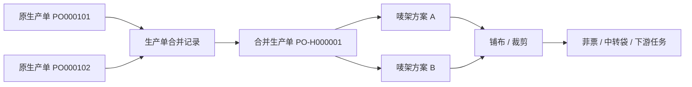

# 生产单合并产品设计

## 1. 文档信息

| 项目 | 内容 |
| --- | --- |
| 文档日期 | 2026-07-27 |
| 文档状态 | 已完成业务方案确认，待书面规格复核 |
| 适用系统 | FCS / PFOS / WLS |
| 唯一操作入口 | FCS 工厂生产协同系统「生产单台账」`/fcs/production/orders` |
| 主要角色 | 裁床人员、裁床主管、跟单、PPIC、系统管理员 |
| 文档目的 | 定义多个生产单整单合并为一个新生产单后的对象关系、事实归属、任务归属、查询展示和统计口径 |
| 实施优先级 | 第二阶段；在裁床中转袋整袋流转之后实施 |

## 2. 决策摘要

1. 一个唛架方案只能对应一个生产单。
2. 多个生产单需要共同排唛时，必须先整单合并，生成新的合并生产单。
3. 普通生产单编号为 `PO` 加 6 位流水号；合并生产单编号为 `PO-H` 加 6 位流水号。
4. 合并前已发生的印花、染色、接收等事实仍归属于原生产单，不复制、不改写。
5. 合并生效后，裁床及之后的新任务、新事实统一归属于合并生产单。
6. 合并由有权限的裁床人员直接在生产单台账操作，不设审批流，不在裁床模块设置第二入口。
7. 合并成功后通过飞书通知相关跟单；通知失败不回滚合并。
8. 原生产单号、合并生产单号均可查询。
9. 本期只支持整单合并，不支持部分合并。
10. 本期不支持撤销、反合并或拆回原生产单。

## 3. 背景

铺布裁剪完成后，同一唛架产生的裁片在现场形成不可按系统生产单重新拆分的实物扎。若一个唛架方案直接包含多个生产单，会导致：

- 一张菲票的生产单归属难以解释。
- 一个中转袋可能包含多个生产单。
- 车缝任务属于单个生产单，但实物袋无法按任务拆分。
- 任务进度、生产单进度、交出数量和统计可能重复或无法归集。

最终业务策略是把复杂度收口到裁床之前：

> 需要共同排唛的生产单，先合并成一个新的生产单；裁床始终只处理一个生产单。

## 4. 目标与非目标

### 4.1 目标

- 确保一个唛架方案只有一个生产单归属。
- 支持符合条件的多个原生产单整单合并。
- 保留合并前事实的原始归属和完整追溯。
- 让裁床以后所有任务和事实只在合并生产单上继续。
- 让原生产单号、合并生产单号都可查询。
- 保证任务进度、生产单进度和跨阶段统计不重复。

### 4.2 非目标

- 不设计合并审批流。
- 不支持按颜色、尺码或部分数量合并。
- 不支持撤销、反合并或拆回原生产单。
- 不迁移或重做已完成的印花、染色等上游事实。
- 不允许唛架方案临时关联多个生产单。
- 不在裁床模块增加合并快捷入口。
- 不在本规格中实现裁床中转袋入仓和交出；该部分由独立规格定义。

## 5. 核心对象

| 对象 | 定义 | 关键规则 |
| --- | --- | --- |
| 原生产单 | 参与合并前已经存在的普通生产单 | 编号格式为 `PO000001`；保留合并前事实 |
| 合并生产单 | 多个原生产单整单合并后新生成的生产单 | 编号格式为 `PO-H000001`；承接裁床及以后执行 |
| 生产单合并记录 | 证明哪些原生产单在何时、由谁、因何原因合并成哪个新生产单 | 永久保留，不可删除 |
| 生效边界 | 原生产单停止产生新执行事实、合并生产单开始承接执行的时间点 | 固定为合并成功时 |
| 有效事实 | 未取消、未作废、未被冲销的业务记录及有效数量 | 合并资格必须按有效事实判断 |
| 唛架方案 | 指导铺布和裁剪的排版方案 | 每个方案只能关联一个生产单 |

## 6. 对象关系



关系约束：

- 一次合并至少包含 2 个原生产单。
- 一个原生产单最多只能进入 1 个有效合并关系。
- 一个合并生产单对应 2 个及以上原生产单。
- 一个唛架方案只能对应 1 个普通生产单或 1 个合并生产单。
- 一个生产单可以按裁剪需要建立多个唛架方案。
- 合并后生成的裁片、菲票和中转袋只归属于合并生产单。

## 7. 合并资格

### 7.1 基础条件

所有参与合并的生产单必须同时满足：

1. 至少选择 2 个生产单。
2. 所有生产单属于同一个 SPU。
3. 所有生产单关联同一个正式技术包版本。
4. 每一个生产单都已接收或部分接收。
5. 所有生产单均为有效状态，未取消、未关闭。
6. 任一生产单均未参与其他有效合并。
7. 必须整单参与。

同一 SPU 下允许各原生产单的颜色、尺码和数量矩阵不同；合并生产单汇总所有来源单的完整矩阵。

### 7.2 唛架方案条件

- 存在有效唛架方案时禁止合并。
- 必须先取消对应唛架方案，再重新发起合并。
- 已取消唛架方案保留历史，但不再占用生产单。
- 只改变页面状态、不真正取消有效占用，不视为满足条件。

阻断提示：

> 生产单 PO000101 仍有有效唛架方案 MK-0008，请先取消该方案后再合并。

### 7.3 铺布条件

- 存在有效铺布单或有效铺布记录时禁止合并。
- 铺布单已经取消时，只有同时满足以下条件才不阻断：
  - 取消已经生效；
  - 有效铺布数量为 0，或原数量已完整冲销；
  - 未产生裁片及裁片之后的事实。
- 不能仅凭铺布单显示「已取消」就允许合并。

阻断提示：

> 生产单 PO000102 已有有效铺布记录，不能合并。若尚未裁剪，请先完成铺布单取消及数量冲销。

### 7.4 裁片及下游事实条件

只要存在以下任一有效事实，就禁止合并：

- 裁片单。
- 裁片事实或裁片矩阵事实。
- 菲票。
- 中转袋装袋、入仓或交出记录。
- 车缝开工、完工、收货、质检或其他裁片之后的执行事实。

这项检查是铺布条件之外的防御性校验。即使历史数据缺少铺布记录，只要已经有裁片或下游事实，仍必须阻断。

### 7.5 接收条件

- 每一个来源生产单的接收状态必须为「部分接收」或「已接收」。
- 「未接收」的生产单不可参与合并。
- 原生产单已有接收记录、物料批次、库位和数量仍归属于原生产单。
- 合并时不得复制接收记录或重复增加库存出库数量。
- 合并生产单引用来源单的有效接收事实，供裁床判断可用物料。
- 原生产单尚未完成的接收需求汇总到合并生产单继续执行，并保留来源需求明细。

### 7.6 技术包条件

- 必须比较实际用于生产的技术包版本，不能只比较技术包 ID。
- 任一生产单没有正式生效的技术包版本时禁止合并。
- 同 SPU 但技术包版本不同，仍禁止合并。
- 合并后的技术包变更继续遵循既有技术包变更规则，不在本期扩展。

## 8. 合并操作

### 8.1 入口与权限

- 唯一入口：FCS「生产单台账」。
- 操作名称：「合并生产单」。
- 操作人：具备生产单合并权限的裁床人员或裁床主管。
- 跟单不审批，只接收合并结果通知。
- 裁床业务页面不设置快捷入口。

### 8.2 操作步骤

1. 在生产单台账选择 2 个及以上普通生产单。
2. 系统校验 SPU、技术包版本、接收、唛架、铺布、裁片及下游事实。
3. 校验失败时，按生产单逐条显示阻断原因和处理动作。
4. 校验通过后展示合并预览：
   - 待生成的合并生产单号；
   - 来源生产单号；
   - SPU、技术包版本；
   - 各来源单数量和汇总数量；
   - 已领、待领物料汇总；
   - 合并后任务与进度的归属变化；
   - 不可撤销提示。
5. 操作人填写合并原因。
6. 操作人二次确认「确认合并生产单」。
7. 系统在保存时再次执行全部资格校验。
8. 系统原子生成合并生产单和合并关系，冻结原生产单的裁床及以后执行入口。
9. 系统关闭或替换原生产单尚未开始的裁床及下游任务，在合并生产单下生成后续任务。
10. 系统提交跟单通知任务。
11. 页面显示结果并提供合并生产单详情入口。

### 8.3 二次确认

确认弹窗必须明确展示：

> 合并后，原生产单不能再执行裁床及之后的任务。本期不支持撤销合并。合并前已经产生的接收、印花、染色等事实仍保留在原生产单。

按钮：

- 主按钮：「确认合并生产单」
- 次按钮：「返回检查」

不得使用含义不清的「确定」或「提交」。

### 8.4 并发与幂等

- 打开预览后的状态变化，必须在最终保存时重新校验。
- 若其他人新增了唛架、铺布或裁片事实，保存必须阻断。
- 重复点击不得生成两个合并生产单号。
- 同一组来源生产单的重复请求返回第一次成功生成的结果。
- 一个来源单已被另一合并占用时，当前操作必须阻断。

## 9. 合并后的数据

### 9.1 合并生产单

| 字段 | 说明 |
| --- | --- |
| 合并生产单 ID | 系统内部唯一标识 |
| 合并生产单号 | `PO-H` 加 6 位流水号 |
| 生产单类型 | 合并生产单 |
| SPU | 与所有来源生产单一致 |
| 技术包版本 | 与所有来源生产单一致 |
| 来源生产单 | 完整来源单 ID 和单号列表 |
| 计划数量 | 所有来源生产单整单数量汇总 |
| 颜色尺码矩阵 | 按来源生产单完整汇总 |
| 合并生效时间 | 合并操作成功时间 |
| 当前执行阶段 | 裁床及以后 |
| 合并状态 | 已生效 |

### 9.2 合并记录

合并记录至少保留：

- 合并记录 ID。
- 合并生产单 ID 和单号。
- 所有来源生产单 ID 和单号。
- 合并前各来源单状态快照。
- SPU 与技术包版本快照。
- 计划数量、已领数量、待领数量快照。
- 唛架、铺布、裁片及下游事实校验结果。
- 合并原因。
- 操作人、操作时间。
- 跟单通知状态、通知时间和失败原因。

合并记录是审计事实，不随页面当前状态被覆盖。

### 9.3 原生产单

合并成功后，原生产单：

- 仍可查询和查看。
- 状态显示为「裁床后续已合并」。
- 展示「已合并至 PO-Hxxxxxx」。
- 保留印花、染色、接收等合并前事实。
- 禁止新增唛架、铺布、裁片、菲票、装袋、交出及车缝任务。
- 不再计入裁床及以后阶段的待执行数量。

## 10. 事实和任务归属

### 10.1 合并前事实

以下事实继续归属于原生产单：

- 生产需求与原生产单创建事实。
- 印花任务及其完成、交出、接收事实。
- 染色任务及其完成、交出、接收事实。
- 已发生的物料接收、出库、批次和库位事实。
- 其他在合并前已经完成且不属于裁片之后的事实。

不迁移、不复制、不改写这些事实，只通过合并关系提供追溯。

### 10.2 合并后事实

以下新事实统一归属于合并生产单：

- 新建唛架方案。
- 铺布单及铺布记录。
- 裁片单、裁片事实和裁片矩阵。
- 菲票。
- 中转袋装袋、入仓、移库和交出。
- 裁片放行。
- 车缝任务及其后续执行事实。

### 10.3 任务处理

- 原生产单已完成的上游任务保持完成，不重新生成。
- 原生产单尚未开始的裁床及下游任务标记为「因生产单合并已替换」，保留历史，不物理删除。
- 合并生产单按照汇总数量、工艺路线和技术包版本重新生成裁床及下游任务。
- 新任务只以合并生产单为执行归属，可展开查看来源生产单。
- 不允许原生产单和合并生产单同时存在可执行的同阶段任务。

## 11. 编号、查询与显示

### 11.1 编号规则

| 类型 | 格式 | 示例 |
| --- | --- | --- |
| 普通生产单 | `PO` + 6 位流水号 | `PO123456` |
| 合并生产单 | `PO-H` + 6 位流水号 | `PO-H000123` |

`H` 是合并标识。流水号由系统生成并保证唯一。

### 11.2 查询规则

- 输入原生产单号，可以找到原生产单及合并去向。
- 输入合并生产单号，可以找到合并生产单及所有来源生产单。
- 在裁床及以后任务页输入任一来源生产单号，也能命中对应合并生产单任务。
- 查询结果必须说明命中关系，不能静默替换编号。
- 应统一建立生产单关系解析能力，避免页面分别直接匹配 `productionOrderNo`。

### 11.3 页面行粒度

| 页面类型 | 行粒度 | 主显示 | 辅助显示 |
| --- | --- | --- | --- |
| 印花、染色等上游页面 | 原生产单一行 | 原生产单号 | 「裁床后续已合并至 PO-Hxxxxxx」 |
| 生产单台账 | 原生产单 N 行 + 合并生产单 1 行 | 各自生产单号 | 原单显示去向，合并单显示来源数量 |
| 裁床及以后任务页 | 任务一行 | 合并生产单号 | 来源生产单摘要 |
| 合并生产单进度页 | 合并生产单一行 | 合并生产单号 | 来源生产单列表 |
| 原生产单进度页 | 原生产单一行 | 原生产单号 | 合并前进度和合并去向 |
| PDA 小屏页面 | 当前阶段生产单号 | 合并生产单号 | 可收起的来源摘要 |
| 导出、审计、全局搜索 | 按事实或生产单口径 | 当前事实归属单号 | 同时输出合并单和来源单 |

页面按当前业务阶段显示主编号，不要求所有位置机械并排展示两组长编号。

## 12. 进度与统计

### 12.1 原生产单进度

展示：

- 合并前已完成的印花、染色、接收等真实进度。
- 合并发生时间。
- 「裁床及后续由 PO-Hxxxxxx 继续执行」。
- 合并生产单详情入口。

原生产单不再产生裁床及以后进度。

### 12.2 合并生产单进度

展示：

- 来源生产单及其合并前准备结果。
- 合并后的唛架、铺布、裁片、交出、车缝及后续进度。
- 汇总计划数量和当前可执行数量。

上游事实只作为来源信息汇总，不能伪造为合并生产单自身完成的任务。

### 12.3 统计去重

- 上游事实统计继续按原生产单计算。
- 裁床及以后执行统计只按合并生产单计算。
- 跨阶段指标不得把 N 个原生产单与 1 个合并生产单重复相加。
- 统计模型必须区分「需求来源数量」和「当前执行生产单数量」。
- 汇总结果必须能下钻到来源生产单。

## 13. 唛架、铺布与菲票

### 13.1 唛架方案

- 新建和保存唛架方案时只能选择一个生产单。
- 选择合并生产单时使用合并后的颜色尺码矩阵。
- 页面不得再提供多个生产单勾选或来源生产单数量字段。
- 已合并原生产单不能新建唛架方案。

### 13.2 铺布

- 铺布单只承接一个唛架方案，因此只承接一个生产单。
- 铺布和裁剪页面显示该生产单号。
- 合并生产单可追溯来源单，但来源单不是铺布单的并列归属。

### 13.3 菲票

- 菲票由一个裁片单生成，只归属于一个生产单。
- 合并后产生的菲票只打印合并生产单号。
- 来源生产单只在追溯详情中查看，不要求现场人员判断数量分摊。
- 不在一张菲票上制作多个原生产单的数量分摊明细。

## 14. 跟单飞书通知

### 14.1 触发和接收人

- 生产单合并成功后触发通知。
- 通知不是审批条件，不影响合并结果。
- 向所有来源生产单关联的有效跟单人员发送；同一人员只通知一次。

### 14.2 通知内容

- 合并生产单号。
- 来源生产单号列表。
- SPU。
- 汇总计划数量。
- 技术包版本。
- 合并原因。
- 操作人和操作时间。
- 合并生产单详情链接。
- 「原生产单保留上游事实，裁床及以后由合并生产单继续」。

### 14.3 失败处理

- 成功提示：「生产单合并成功，已通知跟单」。
- 失败提示：「生产单合并成功，跟单通知待补发」。
- 通知失败不得回滚合并。
- 合并记录保存失败原因和重试状态。
- 管理端提供「重新通知跟单」。
- 重试通知不得再次执行合并。

## 15. 页面要求

### 15.1 生产单台账

生产单台账是管理端标准列表页，实施时必须遵循标准列表页组件契约和治理门禁。

关键能力：

- 按生产单号、SPU、技术包版本、接收状态和合并状态查询。
- 普通生产单多选后发起合并。
- 不符合条件时显示具体原因，不能只禁用按钮。
- 合并单显示来源生产单数量，可展开查看完整来源。
- 原生产单显示「裁床后续已合并」和合并去向。
- 列表、详情、导出保持同一口径。

### 15.2 合并预览

- 顶部显示是否全部通过。
- 按生产单列出资格检查结果。
- 阻断项显示处理动作。
- 汇总数量由系统计算，不要求用户心算。
- 不把通知跟单设计成审批步骤。
- 不可撤销提示必须在主操作前可见。

## 16. 状态

### 16.1 原生产单

```text
正常执行
→ 合并校验中
→ 裁床后续已合并
```

校验失败时保持原状态，不产生合并中间事实。

### 16.2 合并生产单

```text
生成并生效
→ 待建立唛架方案
→ 按既有生产流程继续
```

本期没有「待审批」「已驳回」「已撤销」状态。

## 17. 异常与审计

### 17.1 异常

- 资格校验失败：不创建合并单，逐单展示原因。
- 保存并发冲突：不创建合并单，刷新后重新检查。
- 生产单号冲突：系统自动重新取号。
- 任务生成失败：原子操作失败，不留下无后续任务的已生效合并单。
- 通知失败：合并保持成功，进入通知重试。

### 17.2 审计

必须追溯：

- 生产单合并。
- 唛架方案取消。
- 铺布单取消及数量冲销。
- 原任务因合并关闭或替换。
- 跟单通知及重试。

## 18. 典型场景

### 18.1 正常合并

`PO000101` 和 `PO000102` 属于同一 SPU、同一技术包版本，均已部分接收，没有有效唛架、铺布或裁片事实。

合并后生成 `PO-H000001`。原接收事实仍在原生产单下，新的唛架、铺布、菲票、中转袋和车缝任务归属于 `PO-H000001`。

### 18.2 有唛架方案

`PO000103` 已有唛架方案。系统阻断并提示具体方案号。取消有效后重新校验，才允许合并。

### 18.3 铺布取消但数量未冲销

`PO000104` 的铺布单显示「已取消」，但仍有有效铺布数量。系统继续阻断。

### 18.4 已有裁片事实

历史数据缺少有效铺布记录，但 `PO000105` 已生成菲票。系统通过下游防御校验阻断。

### 18.5 同 SPU 不同技术包版本

两个生产单款式相同，但分别使用 V2 和 V3 技术包。系统阻断合并。

### 18.6 飞书通知失败

合并及任务生成成功，但飞书暂时不可用。页面显示通知待补发；稍后只重试通知，不重复生成合并单。

## 19. 验收标准

### 19.1 合并资格和操作

- [ ] 合并入口只在生产单台账。
- [ ] 至少选择 2 个生产单。
- [ ] 不同 SPU 不能合并。
- [ ] 不同技术包版本不能合并。
- [ ] 任一生产单未接收时不能合并。
- [ ] 任一生产单存在有效唛架方案时不能合并。
- [ ] 任一生产单存在有效铺布事实时不能合并。
- [ ] 已取消铺布单但有效数量未归零时仍不能合并。
- [ ] 任一生产单存在裁片或下游事实时不能合并。
- [ ] 只允许整单合并。
- [ ] 生成唯一的 `PO-Hxxxxxx` 编号。
- [ ] 原生产单保留历史事实，并停止裁床及以后执行。
- [ ] 合并生产单承接裁床及以后任务。
- [ ] 本期没有审批和撤销入口。
- [ ] 保存时重新校验，重复点击不重复生成。

### 19.2 查询、进度与统计

- [ ] 原生产单号和合并生产单号均可查询。
- [ ] 原生产单能看到合并去向。
- [ ] 合并生产单能看到所有来源生产单。
- [ ] 上游页面仍按原生产单展示事实。
- [ ] 裁床及以后页面按合并生产单展示任务。
- [ ] 跨阶段统计不会重复计算。

### 19.3 唛架与菲票

- [ ] 一个唛架方案只能选择一个生产单。
- [ ] 已合并原生产单不能新建唛架。
- [ ] 合并后菲票只归属于合并生产单。
- [ ] 菲票无需记录多个来源生产单的数量分摊。

### 19.4 通知与追溯

- [ ] 合并成功后通知所有相关跟单。
- [ ] 通知失败不回滚合并。
- [ ] 支持单独重试通知。
- [ ] 合并和任务替换均有操作人、时间与原因。

## 20. 当前代码影响范围

后续实施阶段重点核查：

- `src/pages/production/orders-domain.ts`
  - 生产单台账入口、列表、合并预览和详情。
- `src/data/fcs/production-orders.ts`
  - 生产单类型、来源关系、状态和 Mock 数据。
- 唛架方案来源模型及页面
  - 当前允许多个来源生产单，需要改为单一生产单。
- 铺布与裁片上下文
  - 当前存在多生产单聚合表达，需要统一到单一当前生产单。
- 全系统生产单查询和显示
  - 建立原生产单号与合并生产单号的统一关系解析。
- 任务与进度
  - 关闭原单未执行下游任务，在合并单下生成后续任务并避免统计重复。
- 飞书通知演示
  - 表达成功、失败待补发和重新通知。

实施时必须先用 CodeGraph 确认实际符号、调用链和影响面，不以本文列举文件代替代码定位。

## 21. 设计治理自查

- 角色与端类型：合并属于 FCS 管理端操作。
- 任务清晰度：资格检查、预览和不可撤销确认分层表达。
- 防错：保存时重新校验，阻断状态冲突和重复提交。
- 数量表达：来源数量和汇总数量由系统计算。
- 协作关系：跟单接收结果通知，不承担审批。
- 异常追溯：合并、任务替换和通知均保留审计记录。
- 信息负荷：生产单台账只展示来源摘要，完整明细进入预览或详情。

自查结论：设计层面通过，无业务例外。

本次仅拆分产品设计文档，尚未修改原型代码，因此不新增原型审查记录。后续实施涉及原型目录时，必须新增审查记录并运行原型设计治理检查。

## 22. 明确留待未来处理

以下事项不进入本期，不视为待定需求：

- 撤销生产单合并。
- 反向拆分合并生产单。
- 合并审批。
- 一个唛架方案关联多个生产单。
- 部分颜色、尺码或数量参与合并。
