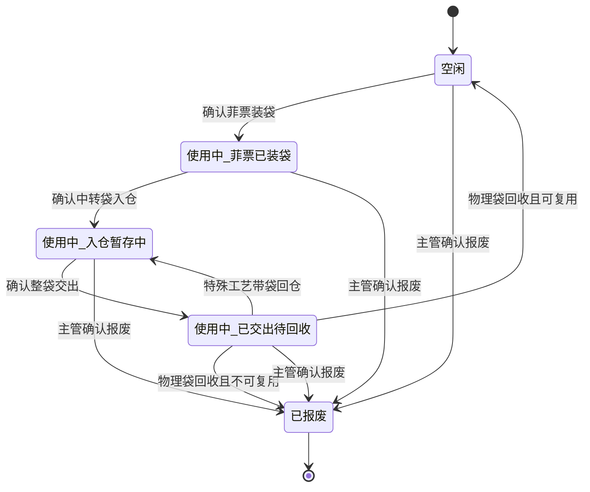

# 裁床中转袋三状态与流转阶段设计

## 1. 文档信息

| 项目 | 内容 |
| --- | --- |
| 文档日期 | 2026-07-30 |
| 文档状态 | 用户已确认；已完成实现、第三轮上下游代码复核与原型治理审查，浏览器视觉验收有条件待补 |
| 适用系统 | PFOS / WLS / FCS |
| 相关页面 | 中转袋流转、裁床待交出仓 Web、裁床 PDA、中转袋扫码详情、下游接收与回写页面 |
| 主要角色 | 裁床装袋人员、待交出仓人员、交出人员、仓管、接收人员、裁床主管、文员 |
| 文档目标 | 将中转袋主状态收口为“空闲、使用中、已报废”，把装袋、入仓、交出结果表达为独立流转阶段，并保证上下游对同一只物理袋的判断一致 |

## 2. 第二轮代码核查结论

本轮不是只核查页面文案，而是沿真实路由、渲染分支、事件处理器、运行时事件账、PDA 临时账、二维码详情、打印模板、下游接收回写和专项检查逐层核查。

已确认当前代码存在以下实现风险，实施计划必须逐项消除：

1. Web 待交出仓同时存在两套动作处理路径。页面头部按钮优先命中只修改模块内临时候选数据的处理器，另一套处理器才写运行时事件账。页面显示“成功”不等于统一业务事实已写入。
2. Web 中转袋入仓仍要求或读取菲票，且入仓事件直接接收菲票数组；这与“入仓只记录袋号、库区、库位”的确认边界冲突。
3. 中转袋主页面仍存在把装袋与入仓合并完成的路径，并直接修改旧主状态。
4. Web 和 PDA 交出仍有按单张菲票确认、过滤部分菲票后继续交出的路径，未完全落实整袋交出。
5. PDA 装袋、入仓、交出主要修改模块内 Mock 账，刷新或跨页面后不一定能看到同一结果。
6. 当前运行时事件缺少贯穿装袋、入仓、交出、特殊工艺回仓和回收的使用周期标识；同一物理袋重复使用时，旧事件可能被误判为本次事件。
7. 特殊工艺回仓既可能带回物理中转袋，也可能只是菲票或裁片回仓；当前设计不能把两种情况都自动改变中转袋阶段。
8. 下游车缝接收、差异、回写有自己的处理状态。这些记录状态不能作为中转袋主状态，也不能提前关闭物理袋使用周期。
9. 中转袋扫码详情当前可能用下游装袋/接收状态充当物理袋状态，并始终显示多种操作按钮。
10. 物理打印标签现状只打印稳定身份，这是正确边界。实时状态不得打印在可长期复用的标签上，只能在扫码后实时查询。
11. 当前回收关闭逻辑可能因差异提示而生成报废关闭结果；业务差异与实物报废必须彻底分离。
12. 既有检查脚本仍对旧多状态、旧“交出装袋确认”动作或仅修改临时账的行为做正向断言，必须随实现同步改成新业务门禁。

因此，本设计的核心不是“把页面上的状态文字替换为三个值”，而是建立一套统一的物理袋生命周期事实，使 Web、PDA、扫码详情、主列表和上下游记录都从同一事实投影得到结果。

## 3. 最终业务口径

### 3.1 三个主状态

中转袋只保留三个主状态：

1. 空闲。
2. 使用中。
3. 已报废。

主状态只回答物理袋当前是否可以开始新的装袋周期：

| 主状态 | 业务定义 | 能否开始新装袋周期 |
| --- | --- | --- |
| 空闲 | 没有未关闭的使用周期，物理袋可以再次投入使用 | 可以 |
| 使用中 | 已确认本次装袋，物理袋尚未完成回收关闭 | 不可以 |
| 已报废 | 已明确确认物理袋不可继续使用，只保留历史追溯 | 不可以 |

### 3.2 三个流转阶段

只有主状态为“使用中”时，才展示当前流转阶段：

| 流转阶段 | 已完成事实 | 正常下一步 |
| --- | --- | --- |
| 菲票已装袋 | 袋内菲票与物理袋关系已确认 | 中转袋入仓 |
| 入仓暂存中 | 物理袋已记录有效库区、库位 | 中转袋交出 |
| 已交出待回收 | 完整物理袋已转移给接收任务或工厂 | 中转袋回收；特殊工艺完成时也可能先回仓 |

空闲和已报废不显示当前流转阶段，页面统一显示“—”。

主状态与流转阶段必须分开：

- 主状态不是流程进度。
- 流转阶段不是新的主状态。
- 下游接收、差异、回写不是流转阶段。
- 操作草稿、弹窗打开、扫码未确认不是已完成流转阶段。

本设计不增加任何其他主状态、中间状态或处理标签。

## 4. 核心业务事实

### 4.1 菲票装袋

菲票装袋只负责建立袋内事实：

- 扫描一个空闲中转袋。
- 扫描一张或多张有效菲票。
- 第一张菲票确定本袋生产单，后续菲票必须属于同一生产单。
- 确认后保存本次使用周期和不可变的袋内菲票快照。
- 确认后，主状态为“使用中”，流转阶段为“菲票已装袋”。

“装袋中”只允许作为未确认页面的临时反馈，不写入生命周期事实，不进入主状态或流转阶段。

历史混装多个生产单的袋不自动拆分。系统应允许查看历史，但在无法明确当前整袋归属时阻断继续入仓或交出，并提示主管处理。

### 4.2 中转袋入仓

中转袋入仓只负责建立仓位事实：

- 输入或扫描中转袋。
- 输入或扫描库区、库位。
- 不再次扫描、选择、添加、删除或重新绑定菲票。
- 系统根据中转袋和当前使用周期读取最近一次已确认装袋快照。
- 只有“使用中 / 菲票已装袋”的袋才能入仓。
- 确认后，主状态保持“使用中”，流转阶段变为“入仓暂存中”。

入仓记录为追溯可以保存一份只读袋内快照，但快照必须由已确认装袋事实派生，不能由入仓页面传入或重新编辑。

### 4.3 中转袋交出

中转袋交出只负责建立整袋责任转移事实：

- 交出的最小单位和唯一确认单位是一只完整中转袋。
- 一次确认只处理一只中转袋。
- 不允许按菲票、裁片数量或部分袋内内容拆分交出。
- 只要袋内任一菲票已有本次交出事实，就必须阻断整袋重复交出，不能过滤已交菲票后提交剩余菲票。
- 只有“使用中 / 入仓暂存中”的袋才能交出。
- 交出时绑定接收任务、接收工厂、操作人和时间。
- 接收任务必须与袋内生产单及既有业务归属一致。
- 确认后，主状态保持“使用中”，流转阶段变为“已交出待回收”。

交出订单可以包含多只袋，但每只袋必须生成独立、完整、可追溯的袋级交出记录。

“交出装袋确认”不再作为新业务动作。历史记录可以兼容读取，但 Web、PDA、扫码详情不得再提供新写入口；新增交出只能写整袋交出事实。

### 4.4 特殊工艺回仓

特殊工艺回仓必须按是否实际带回物理袋区分：

1. 带回并扫描了原物理袋：
   - 关闭当前交出流转段。
   - 写入袋级特殊工艺回仓事实。
   - 主状态保持“使用中”。
   - 流转阶段变为“入仓暂存中”。
   - 后续可以按实际下游任务再次整袋交出。
2. 只回菲票或裁片，没有物理袋：
   - 只更新菲票、裁片、库存和特殊工艺回仓记录。
   - 不改变任何中转袋的主状态或流转阶段。

袋级特殊工艺回仓必须保留：

- 来源交出记录。
- 当前使用周期。
- 当前交出流转段。
- 特殊工艺或来源工厂。
- 回仓库区、库位。
- 实际带回的中转袋。
- 操作人和时间。

数量差异、少回菲票等内容差异继续独立记录。若物理袋已回仓，内容差异不妨碍袋的物理位置阶段回到“入仓暂存中”，但会阻断不满足业务归属的后续交出。

### 4.5 下游接收与回写

下游车缝接收、按菲票接收、按袋接收、接收差异和接收回写是责任转移记录的处理结果，不是物理袋生命周期结果。

因此：

- 下游已扫码接收，物理袋仍是“使用中 / 已交出待回收”。
- 下游存在数量差异，物理袋仍是“使用中 / 已交出待回收”。
- 接收回写已完成，物理袋仍是“使用中 / 已交出待回收”。
- 只有实际完成物理袋回收，才能关闭本次使用周期。
- 下游处理状态必须显示为“交出记录状态”或“接收回写状态”，不得显示为“中转袋状态”。

### 4.6 中转袋回收

中转袋回收负责关闭整个使用周期：

- 实物已回收且可继续使用：关闭使用周期，主状态变为“空闲”，流转阶段清空。
- 实物已回收且不可继续使用：关闭使用周期，写入报废事实，主状态变为“已报废”，流转阶段清空。

数量不一致、少回菲票、回仓记录缺失、接收差异等属于业务差异。业务差异必须单独保存，不得自动把物理袋判为已报废。

### 4.7 直接报废

中转袋在空闲或使用中时，如主管确认实物已经不可继续使用，可以直接报废：

- 操作入口只向有权限的主管或管理人员展示。
- 必须明确扫描或选择物理袋。
- 必须填写报废原因。
- 必须保存操作人和时间。
- 使用中的袋直接报废时，显式终止当前使用周期，并保留未完成业务记录供追溯。
- 不能因程序差异、接收差异或记录缺失自动触发。

报废是明确的实物处置结论，不是异常处理标签。

## 5. 使用周期和交出流转段

### 5.1 使用周期

同一只中转袋可以反复使用，必须用“使用周期”隔离不同批次事实：

- 物理袋有稳定身份，以袋号或载具编号识别。
- 每次确认菲票装袋时创建一个新的使用周期。
- 装袋草稿、打开弹窗或未确认扫码不能创建使用周期。
- 装袋、入仓、交出、特殊工艺回仓、物理回收和报废事实都必须带同一个使用周期标识。
- 使用周期关闭后，旧事实只能用于历史追溯，不能驱动下一次使用的当前状态。

### 5.2 交出流转段

特殊工艺场景中，同一使用周期可能出现多次“入仓后再交出”：

```text
装袋
→ 普通入仓
→ 交出特殊工艺
→ 特殊工艺带袋回仓
→ 再次交出车缝
→ 物理袋回收
```

因此，每次交出必须有独立的交出流转段标识或顺序号：

- 一个使用周期可以有多个先后发生的交出流转段。
- 同一时刻只能有一个未关闭的交出流转段。
- 特殊工艺带袋回仓关闭当前交出流转段，但不关闭使用周期。
- 物理袋回收或直接报废才关闭整个使用周期。

### 5.3 幂等和并发

所有确认动作必须防止重复写入：

- 幂等键至少包含物理袋、使用周期、动作类型和交出流转段。
- 连续双击、回车加点击、浏览器重试、PDA 重试不能生成第二条事实。
- 同一事实已存在时返回已有结果，不再追加。
- 相互冲突的下一步动作必须根据最新事实阻断。
- 页面成功提示必须建立在事实写入成功之后，不能只修改页面内临时数据。

## 6. 生命周期派生规则

“主状态＋流转阶段”必须由事实纯派生，操作代码不得分别维护多个互相冲突的当前状态。

优先级如下：

1. 存在明确有效的报废事实：`已报废 / —`。
2. 最近使用周期已关闭且可复用：`空闲 / —`。
3. 最近未关闭周期的最新袋级事实是整袋交出：`使用中 / 已交出待回收`。
4. 最近未关闭周期的最新袋级事实是普通入仓或带袋特殊工艺回仓：`使用中 / 入仓暂存中`。
5. 最近未关闭周期的最新袋级事实是确认装袋：`使用中 / 菲票已装袋`。
6. 没有未关闭使用周期：`空闲 / —`。

下列事实不得参与主状态或流转阶段派生：

- 下游按袋或按菲票接收状态。
- 接收回写状态。
- 接收、数量或记录差异。
- 页面草稿、扫码暂存、弹窗状态。
- 旧页面中的“待交出”“已回写”等过程文案。

若旧数据存在打开周期但缺少足以判断阶段的事实，可在内部进入“待核查”兼容分支，但页面不能新增第四种主状态或第四个流转阶段。此类数据应阻断新的业务动作并提示主管核查。

## 7. 单一事实源与历史兼容

### 7.1 统一事实源

当前代码中同时存在中转袋运行时存储、裁床运行时事件账、Web 临时候选、PDA Mock 账和下游派工/接收记录。实施后应遵循：

- 装袋、入仓、交出、特殊工艺带袋回仓、回收和报废成功后必须写入统一的生命周期事实。
- Web 临时候选和 PDA Mock 账只能作为页面投影或测试输入，不能成为唯一成功结果。
- 中转袋主列表、详情、待交出仓、PDA、扫码详情统一消费同一个生命周期投影。
- 下游派工/接收记录继续保存自己的业务状态，但不反向覆盖物理袋生命周期。
- 旧 `currentStatus` 或页面局部状态如暂时保留，只能作为兼容缓存，不能决定动作资格。

### 7.2 历史数据迁移

历史事件可能没有使用周期标识。迁移规则如下：

- 袋号、时间顺序和周期关闭边界都明确时，允许把旧事实归入一个推断周期。
- 无法唯一判断属于哪次使用的旧事实，不得拼入当前周期。
- 模糊旧事实继续显示在历史记录中，但不驱动当前状态，也不允许据此继续流转。
- 历史“交出装袋确认”只作为历史记录兼容，不生成新的同名动作。
- 历史多状态只能在集中兼容映射中读取，新写入不得继续使用旧状态。

## 8. 状态转换



下游接收、接收差异、接收回写不出现在状态图中，因为它们不改变物理袋生命周期。

## 9. 页面与交互设计

### 9.1 中转袋流转主列表

主列表必须分开显示：

- 中转袋状态。
- 当前流转阶段。

“中转袋状态”筛选只允许空闲、使用中、已报废；“当前流转阶段”筛选只允许菲票已装袋、入仓暂存中、已交出待回收。

列表继续使用标准列表页组件，满足：

- 摘要只按三个主状态统计，同一物理袋只计一次。
- 分页并明确当前页、每页条数和总数。
- 支持列显示、排序、顺序调整和普通列冻结。
- 必需列不可隐藏。
- 操作列固定在右侧。
- 宽表只在表格容器内部滚动。
- 1366×768 可正常使用，1280×720 保持最低可用。

### 9.2 中转袋详情

详情头部显示：

- 中转袋编号。
- 中转袋状态。
- 当前流转阶段。
- 当前库区库位或当前接收方。
- 当前使用周期。

详情分区展示：

- 当前袋内菲票快照。
- 入仓记录。
- 袋级交出记录。
- 特殊工艺回仓记录。
- 下游接收与回写记录。
- 物理回收记录。
- 报废记录。
- 业务差异。
- 历史使用周期。

每类明细列表都必须分页；首屏只渲染当前页数据。记录标题要明确是“交出记录状态”“接收回写状态”或“使用周期处理结果”，不能混称“中转袋状态”。

### 9.3 Web 待交出仓

保留现有单页工作台和弹窗交互：

- 菲票装袋负责袋内事实。
- 中转袋入仓负责库区库位。
- 中转袋交出页签展示已经完成的整袋交出记录。
- 新增交出通过袋级确认动作完成。
- 特殊工艺回仓保留独立来源事实。

实现必须收口为一个动作分发入口。不能出现一个处理器只改临时候选、另一个处理器才写事实账的双路径。确认成功后写统一事实，并只局部刷新当前工作台区域。

入仓弹窗只出现袋号、库区、库位，不出现菲票输入。交出动作只出现袋号和接收任务/工厂，不出现菲票选择或部分交出数量。

### 9.4 PDA 员工执行页

PDA 每页只保留一个主动作：

- 菲票装袋：确认后显示“菲票已装袋”。
- 中转袋入仓：确认后显示“入仓成功”。
- 中转袋交出：确认后显示“整袋交出成功”。
- 特殊工艺带袋回仓：确认后显示“回仓成功”。

PDA 不要求员工选择主状态或流转阶段。确认成功必须写入与 Web 相同的生命周期事实，不能只修改 PDA 内存账；刷新 PDA 或打开 Web 后必须看到同一结果。

### 9.5 扫码详情与物理标签

物理标签和二维码只包含稳定身份：

- 中转袋编号。
- 稳定的二维码或条码身份。
- 必要的固定归属信息。

物理标签不得打印实时主状态、流转阶段、当前使用周期、库位、接收状态等易过期信息。

扫码后，系统按设备和角色打开相应详情页，并实时读取统一生命周期投影：

- Web 进入中转袋详情。
- PDA 进入适合现场查看的中转袋详情。
- 两端显示的主状态和流转阶段必须一致。
- 页面动作按当前角色和阶段显示，不能长期固定展示装袋、移除菲票、按袋确认、按菲票确认等所有按钮。

### 9.6 下游接收页面

下游页面可以继续展示派工、接收、差异和回写状态，但必须：

- 明确字段是接收记录或回写记录状态。
- 同时查看中转袋时，从统一生命周期投影读取物理袋状态。
- 不因“已扫码接收”“已回写”把物理袋改为空闲。
- 不因接收差异把物理袋改为已报废。

## 10. 操作权限与防错

| 当前主状态 / 阶段 | 普通人员允许动作 | 主管允许动作 | 必须阻断 |
| --- | --- | --- | --- |
| 空闲 / — | 开始菲票装袋 | 确认报废 | 入仓、交出、回收 |
| 使用中 / 菲票已装袋 | 中转袋入仓 | 确认报废 | 新周期、交出、回收 |
| 使用中 / 入仓暂存中 | 整袋交出 | 确认报废 | 新周期、重复入仓、回收 |
| 使用中 / 已交出待回收 | 物理袋回收；特殊工艺带袋回仓 | 确认报废 | 新周期、普通重复入仓、重复交出 |
| 已报废 / — | 查看历史 | 查看报废记录 | 所有流转动作 |

所有动作必须阻断：

- 扫错物理袋。
- 当前状态或阶段不允许操作。
- 重复装袋、入仓、交出、回仓、回收或报废。
- 入仓缺少库区、库位。
- 交出缺少接收任务、接收工厂。
- 袋内生产单不一致。
- 袋内事实与接收任务不一致。
- 历史周期无法唯一归属。
- 同一使用周期存在未关闭的另一交出流转段。

失败提示必须说明原因和下一步，例如“该袋尚未完成入仓，请先完成中转袋入仓”，不得只显示“状态异常”或“参数错误”。

## 11. 代码影响边界

实现阶段必须核查并按最小必要范围修改：

1. 中转袋主档、使用周期、回收模型与统一生命周期投影。
2. 裁床运行时事件账和装袋、入仓、交出、特殊工艺回仓事件写入。
3. 中转袋主列表、详情、弹窗和动作处理器。
4. Web 待交出仓真实路由、渲染分支和两套动作分发入口。
5. PDA 装袋、入仓、整袋交出及实际主处理器。
6. 中转袋扫码详情、二维码路由解析和稳定身份打印模板。
7. 下游车缝派工、接收、差异和回写对中转袋状态的展示映射。
8. 相关主处理器注册顺序。
9. 中转袋、待交出仓、PDA、移动闭环和浏览器验收脚本。

不修改无关菜单、全局布局、技术栈、状态管理体系、部署配置和其他裁床页面。

## 12. 兼容与既有设计关系

本设计替代：

- 把装袋、入仓、交出、接收、回写和回收过程都塞进主状态的旧口径。
- 在列表中混用“可用、装袋中、待交出、已回写、报废”等状态。
- 交出时按菲票或剩余菲票局部确认。
- 新增“交出装袋确认”记录的旧动作。
- 因数量、记录或接收差异自动报废中转袋。

本设计继续保留：

- 菲票装袋与中转袋入仓是两个动作。
- 入仓只记录袋号、库区、库位。
- 中转袋交出以完整物理袋为最小单位。
- Web 待交出仓保持工作台与弹窗模式。
- “中转袋交出”页签展示已完成交出记录。
- PDA 使用扫码和单一主动作。
- 物理标签只承载稳定身份。

既有中转袋多状态图按本设计替换；既有装袋、入仓、整袋交出、特殊工艺、下游接收和追溯事实在不冲突时继续有效。

## 13. 验收场景

### 13.1 正常使用周期

以 `BAG-A-001` 为例：

1. 初始显示“空闲 / —”。
2. 装入同一生产单的多张菲票并确认，显示“使用中 / 菲票已装袋”。
3. 只扫描袋号、库区、库位完成入仓，显示“使用中 / 入仓暂存中”。
4. 只扫描袋号并选择接收任务完成整袋交出，显示“使用中 / 已交出待回收”。
5. 下游扫码接收和完成回写，袋仍显示“使用中 / 已交出待回收”。
6. 实物袋回收且可复用，显示“空闲 / —”。
7. 下一次装袋创建新使用周期，上一周期事件不影响本次状态。

### 13.2 特殊工艺带袋回仓

1. 袋处于“使用中 / 已交出待回收”。
2. 特殊工艺带原袋回仓并扫描袋、库位。
3. 当前交出流转段关闭，使用周期保持打开。
4. 袋变为“使用中 / 入仓暂存中”。
5. 再次整袋交出车缝，创建新的交出流转段，袋变为“使用中 / 已交出待回收”。

### 13.3 特殊工艺无袋回仓

1. 回仓记录只有菲票或裁片，没有物理袋。
2. 更新菲票、裁片、库存和特殊工艺记录。
3. 不修改任何中转袋主状态或流转阶段。

### 13.4 差异与报废

1. 下游接收数量有差异，物理袋状态不变。
2. 物理回收有内容差异，但袋实物可复用，周期关闭后变为空闲。
3. 主管明确确认袋实物不可使用并填写原因，袋才变为已报废。

### 13.5 重复与跨端

1. Web 双击确认、PDA 重试或刷新不会新增第二条事实。
2. PDA 装袋/入仓/交出成功后，重新打开 Web 可看到同一状态。
3. Web 操作成功后，重新打开 PDA 可看到同一状态。
4. 二维码标签不随状态变化；扫码详情始终显示当前实时状态。

## 14. 验收清单

### 14.1 状态与事实

- [ ] 页面中转袋主状态只存在空闲、使用中、已报废。
- [ ] 使用中只显示菲票已装袋、入仓暂存中、已交出待回收三个阶段。
- [ ] 状态和阶段由统一事实投影派生。
- [ ] 草稿、接收、差异和回写不会改变物理袋生命周期。
- [ ] 同一物理袋的不同使用周期完全隔离。
- [ ] 特殊工艺多次交出通过交出流转段区分。

### 14.2 业务动作

- [ ] 菲票装袋确认才创建使用周期。
- [ ] 同一袋只允许装同一生产单菲票。
- [ ] 入仓页面不扫描或选择菲票。
- [ ] 入仓事件中的袋内快照由装袋事实派生。
- [ ] 交出一次只确认一只完整中转袋。
- [ ] 不存在按菲票局部交出或新增“交出装袋确认”。
- [ ] 特殊工艺无袋回仓不改变中转袋。
- [ ] 回收只进入空闲或已报废。
- [ ] 直接报废必须由有权限人员明确确认。
- [ ] 差异不会自动报废。
- [ ] 重复操作不会生成第二条事实。

### 14.3 页面与跨端

- [ ] 主列表状态与阶段分列、分筛选。
- [ ] “中转袋交出”页签显示已完成整袋交出记录。
- [ ] Web 和 PDA 成功结果写统一事实账。
- [ ] Web、PDA、主列表和扫码详情显示一致。
- [ ] PDA 每页只有一个主动作。
- [ ] 物理标签只打印稳定身份。
- [ ] 扫码详情实时查询状态并按角色、阶段显示动作。
- [ ] 下游页面把接收/回写状态与中转袋状态分开。
- [ ] 所有数据列表分页，宽表只在容器内滚动。
- [ ] 弹窗、扫码和页签只做必要区域更新，响应目标不高于 200ms。

### 14.4 自动检查

- [ ] 三状态生命周期专项检查通过。
- [ ] Web 待交出仓真实事件写入与重新渲染检查通过。
- [ ] PDA 装袋、入仓、整袋交出持久化检查通过。
- [ ] 特殊工艺有袋/无袋回仓检查通过。
- [ ] 下游接收/差异/回写不改变袋生命周期检查通过。
- [ ] 同袋多周期、周期内多交出流转段及幂等检查通过。
- [ ] 二维码稳定身份和实时详情检查通过。
- [ ] 标准列表页治理、原型设计治理和项目构建通过。
- [ ] CodeGraph 完成最终同步。
- [ ] 最终任务收据绑定最后一次实质改动并有效。

## 15. 原型设计治理自查

| 检查项 | 结论 | 说明 |
| --- | --- | --- |
| 角色匹配 | 通过 | Web 面向管理和追溯，PDA 面向现场扫码执行，下游接收保留独立记录状态。 |
| 任务清晰度 | 通过 | PDA 每页只表达装袋、入仓、整袋交出或带袋回仓中的一个动作。 |
| 信息架构 | 通过 | 主状态、流转阶段、交出记录状态、接收回写状态分层。 |
| 现场能力 | 通过 | 以扫码和明确确认操作为主，不要求员工理解状态机。 |
| 信息负荷 | 通过 | 主状态收口为三个；复杂追溯放详情并分页。 |
| 中文文案 | 通过 | 页面不直接展示英文过程码。 |
| 防错 | 通过 | 按物理袋、使用周期、生产单、阶段和交出流转段校验。 |
| 异常兜底 | 通过 | 历史模糊事实阻断新动作，差异与报废分开。 |
| 协作关系 | 通过 | 袋级交出保留接收任务、工厂、操作人和时间。 |
| 跨端一致 | 通过 | Web、PDA、扫码详情消费同一生命周期投影。 |
| 标签长期可用 | 通过 | 标签只打印稳定身份，实时信息扫码查询。 |
| 性能 | 通过 | 列表分页，弹窗和扫码局部刷新，避免整页重绘。 |

## 16. 规格自检

- 完整性：已覆盖物理袋身份、使用周期、三主状态、三阶段、装袋、入仓、整袋交出、特殊工艺有袋/无袋回仓、下游接收回写、回收、报废、二维码、打印、权限、防错、历史兼容和跨端一致性。
- 上下游一致性：上游装袋快照决定入仓和交出的整袋内容；下游接收结果不反向篡改物理袋生命周期。
- 可实施性：已指出当前两套 Web 处理器、PDA 临时账、事件周期缺失、局部交出、标签边界和旧检查正向断言等具体改造点。
- 范围控制：只覆盖中转袋状态和直接上下游，不重构无关菜单、全局布局、技术栈或其他裁床模块。
- 模糊性：特殊工艺有袋/无袋、使用周期与交出流转段、业务差异与实物报废、稳定标签与实时详情均已明确。
- 例外：当前裁床全量检查存在与本需求无关的宽表基线失败，实施验证时必须如实单独报告，不能以此跳过本需求专项检查。
