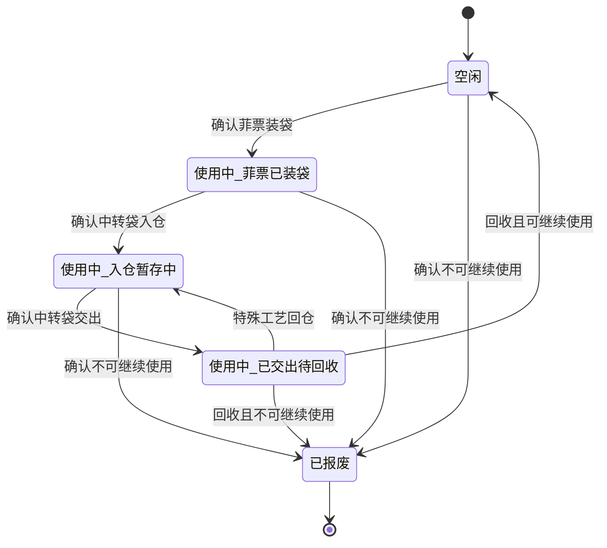

# 裁床中转袋三状态与流转阶段设计

## 1. 文档信息

| 项目 | 内容 |
| --- | --- |
| 文档日期 | 2026-07-30 |
| 文档状态 | 已完成业务方案确认，待书面规格复核 |
| 适用系统 | PFOS / WLS / FCS |
| 相关页面 | `/fcs/craft/cutting/transfer-bags`、裁床待交出仓 Web、中转袋相关 PDA 页面 |
| 主要角色 | 裁床装袋人员、待交出仓人员、交出人员、仓管、裁床主管、文员 |
| 文档目标 | 将中转袋主状态收口为“空闲、使用中、已报废”，并把装袋、入仓、交出结果独立表达为流转阶段 |

## 2. 设计结论

中转袋只保留 3 个主状态：

1. 空闲。
2. 使用中。
3. 已报废。

中转袋在“使用中”状态下，可以处于以下 3 个流转阶段：

1. 菲票已装袋。
2. 入仓暂存中。
3. 已交出待回收。

主状态回答“这个袋现在能不能开始新的使用周期”；流转阶段回答“这个袋当前已经完成了哪一步”。两者不得再混为一个状态字段或同一个筛选条件。

本设计不增加其他中间状态或处理标签。回收确认只产生“可继续使用”或“不可继续使用”两个结果。

## 3. 业务事实与边界

### 3.1 菲票装袋

菲票装袋负责建立袋内事实：

- 扫描中转袋。
- 扫描一张或多张菲票。
- 确认菲票及其裁片已装入该中转袋。
- 完成后，当前流转阶段为“菲票已装袋”。
- 中转袋主状态为“使用中”。

“装袋中”只允许作为操作页面尚未确认时的临时执行反馈，不进入中转袋主状态，也不进入已完成流转阶段。

### 3.2 中转袋入仓

中转袋入仓负责建立仓位事实：

- 输入或扫描中转袋。
- 输入或扫描库区、库位。
- 不再次扫描、选择或绑定菲票。
- 完成后，当前流转阶段为“入仓暂存中”。
- 中转袋主状态保持“使用中”。

### 3.3 特殊工艺回仓

特殊工艺回仓完成后，中转袋同样进入“入仓暂存中”，但回仓记录必须保留：

- 来源类型为“特殊工艺回仓”。
- 来源交出记录。
- 回仓工艺或接收工厂。
- 回仓库区、库位。
- 操作人和时间。

普通入仓和特殊工艺回仓可以共享流转阶段，不得因此合并或丢失各自的业务事实。

### 3.4 中转袋交出

中转袋交出负责建立责任转移事实：

- 交出最小单位是一个完整中转袋。
- 不允许按菲票、裁片数量或部分袋内内容拆分交出。
- 入仓暂存中的中转袋才能交出。
- 交出时绑定接收任务和接收工厂。
- 完成后，当前流转阶段为“已交出待回收”。
- 中转袋主状态保持“使用中”。

### 3.5 中转袋回收

中转袋回收负责关闭本次使用周期：

- 回收并确认可以继续使用：主状态变为“空闲”，清空当前流转阶段。
- 回收并确认不可继续使用：主状态变为“已报废”，清空当前流转阶段。

数量不一致、少回菲票、回仓记录缺失等属于业务差异。业务差异必须独立记录，不得直接把中转袋判定为已报废。

中转袋在空闲、装袋、入仓或交出期间一旦确认实物不可继续使用，也可以直接转为“已报废”。报废是实物处置结论，不要求先完成回收。

## 4. 状态定义

### 4.1 中转袋主状态

| 主状态 | 业务定义 | 是否允许开始装袋 | 是否允许继续流转 |
| --- | --- | --- | --- |
| 空闲 | 没有未结束的使用周期，可以投入下一次装袋 | 是 | 是 |
| 使用中 | 已开始本次使用周期，尚未完成回收关闭 | 否 | 按当前流转阶段判断 |
| 已报废 | 实物确认不可继续使用，只保留历史追溯 | 否 | 否 |

### 4.2 当前流转阶段

| 流转阶段 | 已完成的业务事实 | 下一步 |
| --- | --- | --- |
| 菲票已装袋 | 袋内菲票与中转袋关系已确认 | 中转袋入仓 |
| 入仓暂存中 | 中转袋已绑定有效库区、库位 | 中转袋交出 |
| 已交出待回收 | 中转袋已完整交给接收任务和工厂 | 中转袋回收 |

空闲袋和已报废袋不显示当前流转阶段。

## 5. 状态转换

特殊工艺回仓完成后进入“使用中 / 入仓暂存中”，之后按实际下游任务继续交出。

## 6. 状态判断依据

状态和流转阶段必须根据已完成的业务事实判断，不能只依赖历史编号或页面临时状态：

| 已完成事实 | 中转袋主状态 | 当前流转阶段 |
| --- | --- | --- |
| 没有未结束的使用周期 | 空闲 | 无 |
| 已确认菲票装袋，尚未确认入仓 | 使用中 | 菲票已装袋 |
| 已确认普通入仓或特殊工艺回仓，尚未交出 | 使用中 | 入仓暂存中 |
| 已确认整袋交出，尚未完成回收 | 使用中 | 已交出待回收 |
| 已回收并确认可继续使用 | 空闲 | 无 |
| 已确认不可继续使用 | 已报废 | 无 |

历史状态迁移必须优先读取装袋、入仓、交出、回收和报废事实。只有缺少事实记录时，才能使用旧状态作为兼容判断依据。

## 7. 页面设计

### 7.1 中转袋流转主列表

主列表必须分开显示：

- 中转袋状态。
- 当前流转阶段。

“中转袋状态”筛选只允许：

- 空闲。
- 使用中。
- 已报废。

“当前流转阶段”可以独立筛选：

- 菲票已装袋。
- 入仓暂存中。
- 已交出待回收。

空闲袋和已报废袋的流转阶段显示为“—”。

调整主列表时必须继续遵守标准列表页治理要求，包括分页、列设置、列排序、冻结列和右侧固定操作栏。

### 7.2 中转袋详情

详情头部同时展示：

- 中转袋编号。
- 中转袋状态。
- 当前流转阶段。
- 当前库区、库位或接收方。

历史使用周期、袋内菲票、入仓记录、交出记录、回收记录和报废记录继续作为独立事实展示，不再作为中转袋主状态。

### 7.3 Web 待交出仓

保留现有工作台和弹窗边界：

- 菲票装袋负责袋内事实。
- 中转袋入仓负责库位事实。
- 中转袋交出展示和记录整袋责任转移。
- 特殊工艺回仓保留独立来源记录。

不得把这些动作改造成互相替代的页面，也不得在入仓时重新扫描菲票。

### 7.4 PDA 员工执行页

PDA 不向一线员工展示完整状态机，只展示当前任务、当前袋、当前动作和操作结果：

- 菲票装袋页：确认后显示“菲票已装袋”。
- 中转袋入仓页：确认后显示“入仓成功”。
- 中转袋交出页：确认后显示“整袋交出成功”。
- 特殊工艺回仓页：确认后显示“回仓成功”。

每个执行页只保留一个主动作。状态判断由系统完成，员工不手选“空闲、使用中、已报废”。

## 8. 操作权限与防错

| 当前主状态 / 流转阶段 | 允许动作 | 必须阻断 |
| --- | --- | --- |
| 空闲 | 开始菲票装袋 | 入仓、交出、回收 |
| 使用中 / 菲票已装袋 | 中转袋入仓 | 新建装袋周期、交出、回收 |
| 使用中 / 入仓暂存中 | 中转袋交出 | 新建装袋周期、重复入仓、回收 |
| 使用中 / 已交出待回收 | 中转袋回收；特殊工艺任务完成后回仓 | 新建装袋周期、普通重复入仓、重复交出 |
| 已报废 | 查看历史 | 所有流转动作 |

所有动作必须阻断：

- 扫错中转袋。
- 状态或阶段不允许操作。
- 重复装袋、重复入仓、重复交出、重复回收。
- 入仓缺少库区或库位。
- 交出缺少接收任务或接收工厂。
- 袋内事实与交出对象不一致。

失败提示必须说明原因和下一步，不使用“状态异常”“参数错误”等抽象文案。

## 9. 数据与模块边界

本次收口保持 3 层事实：

1. 中转袋主档：只保存空闲、使用中、已报废。
2. 当前使用周期：保存当前流转阶段、袋内关系、库位、接收对象和起止时间。
3. 业务记录：分别保存装袋、入仓、交出、回收、报废和业务差异。

页面统一从一处获得“主状态＋当前流转阶段”，不得在主列表、详情、PDA、待交出仓和二维码页面分别维护不同映射。

使用周期仍可保留实现装袋、入仓、交出、回收所需的内部过程值，但这些过程值不得直接作为中转袋主状态展示。

## 10. 兼容与既有设计关系

本设计只替代以下旧口径：

- 将“装袋中、已装袋待入仓、已入待交出仓、已交出待回收、已回收”等全部作为中转袋主状态。
- 将“可用、装袋中、待交出、已交出待回收、报废”等混在同一个主列表状态筛选中。
- 因回收差异把使用周期或中转袋标记为报废。

本设计不改变以下已确认边界：

- 菲票装袋与中转袋入仓是两个动作。
- 中转袋入仓只记录袋号、库区和库位。
- 中转袋交出以整袋为最小单位，不允许拆袋。
- Web 待交出仓保持工作台与弹窗模式。
- PDA 继续以扫码和单一主动作为核心。

`2026-07-25-cutting-wait-handover-transfer-bag-flow-design.md` 和 `2026-07-27-cutting-transfer-bag-whole-flow-design.md` 中的中转袋多状态图，按本设计替换；其他装袋、入仓、整袋交出、特殊工艺回仓和追溯边界继续有效。

## 11. 预计影响范围

实现阶段应重点核查并按最小范围修改：

- 中转袋主档、使用周期和投影模型。
- 中转袋主列表、筛选、摘要和详情。
- 装袋、入仓、交出、回收动作处理。
- 待交出仓 Web 投影。
- PDA 入仓和交出候选判断。
- 中转袋二维码详情和打印展示。
- 中转袋相关治理脚本、专项检查和浏览器验收。

不修改无关菜单、全局布局、技术栈、状态管理体系和部署配置。

## 12. 验收标准

### 12.1 主状态

- [ ] 中转袋主状态只存在空闲、使用中、已报废。
- [ ] 主列表状态筛选只展示这 3 个选项。
- [ ] Web、PDA、待交出仓和二维码详情对同一个袋的主状态一致。
- [ ] 页面不展示英文状态码。

### 12.2 流转阶段

- [ ] 菲票装袋确认后显示“菲票已装袋”。
- [ ] 普通入仓或特殊工艺回仓完成后显示“入仓暂存中”。
- [ ] 整袋交出后显示“已交出待回收”。
- [ ] 空闲袋和已报废袋没有当前流转阶段。

### 12.3 业务闭环

- [ ] 只有空闲袋可以开始新的装袋周期。
- [ ] 菲票已装袋后才能入仓。
- [ ] 入仓暂存中的袋才能交出。
- [ ] 已交出待回收的袋才能回收。
- [ ] 回收确认后只能进入空闲或已报废。
- [ ] 任一阶段确认实物不可继续使用时，可以直接进入已报废。
- [ ] 回收差异不会导致袋被误判为已报废。
- [ ] 重复操作不会生成第二条业务事实。

### 12.4 页面与现场

- [ ] PDA 每页只有一个主动作。
- [ ] PDA 不要求员工理解或选择状态机。
- [ ] 入仓仍只记录中转袋和库区库位。
- [ ] 交出仍以完整中转袋为最小单位。
- [ ] 列表继续分页，并满足标准列表页治理。
- [ ] 1366×768 和 1280×720 下主列表、筛选和操作栏可用。
- [ ] 弹窗和扫码操作不触发不必要的整页重绘。

### 12.5 自动检查

- [ ] 中转袋完整流转治理检查通过，且不再要求旧多状态口径。
- [ ] 中转袋移动端闭环检查通过。
- [ ] PDA 装袋、入仓、交出相关专项检查通过。
- [ ] 标准列表页治理检查通过。
- [ ] 原型设计治理检查通过。
- [ ] 项目构建通过。
- [ ] CodeGraph 已同步且状态正常。
- [ ] 最终任务收据有效。

## 13. 设计治理自查

| 检查项 | 结论 | 说明 |
| --- | --- | --- |
| 角色匹配 | 通过 | Web 面向主管和文员，PDA 面向现场执行人员。 |
| 任务清晰度 | 通过 | PDA 每页只表达装袋、入仓、交出或回仓中的一个动作。 |
| 信息架构与导航 | 通过 | 保留既有路由、工作台和弹窗边界。 |
| 页面模式 | 通过 | Web 使用可追溯列表，PDA 使用扫码执行页。 |
| 信息负荷 | 通过 | 主状态从多状态收口为 3 个，流转阶段单独表达。 |
| 文案 | 通过 | 使用“空闲、使用中、已报废”和现场动作结果。 |
| 数量与状态 | 通过 | 状态不要求员工判断，差异与报废分开。 |
| 扫码与识别 | 通过 | PDA 继续扫码识别袋、菲票、库位和任务。 |
| 防错 | 通过 | 按主状态和流转阶段阻断错误及重复操作。 |
| UI 样式 | 通过 | 状态色服务识别，不增加额外视觉层级。 |
| 组件交互 | 通过 | 保留分页、固定操作栏和局部弹窗交互。 |
| 协作关系 | 通过 | 交出记录继续表达交出方、接收任务和接收工厂。 |
| 异常与追溯 | 通过 | 差异、回收和报废分别记录。 |
| 现场设备可用性 | 通过 | PDA 保持单动作，Web 按既有分辨率门禁验收。 |

## 14. 规格自检

- 占位符检查：无未完成占位项或空白业务规则。
- 一致性检查：主状态、流转阶段、操作结果和历史记录已分层，无互相替代。
- 范围检查：仅覆盖中转袋状态与直接上下游展示，不扩展到无关仓储或工艺模块。
- 模糊性检查：特殊工艺回仓、业务差异、回收结果和报废边界已明确。
- 例外：无。
