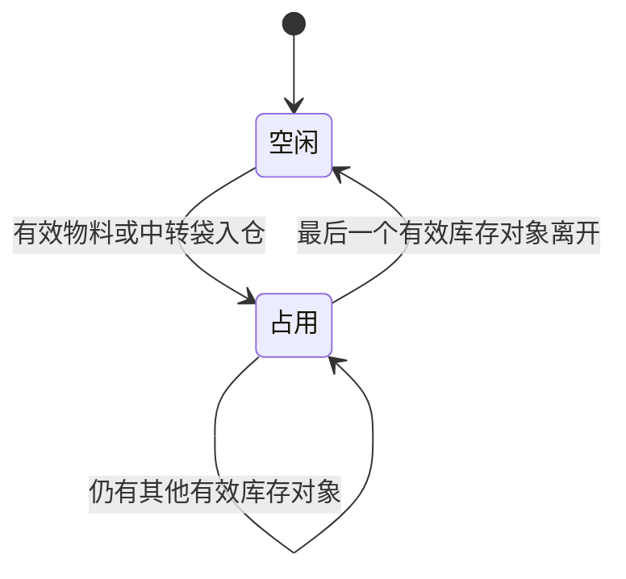

# 裁床待加工仓与待交出仓库位图产品设计

## 1. 文档信息

| 项目 | 内容 |
| --- | --- |
| 文档日期 | 2026-07-30 |
| 复核状态 | 2026-07-30 已按现有主数据、PFOS、PDA、运行时事件和检查脚本完成第二轮代码事实复核 |
| 适用系统 | FCS / PFOS / 工厂现场仓管端 |
| 涉及业务 | 裁床接收入仓、布料暂存、裁片中转袋入仓、待交出仓暂存、裁片交出 |
| 页面名称 | 待加工仓库位图、待交出仓库位图 |
| 主要角色 | 裁床仓管、待交出仓工人、办公室文员、裁床主管 |
| 设计结论 | 复用现有“仓库—库区—货架—库位”层级，不新增“库位组”；通过裁床专用编排快照保存物理顺序；库位图只展示“空闲、占用”两种业务状态 |

## 2. 背景

裁床现场已经维护了部分仓库、库区和库位资料，但当前信息主要以名称、编号和下拉选择的形式存在，无法直观看出：

- 哪些库位当前空闲。
- 哪些库位已经被占用。
- 待加工仓库位由哪个生产单的哪种物料占用。
- 待交出仓库位由哪个生产单的哪些中转袋占用。
- 一批布料需要多个库位时，哪些空闲库位在现场属于连续相邻位置。

现场库位不是一张完整、规则的大网格，而是分散成多个库区；每个库区有若干货架，每个货架有多个库位。现有库位编号可以调整，因此不能依靠编号文本推断物理位置和相邻关系。

本设计通过一次性编排现有库位，形成可持续使用的二维库位图。日常占用状态由真实入仓、领用和交出事实自动生成，不由人员手工切换。

## 3. 设计目标

### 3.1 业务目标

1. 仓管进入页面后能一眼看到全部库区及空闲、占用分布。
2. 占用库位能追溯到具体生产单、物料或中转袋。
3. 布料需要多个库位时，只能选择同一货架内连续相邻的空闲库位。
4. 复用系统已有仓库、库区、货架和库位资料，不重复建立仓库主数据。
5. 库位编号发生修改后，库位在图中的位置和相邻关系不变。
6. 待加工仓和待交出仓使用同一套图形编排方法，但分别读取各自的库存事实。

### 3.2 现场体验目标

- 少读：库位卡片只显示库位编号和必要占用摘要。
- 少选：入仓时只允许点击符合条件的空闲库位。
- 少判断：相邻关系由系统判断，不让员工根据编号自行推测。
- 少填：生产单、物料、中转袋等占用内容由入仓事实自动带入。
- 可追溯：点击占用库位即可查看占用对象和入仓事实。

## 4. 范围与非目标

### 4.1 本次范围

- 待加工仓库位图。
- 待交出仓库位图。
- 现有库区、货架、库位的图形编排。
- 未编排库位的补充编排。
- 空闲、占用两种业务状态。
- 占用对象的简要展示和详情查看。
- 待加工仓连续相邻空闲库位选择。
- 库位编号变更后的稳定布局。

### 4.2 本次不做

- 不做三维仓库或数字孪生。
- 不做真实建筑平面图、通道和人员动线模拟。
- 不做库位热力图、周转率分析或库容利用率分析。
- 不增加“部分占用、预留、冻结、锁定”等页面业务状态。
- 不增加“库位组”层级。
- 不让仓管手工维护库位空闲、占用状态。
- 不把本次设计扩展为全公司的通用 WMS 改造。

## 5. 当前系统基础

当前系统已经具备正式的工厂内部仓库层级：

```text
仓库
└── 库区
    └── 货架
        └── 库位
```

代码审阅确认的现有能力包括：

- 区分待加工仓和待交出仓。
- 仓库下维护库区列表。
- 库区下维护货架列表。
- 货架下维护库位列表。
- 页面能够按仓库读取库区、货架和库位选项。
- 待交出仓运行时事件已经区分“菲票装袋”“中转袋入仓”“交出装袋确认”“新增交出记录”“特殊工艺交出”“特殊工艺回仓”。
- 待加工仓已有生产单、物料和仓内库存事实。

同时，代码中存在以下必须在实现时处理的事实差异：

1. 通用仓库主数据默认编号为 `A区 / A-01 / A-01-01`，PDA 待加工仓仍使用硬编码的 `面料 A 区 / FAB-A-01` 等选项，PFOS 也存在 `FAB-A-01`、`CUT-A-01`、`SP-RETURN-01` 等静态示例。
2. 待加工仓库存、接收会话和待交出仓部分事件主要保存库区、库位文本，没有完整稳定路径 ID。
3. `buildRuntimeInboundTempBagsFromWaitHandoverEvents()` 当前从“菲票装袋”事件生成入仓袋，和“装袋不绑定库位、入仓才占用库位”的现有页面规则冲突。
4. PDA 中转袋入仓先更新自身 Mock 台账，尚未写入 PFOS 使用的待交出仓运行时事件。
5. 当前仓库 Store 是内存数据，刷新页面后不能保证编排结果仍在。
6. 系统中至少存在两个裁床工厂，库位图必须明确当前工厂，不能把不同工厂的仓库和占用混在一起。

因此，本设计不新建另一套库位主数据；实现必须先统一裁床库位引用与事件事实，再在现有层级上叠加裁床专用编排快照和占用投影。

## 6. 术语与层级

### 6.1 统一术语

| 术语 | 定义 | 页面表达 |
| --- | --- | --- |
| 待加工仓 | 裁床领取布料后、铺布裁剪前的暂存仓 | 待加工仓库位图 |
| 待交出仓 | 裁片装入中转袋后、交给下游前的暂存仓 | 待交出仓库位图 |
| 库区 | 仓库内一组可识别的物理存放区域，包含若干货架 | 库区 A、库区 B |
| 货架 | 库区内承载多个库位的物理货架或连续存放排 | 货架 A-01 |
| 库位 | 可单独分配和识别的最小存放位置 | A-01-01 |
| 空闲 | 当前没有任何有效库存对象占用该库位 | 空闲 |
| 占用 | 当前至少有一个有效库存对象占用该库位 | 占用 |

### 6.2 不使用“库位组”

现场所说的“一组一组”由现有“库区”承接。

```text
错误层级：
仓库 → 库区 → 库位组 → 货架 → 库位

确认层级：
仓库 → 库区 → 货架 → 库位
```

只有当未来确认一个库区内部还存在多组独立、需要单独管理的物理区域时，才重新评估是否增加层级。本次明确不增加。

## 7. 整体页面结构

### 7.1 页面入口

沿用现有两个路由，不新增菜单和页面：

- `/fcs/craft/cutting/warehouse-management/wait-process?tab=locations`
- `/fcs/craft/cutting/warehouse-management/wait-handover?tab=locations`

两个页面现有“库区库位”页签统一改名为“库位图”。库存、接收记录、使用记录、退料、装袋、入仓、交出等既有页签和弹窗工作台保持不变。

库位图顶部必须显示当前裁床工厂。PFOS 在库位图页签提供紧凑的裁床工厂选择器；选择结果按 `factoryId` 保存在查询参数或既有页面状态中。PDA 直接使用当前登录运行时的 `factoryId`，不得让一线员工再次选择工厂。

### 7.2 页面布局

页面从上到下分为：

1. 当前裁床工厂、页面标题和当前仓库。
2. 空闲、占用图例。
3. 库位总数、空闲数、占用数。
4. 按库区排列的库区卡片。
5. 库区卡片内按货架分行展示库位。

示意：

```text
待加工仓库位图
空闲 11 个｜占用 7 个

┌─ 库区 A ─────────────────────┐
│ 货架 A-01  [01][02][03][04]  │
│ 货架 A-02  [05][06][07]      │
└──────────────────────────────┘

┌─ 库区 B ─────────────────────┐
│ 货架 B-01  [01][02][03][04]  │
└──────────────────────────────┘
```

### 7.3 库区卡片排列

- 库区卡片按已保存的库区显示顺序排列。
- 页面宽度充足时可多列展示；宽度不足时自动变成单列。
- 库区在真实现场可以彼此分散，页面不要求还原精确平面坐标。
- 每张库区卡片内部必须完整显示其货架关系。

### 7.4 货架和库位排列

- 货架在库区内按货架显示顺序纵向排列。
- 同一货架内的库位必须保持单行、连续展示。
- 同一货架库位较多时，只允许货架行内部横向滚动，不让整个页面横向溢出。
- 库位不能因为页面换行而造成虚假的上下相邻关系。

## 8. 库位图编排

### 8.1 编排角色

| 角色 | 权限 |
| --- | --- |
| 裁床主管或仓库主管 | 进入库位图编排，调整库区、货架和库位顺序 |
| 办公室文员 | 可协助首次编排和修改编号 |
| 一线仓管 | 只查看库位图和执行入仓选位，不进入编排模式 |

### 8.2 首次生成

系统按现有仓库资料自动生成初始库位图：

1. 按仓库读取现有库区。
2. 按库区读取现有货架。
3. 按货架读取现有库位。
4. 已有顺序时沿用现有顺序。
5. 现有嵌套数组顺序作为第一次生成的默认物理顺序；只有导入记录完全没有顺序时才以编号作一次性兜底。
6. 只有导入或历史资料能识别稳定库位、但无法归入现有货架时，才进入“未编排库位”区域。

编号排序只用于首次生成，保存编排后不再用编号实时重排。

### 8.3 编排动作

编排模式只提供以下必要动作：

- 调整库区显示顺序。
- 调整库区内的货架顺序。
- 调整同一货架内的库位顺序。
- 把未编排库位放入指定货架。
- 为缺少货架的现有库位补充货架归属。
- 修改库区、货架、库位显示名称或编号。
- 保存编排。

2026-07-31 增强后，**新增库区**和**新增库位**属于主管/文员在普通管理查看模式执行的结构维护动作，不属于拖拽/排序编排动作，因此入口只在 `VIEW` 显示、进入 `LAYOUT` 后隐藏。PDA 与 `SELECT` 选位模式均不得显示结构维护入口；原型没有真实鉴权，正式系统还需按本节角色表限制主管和文员可见。

### 8.4 编排保存结果

保存后形成稳定的图形关系：

```text
仓库
├── 库区显示顺序
│   └── 货架显示顺序
│       └── 库位显示顺序
```

编排关系只负责“画在哪里”，不负责“里面放了什么”。

编排不强制修改全公司通用仓库接口，而是保存裁床专用编排快照：

```text
工厂 ID + 仓库类型
├── 编排版本
├── 库区 ID 顺序
├── 每个库区的货架 ID 顺序
├── 每个货架的库位 ID 顺序
├── 未编排库位 ID
├── 编号、名称显示覆盖
├── 原型新增库区的完整结构
└── 原型新增到既有货架的库位结构
```

新增结构是 2026-07-31 原型增强后的明确扩展：当前通用仓库 Store 仅驻留内存，若只调用主数据创建函数，刷新后会丢失。为保证演示稳定，新增库区和库位暂随 `factoryId + warehouseKind` 的版本化快照保存，并在裁床库位投影入口统一合并；PFOS 查看、编排及 PDA/现场选位都必须读取同一投影，不能各自维护第二套结构。该扩展只建立“空的物理结构”，仍不保存占用内容；真实交付时应由仓库主数据服务承接，不把 localStorage 视为正式主数据。

- 原型阶段使用版本化本地持久化，路由切换和浏览器刷新后仍能恢复。
- 保存时校验编排版本；发现页面版本落后时阻止覆盖并提示“库位图已被更新，请刷新后重试”。
- 新增主数据节点没有编排记录时，追加到所属层级末尾并提示主管检查。
- 编排按 `factoryId + warehouseKind` 隔离，待加工仓、待交出仓及不同工厂互不覆盖。
- 本规则是原型内的展示和防错设计，不引入真实后端、权限系统或并发锁。

## 9. 编号与物理位置分离

### 9.1 核心原则

库位编号是现场显示标识，库位 ID 和编排顺序才是稳定身份。

```text
稳定关系：
库位 ID → 所属仓库 → 所属库区 → 所属货架 → 库位顺序

可变信息：
库位编号、库位名称
```

### 9.2 编号修改规则

- 修改库位编号后，原库位 ID 不变。
- 所属库区、货架和库位顺序不变。
- 当前占用事实仍然关联原库位 ID。
- 历史记录可以展示修改后的当前编号，同时保留可追溯身份。
- 不允许因为编号变化自动重新排序。

## 10. 空闲与占用状态

### 10.1 页面只展示两个状态

| 状态 | 判定 | 可执行动作 |
| --- | --- | --- |
| 空闲 | 当前没有有效库存对象占用 | 可以选择存放 |
| 占用 | 当前至少有一个有效库存对象占用 | 只能查看占用详情 |

“本次已选”只是当前操作的选中效果，不作为第三种业务状态保存，也不进入状态图例。

### 10.2 主数据停用的处理

系统内部可以保留库位“可用、停用”等主数据状态，但停用库位不进入日常库位图，也不参与空闲数和占用数统计。

这样可以保证日常页面始终只有“空闲、占用”两个状态。

主数据状态与业务占用状态是两条不同轴：

| 维度 | 值 | 含义 |
| --- | --- | --- |
| 主数据可用性 | 可用、停用 | 这个物理库位是否允许继续使用 |
| 业务占用 | 空闲、占用 | 可用库位当前是否存在有效库存对象 |

停用是维护属性，不作为日常图中的第三种颜色或第三种业务状态。

### 10.3 状态自动变化



页面不提供“设为空闲”“设为占用”按钮。

## 11. 待加工仓库位图

### 11.1 占用对象

待加工仓库位的占用对象是进入裁床待加工仓、尚未领出加工的物料。

占用事实至少能关联：

- 生产单。
- 裁床单或相关裁床任务。
- 物料。
- 颜色或规格。
- 入仓数量和单位。
- 入仓人。
- 入仓时间。

### 11.2 库位卡片展示

空闲库位：

```text
A-01-01
空闲
```

占用库位：

```text
A-01-02
PO15371
面料
```

库位卡片不堆叠全部物料字段。点击占用库位后，在轻量浮层或右侧详情中展示完整占用明细。

### 11.3 一个库位存在多条物料

只要库位内仍存在一条有效物料库存，该库位就显示为占用。

页面卡片显示：

```text
A-01-02
PO15371 等
2 种物料
```

点击后展示全部占用物料。只有最后一条物料领出或移出后，库位才恢复为空闲。

### 11.4 一批物料占用多个库位

多选库位表示一条接收会话的“存放范围”，不是把总数量复制成多条独立库存：

- 接收会话只保存一次总数量、卷数和物料明细。
- 同一会话保存一个或多个 `locationId`，形成 `storageFootprint`。
- 每个关联库位都显示同一批物料，并注明“本批共占 N 个库位”。
- 库位详情不把整批数量按库位重复相加，避免总量被放大 N 倍。
- 首版不要求仓管拆分每个库位各放多少米、多少卷；如业务以后需要逐库位数量，再单独设计库位级库存。

部分领出时系统不能猜测现场哪个库位已经腾空：

1. 领出后该接收会话仍有剩余量，原存放范围默认继续全部占用。
2. 仓管确认部分库位实际已经清空时，使用“调整剩余存放范围”重新选择连续库位。
3. 调整只改变剩余物料与库位的关联，不提供“手工设为空闲”。
4. 接收会话剩余量为零时，系统自动释放该会话关联的全部库位。

## 12. 待交出仓库位图

### 12.1 占用对象

待交出仓库位的占用对象是已完成入仓、尚未交出的中转袋。

占用事实至少能关联：

- 生产单。
- 中转袋号。
- 袋内菲票。
- 裁片数量。
- 入仓人。
- 入仓时间。

### 12.2 库位卡片展示

空闲库位：

```text
B-01-01
空闲
```

占用库位：

```text
B-01-02
PO15371
袋 BAG-008
```

一个库位存放多个中转袋时，卡片显示生产单摘要和袋数，点击后查看完整中转袋列表。

### 12.3 交出后的变化

- 中转袋完成交出后，从原库位占用明细移除。
- 原库位还有其他中转袋时仍为占用。
- 原库位没有任何有效中转袋时自动变为空闲。
- 特种工艺回仓的中转袋重新入仓后，按新的库区和库位恢复占用。

### 12.4 待交出仓事件与占用生命周期

| 业务动作 | 物理事实 | 库位图处理 |
| --- | --- | --- |
| 菲票装袋 | 菲票进入临时袋，但尚未确认物理库位 | 不形成库位占用 |
| 中转袋入仓 | 临时袋进入指定待交出仓库位 | 以入仓事件形成占用 |
| 交出装袋确认 | 裁片从临时袋整理进目标中转袋 | 默认把同一物理库位的占用主体从临时袋转为目标中转袋，不重复占用、不直接释放 |
| 新增交出记录 | 目标中转袋离开待交出仓 | 移除该袋占用；同库位无其他有效袋时释放 |
| 特殊工艺交出 | 指定菲票或袋离仓加工 | 按实际交出对象减少占用 |
| 特殊工艺回仓 | 指定菲票或袋回到扫描的库位 | 在新库位恢复占用；部分回仓保留实回数量 |

实现时必须先修正当前运行时投影：入仓袋只能由“中转袋入仓”事实生成，不能由“菲票装袋”事实生成。现有 `菲票装袋`、`中转袋入仓`、`交出装袋确认`、`特殊工艺回仓`弹窗仍保留在原单页工作台内，不拆成新页面。

`inventoryEffect.toLocationCode` 或 `fromLocationCode` 中出现袋码时只表示旧事件的业务对象兼容字段，不能把袋码误认成物理库位。投影必须结合事件类型、稳定库位 ID、袋使用记录和菲票归属计算。

## 13. 连续相邻库位选择

### 13.1 使用场景

裁床领取布料并存放到待加工仓时，一批物料可能需要多个库位。仓管可以一次选择多个空闲库位，但必须连续相邻。

### 13.2 相邻判定

两个库位同时满足以下条件才算相邻：

1. 属于同一个待加工仓。
2. 属于同一个库区。
3. 属于同一个货架。
4. 在货架中的库位顺序连续。

库位编号不参与相邻判断。

### 13.3 示例

货架 A-01 的稳定顺序为：

```text
A-01-01 → A-01-03 → A-01-08 → A-01-09
```

即使编号不连续，仍以已保存顺序判断：

- 选择 `A-01-01、A-01-03`：允许。
- 选择 `A-01-01、A-01-08`：不允许，中间隔了一个库位。
- 选择 `A-01-08、A-01-09`：允许。
- 选择货架 A-01 和货架 A-02 的库位：不允许。
- 选择库区 A 和库区 B 的库位：不允许。

### 13.4 页面交互

1. 用户点击第一个空闲库位。
2. 系统只允许从当前连续区间的左端或右端增加一个相邻空闲库位。
3. 点击已选区间的端点可缩短区间；点击中间库位会造成区间断开，因此阻止并提示。
4. 页面提供“清空重选”。
5. 不符合条件的其他库位显示不可选，但仍保留空闲或占用文字。
6. 页面显示“已选 N 个库位”和本次起止库位。
7. 用户确认存放前，系统基于最新占用事实再次校验可用性和相邻性。
8. 校验通过后生成一次入仓事实和一个存放范围；这些库位自动变为占用。

“本次已选”用勾选图标、加粗边框和选中提示表达，但格内业务状态仍写“空闲”，不把选中保存成第三种状态。

错误提示：

> 请选择同一货架内连续相邻的空闲库位。

## 14. 占用详情

### 14.1 点击行为

- 点击空闲库位：在入仓选位场景中选择该库位；在普通查看场景中不展开空详情。
- 点击占用库位：打开占用详情。

### 14.2 待加工仓占用详情

必须展示：

- 库区、货架、库位。
- 生产单号。
- 物料名称或物料 SKU。
- 颜色、规格。
- 在库数量和单位。
- 入仓人、入仓时间。
- 本批存放范围和共占库位数。
- 当前剩余数量；存在部分领出时显示“仍按原范围占用”或调整记录。

### 14.3 待交出仓占用详情

必须展示：

- 库区、货架、库位。
- 生产单号。
- 中转袋号。
- 袋内裁片数量。
- 入仓人、入仓时间。

详情只用于查看事实，不在详情内手工修改占用状态。

占用明细、未定位库存属于数据列表，默认每页 10 条并显示总数、当前页和每页条数。库位图本身是空间分组视图，不套用标准列表页模板，也不需要分页。

## 15. 数据来源与投影

### 15.1 主数据

库位图结构读取：

- 仓库。
- 库区。
- 货架。
- 库位。
- 各层显示顺序。
- 当前裁床工厂。
- 裁床专用编排快照。

### 15.2 待加工仓占用投影

```text
有效待加工仓物料库存
→ 按库位归集
→ 库位内有效库存数量大于 0
→ 占用
```

### 15.3 待交出仓占用投影

```text
有效待交出仓中转袋库存
→ 按库位归集
→ 库位内有效中转袋数量大于 0
→ 占用
```

### 15.4 统一原则

- Web、PDA 和库位图必须读取同一份库存事实。
- 库位图不建立独立的手工占用台账。
- 入仓、领用、移位、交出和回仓动作改变事实后，库位图自动更新。
- 历史已离仓记录不参与当前占用计算。

### 15.5 稳定库位引用与历史兼容

新写入的接收、入仓、回仓和位置调整事实必须同时保存：

- `factoryId`
- `warehouseId`
- `areaId`
- `shelfId`
- `locationId` 或 `locationIds`
- 当前库区名称、货架编号、库位编号兼容快照

读取历史事实时按以下顺序解析，任何一步不能唯一匹配就进入“未定位库存”：

1. 稳定 `locationId`。
2. 同一工厂、同一仓库内的“库区 + 货架 + 库位编号”。
3. 同一工厂、同一仓库内唯一的“库区 + 库位编号”。
4. 无法唯一确定时不猜测、不自动归位。

现有 `FAB-*`、`CUT-*`、`SP-RETURN-*` 等硬编码选项必须通过一次性裁床库位迁移或映射处理，不能继续与 `A-01-01` 主数据并行形成两套库位。迁移结果必须列出：已唯一匹配、待人工确认、无法匹配三类。

### 15.6 Web 与 PDA 同一事实及幂等

- PDA 扫码优先识别稳定库位二维码，同时兼容当前唯一库位编号。
- 编号重名、找不到或停用时必须阻断；可视化选位是扫码后的确认和无扫码时的兜底。
- PDA 中转袋入仓必须写入与 PFOS 相同的“中转袋入仓”运行时事件，不能只更新 PDA 本地台账。
- 每次入仓使用稳定幂等键，例如“袋使用 ID + 入仓动作”；重试不得生成重复事件。
- 只有运行时事件写入成功后，PDA 本地袋状态才变成“已入仓”。
- 写入失败时保留当前表单和待入仓状态，提示“入仓未同步，请重试”，不得先显示成功。
- PFOS 的中转袋入仓、特殊工艺回仓也使用同一稳定库位解析和占用校验。

## 16. 最小信息补充

现有仓库模型已经具有仓库、库区、货架和库位层级。本次新增信息限定在裁床编排和事实引用范围内：

| 信息 | 用途 |
| --- | --- |
| 工厂和仓库类型 | 隔离多个裁床工厂及两类仓库 |
| 编排版本 | 防止旧页面覆盖新编排 |
| 库区 ID 顺序 | 决定库区卡片顺序 |
| 各库区货架 ID 顺序 | 决定库区内货架顺序 |
| 各货架库位 ID 顺序 | 决定同一货架内库位顺序及相邻关系 |
| 库位稳定 ID | 编号变更后仍保持身份、占用和历史关联 |
| 编号和名称显示覆盖 | 原型内支持改号且不改变稳定身份 |

不把 `displayOrder` 改为通用仓库主数据的强制字段，避免影响印花、染色、毛织和其他工厂仓库。没有编排快照时沿用当前数组顺序。

## 17. 异常与兜底

### 17.1 库位未编排

- 现有嵌套主数据正常按当前货架归属生成，不人为制造未编排数据。
- 只有导入或历史适配器能够识别稳定库位、但不能确定货架归属的记录进入“未编排库位”。
- 未编排库位不出现在正式库位图中。
- 主管或文员完成编排后才可用于入仓选位。

### 17.2 库位存在库存但主数据缺失

- 页面在库位图顶部提示“存在未定位库存”。
- 展示生产单、物料或中转袋摘要。
- 不把该库存错误归入任意空闲库位。
- 由主管补充实际库位后再进入正式库位图。

### 17.3 编排调整时库位已占用

- 允许调整显示顺序和修改编号，不改变占用事实。
- 不允许把已占用库位删除。
- 如需停用，必须先完成库存转移；停用后从日常库位图移除。

### 17.4 重复操作

- 同一入仓事实不能重复占用库位。
- 同一中转袋不能同时占用两个不同库位。
- 同一批物料选择多个库位时，系统保存一次入仓动作和多个库位关联。

### 17.5 并发占用冲突

- 页面选中不等于预占，不改变业务状态。
- 确认时必须重新读取最新占用投影。
- 任一所选库位已被其他操作占用时整次确认失败，不做部分写入。
- 提示具体冲突库位，并保留仍可用的选择供用户重新确认。

### 17.6 布局持久化损坏

- 编排快照无法解析或引用已删除节点时，回退到当前主数据数组顺序。
- 页面提示“部分编排无法恢复，请重新检查”，列出无法识别的节点。
- 不影响库存事实读取，也不把库存自动迁移到其他库位。

## 18. 页面防错

- 占用库位不可被选择为新存放库位。
- 不相邻库位不可同时确认。
- 跨库区、跨货架不可连续选择。
- 库位编号变化不触发重新排序。
- 未编排库位不可用于入仓。
- 没有真实库存事实时不得显示为占用。
- 库存尚未全部离开时不得显示为空闲。
- 一线页面不展示内部英文状态码。
- 选位确认时重新校验最新占用，避免两个终端同时占用。
- 多库位总数量只计算一次，不按格重复汇总。
- 袋码不能被当成物理库位编号。
- 不同裁床工厂的数据不得互相出现。

## 19. 业务场景

### 19.1 场景一：现有库位首次成图

裁床主管进入待加工仓库位图编排。系统自动读取已有库区、货架和库位，将结构完整的库位生成初始图，将缺少货架归属的库位放入“未编排库位”。主管把未编排库位放到正确货架，调整库位顺序并保存。

结果：

- 现有库位资料被直接复用。
- 不需要重新建库位。
- 保存后的顺序成为相邻判断依据。

### 19.2 场景二：布料占用多个相邻库位

仓管领取生产单 `PO15371` 的面料，需要 3 个库位。仓管在货架 A-01 选择第一个空闲库位后，系统只允许继续选择同一货架内能够组成连续区间的空闲库位。

结果：

- 确认后 3 个库位均显示为占用。
- 3 个库位点击后都能追溯到 `PO15371` 和对应面料。
- 不允许跨货架拼成 3 个库位。

### 19.3 场景三：查看待加工仓占用

主管打开待加工仓库位图，看到库区 A 的两个库位被 `PO15371` 面料占用。点击其中一个库位后查看物料、颜色、数量、入仓人和入仓时间。

### 19.4 场景四：中转袋进入待交出仓

裁片装袋完成后，中转袋 `BAG-008` 入待交出仓并选择库区 B、货架 B-01、库位 B-01-02。

结果：

- B-01-02 显示为占用。
- 卡片显示 `PO15371` 和 `BAG-008`。
- 点击后可查看袋内裁片数量。

### 19.5 场景五：中转袋交出后释放库位

`BAG-008` 完成交出。如果 B-01-02 没有其他有效中转袋，系统自动将该库位变为空闲；如果仍有其他袋，则继续显示占用。

### 19.6 场景六：修改库位编号

主管将库位 `A-01-02` 改名为 `面料-A-02`。

结果：

- 图中位置不变。
- 左右相邻关系不变。
- 原占用物料不丢失。
- 后续页面显示新编号。

### 19.7 场景七：物料部分领出

一批面料原来占用 A-01 的 3 个连续库位，部分领出后仍有余料。系统保守保持 3 个库位占用。仓管现场确认末端 1 个库位已经清空后，使用“调整剩余存放范围”把范围缩为前 2 个连续库位；空出的库位随后显示为空闲。

### 19.8 场景八：装袋、入仓、换袋和交出

菲票装入临时袋时不占库位；临时袋扫描 B-01-02 入仓后占用。交出装袋确认将内容转入正式中转袋，B-01-02 仍占用但占用主体改为正式袋。正式袋完成交出后，B-01-02 才释放。

### 19.9 场景九：PDA 入仓同步失败

PDA 已扫描中转袋和空闲库位，写入共同运行时事件失败。页面保留袋码、菲票和库位选择，袋状态仍为待入仓，显示“入仓未同步，请重试”。再次提交使用同一幂等键，成功后只产生一条入仓事实。

### 19.10 场景十：历史库位无法唯一匹配

历史事实只有 `面料 A 区 / FAB-A-01`，现有主数据存在多个可能库位。系统把它列入“未定位库存”，不随意占用 A 区任一格。主管确认实际位置后形成位置调整记录，再进入正式库位图。

## 20. 验收标准

### 20.1 层级与编排

1. 页面只使用“仓库—库区—货架—库位”层级。
2. 页面不出现“库位组”。
3. 系统能用现有库区、货架和库位生成初始库位图。
4. 未编排库位能被识别并进入单独区域。
5. 保存后库区、货架和库位顺序稳定。
6. 修改库位编号不会改变图中位置。
7. 编排结果在路由切换和浏览器刷新后仍能恢复。
8. 两个裁床工厂及两类仓库的编排互相隔离。
9. 编排版本落后时不能覆盖较新结果。

### 20.2 状态

10. 日常库位图只显示“空闲、占用”两种业务状态。
11. 停用库位不进入日常库位图。
12. 有有效库存对象时库位显示为占用。
13. 最后一个有效库存对象离开后库位自动显示为空闲。
14. 页面不提供手工切换占用状态的按钮。

### 20.3 待加工仓

15. 占用库位能展示生产单和物料摘要。
16. 点击占用库位能查看完整物料占用明细。
17. 可以选择多个空闲库位存放同一批物料。
18. 多选库位必须属于同一库区、同一货架且顺序连续。
19. 库位编号不参与相邻判断。
20. 多库位只统计一次批次总量，并显示存放范围。
21. 部分领出后按保守占用规则处理，支持调整剩余存放范围。

### 20.4 待交出仓

22. 占用库位能展示生产单和中转袋摘要。
23. 点击占用库位能查看中转袋明细。
24. 菲票装袋不形成库位占用，中转袋入仓才形成占用。
25. 交出装袋确认只转移占用主体，不重复占用或提前释放。
26. 中转袋交出后能正确释放库位。
27. 特种工艺回仓后能按新的库位恢复占用。
28. Web 与 PDA 写入并读取同一待交出仓事实。

### 20.5 现场可用性

29. 1366 × 768 分辨率下页面主体不产生横向溢出。
30. 1280 × 720 分辨率下能完成查看和选择。
31. 1024 × 768 下库区卡片变为单列，仍能查看和选择。
32. 同一货架库位过多时，仅货架行内部横向滚动。
33. 库位点击目标不小于 44 × 44 像素，状态使用文字、图标和边框，不只依赖颜色。
34. Web 可用 Enter 或 Space 操作当前库位。
35. 点击库位、打开详情和编排操作只更新必要区域，目标响应不超过 200ms。
36. 一线员工无需根据编号计算相邻关系。
37. 页面文案全部使用中文业务语言。
38. 占用明细和未定位库存列表均有分页。
39. PDA 扫码编号歧义、失效或已占用时明确阻断。

## 21. 角色、设备与操作边界

| 角色 | 使用端 | 可执行动作 | 不可执行动作 |
| --- | --- | --- | --- |
| 裁床主管、仓库主管 | PFOS 固定电脑或 iPad | 切换工厂、查看两张库位图、查看明细、进入编排、处理未定位库存 | 手工把占用改为空闲 |
| 办公室文员 | PFOS 固定电脑 | 协助首次编排、修改编号显示、核对历史库位迁移 | 代替现场确认物理库位是否已经清空 |
| 待加工仓仓管 | PDA；必要时 iPad | 扫码/选位、连续多选、确认接收存放、调整剩余存放范围 | 跨货架选位、选择占用或停用库位 |
| 待交出仓工人 | PDA | 中转袋扫码入仓、单选库位、特殊工艺回仓 | 在菲票装袋时提前占用库位 |
| 现场管理查看人员 | PFOS 或 iPad | 查看空闲、占用、占用详情和未定位清单 | 进入编排或改变库存事实 |

设备配置原则：

- PDA 用于扫描中转袋、菲票和库位二维码，以及执行高频单步确认。
- iPad 用于现场查看较完整库位图、主管巡仓和低频编排确认。
- 固定电脑用于首次编排、历史迁移核对、编号维护和异常处理。
- 本功能不要求现场手写后由文员二次录入；无法扫码时可在受控页面选择库位，但仍写同一事实。
- 最终设备数量应按同一时段并发岗位数配置，不按库位数量配置；库位图本身不会导致“一库位一设备”。

## 22. 需要记录的监控与追溯数据

本功能不增加复杂统计看板，但关键动作必须可追溯：

| 动作 | 必须记录 |
| --- | --- |
| 编排保存 | 工厂、仓库类型、原版本、新版本、变更的库区/货架/库位顺序、操作人、时间 |
| 库位改号 | 稳定库位 ID、原编号、新编号、操作人、时间 |
| 接收存放 | 接收会话、生产单、物料、总量、库位 ID 列表、操作人、时间、幂等键 |
| 剩余范围调整 | 原库位范围、新库位范围、当前剩余量、调整人、时间 |
| 中转袋入仓 | 袋使用 ID、生产单、菲票、稳定库位路径、入仓人、时间、来源端、幂等键 |
| 交出装袋确认 | 来源临时袋、目标中转袋、继承的物理库位、菲票、操作人、时间 |
| 最终交出 | 中转袋、原稳定库位、交出对象、交出人、时间 |
| 特殊工艺回仓 | 来源交出记录、袋/菲票、实回数量、新稳定库位、操作人、时间、幂等键 |
| 冲突或失败 | 动作、目标库位、失败原因、是否保留输入、发生时间 |

首版页面只需要提供占用详情、位置调整记录和未定位清单，不另建分析看板。后续如要衡量管理效果，可基于上述事实计算库位利用率、平均停留时长、选位冲突次数和未定位库存数量。

## 23. 代码审阅覆盖清单

本轮设计复核已覆盖以下直接代码事实，实施时不得只根据文档猜测：

| 代码范围 | 已核查内容 | 对应设计结论 |
| --- | --- | --- |
| `src/data/fcs/factory-internal-warehouse.ts` | 仓库层级、稳定 ID、可用/停用、内存 Store、两个裁床工厂 | 使用裁床专用编排快照，不强改通用接口 |
| `src/data/fcs/cutting/production-material-prep.ts` | 接收会话、单库位文本、待加工运行时事件 | 增加一次性存放范围和稳定路径 |
| `src/pages/pda-warehouse-wait-process.ts` | `FAB-*` 硬编码、单库区/单库位下拉 | 迁移编码并接入连续多选 |
| `src/pages/process-factory/cutting/warehouse-hub.ts` | 两张静态库位表、PFOS 接收/入仓/回仓弹窗、现有页签 | 原路由原工作台内替换为库位图 |
| `src/pages/process-factory/cutting/wait-handover-runtime.ts` | 六类事件、装袋/入仓投影、交出和特殊工艺库存影响 | 修正入仓来源并折叠完整袋生命周期 |
| `src/pages/pda-cutting-inbound.ts` | PDA 本地袋台账、单库位文本、尚未写共同事件 | 共同事实、确认顺序和幂等 |
| `src/pages/pda-cutting-handover.ts` | 特殊工艺回仓扫码、数量和文本库位 | 写稳定库位并进入同一占用投影 |
| `src/pages/process-factory/cutting/wait-handover-web-actions.ts` | Web 入仓动作仍有文本库位路径 | 清除并行文本写入路径 |
| `src/data/fcs/cutting/cutting-runtime-event-ledger.ts` | 运行时事件引用、库存影响和 payload 承载 | 补稳定路径和幂等键但保留兼容字段 |
| `package.json` 及相关 `scripts/check-*` | 当前可用裁床、仓库、PDA、特殊工艺和治理检查 | 在实现计划中列出直接回归矩阵 |

## 24. 设计自检

| 检查项 | 结论 | 说明 |
| --- | --- | --- |
| 角色匹配 | 通过 | 编排由主管或文员完成，一线仓管只看图和选位 |
| 任务清晰度 | 通过 | 日常页面只回答哪里空闲、哪里占用、被什么占用 |
| 信息架构 | 通过 | 统一使用仓库、库区、货架、库位，不增加重复层级 |
| 页面模式 | 通过 | 管理端使用分组卡片，入仓操作突出选位主动作 |
| 信息负荷 | 通过 | 库位卡片只显示编号和占用摘要，完整信息进入详情 |
| 数量与状态 | 通过 | 仅空闲、占用两个业务状态，数量由系统汇总 |
| 扫码与识别 | 通过 | PDA 以稳定库位二维码优先，编号唯一匹配兼容，库位图用于确认或兜底 |
| 防错 | 通过 | 占用不可选、跨货架不可多选、相邻关系由稳定顺序判断 |
| 协作关系 | 通过 | 占用详情保留生产单、物料或中转袋及入仓责任事实 |
| 异常与追溯 | 通过 | 未编排、未定位、已占用调整均有明确处理 |
| 现场设备可用性 | 通过 | 覆盖 1366×768、1280×720、1024×768 和 PDA 小屏，避免整页横向溢出 |
| 代码事实一致性 | 通过 | 已明确编码迁移、装袋/入仓事实修正、PDA 同账、幂等与多工厂隔离 |

最终结论：**通过，可按修订后的实现计划进入开发。**

本轮没有产品设计例外。原型阶段的限制是：编排快照使用本地持久化，角色可见性是页面演示规则，不引入真实后端权限和数据库并发控制；这些限制不改变库位身份、占用来源和现场防错规则。
