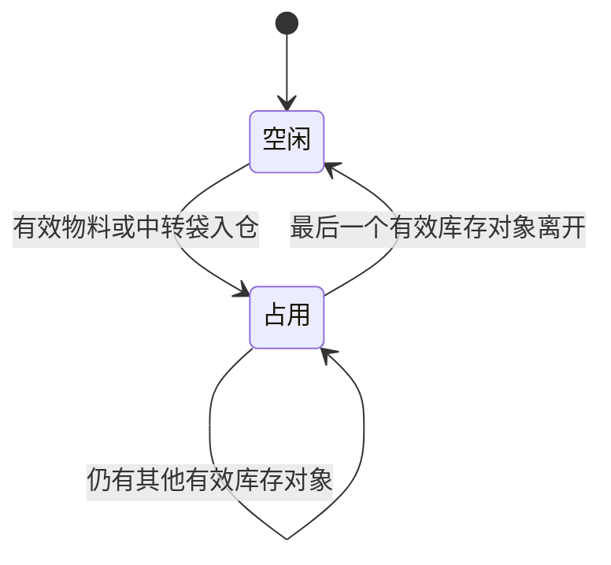

# 裁床待加工仓与待交出仓库位图产品设计

## 1. 文档信息

| 项目 | 内容 |
| --- | --- |
| 文档日期 | 2026-07-30 |
| 适用系统 | FCS / PFOS / 工厂现场仓管端 |
| 涉及业务 | 裁床领料入仓、布料暂存、裁片中转袋入仓、待交出仓暂存、裁片交出 |
| 页面名称 | 待加工仓库位图、待交出仓库位图 |
| 主要角色 | 裁床仓管、待交出仓工人、办公室文员、裁床主管 |
| 设计结论 | 复用现有“仓库—库区—货架—库位”层级，不新增“库位组”；库位图只展示“空闲、占用”两种业务状态 |

## 2. 背景

裁床现场已经维护了部分仓库、库区和库位资料，但当前信息主要以名称、编号和下拉选择的形式存在，无法直观看出：

- 哪些库位当前空闲。
- 哪些库位已经被占用。
- 待加工仓库位由哪个生产单的哪种物料占用。
- 待交出仓库位由哪个生产单的哪些中转袋占用。
- 一批布料需要多个库位时，哪些空闲库位在现场属于连续相邻位置。

现场库位不是一张完整、规则的大网格，而是分散成多个库区；每个库区有若干货架，每个货架有多个库位。现有库位编号可以调整，因此不能依靠编号文本推断物理位置和相邻关系。

本设计通过一次性编排现有库位，形成可持续使用的二维库位图。日常占用状态由真实入仓、领用和交出事实自动生成，不由人员手工切换。

## 3. 设计目标

### 3.1 业务目标

1. 仓管进入页面后能一眼看到全部库区及空闲、占用分布。
2. 占用库位能追溯到具体生产单、物料或中转袋。
3. 布料需要多个库位时，只能选择同一货架内连续相邻的空闲库位。
4. 复用系统已有仓库、库区、货架和库位资料，不重复建立仓库主数据。
5. 库位编号发生修改后，库位在图中的位置和相邻关系不变。
6. 待加工仓和待交出仓使用同一套图形编排方法，但分别读取各自的库存事实。

### 3.2 现场体验目标

- 少读：库位卡片只显示库位编号和必要占用摘要。
- 少选：入仓时只允许点击符合条件的空闲库位。
- 少判断：相邻关系由系统判断，不让员工根据编号自行推测。
- 少填：生产单、物料、中转袋等占用内容由入仓事实自动带入。
- 可追溯：点击占用库位即可查看占用对象和入仓事实。

## 4. 范围与非目标

### 4.1 本次范围

- 待加工仓库位图。
- 待交出仓库位图。
- 现有库区、货架、库位的图形编排。
- 未编排库位的补充编排。
- 空闲、占用两种业务状态。
- 占用对象的简要展示和详情查看。
- 待加工仓连续相邻空闲库位选择。
- 库位编号变更后的稳定布局。

### 4.2 本次不做

- 不做三维仓库或数字孪生。
- 不做真实建筑平面图、通道和人员动线模拟。
- 不做库位热力图、周转率分析或库容利用率分析。
- 不增加“部分占用、预留、冻结、锁定”等页面业务状态。
- 不增加“库位组”层级。
- 不让仓管手工维护库位空闲、占用状态。
- 不把本次设计扩展为全公司的通用 WMS 改造。

## 5. 当前系统基础

当前系统已经具备正式的工厂内部仓库层级：

```text
仓库
└── 库区
    └── 货架
        └── 库位
```

现有能力包括：

- 区分待加工仓和待交出仓。
- 仓库下维护库区列表。
- 库区下维护货架列表。
- 货架下维护库位列表。
- 页面能够按仓库读取库区、货架和库位选项。
- 待交出仓运行时事实已经记录生产单、中转袋、裁片和入仓记录。
- 待加工仓已有生产单、物料和仓内库存事实。

因此，本设计不新建另一套库位主数据，只在现有层级上补足图形显示顺序和占用投影。

## 6. 术语与层级

### 6.1 统一术语

| 术语 | 定义 | 页面表达 |
| --- | --- | --- |
| 待加工仓 | 裁床领取布料后、铺布裁剪前的暂存仓 | 待加工仓库位图 |
| 待交出仓 | 裁片装入中转袋后、交给下游前的暂存仓 | 待交出仓库位图 |
| 库区 | 仓库内一组可识别的物理存放区域，包含若干货架 | 库区 A、库区 B |
| 货架 | 库区内承载多个库位的物理货架或连续存放排 | 货架 A-01 |
| 库位 | 可单独分配和识别的最小存放位置 | A-01-01 |
| 空闲 | 当前没有任何有效库存对象占用该库位 | 空闲 |
| 占用 | 当前至少有一个有效库存对象占用该库位 | 占用 |

### 6.2 不使用“库位组”

现场所说的“一组一组”由现有“库区”承接。

```text
错误层级：
仓库 → 库区 → 库位组 → 货架 → 库位

确认层级：
仓库 → 库区 → 货架 → 库位
```

只有当未来确认一个库区内部还存在多组独立、需要单独管理的物理区域时，才重新评估是否增加层级。本次明确不增加。

## 7. 整体页面结构

### 7.1 页面入口

仓库管理中提供两个清晰入口：

- 待加工仓库位图。
- 待交出仓库位图。

可以采用两个页面，也可以在同一库位图页面通过页签切换，但页面标题和当前仓库必须始终清楚。

### 7.2 页面布局

页面从上到下分为：

1. 页面标题和当前仓库。
2. 空闲、占用图例。
3. 库位总数、空闲数、占用数。
4. 按库区排列的库区卡片。
5. 库区卡片内按货架分行展示库位。

示意：

```text
待加工仓库位图
空闲 11 个｜占用 7 个

┌─ 库区 A ─────────────────────┐
│ 货架 A-01  [01][02][03][04]  │
│ 货架 A-02  [05][06][07]      │
└──────────────────────────────┘

┌─ 库区 B ─────────────────────┐
│ 货架 B-01  [01][02][03][04]  │
└──────────────────────────────┘
```

### 7.3 库区卡片排列

- 库区卡片按已保存的库区显示顺序排列。
- 页面宽度充足时可多列展示；宽度不足时自动变成单列。
- 库区在真实现场可以彼此分散，页面不要求还原精确平面坐标。
- 每张库区卡片内部必须完整显示其货架关系。

### 7.4 货架和库位排列

- 货架在库区内按货架显示顺序纵向排列。
- 同一货架内的库位必须保持单行、连续展示。
- 同一货架库位较多时，只允许货架行内部横向滚动，不让整个页面横向溢出。
- 库位不能因为页面换行而造成虚假的上下相邻关系。

## 8. 库位图编排

### 8.1 编排角色

| 角色 | 权限 |
| --- | --- |
| 裁床主管或仓库主管 | 进入库位图编排，调整库区、货架和库位顺序 |
| 办公室文员 | 可协助首次编排和修改编号 |
| 一线仓管 | 只查看库位图和执行入仓选位，不进入编排模式 |

### 8.2 首次生成

系统按现有仓库资料自动生成初始库位图：

1. 按仓库读取现有库区。
2. 按库区读取现有货架。
3. 按货架读取现有库位。
4. 已有顺序时沿用现有顺序。
5. 没有明确顺序时，先按当前编号生成临时顺序。
6. 缺少货架归属或顺序的库位进入“未编排库位”区域。

编号排序只用于首次生成，保存编排后不再用编号实时重排。

### 8.3 编排动作

编排模式只提供以下必要动作：

- 调整库区显示顺序。
- 调整库区内的货架顺序。
- 调整同一货架内的库位顺序。
- 把未编排库位放入指定货架。
- 为缺少货架的现有库位补充货架归属。
- 修改库区、货架、库位显示名称或编号。
- 保存编排。

### 8.4 编排保存结果

保存后形成稳定的图形关系：

```text
仓库
├── 库区显示顺序
│   └── 货架显示顺序
│       └── 库位显示顺序
```

编排关系只负责“画在哪里”，不负责“里面放了什么”。

## 9. 编号与物理位置分离

### 9.1 核心原则

库位编号是现场显示标识，库位 ID 和编排顺序才是稳定身份。

```text
稳定关系：
库位 ID → 所属仓库 → 所属库区 → 所属货架 → 库位顺序

可变信息：
库位编号、库位名称
```

### 9.2 编号修改规则

- 修改库位编号后，原库位 ID 不变。
- 所属库区、货架和库位顺序不变。
- 当前占用事实仍然关联原库位 ID。
- 历史记录可以展示修改后的当前编号，同时保留可追溯身份。
- 不允许因为编号变化自动重新排序。

## 10. 空闲与占用状态

### 10.1 页面只展示两个状态

| 状态 | 判定 | 可执行动作 |
| --- | --- | --- |
| 空闲 | 当前没有有效库存对象占用 | 可以选择存放 |
| 占用 | 当前至少有一个有效库存对象占用 | 只能查看占用详情 |

“本次已选”只是当前操作的选中效果，不作为第三种业务状态保存，也不进入状态图例。

### 10.2 主数据停用的处理

系统内部可以保留库位“可用、停用”等主数据状态，但停用库位不进入日常库位图，也不参与空闲数和占用数统计。

这样可以保证日常页面始终只有“空闲、占用”两个状态。

### 10.3 状态自动变化



页面不提供“设为空闲”“设为占用”按钮。

## 11. 待加工仓库位图

### 11.1 占用对象

待加工仓库位的占用对象是进入裁床待加工仓、尚未领出加工的物料。

占用事实至少能关联：

- 生产单。
- 裁床单或相关裁床任务。
- 物料。
- 颜色或规格。
- 入仓数量和单位。
- 入仓人。
- 入仓时间。

### 11.2 库位卡片展示

空闲库位：

```text
A-01-01
空闲
```

占用库位：

```text
A-01-02
PO15371
面料
```

库位卡片不堆叠全部物料字段。点击占用库位后，在轻量浮层或右侧详情中展示完整占用明细。

### 11.3 一个库位存在多条物料

只要库位内仍存在一条有效物料库存，该库位就显示为占用。

页面卡片显示：

```text
A-01-02
PO15371 等
2 种物料
```

点击后展示全部占用物料。只有最后一条物料领出或移出后，库位才恢复为空闲。

## 12. 待交出仓库位图

### 12.1 占用对象

待交出仓库位的占用对象是已完成入仓、尚未交出的中转袋。

占用事实至少能关联：

- 生产单。
- 中转袋号。
- 袋内菲票。
- 裁片数量。
- 入仓人。
- 入仓时间。

### 12.2 库位卡片展示

空闲库位：

```text
B-01-01
空闲
```

占用库位：

```text
B-01-02
PO15371
袋 BAG-008
```

一个库位存放多个中转袋时，卡片显示生产单摘要和袋数，点击后查看完整中转袋列表。

### 12.3 交出后的变化

- 中转袋完成交出后，从原库位占用明细移除。
- 原库位还有其他中转袋时仍为占用。
- 原库位没有任何有效中转袋时自动变为空闲。
- 特种工艺回仓的中转袋重新入仓后，按新的库区和库位恢复占用。

## 13. 连续相邻库位选择

### 13.1 使用场景

裁床领取布料并存放到待加工仓时，一批物料可能需要多个库位。仓管可以一次选择多个空闲库位，但必须连续相邻。

### 13.2 相邻判定

两个库位同时满足以下条件才算相邻：

1. 属于同一个待加工仓。
2. 属于同一个库区。
3. 属于同一个货架。
4. 在货架中的库位顺序连续。

库位编号不参与相邻判断。

### 13.3 示例

货架 A-01 的稳定顺序为：

```text
A-01-01 → A-01-03 → A-01-08 → A-01-09
```

即使编号不连续，仍以已保存顺序判断：

- 选择 `A-01-01、A-01-03`：允许。
- 选择 `A-01-01、A-01-08`：不允许，中间隔了一个库位。
- 选择 `A-01-08、A-01-09`：允许。
- 选择货架 A-01 和货架 A-02 的库位：不允许。
- 选择库区 A 和库区 B 的库位：不允许。

### 13.4 页面交互

1. 用户点击第一个空闲库位。
2. 系统只保留同一货架内可形成连续区间的空闲库位可选。
3. 不符合条件的其他库位不可继续选择。
4. 页面显示“已选 N 个库位”。
5. 用户确认存放后生成入仓事实。
6. 这些库位自动变为占用。

错误提示：

> 请选择同一货架内连续相邻的空闲库位。

## 14. 占用详情

### 14.1 点击行为

- 点击空闲库位：在入仓选位场景中选择该库位；在普通查看场景中不展开空详情。
- 点击占用库位：打开占用详情。

### 14.2 待加工仓占用详情

必须展示：

- 库区、货架、库位。
- 生产单号。
- 物料名称或物料 SKU。
- 颜色、规格。
- 在库数量和单位。
- 入仓人、入仓时间。

### 14.3 待交出仓占用详情

必须展示：

- 库区、货架、库位。
- 生产单号。
- 中转袋号。
- 袋内裁片数量。
- 入仓人、入仓时间。

详情只用于查看事实，不在详情内手工修改占用状态。

## 15. 数据来源与投影

### 15.1 主数据

库位图结构读取：

- 仓库。
- 库区。
- 货架。
- 库位。
- 各层显示顺序。

### 15.2 待加工仓占用投影

```text
有效待加工仓物料库存
→ 按库位归集
→ 库位内有效库存数量大于 0
→ 占用
```

### 15.3 待交出仓占用投影

```text
有效待交出仓中转袋库存
→ 按库位归集
→ 库位内有效中转袋数量大于 0
→ 占用
```

### 15.4 统一原则

- Web、PDA 和库位图必须读取同一份库存事实。
- 库位图不建立独立的手工占用台账。
- 入仓、领用、移位、交出和回仓动作改变事实后，库位图自动更新。
- 历史已离仓记录不参与当前占用计算。

## 16. 最小信息补充

现有仓库模型已经具有仓库、库区、货架和库位层级。本次只需要确保以下信息完整：

| 信息 | 用途 |
| --- | --- |
| 库区显示顺序 | 决定库区卡片顺序 |
| 货架显示顺序 | 决定库区内货架顺序 |
| 库位显示顺序 | 决定同一货架内库位顺序及相邻关系 |
| 库位稳定 ID | 编号变更后仍保持身份、占用和历史关联 |

如现有部分库位缺少货架归属，则在编排模式中补充所属货架，不重建库位。

## 17. 异常与兜底

### 17.1 库位未编排

- 未绑定货架或没有库位顺序的库位进入“未编排库位”。
- 未编排库位不出现在正式库位图中。
- 主管或文员完成编排后才可用于入仓选位。

### 17.2 库位存在库存但主数据缺失

- 页面在库位图顶部提示“存在未定位库存”。
- 展示生产单、物料或中转袋摘要。
- 不把该库存错误归入任意空闲库位。
- 由主管补充实际库位后再进入正式库位图。

### 17.3 编排调整时库位已占用

- 允许调整显示顺序和修改编号，不改变占用事实。
- 不允许把已占用库位删除。
- 如需停用，必须先完成库存转移；停用后从日常库位图移除。

### 17.4 重复操作

- 同一入仓事实不能重复占用库位。
- 同一中转袋不能同时占用两个不同库位。
- 同一批物料选择多个库位时，系统保存一次入仓动作和多个库位关联。

## 18. 页面防错

- 占用库位不可被选择为新存放库位。
- 不相邻库位不可同时确认。
- 跨库区、跨货架不可连续选择。
- 库位编号变化不触发重新排序。
- 未编排库位不可用于入仓。
- 没有真实库存事实时不得显示为占用。
- 库存尚未全部离开时不得显示为空闲。
- 一线页面不展示内部英文状态码。

## 19. 业务场景

### 19.1 场景一：现有库位首次成图

裁床主管进入待加工仓库位图编排。系统自动读取已有库区、货架和库位，将结构完整的库位生成初始图，将缺少货架归属的库位放入“未编排库位”。主管把未编排库位放到正确货架，调整库位顺序并保存。

结果：

- 现有库位资料被直接复用。
- 不需要重新建库位。
- 保存后的顺序成为相邻判断依据。

### 19.2 场景二：布料占用多个相邻库位

仓管领取生产单 `PO15371` 的面料，需要 3 个库位。仓管在货架 A-01 选择第一个空闲库位后，系统只允许继续选择同一货架内能够组成连续区间的空闲库位。

结果：

- 确认后 3 个库位均显示为占用。
- 3 个库位点击后都能追溯到 `PO15371` 和对应面料。
- 不允许跨货架拼成 3 个库位。

### 19.3 场景三：查看待加工仓占用

主管打开待加工仓库位图，看到库区 A 的两个库位被 `PO15371` 面料占用。点击其中一个库位后查看物料、颜色、数量、入仓人和入仓时间。

### 19.4 场景四：中转袋进入待交出仓

裁片装袋完成后，中转袋 `BAG-008` 入待交出仓并选择库区 B、货架 B-01、库位 B-01-02。

结果：

- B-01-02 显示为占用。
- 卡片显示 `PO15371` 和 `BAG-008`。
- 点击后可查看袋内裁片数量。

### 19.5 场景五：中转袋交出后释放库位

`BAG-008` 完成交出。如果 B-01-02 没有其他有效中转袋，系统自动将该库位变为空闲；如果仍有其他袋，则继续显示占用。

### 19.6 场景六：修改库位编号

主管将库位 `A-01-02` 改名为 `面料-A-02`。

结果：

- 图中位置不变。
- 左右相邻关系不变。
- 原占用物料不丢失。
- 后续页面显示新编号。

## 20. 验收标准

### 20.1 层级与编排

1. 页面只使用“仓库—库区—货架—库位”层级。
2. 页面不出现“库位组”。
3. 系统能用现有库区、货架和库位生成初始库位图。
4. 未编排库位能被识别并进入单独区域。
5. 保存后库区、货架和库位顺序稳定。
6. 修改库位编号不会改变图中位置。

### 20.2 状态

7. 日常库位图只显示“空闲、占用”两种业务状态。
8. 停用库位不进入日常库位图。
9. 有有效库存对象时库位显示为占用。
10. 最后一个有效库存对象离开后库位自动显示为空闲。
11. 页面不提供手工切换占用状态的按钮。

### 20.3 待加工仓

12. 占用库位能展示生产单和物料摘要。
13. 点击占用库位能查看完整物料占用明细。
14. 可以选择多个空闲库位存放同一批物料。
15. 多选库位必须属于同一库区、同一货架且顺序连续。
16. 库位编号不参与相邻判断。

### 20.4 待交出仓

17. 占用库位能展示生产单和中转袋摘要。
18. 点击占用库位能查看中转袋明细。
19. 中转袋交出后能正确释放库位。
20. 特种工艺回仓后能按新的库位恢复占用。

### 20.5 现场可用性

21. 1366 × 768 分辨率下页面主体不产生横向溢出。
22. 1280 × 720 分辨率下能完成查看和选择。
23. 同一货架库位过多时，仅货架行内部横向滚动。
24. 一线员工无需根据编号计算相邻关系。
25. 页面文案全部使用中文业务语言。

## 21. 设计自检

| 检查项 | 结论 | 说明 |
| --- | --- | --- |
| 角色匹配 | 通过 | 编排由主管或文员完成，一线仓管只看图和选位 |
| 任务清晰度 | 通过 | 日常页面只回答哪里空闲、哪里占用、被什么占用 |
| 信息架构 | 通过 | 统一使用仓库、库区、货架、库位，不增加重复层级 |
| 页面模式 | 通过 | 管理端使用分组卡片，入仓操作突出选位主动作 |
| 信息负荷 | 通过 | 库位卡片只显示编号和占用摘要，完整信息进入详情 |
| 数量与状态 | 通过 | 仅空闲、占用两个业务状态，数量由系统汇总 |
| 扫码与识别 | 有条件通过 | 本文聚焦库位图，具体扫码入口沿用现有入仓流程 |
| 防错 | 通过 | 占用不可选、跨货架不可多选、相邻关系由稳定顺序判断 |
| 协作关系 | 通过 | 占用详情保留生产单、物料或中转袋及入仓责任事实 |
| 异常与追溯 | 通过 | 未编排、未定位、已占用调整均有明确处理 |
| 现场设备可用性 | 通过 | 支持低分辨率，避免整页横向溢出 |

最终结论：**通过，可进入规格审查。**

本设计的唯一条件项是：库位图本身不重新设计 PDA 扫码入口；进入实现计划时，需要核对现有领料入仓和中转袋入仓页面如何调用库位图选位能力。
