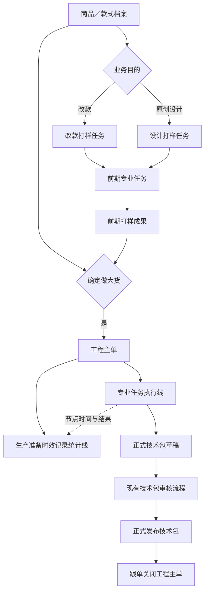
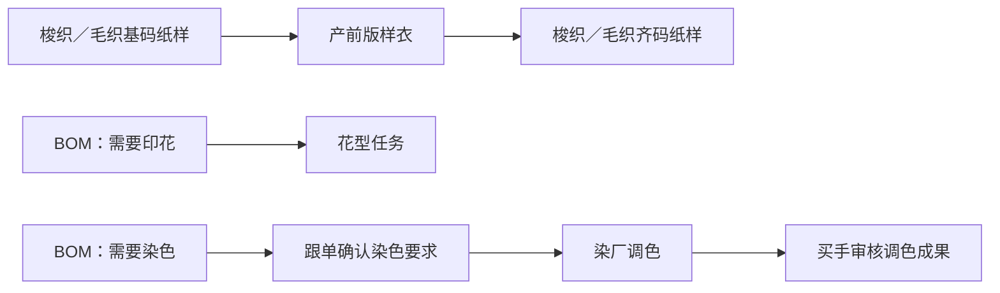

# PCS 生产工程管理总体设计

## 1. 文档信息

| 项目 | 内容 |
| --- | --- |
| 文档版本 | V1.1 |
| 设计日期 | 2026-07-30 |
| 适用系统 | PCS 商品中心系统、FCS 生产准备时效、采购管理系统 |
| 当前实施重点 | PCS 生产工程管理 |
| 后续顺序 | 物料／商品档案 → 商品测款 |
| 暂缓范围 | 样衣管理模块 |
| 设计依据 | 已确认的制版、改款、花型、调色业务规则，当前技术包列表，现有生产准备时效规则及本轮业务确认 |

## 2. 设计结论

1. PCS 商品中心分为商品测款、生产工程、物料／商品档案、样衣管理四个大模块。
2. 当前优先完成并上线生产工程，再实现物料／商品档案，最后实现商品测款；样衣管理暂缓。
3. 生产工程以“独立前期打样 + 工程主单 + 专业任务 + 技术资料”组织，不再使用商品项目工作项、工作项库和工作项模板。
4. 改款、设计等前期打样可以独立创建专业任务；只有确定要做大货时，才创建工程主单。
5. 生产准备时效不是任务执行入口，只读取工程主单及其专业任务的节点时间、状态和成果。
6. 工程主单必须覆盖当前生产准备时效全部准备项，依赖结构沿用已经与业务确认的固定规则，不允许人工调整。
7. BOM 与价格是工程资料的一部分，贯穿前期打样、工程主单和技术包；技术包生效时形成正式快照。
8. 不允许绕过工程主单直接新增技术包，也不提供技术包导入、转换入口。
9. 技术包继续沿用当前审核流程，正式发布后才能作为工程主单关闭依据。
10. 只有首次做大货的款式进入生产准备时效；已经正式生产过的款式再次做货，不再创建工程主单和生产准备时效记录。
11. 工程主单生成的生产准备时效记录从上线首日起即为只读，所有执行事实只来源于工程主单及其专业任务。
12. 工程主单与专业任务只从本设计规定的业务入口创建，不提供任务导入、转换或兼容入口。

## 3. 业务对象与关系



### 3.1 商品／款式档案

- 是前期打样和工程主单的基础业务对象。
- 没有商品／款式档案，不能创建改款打样、设计打样或工程主单。
- 业务人员先人工创建档案，首版不从商品测款自动触发。

### 3.2 改款打样任务

- 用于基于已有款式进行修改并制作直播间销售展示样衣。
- 必须同时选择“基于款式 SPU”和“目标款式 SPU”。
- 两个 SPU 必须提前存在，且不能是同一个 SPU。
- 专业任务和成果归属于目标 SPU。
- 后续达到做大货要求时，工程主单关联目标 SPU，并可选择复用改款成果。

### 3.3 设计打样任务

- 用于原创设计并制作直播间销售展示样衣。
- 必须提前存在目标商品／款式档案。
- 只关联目标 SPU；如果存在明确来源 SPU，应归为改款打样。
- 可关联或创建制版、样衣、花型、调色等专业任务。

### 3.4 工程主单

- 只服务于确定要做大货的款式。
- 同一款式只允许存在一张未关闭的工程主单。
- 工程主单内承载本次做大货所需全部专业任务、固定依赖、任务成果、BOM 与价格、技术包及关闭门禁。
- 已有前期打样成果可作为工程主单输入，但由业务人员逐项选择“复用、重新执行或不采用”。
- 复用成果满足对应依赖门禁，不虚构新的执行任务和时效。

### 3.5 专业任务

专业任务是实际执行载体，来源只能是：

- 工程主单。
- 改款打样任务。
- 设计打样任务。
- 工程主单关闭后的独立工程变更任务。

专业任务列表必须展示来源类型和来源单号，不能再依赖通用工作项节点表达任务事实。

### 3.6 首次工程准备

- 首次工程准备属于款式级事实，判断依据是该 SPU 此前从未形成过正式生产。
- 首次工程准备完成后，该款式再次做货属于生产复单，不再进入本模块。
- 工程主单未关闭前发生补任务或返工，必须在原主单及原专业任务内完成。
- 工程主单关闭后的修改通过独立工程变更任务处理，不重新创建首次工程准备主单。

## 4. 菜单结构

```text
生产工程管理
├─ 工程主单
├─ 我的工程任务
└─ 专业任务
   ├─ 制版任务
   ├─ 产前版样衣任务
   ├─ 花型任务
   ├─ 调色任务
   ├─ 辅料下单任务
   └─ 技术包确认任务

前期打样
├─ 改款打样任务
└─ 设计打样任务

技术资料
├─ 技术包
├─ 花型库
└─ 部件模板库
```

说明：

- 部件模板库属于技术资料，不属于已删除的工作项模板体系。
- 部件模板库维护领型、袖型、口袋等可复用标准部件，至少包含名称、图片、纸样文件、适用品类和版本。
- 部件模板由版师团队维护，制版任务可引用；正式技术包发布时固化所引用的模板版本，模板后续修改不影响已发布技术包。
- 技术包列表参考当前线上技术包列表的信息结构、筛选项和版本展示方式。
- 技术包列表不提供直接新增入口。

## 5. 工程主单创建与发布

### 5.1 创建条件

- 已存在商品／款式档案。
- 当前款式不存在其他未关闭工程主单。
- 业务已确认该款式需要做大货。
- 已选择跟单负责人。
- 工程主单由跟单人工创建，不根据销量或测款状态自动创建。
- 系统必须校验目标 SPU 从未形成过正式生产；已正式生产过的款式禁止创建工程主单。

### 5.2 前期成果带入

创建主单时，系统展示目标 SPU 最近的前期打样及专业任务成果：

- 基码纸样。
- 版衣／销售展示样衣。
- 花型成果。
- 调色成果。
- BOM 与价格草稿。
- 其他已完成且已确认的技术资料。

每项成果由业务人员选择：

- 复用：作为工程主单输入，不重复生成同类已完成任务。
- 重新执行：生成新的专业任务。
- 不采用：不作为本次工程输入。

### 5.3 准备任务确认

- 系统根据款式类型、BOM、工艺需求和固定规则推荐准备任务。
- 跟单确认本次适用任务。
- 依赖结构本身不允许修改。
- 选择后续任务时，系统自动补齐缺失的前置任务。
- 主单发布时一次性生成完整任务骨架，后续不得另起一套同类型任务结构。
- 花型、调色等条件任务也在任务骨架中生成；条件未满足时显示“未启用”。
- BOM 明确需要印花或染色后，系统启用任务骨架中既有的花型／调色任务并加入对应物料行，跟单不能删除。
- 前置未满足的任务仍显示，但处于锁定状态，不能执行。

## 6. 生产准备项与专业任务映射

当前生产准备时效的 11 个准备项必须全部由工程主单任务覆盖。

| 生产准备时效准备项 | PCS 执行载体 | 任务完成口径 |
| --- | --- | --- |
| 梭织基码纸样 | 制版任务：梭织基码 | 版师提交纸样成果 |
| 毛织基码纸样 | 制版任务：毛织基码 | 毛织团队提交纸样成果 |
| 版衣制作 | 产前版样衣任务 | 制作团队提交版衣成果 |
| 梭织齐码纸样 | 制版任务：梭织齐码 | 版师提交纸样成果 |
| 毛织齐码纸样 | 制版任务：毛织齐码 | 毛织团队提交纸样成果 |
| 数码印／DTF／DTG 花型 | 花型任务 | 买手审核全部花型物料通过 |
| 确认染色要求（纱线） | 调色任务（纱线）阶段节点 | 跟单完成纱线颜色要求确认 |
| 染色调色（纱线） | 调色任务（纱线）阶段节点 | 买手审核全部纱线调色成果通过 |
| 确认染色要求（面料） | 调色任务（面料）阶段节点 | 跟单完成面料颜色要求确认 |
| 染色调色（面料） | 调色任务（面料）阶段节点 | 买手审核全部面料调色成果通过 |
| 辅料下单 | 辅料下单任务 | 绑定有效采购单并读取实际下单时间 |

### 6.1 固定依赖



- 梭织与毛织基码可按款式情况并行。
- 产前版样衣等待本款所需全部基码纸样完成。
- 梭织与毛织齐码纸样可在产前版样衣完成后并行。
- 确认染色要求必须先于对应纱线／面料调色。
- 花型、调色、辅料下单可按固定业务结构与纸样链并行。
- 页面不提供增加、删除或拖拽依赖关系的操作。

## 7. 专业任务规则

### 7.0 统一状态

专业任务统一使用以下状态：

```text
未启用 → 待前置 → 待开始 → 进行中 → 待审核 → 已完成
                            ↑          ↓
                            └── 返工中 ┘

任一未完成状态 ──BOM 移除对应需求──→ 因需求变更结束
```

- “待审核”只适用于花型任务和调色任务；制版及产前版样衣由制作团队提交完成即结束。
- 不设置人工暂停、人工取消和异常状态，也不建设异常处理流程。
- 前置依赖未满足时显示“待前置”，满足后自动转为“待开始”。
- 任务开始后按自然时间连续记录；超过目标时间只显示逾期风险，不改变任务业务状态。

### 7.1 制版任务

任务类型：

- 梭织基码纸样。
- 毛织基码纸样。
- 梭织齐码纸样。
- 毛织齐码纸样。

规则：

- 制版任务本身不设置审核。
- 执行团队提交成果即完成任务。
- 基码完成后解锁产前版样衣。
- 产前版样衣完成后解锁齐码纸样。
- 齐码纸样进入技术包，由技术包现有审核流程统一审核。
- 技术包审核发现纸样问题时，原制版任务新增返工轮次，不创建重复任务。
- 生产准备时效记录专业团队实际提交时间，不等待技术包审核。

### 7.2 产前版样衣任务

- 由制作团队执行。
- 制作团队提交版衣成果后即完成，不另设业务审核。
- 本阶段只记录任务成果图片、制作数量和提交时间。
- 本阶段不生成样衣唯一码，不管理样衣库存、借用流转或退回。
- 完成后解锁齐码纸样。
- 后续发现问题时，在原任务中追加返工轮次。
- 产前版样衣与改款／设计阶段的直播销售展示样衣必须通过来源和用途明确区分。

### 7.3 花型任务

来源：

- BOM 中买手维护的“是否需要印花”及基础印花要求。
- 工程主单或前期打样任务。

执行流程：


审核规则：

- 整张任务一次提交、一次审核。
- 买手逐个物料标记“通过／未通过”。
- 未通过项必须填写原因。
- 存在任一未通过项，任务整体退回修改。
- 下一轮只修改未通过项；已通过项保留结论并锁定。
- 所有物料通过后任务才完成，并写入生产准备时效完成时间。
- 审核通过的每个物料成果分别生成一条花型资产并进入花型库，不能只生成一条整单资产。
- 每条花型资产至少保存成果文件、效果图、物料 SKU、商品颜色、印花工艺和来源任务。
- 每轮保留成果文件、效果图、提交时间、审核人、审核意见和审核时间。

### 7.4 调色任务

实际大货批量染色不属于 PCS。PCS 调色任务只负责产前颜色要求确认和调色成果。

按物料类型生成两张任务：

- 调色任务（纱线）。
- 调色任务（面料）。

每张调色任务包含三个阶段：

1. 系统从 BOM 自动带入买手标记为“需要染色”的物料。
2. 跟单逐项维护潘通色卡色号、颜色名称等具体染色要求。
3. 染厂执行产前调色并提交成果，买手审核。

每个调色物料行至少记录：

- 物料 SKU、物料类型和商品颜色。
- 潘通色卡色号、颜色名称和染色色号。
- 染厂、提交人、成果照片／色卡和提交时间。
- 买手逐项审核结论、不通过原因、审核人和审核时间。

节点回写：

- 跟单完成第二阶段时，回写“确认染色要求（纱线／面料）”完成时间。
- 买手最终审核全部通过时，回写“染色调色（纱线／面料）”完成时间。

审核与返工：

- 与花型任务统一采用整单审核、逐项判定。
- 未通过项必须填写原因。
- 染厂只重新处理未通过物料。
- 已通过项保留并锁定。
- 所有物料通过后任务才完成。
- 每轮保留成果照片、色卡、提交时间、审核意见和审核时间。

### 7.5 辅料下单任务

- 采购人员仍在采购管理系统完成下单。
- PCS 不复制采购下单页面。
- 采购人员在辅料下单任务中直接绑定采购单号。
- 一张辅料下单任务可以绑定多个采购单号。
- 系统通过采购单号读取供应商、物料、数量、下单状态、下单时间等必要信息。
- 无效采购单号不能绑定。
- 系统按 BOM 中应采购的辅料逐项校验采购单覆盖关系；存在未被采购单覆盖的辅料时，任务不能完成。
- 每张有效采购单都必须具有采购系统回传的实际下单时间。
- 全部辅料均已覆盖后，任务完成时间取所有有效采购单实际下单时间中的最晚时间。
- 不增加审批流，不要求采购人员在多个系统重复录入采购信息。

### 7.6 技术包确认任务

- 必须由跟单负责。
- 汇总工程主单内全部有效成果和 BOM 与价格。
- 状态反映技术包“草稿、审核中、待发布、已发布”。
- 任务只在技术包正式发布后完成。
- 技术包审核和发布不在专业任务中复制一套审核按钮。

## 8. BOM 与价格

### 8.1 页面名称与阶段

- 前期打样和工程主单统一使用“BOM 与价格”。
- 前期打样及工程执行阶段显示为草稿。
- 技术包正式生效后形成正式版本。
- 技术包中的 BOM 是同一份 BOM 的正式快照，不是另一套独立 BOM。

### 8.2 权限

- 只有买手可以新增、修改、删除 BOM 物料和自定义成本项。
- 只有买手可以选择或切换历史物料方案。
- 其他角色只读；发现问题时线下联系买手，不增加系统问题提报流程。
- 买手不能修改物料档案的标准单价。

### 8.3 BOM 结构

BOM 按“SPU + 商品颜色”分组，同一颜色下适用于全部尺码 SKU。

每个物料行至少包含：

- 序号。
- 物料类型。
- 物料编码。
- 物料名称。
- 物料图片。
- 规格。
- 单位用量。
- 单位。
- 损耗率。
- 打样数量。
- 本次总需求量。
- 是否需要印花及印花要求。
- 是否需要染色及染色要求。
- 缩率要求。
- 水溶要求。
- 印花正反面、正面花型、里布花型。
- 适用 SKU、关联花型和工艺编码等现有技术包工艺字段。
- 物料档案标准单价。
- 物料成本小计。

计算口径：

`本次总需求量 = 单位用量 × 打样数量 ×（1 + 损耗率）`

物料标准成本按当前有效标准单价、单位用量及损耗计算；首版不允许在 BOM 中覆盖物料标准单价。

工艺联动：

- “需要印花”启用花型任务并带入对应物料行。
- “需要染色”启用对应物料类型的调色任务并带入对应物料行。
- 水溶及其他保留工艺要求进入技术包工艺资料，本阶段不额外生成专业任务或生产准备时效准备项。

### 8.4 标准单价

- BOM 使用的标准单价只取物料 SKU 档案中的成本价，不包含运费。
- 标准单价货币为人民币，单价保留 4 位小数，物料成本小计及人民币汇总保留 2 位小数。
- BOM 用量单位与物料档案计价单位不一致时，必须使用物料档案中已经维护的单位换算关系。
- 物料档案不存在适用换算关系时禁止加入 BOM，并提示先维护物料单位换算；买手不能在 BOM 内新增或修改换算关系。
- 草稿阶段直接读取物料档案最新有效标准单价，不形成价格快照，也不提供“同步最新价格”按钮。
- 物料没有标准单价时禁止加入 BOM，并提示：

> 该物料暂无标准单价，无法加入。请先维护该物料的标准单价。

- 已加入物料的标准单价失效时，该行立即标记“标准单价失效”。
- 存在标准单价失效物料时，禁止提交技术包审核。
- 买手必须等待物料档案恢复有效价格，或替换物料。
- 技术包审核期间、正式发布前，草稿仍读取物料档案最新有效标准单价。
- 审核期间标准单价发生变化时，页面必须展示变更前后差异，并仅使买手对“BOM 与价格”的审核结论失效；版师等未受影响模块的审核结论继续有效。
- 技术包正式生效时，才对 BOM、标准单价和成本结果形成版本快照。

### 8.5 币种、汇率与综合成本

- 物料标准成本统一使用人民币。
- 自定义成本项统一使用印尼盾。
- 汇率由系统配置统一维护，BOM 与价格页面只读展示，不提供维护入口。
- 草稿始终使用系统配置中的最新汇率，不处理汇率变化、差异提醒或重新审核。
- 汇率展示方向统一为：`1 CNY = X IDR`。
- 综合成本必须同时展示人民币物料成本、印尼盾自定义费用、当前汇率、人民币综合成本和印尼盾综合成本。
- 人民币金额保留 2 位小数；印尼盾金额按整数展示。
- 人民币综合成本计算公式：`人民币物料成本 + 印尼盾自定义费用 ÷ 汇率`。
- 印尼盾综合成本计算公式：`人民币物料成本 × 汇率 + 印尼盾自定义费用`。
- 汇率、两种原币金额和两种换算结果均在正式技术包发布时形成快照。

### 8.6 自定义成本项

- 买手可以维护车位费、印花费等自定义成本项。
- 自定义成本项统一作用于整个 SPU，不拆到单个尺码。
- 自定义成本项以印尼盾录入，并与人民币物料成本共同进入“BOM 与价格”综合成本。
- 正式技术包生效时形成快照并锁定。

### 8.7 物料方案复用

- 系统推荐目标 SPU 最近一份“已完成且已确认”的物料方案。
- 买手可以改选其他已完成版本。
- 复制物料方案时只复制 BOM 结构和工艺要求。
- 草稿中的标准单价始终读取当前物料档案最新有效值。

## 9. BOM 变更与专业任务联动

### 9.1 新增印花／染色需求

- BOM 新增印花或染色物料时，系统启用任务骨架中既有的花型／调色任务，并自动加入对应物料行。
- 同一工程主单内不得再创建第二张同类型任务；任务已经完成时，在原任务中新增“需求变更轮次”。
- 原已通过成果保持不变，只处理新增物料。
- 未启用任务转为“待前置”或“待开始”；已完成任务进入“返工中”。
- 生产准备时效保留首次完成时间，并将当前有效完成时间更新为新增物料最终通过时间。

### 9.2 删除印花／染色需求

按受影响物料行处理，不提供人工取消任务：

| 当前情况 | 处理方式 |
| --- | --- |
| 未启用、待前置或待开始 | 受影响物料行标记“因需求变更结束”，不参与完成门禁 |
| 进行中、未提交 | 受影响物料行标记“因需求变更结束”，保留开始时间、耗时和已填写内容 |
| 已提交、待审核 | 保留成果并将受影响物料行标记“因需求变更结束”，不再审核，不进入正式成果库 |
| 已审核通过 | 保留审核和成果记录，成果标记“当前款式已停用”，新技术包不再引用 |

补充规则：

- 任务还有其他有效物料时继续执行。
- 所有物料均不再需要时，任务状态为“因需求变更结束”，不是人工取消。
- 生产准备时效区分“正常完成”和“因需求变更结束”，不产生异常状态。
- 所有变更必须记录 BOM 变更人、变更时间、原要求和新要求。

### 9.3 正式技术包生效后

- BOM 与价格正式版本锁定。
- 不允许在原工程主单中直接修改正式 BOM。
- 后续修改通过独立工程变更任务产生新技术包版本。

## 10. 技术包

### 10.1 创建边界

- 不允许绕过工程主单直接新增技术包。
- 技术包新版本只能由工程主单或工程变更任务汇总生成。
- 不提供技术包导入、转换或人工绑定工程主单的功能。
- 已正式发布的技术包继续在当前技术包列表中查询和查看，不改变其展示方式。
- 技术包列表参考当前线上页面，保留技术包 ID、商品信息、状态、版本、完整度、做货难度、跟单、版师、关联生产单和创建时间等核心信息。

### 10.2 审核流程

继续使用当前技术包审核流程：


- 审核退回按当前模块化退回和重新审核规则执行。
- 正式发布前不形成正式 BOM 与价格快照。
- 正式发布后，技术包确认任务完成。

#### 10.2.1 技术包模块范围

继续保留当前技术包的完整模块，不因工程主单接入而删减：

1. BOM。
2. 价格。
3. 纸样。
4. 物料花型关联。
5. 颜色物料映射。
6. 工艺。
7. 尺码。
8. 设计。
9. 附件。
10. 质量。

其中 BOM 与价格在工程执行阶段作为同一份“BOM 与价格”业务资料维护，但进入技术包审核时仍映射到既有 BOM 和价格审核模块。

#### 10.2.2 审核退回与专业任务返工

- 技术包审核发现纸样、花型或调色成果需要修改时，重新打开原专业任务并新增返工轮次，不创建重复任务。
- 只使被退回内容及其对应技术包审核模块失效，未受影响模块的审核结论继续有效。
- 返工专业任务再次满足完成条件后，回到原技术包版本继续审核，不另建技术包草稿。
- 生产准备时效保留该任务首次完成时间，并将当前有效完成时间更新为本轮返工再次完成时间。

### 10.3 工程主单关闭

关闭门禁：

- 主单内所有有效专业任务已完成，或已按需求变更规则结束。
- 固定依赖已满足。
- 正式技术包版本已经生成并生效。
- 技术包中的 BOM 与价格正式快照有效。
- 系统校验全部通过。

以下内容属于主单关闭后的生产衔接结果，不作为工程主单关闭门禁：

- 生产需求单。
- 生产单。
- 印花加工单、染色加工单等正式生产加工单。
- 其他由正式技术包驱动的生产产出。

关闭动作：

- 由跟单人工关闭工程主单。
- 系统不自动关闭。
- 已关闭主单不能重新打开。

## 11. 状态与变更

### 11.1 工程主单状态

```text
草稿 → 已发布 → 进行中 → 技术包审核中 → 待关闭 → 已关闭
                                      ↘ 已终止
```

- 草稿：尚未一次性生成专业任务。
- 已发布：任务已生成，等待执行。
- 进行中：至少一项专业任务正在执行或返工。
- 技术包审核中：技术包已提交现有审核流程。
- 待关闭：正式技术包已发布，系统关闭校验通过。
- 已关闭：跟单已人工关闭。
- 已终止：款式确定不再做大货，整张主单终止。

### 11.2 主单终止

- 不增加审批流。
- 跟单填写终止原因并二次确认。
- 不允许单独人工取消专业任务。
- 终止后保留全部任务、成果、耗时和操作记录。

### 11.3 主单关闭后的修改

- 已关闭主单不能重新打开。
- 新修改通过独立工程变更任务处理。
- 工程变更任务引用原正式技术包和相关成果。
- 变更完成后生成新的技术包版本并走现有审核流程。

## 12. 任务时间与生产准备时效

### 12.1 任务时间

每张专业任务记录：

- 生成时间。
- 解锁时间。
- 开始时间。
- 提交时间。
- 审核通过时间（适用于花型、调色）。
- 每轮返工的退回、重新提交和通过时间。
- 首次完成时间。
- 当前有效完成时间。

可派生：

- 等待前置时长。
- 待响应时长。
- 实际处理时长。
- 审核时长。
- 总完成时长。

任务不提供暂停。开始后自然经过的时间如实进入时效统计，超过目标时间只标记逾期风险。

前期成果复用规则：

- 被标记为“前期成果复用”的成果可以满足固定依赖。
- 复用成果不生成本次任务的开始时间和完成时间。
- 复用成果不计入本次生产准备的任务完成数量、完成时长和准时率。

### 12.2 生产准备时效边界

生产准备时效只负责：

- 读取工程主单和专业任务。
- 展示准备项是否适用、当前状态、开始时间、完成时间、责任团队和超时情况。
- 统计正常完成、需求变更结束、进行中和超时。
- 关联查看工程主单、专业任务、采购单和正式技术包。

生产准备时效不负责：

- 新增或修改专业任务。
- 调整任务依赖。
- 修改 BOM、潘通色号、花型或调色成果。
- 上传专业任务成果。
- 审核花型、调色或技术包。

- 工程主单生成的生产准备记录从上线首日起完全只读，不保留确认准备项、修改准备项或补录任务结果的入口。
- 准备项结构、适用性、依赖、责任团队、开始时间和完成时间均由工程主单及专业任务事件投影生成。
- 相同任务事件重复推送时必须保持幂等，不能重复累计准备项或完成次数。
- 专业任务返工时保留首次完成时间，页面同时展示当前有效完成时间；统计以当前有效结果判断是否完成。

## 13. 页面与交互设计

### 13.1 工程主单详情

采用全宽泳道工作台，不强制三栏布局。

- 横向按逻辑阶段排列，不按真实日历时间轴排列。
- 纵向按专业任务类型分泳道：制版、产前版样衣、花型、调色、辅料下单、技术包确认。
- 每张真实任务独立显示一张卡片。
- 卡片只展示任务名称、负责人、状态、当前节点、计划／实际时间和风险等必要信息。
- 默认用浅色依赖线表达全部关系。
- 选中任务后，高亮其全部上游和下游依赖。
- 点击任务卡片打开右侧详情抽屉。
- 页面不堆放业务说明文案；只保留操作所需提示、真实业务状态和门禁原因。

### 13.2 前期输入区

- 前期打样成果显示在主工作台顶部“前期输入”区域。
- 复用成果以只读卡片展示。
- 使用虚线连接到其满足的工程任务。
- 复用成果不伪装成本次新任务，不产生虚假开始和完成时间。

### 13.3 专业任务列表

- 按专业任务类型分别进入列表。
- 每条任务显示来源类型、来源单号、目标 SPU、负责人、当前状态、当前轮次和更新时间。
- 列表支持分页、排序、显示列、冻结列和固定右侧操作栏，并遵循项目标准列表页治理。

### 13.4 详情抽屉

抽屉按任务类型显示必要内容：

- 来源和款式信息。
- 当前阶段和依赖。
- 执行资料和成果。
- 物料明细。
- 审核或返工记录。
- 时效节点。
- 操作日志。

轻交互采用局部更新，不触发整页重渲染。

## 14. 权限与责任

| 角色 | 主要责任 |
| --- | --- |
| 跟单 | 创建和发布工程主单、确认准备任务、维护调色颜色要求、协调任务、负责技术包确认任务、系统校验后关闭主单 |
| 买手 | 维护 BOM 与价格、确认印花／染色物料、审核花型成果、审核调色成果、参与技术包第一阶段审核 |
| 版师／毛织团队 | 提交基码和齐码纸样 |
| 制作团队 | 制作并提交产前版样衣 |
| 花型团队 | 制作和返工花型成果 |
| 染厂 | 执行产前调色、提交和返工调色成果 |
| 采购人员 | 在采购系统下单，在 PCS 绑定采购单号 |
| 系统配置管理员 | 统一维护人民币兑印尼盾汇率；BOM 与价格页面只读使用最新汇率 |

## 15. 关键防错

- 无商品／款式档案：禁止创建前期打样和工程主单。
- 改款来源 SPU 与目标 SPU 相同：禁止创建。
- 同一款式已有未关闭工程主单：禁止重复创建。
- 目标 SPU 已形成正式生产：禁止创建工程主单。
- 选择后续任务但缺少前置：系统自动补齐，不能产生缺前置任务。
- BOM 存在印花／染色需求：强制生成对应任务。
- BOM 用量单位与物料档案计价单位不一致且档案未维护换算关系：禁止加入 BOM。
- 采购单号无效、采购单无实际下单时间或采购单未覆盖全部应采购辅料：禁止完成辅料下单任务。
- 物料无有效标准单价：禁止加入 BOM。
- BOM 中已有物料标准单价失效：禁止提交技术包审核。
- 审核期间标准单价发生变化：仅使买手的 BOM 与价格审核结论失效，并展示价格差异。
- 技术包资料不完整或审核未通过：禁止正式发布。
- 正式技术包未发布：禁止关闭工程主单。
- 错误提示放在字段、物料行、任务卡或动作附近，不使用大段说明替代防错。

## 16. 明确不实施

- 不恢复商品项目工作项、工作项库和工作项模板。
- 不让商品开发成为商品测款流程的一部分。
- 不在生产准备时效维护第二套任务。
- 不允许人工调整固定依赖。
- 不提供专业任务人工取消或人工暂停。
- 不设置异常状态，不建设异常提报、异常审批或异常处理功能。
- 不把实际大货染色放入 PCS 调色任务。
- 不在 PCS 重做采购下单页面。
- 不绕过工程主单直接新增技术包。
- 不提供技术包导入、转换或人工绑定工程主单。
- 不实现样衣唯一码、样衣库存、样衣流转和样衣退回。
- 不把页面迁移为 React，不引入后端、真实权限和复杂状态管理。
- 当前阶段不实施样衣管理模块。

## 17. 验收场景

### 场景一：首单梭织款

1. 已有款式档案，业务确认做大货。
2. 跟单创建工程主单。
3. 系统生成梭织基码、产前版样衣、梭织齐码及其他适用任务。
4. 基码未完成时，版衣和齐码均锁定。
5. 制作团队提交版衣后，齐码解锁。
6. 齐码提交后进入技术包，纸样不重复审核。
7. 技术包审核、发布并形成 BOM 与价格快照。
8. 系统校验通过，跟单人工关闭主单。

### 场景二：改款前期打样后做大货

1. 来源 SPU 和目标 SPU 均已存在且不同。
2. 创建改款打样任务并完成销售展示样衣、花型或调色成果。
3. 达到大货条件后，为目标 SPU 创建工程主单。
4. 创建时展示前期成果，业务选择复用或重新执行。
5. 复用成果满足依赖但不产生虚假本次任务时间。

### 场景三：花型部分未通过

1. BOM 中多个物料需要印花，系统自动生成花型任务。
2. 花型团队整单提交。
3. 买手逐项标记，部分通过、部分不通过，并填写不通过原因。
4. 任务整体退回，仅未通过物料进入下一轮。
5. 全部物料通过后任务完成，成果进入花型库并回写准备时效。

### 场景四：面料调色返工

1. BOM 中买手标记面料需要染色。
2. 系统生成调色任务（面料）。
3. 跟单维护潘通色号和颜色名称，回写“确认染色要求（面料）”完成时间。
4. 染厂提交调色成果。
5. 买手审核部分未通过，染厂只返工未通过物料。
6. 全部通过后回写“染色调色（面料）”完成时间。

### 场景五：BOM 工艺需求发生变化

1. 花型任务已开始后，买手将某物料改为不需要印花。
2. 受影响物料停止执行并保留过程，其他物料继续。
3. 已提交成果不进入正式花型库。
4. 如果任务完成后又新增印花物料，原任务增加需求变更轮次并重新进入执行。
5. 正式技术包生效后，不再直接修改 BOM，改走工程变更任务。

### 场景六：辅料采购

1. 采购人员在采购系统下单。
2. 在 PCS 同一张辅料下单任务中绑定多个采购单号。
3. 系统读取采购信息和实际下单时间，并逐项校验全部应采购辅料均已覆盖。
4. 任一单号无效、缺少实际下单时间或存在未覆盖辅料时均不能完成。
5. 全部满足后，以多个采购单实际下单时间中的最晚时间作为任务完成时间。

### 场景七：正式生产过的款式再次做货

1. 目标 SPU 已经形成过正式生产。
2. 跟单尝试创建工程主单。
3. 系统识别该款不属于首次工程准备并阻断创建。
4. 本次做货直接进入后续生产业务，不生成生产准备时效记录。

### 场景八：技术包审核期间物料涨价

1. 技术包处于第一阶段并行审核，买手已经审核 BOM 与价格，版师已经审核纸样。
2. 物料档案中的某个标准单价发生变化。
3. 草稿立即读取最新有效标准单价并展示价格差异。
4. 仅买手的 BOM 与价格审核结论失效，版师纸样审核结论继续有效。
5. 买手重新审核后继续原技术包流程；正式发布时固化最新价格、汇率和成本结果。

### 场景九：技术包审核退回专业成果

1. 技术包审核发现齐码纸样或花型成果需要修改。
2. 系统重新打开原专业任务并新增返工轮次，不创建重复任务。
3. 未受影响技术包模块的审核结论继续有效。
4. 专业团队重新提交并满足完成口径后，回到原技术包版本继续审核。
5. 生产准备时效保留首次完成时间，并更新当前有效完成时间。

## 18. 实施顺序建议

1. 删除商品项目工作项、工作项库、工作项模板的菜单、路由、页面、数据和运行时引用，保留商品项目与商品／款式档案的直接业务关系。
2. 建立工程主单、专业任务、完整任务骨架及固定依赖的原型结构。
3. 完成全宽泳道工作台、专业任务标准列表页和任务详情抽屉。
4. 打通 11 个生产准备项与专业任务节点，并将新生成记录直接收口为只读投影。
5. 完成花型、调色的整单提交、逐项审核、返工轮次及花型资产生成。
6. 完成 BOM 与价格、物料档案标准单价、单位换算、人民币／印尼盾和系统汇率联动。
7. 完成多个辅料采购单绑定、辅料覆盖校验和最晚下单时间回写。
8. 串联现有技术包十个模块的审核、发布、专业任务返工和工程主单关闭门禁。
9. 移除技术包列表直接新增入口，确保技术包新版本只能由工程主单或工程变更任务生成。
