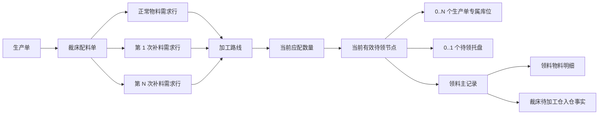
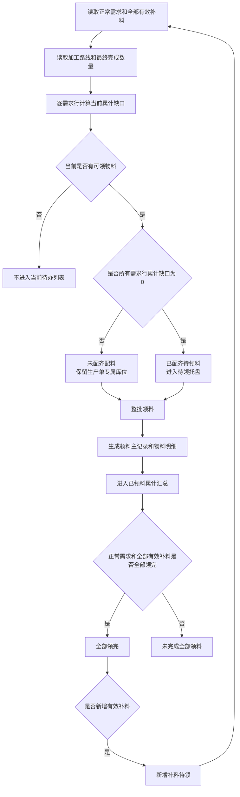

# 领料管理一级菜单与三列表产品设计

## 1. 文档状态

- 设计日期：2026-07-30
- 设计状态：已完成业务讨论，待书面规格审查
- 适用系统：工艺工厂运营系统 Web
- 主要角色：裁床仓管、裁床领料人员、裁床主管
- 关联现场端：工厂端移动应用 PDA
- 上游事实：生产单物料需求、染色完成、印花完成、补料、中转仓配料和库位
- 下游事实：裁床领料记录、裁床待加工仓入仓

本文档延续《中转仓配料与裁床领料完整关系设计》中“一张生产单对应一张持续汇总的裁床配料单、同一时刻最多一个有效待领节点、当前节点必须整批领取”的业务结论，并补充以下内容：

- 将“领料管理”提升为一级菜单。
- 将当前待办与历史结果拆成 3 张独立列表。
- 直接在列表展示物料、数量、加工属性、补料和现场位置。
- 明确染色、印花完成数量与应配数量的关系。
- 明确多次补料对最终领料结果的影响。
- 明确生产单专属库位和待领托盘的现场事实。

## 2. 背景与目标

当前领料管理将未配齐、已配齐待领和历史已领放在同一页面中。业务人员需要先进入页面，再通过页签或筛选寻找任务。物料、数量和历史结果也有部分信息需要进入详情后才能核对。

本次目标是：

1. 将“领料管理”提升为工艺工厂运营系统 Web 的一级菜单。
2. 一级菜单下设置“已配齐待领料”“未配齐配料”“已领料”3 个二级菜单。
3. 让业务人员在列表直接看到生产单关联的全部物料，不必为核对物料进入详情。
4. 未配齐配料可以直接领料，但必须一次领走当前节点全部物料。
5. 已领料列表明确区分“已配齐后领料”和“未配齐先领”，并判断生产单是否最终完成全部领料。
6. 领料判断同时覆盖正常需求、染色、印花和多次补料。
7. 页面表达当前真实现场，同时保留未来托盘编号和扫码能力。

## 3. 设计范围

### 3.1 本次范围

- 工艺工厂运营系统 Web 的领料管理菜单结构。
- 3 张独立列表的业务对象、字段、筛选、状态和操作。
- 正常物料需求、加工后物料和多次补料的应配数量口径。
- 未配齐专属库位和已配齐待领托盘的现场位置表达。
- 当前待领节点、领料记录和生产单累计结果之间的关系。
- 领料确认、防重、差异上报和主管兜底。
- PDA 与 Web 共用事实但保持不同信息架构的边界。
- 支撑原型演示的典型 Mock 数据和验收标准。

### 3.2 不在本次范围

- 真实仓储接口、数据库、权限和状态机实现。
- 中转仓内部收货、分拣、上架、盘点和调拨流程重做。
- 染色、印花加工流程本身的页面重做。
- 补料申请、审批、加工单生成和结算流程重做。
- 裁床待加工仓向铺布环节发料的流程重做。
- 强制要求当前现场立即给托盘编号。
- PDA 菜单拆成与 Web 相同的 3 个菜单。

## 4. 角色与端类型

| 角色 | 端类型 | 主要任务 | 页面要求 |
| --- | --- | --- | --- |
| 裁床仓管 | Web / PDA | 找到当前待领物料、核对位置和数量、确认领料 | 直接看到物料和位置，数量无需心算 |
| 裁床领料人员 | Web / PDA | 按生产单领取当前全部物料 | 主动作明确，不允许挑物料或挑库位 |
| 裁床主管 | Web | 查看缺口、处理差异、追溯领料结果 | 能看到完整累计关系和异常证据 |
| 中转仓人员 | 上游协作角色 | 配料、放入专属库位或汇总到托盘 | 发布真实位置和当前可领数量 |

工艺工厂运营系统 Web 可以使用高信息密度表格、筛选和抽屉。PDA 仍以任务和扫码为主，不照搬 3 张管理列表。

## 5. 核心业务事实

### 5.1 生产单与待领节点

- 一张生产单在本场景内只有一张持续汇总的裁床配料单。
- 分批到货、多次补料和多次领料不新建第二张主配料单。
- 同一生产单同一时刻最多有一个当前有效待领节点。
- 当前有效待领节点只能是“未配齐可领”或“已配齐待领”之一。
- 当前节点必须整批领取，不允许选择部分物料、部分数量或部分库位。

### 5.2 库位与生产单

- 一个中转仓库位同一时刻只能归属一个生产单。
- 一个生产单可以同时占用多个中转仓库位。
- 同一种物料可以分布在多个库位。
- 列表仍保持一个物料需求行，并在位置列中逐项展示每个库位及该库位数量。
- 不同生产单不得共用同一有效库位。

### 5.3 待领托盘

已配齐待领料存在两种形成方式：

1. 物料到达后一次直接配齐，现场将物料放入待领托盘。
2. 原本未配齐，后续物料到齐后，中转仓将生产单专属库位上的物料取下，与本次到料汇总到待领托盘。

当前现场的托盘尚未编号，但托盘编号是合理的目标能力。因此：

- 托盘编号为可选事实。
- 当前未编号时展示“待领托盘（暂未编号）”。
- 未来托盘编号后直接展示托盘号，并支持扫码核对。
- 系统不得把已经释放的原库位继续显示为已配齐物料的当前位置。
- 当前节点的现场承载方式必须互斥：未配齐节点使用一个或多个生产单专属库位；已配齐节点使用一个待领托盘，不能同时把库位和托盘都标记为当前位置。

### 5.4 加工物料

- 染色、印花都在该生产单该物料齐全后一次性加工、一次性交出。
- 不存在需求为 `1,000 yard`，先完成并交出 `600 yard`，后续再完成 `400 yard` 的分批加工场景。
- 同一物料同时需要染色和印花时，加工顺序固定为先染色、后印花。
- 加工未最终完成前，不产生可用于本次配料判断的加工完成数量。

### 5.5 多次补料

- 一张生产单可以有多次补料。
- 每次有效补料都是独立需求行。
- 同一物料 SKU 的正常需求、第 1 次补料、第 2 次补料不得合并。
- 每次补料分别保留补料单号、原因、应配、已配、已领和最终结果。
- 补料作废后保留历史事实，但不再计入有效应配和全部领完判断。
- 生产单原本全部领完后新增补料，总体状态重新打开为“新增补料待领”。

## 6. 业务对象与关系



### 6.1 物料需求行的唯一口径

一条物料需求行至少由以下信息确定：

- 生产单。
- 需求来源：正常需求或某次补料。
- 物料 SKU。
- 颜色。
- 规格。
- 单位。
- 加工路线。

正常需求和不同补料即使物料、颜色、规格和单位相同，也不能合并成一条需求行。

## 7. 应配数量与累计判断

### 7.1 应配数量

| 需求来源与加工路线 | 应配数量来源 |
| --- | --- |
| 正常需求、无需加工 | 生产单计划物料数量 |
| 补料需求、无需加工 | 该次补料批准数量 |
| 正常需求或补料需求、只需染色 | 染色最终完成数量 |
| 正常需求或补料需求、染色后印花 | 印花最终完成数量 |

染色完成数量和印花完成数量不得相加。染色后印花场景只读取最终印花完成数量。

### 7.2 当前累计缺口

列表中的数量统一按以下口径展示：

| 数量 | 业务含义 |
| --- | --- |
| 应配数量 | 本需求行按计划、补料批准或最终加工完成结果得出的有效应配 |
| 累计有效配料数量 | 历次已经形成有效领料的数量，加上当前有效待领节点中的数量 |
| 历史有效已领数量 | 已经完成领料且未被作废、退回或冲销的数量 |
| 当前待领数量 | 当前有效待领节点中本需求行可以一次性领取的数量 |

对每条有效需求行分别计算：

```text
当前累计缺口
= 应配数量
- 历史有效已领数量
- 当前待领数量
```

如果结果小于 `0`，页面按 `0` 展示，但保留超量异常事实供主管处理。

计算约束：

- 逐需求行计算。
- 不同物料、颜色、规格或单位不得抵扣。
- 正常需求与补料需求不得抵扣。
- 不同次数的补料不得抵扣。
- 已作废、已退回或无效的领料记录不计入历史有效已领。

### 7.3 当前节点分类

| 判断结果 | 当前页面 |
| --- | --- |
| 当前有可领物料，且至少一条有效需求行累计缺口大于 `0` | 未配齐配料 |
| 当前有可领物料，且所有有效需求行累计缺口均为 `0` | 已配齐待领料 |
| 当前没有可领物料 | 不进入两张当前待办列表 |

### 7.4 生产单全部领完

生产单满足以下全部条件后，才能显示“全部领完”：

1. 所有正常需求和有效补料的必需加工均已最终完成。
2. 每条有效需求行的历史有效已领数量均达到应配数量。
3. 当前不存在尚未领取的有效待领节点。
4. 当前不存在新增但尚未完成领料的有效补料。

只要生产单产生过一条有效领料记录，就进入“已领料”列表。未达到以上条件时，显示“未完成全部领料”或“新增补料待领”。

## 8. 菜单与页面架构

工艺工厂运营系统 Web 新增一级菜单：

```text
领料管理
├── 已配齐待领料
├── 未配齐配料
└── 已领料
```

### 8.1 入口规则

- 原“裁前准备 > 领料管理”菜单入口移除，避免出现两个业务入口。
- 3 个二级菜单分别进入独立列表，不使用一个页面中的 3 个页签替代。
- PDA 保留统一“待领料 / 扫码领料”入口。
- Web 和 PDA 读取同一当前待领节点、物料、位置和领料记录。

### 8.2 页面归属

- “已配齐待领料”和“未配齐配料”按当前有效待领节点展示，同一个节点只能出现在其中一张列表。
- “已领料”按生产单累计展示，不与当前待办互斥。
- 生产单曾经未配齐领过物料，后来又形成新待领节点时，可以同时出现在“已领料”和一张当前待办列表。
- 这种同时出现表达“历史结果与当前任务并存”，不是重复待办。

## 9. 统一列表结构

### 9.1 分组与明细

- 列表按生产单分组。
- 组内一个物料需求行对应一行。
- 生产单字段采用分组合并展示，不重复制造多条生产单业务记录。
- 同一物料需求行包含多个库位时，在位置列逐项显示库位和数量。
- 正常需求和每次补料分别占一行。

### 9.2 分页

- 分页按生产单数量计算，不按物料行数量计算。
- 同一生产单的全部物料行必须在同一页，不得跨页。
- 页面明确展示当前页、每页生产单数和生产单总数。
- 列表首屏只渲染当前页生产单及其物料行。

### 9.3 共同必需列

以下列属于业务防错列，不允许隐藏：

- 生产单。
- 配料单。
- 物料缩略图。
- 物料名称。
- 物料编码。
- 颜色与规格。
- 需求来源。
- 加工路线。
- 应配数量。
- 当前已配或累计已领数量。
- 当前现场位置或托盘状态。
- 操作。

所有数量必须带单位。

### 9.4 通用交互

- 使用标准列表页结构。
- 摘要卡片使用 `48 px` 单行布局，标签和值水平排列。
- 支持列排序、显示、顺序调整和普通列冻结。
- 操作列固定在右侧。
- 宽表只在表格容器内部横向滚动。
- 列显示、列顺序、冻结列和每页生产单数按路由保存。
- 当前页和排序不保存，重新进入页面时回到稳定默认状态。
- 搜索输入采用局部更新或防抖，不因每次输入重绘整页。
- 打开领料工作区、领料记录和异常处理时只更新必要区域。

## 10. 已配齐待领料

### 10.1 页面对象

累计已覆盖全部有效需求、当前尚未领取的有效待领节点。

### 10.2 生产单分组字段

- 生产单号。
- 配料单号。
- 款式或 SPU 识别信息。
- 配齐方式：一次直接配齐、从未配齐升级已配齐。
- 当前托盘状态。
- 当前可领物料种数和数量单位摘要。
- 最近配齐时间。

### 10.3 物料行字段

- 物料缩略图。
- 物料名称、编码、颜色和规格。
- 需求来源：正常需求或第 N 次补料。
- 补料单号和补料原因。
- 加工路线。
- 应配依据：计划数量、补料批准数量、染色完成或印花完成。
- 应配数量。
- 累计已配数量。
- 历史有效已领数量。
- 本轮可领数量。

### 10.4 位置表达

- 当前托盘有编号：显示托盘号，并支持扫码。
- 当前托盘未编号：显示“待领托盘（暂未编号）”。
- 从未配齐升级已配齐后，原专属库位已经释放，不显示为当前位置。

### 10.5 主要操作

- 主操作：去领料。
- 辅助操作：查看领料记录、上报领料差异。
- 不提供选择物料、选择数量、选择库位或“暂不领”。

## 11. 未配齐配料

### 11.1 页面对象

当前已有物料可领，但至少一条有效需求行仍有累计缺口的有效待领节点。

### 11.2 生产单分组字段

- 生产单号。
- 配料单号。
- 款式或 SPU 识别信息。
- 当前占用库位数。
- 当前可领物料种数。
- 仍缺物料种数。
- 本轮领走后仍缺摘要。
- 最近配料时间。

### 11.3 物料行字段

- 物料缩略图。
- 物料名称、编码、颜色和规格。
- 需求来源：正常需求或第 N 次补料。
- 补料单号和补料原因。
- 加工路线。
- 应配依据。
- 中转仓库区、库位及各库位数量。
- 应配数量。
- 历史有效已领数量。
- 本轮可领数量。
- 本轮领走后仍缺数量。

### 11.4 位置表达

示例：

```text
B-03-01：150 yard
B-03-02：100 yard
```

位置规则：

- 每个展示库位必须当前归属该生产单。
- 一个生产单可以展示多个库位。
- 同一物料可以在一个物料行中展示多个库位。
- 页面显示的各库位数量之和必须与本轮该物料可领数量一致。

### 11.5 主要操作

- 主操作：去领料。
- 一次领走当前节点全部物料和全部库位。
- 不允许只领某个库位。
- 不允许修改领料数量后继续。

## 12. 已领料

### 12.1 页面对象

至少产生过一条有效领料记录的生产单累计汇总。

### 12.2 生产单分组字段

- 生产单号。
- 配料单号。
- 款式或 SPU 识别信息。
- 领料路径。
- 领料次数。
- 最近领料人和最近领料时间。
- 最终结果。
- 当前是否又有待领节点。

### 12.3 领料路径

| 领料事实 | 页面表达 |
| --- | --- |
| 第一次领取前已经累计配齐，且从未发生未配齐领料 | 已配齐后领料 |
| 曾经领取过未配齐节点 | 未配齐先领 |

同一生产单先未配齐领料，最后再领收尾节点时，领料路径仍显示“未配齐先领”，最终结果可以同时显示“全部领完”。

### 12.4 最终结果

| 条件 | 页面表达 |
| --- | --- |
| 所有正常需求和有效补料均完成全部领料 | 全部领完 |
| 已经领过物料，但仍有正常需求、有效补料或必需加工尚未完成 | 未完成全部领料 |
| 原本全部领完后新增有效补料 | 新增补料待领 |
| 当前有新的有效待领节点 | 当前又有物料可领 |
| 当前没有待领节点但仍有缺口 | 等待后续配料 |

### 12.5 物料行字段

- 物料缩略图。
- 物料名称、编码、颜色和规格。
- 需求来源。
- 补料单号和原因。
- 加工路线。
- 应配数量。
- 累计配料数量。
- 累计有效已领数量。
- 尚未领完数量。

### 12.6 主要操作

- 主操作：领料记录。
- 领料记录承接每次领取人、领取时间、物料明细、来源库位、托盘号、裁床接收位置和异常证据。
- 如果当前又有待领节点，可以提供“去处理当前待领”的辅助入口。
- 主列表已经展示物料和累计数量，不能把这些主信息藏回详情。

## 13. 页面流转



## 14. 领料执行

### 14.1 未配齐配料领料

1. 打开生产单领料工作区。
2. 页面列出当前节点全部生产单专属库位。
3. 逐个核对库位、物料、数量和单位。
4. 任一物料、数量、单位或库位不一致时阻断。
5. 全部一致后一次确认全部库位领料。

### 14.2 已配齐待领料领料

1. 打开生产单领料工作区。
2. 页面展示托盘号；当前无编号时展示“待领托盘（暂未编号）”。
3. 有托盘号时优先扫码。
4. 无托盘号时使用生产单、物料图片、名称、编码、颜色、规格和数量核对实物。
5. 实物不一致时阻断。
6. 全部一致后一次确认整托领料。

### 14.3 一次确认的完整结果

一次确认必须同时形成：

1. 一条领料主记录。
2. 当前节点全部物料明细。
3. 正常需求与补料需求的来源关系。
4. 当前节点关闭事实。
5. 未配齐场景下全部专属库位释放事实。
6. 裁床待加工仓入仓事实。
7. 各需求行历史有效已领数量更新。
8. 生产单累计结果重新派生。
9. 操作人、时间和现场来源证据。

不得出现领料记录已经生成但库位未释放，或库位已释放但领料记录未生成的中间结果。

## 15. 防错与异常

### 15.1 必须阻断

- 物料与当前节点不一致。
- 数量或单位不一致。
- 库位不属于当前生产单。
- 页面展示库位数量之和与本轮可领数量不一致。
- 当前节点在核对期间已更新。
- 已关闭节点再次领取。
- 重复提交产生第二条领料记录。
- 加工尚未最终完成却生成加工完成应配数量。
- 已作废补料仍参与有效应配判断。

### 15.2 异常入口

页面提供：

- 上报领料差异。
- 叫主管处理。
- 拍照或补充现场说明。

异常至少记录：

- 生产单和当前节点。
- 涉及物料。
- 差异数量和单位。
- 涉及库位或托盘号。
- 托盘当前是否未编号。
- 操作人和时间。
- 现场照片或说明。

员工不得通过修改系统数量绕过差异。

### 15.3 节点更新与防重

- 待领节点物料或位置更新后生成新版本。
- 旧版本提交时提示重新核对全部物料。
- 重复点击和弱网重试只返回原领料结果。
- 同一节点不得生成第二条领料主记录。

## 16. Web 与 PDA 边界

### 16.1 Web

- 提供一级菜单和 3 张独立列表。
- 展示生产单累计关系、物料明细、补料、加工路线、库位和领料结果。
- 支持筛选、排序、列配置、抽屉和主管异常处理。

### 16.2 PDA

- 保持统一“待领料 / 扫码领料”入口。
- 不要求一线员工先判断 3 个菜单。
- 只展示当前任务、当前生产单、当前物料、当前数量、当前位置或托盘状态和主动作。
- 托盘有编号时扫码；当前未编号时按页面识别信息人工核对。
- 复杂累计历史和多次补料明细后置，不堆在首屏。

## 17. 筛选与摘要

### 17.1 已配齐待领料

建议筛选：

- 生产单。
- 配料单。
- 物料名称或编码。
- 需求来源。
- 加工路线。
- 配齐方式。
- 托盘是否编号。
- 最近配齐时间。

摘要：

- 待领生产单数。
- 一次直接配齐数。
- 从未配齐升级数。
- 当前未编号托盘数。

### 17.2 未配齐配料

建议筛选：

- 生产单。
- 配料单。
- 物料名称或编码。
- 需求来源。
- 加工路线。
- 库区或库位。
- 仍缺物料。
- 最近配料时间。

摘要：

- 未配齐生产单数。
- 当前占用库位数。
- 可整批领料生产单数。
- 含补料生产单数。

### 17.3 已领料

建议筛选：

- 生产单。
- 配料单。
- 物料名称或编码。
- 需求来源。
- 加工路线。
- 领料路径。
- 最终结果。
- 最近领料时间。

摘要：

- 已产生领料记录的生产单数。
- 已配齐后领料数。
- 未配齐先领数。
- 尚未全部领完数。
- 新增补料待领数。

所有摘要统计生产单数，不统计展开后的物料行数。

## 18. 原型 Mock 场景

原型至少包含以下场景：

1. 无加工物料一次直接配齐，进入未编号待领托盘。
2. 未配齐生产单占用多个专属库位。
3. 同一物料分布在多个库位，并在一个物料行中列出各库位数量。
4. 未配齐节点领走后，生产单显示“未完成全部领料”。
5. 后续物料到齐，原专属库位物料汇总到待领托盘，升级为已配齐待领。
6. 只需染色的物料，以染色最终完成数量为应配。
7. 先染色后印花的物料，以印花最终完成数量为应配。
8. 同一 SKU 存在正常需求和多次补料，每次补料独立展示。
9. 原本全部领完后新增补料，状态变为“新增补料待领”。
10. 新增补料全部领完后，状态恢复“全部领完”。
11. 托盘已有编号并可扫码。
12. 当前托盘未编号，使用物料识别信息人工核对。
13. 实物、数量、单位或库位不一致，阻断并进入主管处理。
14. 核对期间节点更新，旧版本提交被阻断。
15. 重复点击只返回原领料结果。

## 19. 页面与交互验收

### 19.1 信息可见

- 列表无需进入详情即可看到物料缩略图、名称、编码、颜色、规格、应配、已配或已领。
- 补料行直接显示第 N 次补料、补料单号和原因。
- 加工物料直接显示加工路线和应配依据。
- 未配齐列表直接显示全部当前专属库位及各库位数量。
- 已配齐列表直接显示托盘号或“待领托盘（暂未编号）”。
- 已领料列表直接显示领料路径和最终结果。

### 19.2 列表治理

- 3 张列表均使用标准列表页能力。
- 每张列表均有分页。
- 分页按生产单计数，组内物料不得跨页。
- 排序列具有未排序、升序和降序 3 种状态。
- 支持显示列、调整列顺序和冻结普通列。
- 必需列和操作列不可隐藏。
- 操作列固定右侧。
- 列偏好和每页生产单数按路由保存。

### 19.3 性能与分辨率

- 任一功能按钮点击后在 `200 ms` 内出现可感知反馈。
- 筛选、弹窗、抽屉和行操作不触发不必要的整页重绘。
- 局部更新不重复扫描整页图标。
- 1366×768 分辨率完整可用。
- 1280×720 分辨率下主操作不被遮挡。
- 页面主体不产生横向溢出，宽表只在表格容器内部滚动。

## 20. 原型审查重点

### 20.1 角色与任务

- Web 页面服务裁床仓管、领料人员和主管。
- PDA 仍从任务入口进入，不让一线员工理解菜单状态。
- 两张待领列表只有一个主动作：“去领料”。

### 20.2 数量与状态

- 所有数量带单位。
- 系统自动计算应配、历史已领、本轮可领和领后仍缺。
- 页面不显示英文状态码。
- “本轮已领完”和“生产单全部领完”不得混用。

### 20.3 位置与识别

- 一个库位只能归属一个生产单。
- 一个生产单可以占多个库位。
- 已配齐后不继续显示已释放的原库位。
- 托盘编号为可选；当前无编号、未来可编号扫码。
- 当前无托盘编号时，使用生产单和物料识别信息作为替代防错。

### 20.4 协作与追溯

- Web、PDA、中转仓和裁床待加工仓读取同一领料事实。
- 每次领料可追溯领取人、时间、物料、来源位置和接收位置。
- 差异有结构化入口和主管兜底。
- 多次补料独立保留，不覆盖原需求或前次补料。

## 21. 验收标准

1. 工艺工厂运营系统 Web 出现“领料管理”一级菜单及 3 个二级菜单。
2. 原“裁前准备 > 领料管理”菜单入口不再重复展示。
3. 当前有效待领节点只出现在“已配齐待领料”或“未配齐配料”之一。
4. 未配齐配料可以执行整批领料。
5. 未配齐领料必须覆盖当前节点全部物料和全部库位。
6. 列表按生产单分组、按物料需求行展开。
7. 同一物料的多个库位及各库位数量在列表直接可见。
8. 无需加工、只染色、染色后印花的应配数量口径正确。
9. 染色后印花只取印花最终完成数量，不与染色数量相加。
10. 正常需求和每次补料独立展示、独立计算。
11. 新增补料会重新打开生产单总体领料状态。
12. 已配齐列表正确区分一次直接配齐和从未配齐升级配齐。
13. 当前未编号托盘显示“待领托盘（暂未编号）”。
14. 未来托盘有编号时可以展示并支持扫码。
15. 已领料列表正确显示“已配齐后领料”或“未配齐先领”。
16. 已领料列表正确显示“全部领完”“未完成全部领料”或“新增补料待领”。
17. 同一生产单的物料行不跨页。
18. 实物、数量、单位、库位或节点版本不一致时阻断领料。
19. 重复提交不生成第二条领料主记录。
20. PDA 菜单不拆分，但与 Web 读取同一当前任务和领料结果。

## 22. 最终设计结论

本次采用“一级菜单 + 3 张独立列表”的方案：

- “已配齐待领料”回答：哪些生产单已经配齐，现在可以整托领走。
- “未配齐配料”回答：哪些生产单当前虽未配齐，但已经有哪些物料、分别在哪些专属库位，可以整批领走。
- “已领料”回答：哪些生产单曾经领过物料，是已配齐后领还是未配齐先领，正常需求和全部补料是否最终都已完成领料。

3 张列表共享同一业务事实，但承担不同任务。当前待办按有效待领节点展示，历史结果按生产单累计展示。页面不要求业务人员进入详情才能核对物料，也不把当前现场尚未具备的托盘编号强制为必填；同时保留未来托盘编号和扫码能力。
