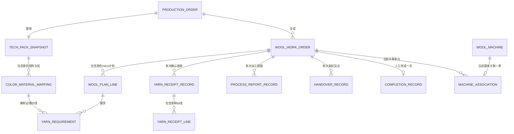
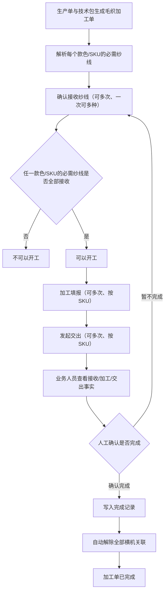
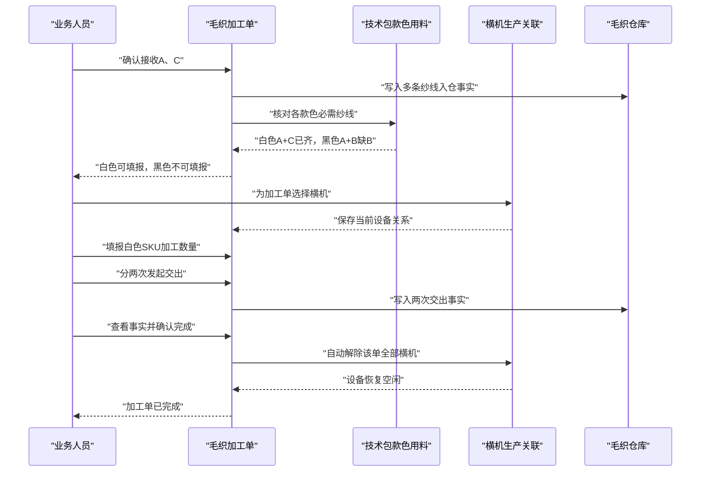

# 毛织管理事实型加工单重构设计

> 文档状态：业务已确认
>
> 设计日期：2026-07-30
>
> 业务确认日期：2026-07-30
>
> 设计范围：毛织加工单、横机生产关联、毛织仓库事实、PDA 执行及直接上下游
>
> 方案结论：采用方案 1，在毛织模块范围内干净重写，不在旧节点状态机上继续叠加兼容逻辑
>
> 确认结论：本文档作为后续实施、规格审查和业务验收的正式基线
>
> 当前阶段：设计已确认，产品代码实现尚未开始

## 1. 文档目的

本设计解决的不是“修改几个按钮”，而是把毛织加工单从旧的固定工序节点模型，重构为以真实业务记录为核心的事实模型。

重构后，一个毛织加工单只围绕以下业务事实运行：

1. 确认接收纱线，可多次。
2. 加工填报，可多次。
3. 发起交出，可多次。
4. 业务人员主动完成加工单，只能一次。
5. 横机与加工单的关系独立动态维护，不再作为加工单状态节点。

本设计同时覆盖：

- 技术包中的款色用料关系如何成为开工判断依据。
- 毛织加工单列表、详情和操作弹窗。
- 横机设备与加工单的当前关联关系。
- 毛织待加工仓、待交出仓及 PDA 仓管页面。
- PDA 毛织执行任务。
- 任务生成、移动任务索引、交接记录、菜单、路由和专项检查。
- 旧“横机成片、缝盘、熨烫、包装、菲票打印”节点及相关代码、字段和文案的清理边界。

## 2. 逐行代码核查说明

### 2.1 核查方法

本设计先同步 CodeGraph 索引，再按以下顺序核查代码：

1. 用 CodeGraph 确认毛织模块文件、核心符号和影响范围。
2. 逐行阅读毛织领域文件和全部毛织 Web 页面。
3. 沿调用关系逐行阅读技术包、生产任务生成、PDA 执行、PDA 仓管和通用交接适配。
4. 逐行核对路由、菜单、主事件分发和专项检查脚本。
5. 对中文节点文案做全仓文字检索，区分毛织专属引用与其他业务正常使用。

核查时 CodeGraph 索引状态为最新，共 1,325 个文件、40,885 个节点、146,747 条关系边。`WoolWorkOrder` 两层影响范围涉及 96 个符号；`getWoolAllowedActions` 三层影响范围涉及 35 个符号，说明该改动必须同步处理 Web、PDA、仓库和通用任务适配，不能只修改毛织列表。

### 2.2 已逐行阅读的核心代码

以下行号基于本设计成文时的代码版本；后续实现造成行号变化时，以文件和符号名为准。

| 层级 | 文件与核查范围 | 当前代码事实 | 设计结论 |
|---|---|---|---|
| 毛织领域 | `src/data/fcs/wool-task-domain.ts` 全文 | 3,400 余行把单一纱线接收、固定节点、横机排产、菲票打印、仓库推导和 PDA 种子集中在一个文件 | 在毛织模块内重建事实模型；删除旧节点状态机及自动推进函数 |
| 加工单列表 | `src/pages/process-factory/wool/work-orders.ts` 全文 | 1,500 余行同时承担列表、所有弹窗、仓库动作和旧节点自动推进 | 拆清列表、操作弹窗和事件处理；列表迁移至标准列表页组件 |
| 加工单详情 | `src/pages/process-factory/wool/work-order-detail.ts` 全文 | 页签直接包含“横机成片”“缝盘熨烫包装”“毛织菲票” | 改为业务概览、款色用料、接收记录、加工填报、交出记录、横机关联和操作记录 |
| 横机排产 | `src/pages/process-factory/wool/machine-schedule.ts` 全文 | 只展示“待横机排产”的加工单，要求机台数、起止日期和手输机号 | 整页改为“横机生产关联”，默认展示全部设备当前状态和当前加工单 |
| 横机设备 | `src/pages/process-factory/wool/machines.ts` 全文 | 设备档案页混有“查看横机排产”语义 | 保留设备档案职责；关联维护统一进入“横机生产关联” |
| 毛织菲票 | `src/pages/process-factory/wool/fei-tickets.ts` 全文 | 页面只服务于毛织菲票打印状态和打印操作 | 删除页面、菜单、路由和渲染器 |
| 毛织统计 | `src/pages/process-factory/wool/statistics.ts` 全文 | 所有统计都依赖旧节点和菲票打印状态 | 不再统计旧节点；如保留页面，只能统计接收、可填报、加工、交出和完成事实 |
| 毛织仓库 | `src/pages/process-factory/wool/warehouse.ts` 全文 | Web 仓库包含领料入仓、加工领料、回收入仓、完工入仓、交出确认，并调用加工单文件里的弹窗 | 仓库仅表达物理库存和流转事实；不得自动推进加工单状态 |
| PDA 执行 | `src/pages/pda-exec-detail.ts` 毛织渲染、前置判断和事件处理相关段落 | PDA 仍按接单、开工、横机里程碑、缝盘、熨烫、包装、菲票和自动完工运行 | 改为与 Web 同源的确认接收、加工填报、发起交出和人工完成 |
| PDA 接单 | `src/pages/pda-task-receive.ts:330-342, 1459-1492` | 毛织任务“确认接单”调用 `acceptWoolWorkOrder`，与本次“确认接收纱线”语义冲突 | 毛织加工单不再用接单状态门禁；毛织任务接收页不得把接单写成纱线接收 |
| PDA 待加工仓 | `src/pages/pda-warehouse-wait-process.ts` 毛织动作相关段落 | “加工领料”会自动完成领料、排机并启动横机成片 | 删除自动推进；仓库领用/退回即使保留，也只能形成独立库存事实 |
| PDA 待交出仓 | `src/pages/pda-warehouse-wait-handover.ts` 毛织动作相关段落 | “完工入仓”会循环完成所有旧节点；“交出确认”会自动打印菲票 | 删除自动完成旧节点和自动打印菲票 |
| PDA 仓管首页 | `src/pages/pda-warehouse.ts:36-38, 46-63, 172-189, 203-247` | 毛织快捷入口仍写“给横机使用”“完工入仓”“交出确认” | 改成与事实模型一致的仓库入口，不再表达加工节点 |
| 移动任务绑定 | `src/data/fcs/process-mobile-task-binding.ts:393-416, 740-846, 927-986` | 毛织任务被合入统一移动执行列表，并按加工单任务号校验绑定 | 保留任务绑定，但更换状态和动作投影 |
| 移动任务索引 | `src/data/fcs/mobile-execution-task-index.ts:225-244, 417-443` | 只投影单一 `yarnReceipt.yarnSku`，并投影菲票号 | 改为多纱线摘要；菲票号仅作为已有实物标识，不再作为打印流程 |
| PDA 交接事件 | `src/data/fcs/pda-handover-events.ts:1332-1363, 3746-3783` | 毛织领料和交出以静态种子并入通用交接头、明细 | 改为从多次接收记录和多次交出记录生成 |
| 工厂仓库概览 | `src/data/fcs/factory-mobile-warehouse.ts:93-124` | 以单一纱线收货、旧完工入仓和交出记录计算毛织仓库概览 | 改为按接收行与交出行汇总，避免按加工单数冒充物料行数 |
| 技术包类型 | `src/data/pcs-technical-data-version-types.ts:315-345` | 毛织工艺含 `requiresFeiTicket`、`packagingRequired` 等旧执行要求 | 删除毛织专属的菲票打印和包装节点配置；保留任务类型、交出对象等仍有效字段 |
| 技术包页面 | `src/pages/tech-pack/process-domain.ts:94-210, 532-646` | 毛织规则卡展示菲票规则、包装节点开关、固定交出说明 | 删除旧节点文案和开关；款色用料关系成为开工判断的唯一技术依据 |
| 技术包快照页 | `src/pages/fcs-production-tech-pack-snapshot.ts:430-465` | 执行要求列展示“打印毛织菲票”“毛织厂包装” | 删除两项毛织执行要求 |
| 技术包样例 | `src/data/pcs-technical-data-version-bootstrap.ts:204-265` | 样例写死熨烫、包装和打印菲票 | 改为接收、加工填报、交出语义 |
| 任务生成 | `src/data/fcs/process-tasks.ts:560-647, 903-1085` | 新毛织任务默认已接单、已开工、已上报横机里程碑，并只找第一条物料行 | 改为生成未加工的加工单，生成款色/SKU 计划行和全部必需纱线关系 |
| 生产工艺产物 | `src/data/fcs/production-artifact-generation.ts:307-321` | 自动写入菲票和包装要求 | 删除旧要求的产物字段 |
| 里程碑配置 | `src/data/fcs/milestone-configs.ts:209-258` | 毛织配置明确要求“横机首批上报” | 删除毛织专属横机里程碑配置，避免 PDA 重新生成旧动作 |
| 工艺字典 | `src/data/fcs/process-craft-dict.ts` 毛织定义相关段落 | 毛织工艺备注仍写熨烫必有、包装按单、部位打印菲票 | 只清理毛织工艺定义中的旧描述；不得删除全局熨烫/包装工序 |
| 通用打印 | `src/pages/print/templates/label-print-template.ts` 毛织引用 | 通用标签模板直接读取毛织菲票打印记录 | 移除毛织打印数据源；其他业务标签打印保持不变 |
| 路由链接 | `src/data/fcs/fcs-route-links.ts:205-247` | 提供毛织菲票和横机排产链接 | 删除菲票链接；将横机排产链接改为横机生产关联链接 |
| 路由注册 | `src/router/routes-fcs.ts:146-153, 359-376, 539-540` | 注册毛织菲票、横机排产及详情路由 | 删除菲票路由；排产路由改为关联页，可保留旧地址到新地址的重定向 |
| 异步渲染 | `src/router/route-renderers-fcs.ts:505-535` | 独立加载菲票页和横机排产页 | 删除菲票渲染器；排产渲染器更名 |
| 菜单 | `src/data/app-shell-config.ts:514-529` | 菜单包含“横机排产”“毛织菲票” | 改为“横机生产关联”，删除“毛织菲票” |
| 主事件分发 | `src/main-handlers/fcs-handlers.ts:213-215, 392-399` | 分别分发加工单、横机排产和设备事件 | 替换为加工单、横机生产关联、设备事件 |
| 专项检查 | `scripts/check-wool-internal-style-code.ts` 全文 | 仍强制列表渲染紧凑统计卡片 | 改为校验筛选联动的三类 Tab 数量，不再要求统计卡片 |
| 专项检查 | `scripts/check-wool-warehouse-unified-model.ts` 全文 | 强制存在加工领料、完工入仓、交出确认和对应 PDA 自动动作 | 按事实模型重写，禁止旧节点自动推进 |
| 列表治理 | `scripts/standard-list-page-baseline.json` | 毛织加工单仍在历史基线中 | 列表完成标准化后删除该基线条目，不得更新哈希绕过治理 |

### 2.3 当前实现与目标需求的根本冲突

#### 冲突一：接收对象错误

当前 `WoolWorkOrder` 只有一个 `yarnReceipt`。`resolveYarnReceipt()` 通过 `find()` 只取技术包中的第一条匹配纱线，后续确认收货也是覆盖这个单一对象。

这无法表达：

- 一次接收 A、B 两种纱线。
- 第一次接收 A，第二次接收 B。
- 同一纱线分多个送货批次到达。
- 黑色款需要 A、B，白色款需要 A、C 的共同纱线关系。

#### 冲突二：加工单状态被固定节点支配

当前状态由 `deriveWoolOrderStatus()` 根据“横机成片、缝盘、熨烫、包装、菲票打印、交出、仓库收货”串行推导。用户要求的三类可重复事实无法嵌入这条单向链路。

#### 冲突三：横机被当成加工节点和排期

当前 `scheduleWoolMachines()` 同时写排期记录、加工单状态和“横机成片”节点机号。机器关系不能独立转移、替换或在完成加工单时统一解除。

#### 冲突四：仓库动作会篡改加工事实

当前 Web/PDA 的“加工领料”和“完工入仓”会自动接单、自动确认领料、自动排机、自动完成所有节点。物理仓库事实和加工履约事实被混成同一个状态推进器。

#### 冲突五：上游默认把新单做成已开工

当前生产任务生成会把毛织任务默认设置为已接单、进行中、已有开工凭证和横机里程碑。新加工单从生成时就越过了真实的纱线确认接收门禁。

## 3. 设计原则与边界

### 3.1 设计原则

1. 事实优先：接收、加工、交出和设备关联都保存独立记录。
2. 状态派生：列表状态和可操作性由记录计算，不靠人工推进节点。
3. 款色判断：开工门禁以“任一款色/SKU 的全部必需纱线均有过有效确认接收”为准。
4. 数量分离：纱线接收数量不参与可加工件数换算。
5. 多次操作：确认接收、加工填报和发起交出都允许多次。
6. 人工收口：完成加工单不做数量充分性判断，由业务人员查看事实后二次确认。
7. 设备独立：横机关联是当前生产关系，不是加工单状态。
8. 仓库独立：仓库只记录实物位置和流转，不代替业务人员填报加工进度。

### 3.2 本次明确删除的内容

以下内容在“毛织加工单语境”中全部删除：

- 横机成片节点及开始、上报、完成动作。
- 缝盘节点及开始、完成、损耗自动计算。
- 熨烫节点及开始、完成动作。
- 包装节点、是否需要包装节点和跳过包装动作。
- 菲票打印节点、待打印/已打印状态、打印/补打动作和毛织菲票页面。
- 由上述节点派生的里程碑、统计、价格明细、PDA 按钮、证据文案和自动推进函数。

以下内容不在删除范围：

- 全局工艺字典中的独立“熨烫”“包装”工序，因为其他业务仍可能使用。
- 其他模块的菲票生成、打印和流转。
- 毛织成品或部位明细中已经存在的菲票号。菲票号仅作为实物身份和追溯字段，不再产生毛织打印状态和打印操作。
- “整件毛织”“部位毛织”任务类型及其不同交出对象。

### 3.3 本次不做

- 不按纱线接收重量和单件用量计算最多可加工件数。
- 不做纱线分配、预占或在多个款色之间扣减。
- 不把辅助工艺领域模型直接复用到毛织；只借鉴其多次事实记录思路。
- 不建设真实后端、数据库或接口。
- 不重构毛织以外的工艺字典和仓库体系。

## 4. 业务对象与关系



### 4.1 毛织加工单

毛织加工单是一次毛织加工履约的业务主对象，保留：

- 加工单编号、任务编号。
- 生产单、款号、款名、内部货号。
- 整件毛织或部位毛织。
- 承接工厂。
- 计划开始、计划完成。
- 交出对象。
- 款色/SKU 计划行。
- 技术包快照版本和生成来源。

加工单不再直接保存：

- 单一纱线接收对象。
- 固定执行节点数组。
- 横机排产编号和计划机数。
- 菲票打印状态。
- 单一累计完成数量和单一交出数量作为事实源。

### 4.2 款色/SKU 计划行

每个计划行至少包含：

- 成衣 SKU。
- 颜色编码、颜色名称。
- 尺码。
- 计划数量和单位。
- 对应的必需纱线 SKU 集合。
- 累计加工填报数量。
- 累计交出数量。
- 当前是否可填报及缺少的纱线。

同一颜色有多个尺码 SKU 时，技术包款色用料关系可以复用于这些 SKU；加工数量上限仍按每个 SKU 自己的计划数量计算。

### 4.3 确认接收记录

一次确认接收是一张业务记录，可包含多条纱线：

- 接收记录编号。
- 送货单号或来源单号。
- 批次号。
- 接收时间、接收人。
- 库区、库位。
- 凭证和备注。
- 多条纱线明细。

每条明细包含：

- 物料 SKU。
- 物料名称、颜色或规格。
- 实收数量和单位，可记录但不参与开工门禁。
- 差异说明。

有效接收记录指未作废的确认接收记录。若以后提供作废能力，作废后必须重新计算款色是否可填报；本期原型可通过 Mock 数据体现有效/作废，但不新增作废入口。

### 4.4 加工填报记录

一次加工填报只针对一个款色/SKU，包含：

- 填报记录编号。
- 款色/SKU。
- 本次填报数量。
- 填报时间、填报人。
- 凭证和备注。

同一加工单可多次填报，同一 SKU 也可多次填报。

### 4.5 发起交出记录

一次发起交出只针对一个款色/SKU，包含：

- 交出记录编号。
- 款色/SKU。
- 本次交出数量。
- 接收对象。
- 发起时间、发起人。
- 已有菲票号或其他实物标识，可多值。
- 凭证和备注。
- 下游实际接收数量和时间，如下游已回写。

同一加工单可多次交出，同一 SKU 也可多次交出。

### 4.6 完成记录

完成记录每个加工单最多一条：

- 完成人、完成时间。
- 完成确认备注。
- 确认当时的接收、加工、交出汇总快照。
- 自动解除的横机编号。

保存快照的目的，是避免以后新增接收或下游回写后无法还原当时业务人员看到的确认依据。

### 4.7 横机当前关联

横机关联表示“该设备当前正在为哪个毛织加工单生产”，不是排产节点。

关系约束：

- 一个加工单可关联多台横机。
- 一台横机当前最多关联一个加工单。
- 同一设备和加工单不能存在重复当前关系。
- 关联历史可作为操作记录保留，但当前页面只以当前关系为准。

## 5. 技术包到加工单的款色纱线解析

### 5.1 现有可用数据

技术包快照已经提供：

- `colorMaterialMappings`：款色用料关系。
- 每个款色的 `colorCode`、`colorName`。
- 每条关系的 `bomItemId`、`materialCode`、`materialName`、`materialType`。
- 每条关系的 `applicableSkuCodes`。
- BOM 中的 `usageProcessCodes`、`applicableSkuCodes` 和用量字段。

本次只使用“物料身份”和“适用款色/SKU”，不使用单耗和损耗率计算开工件数。

### 5.2 必需纱线解析规则

对加工单对应生产单的技术包快照执行：

1. 取得生产单的款色/SKU 计划行。
2. 按颜色匹配 `colorMaterialMappings`。
3. 只保留属于毛织/纱线的物料行：
   - 优先依据关联 BOM 的 `usageProcessCodes` 包含毛织。
   - 其次依据明确的纱线物料类型。
   - 不得把同色关系中的包装、辅料或其他非纱线物料当作开工必需纱线。
4. 纱线身份优先使用 `materialCode`；若关系行缺失，则回退到关联 BOM 的 `materialCode`。
5. 按 `applicableSkuCodes` 投影到对应成衣 SKU；没有 SKU 列表时按该颜色的全部计划 SKU 投影。
6. 同一款色/SKU 下按物料 SKU 去重。
7. 保存来源快照版本、关系行和 BOM 行引用，供详情追溯。

若某款色/SKU 没有解析出任何必需纱线，不能把空集合判定为“全部已接收”。该 SKU 必须显示：

> 技术包缺少该款色的必需纱线关系，暂不可加工填报。

### 5.3 可加工判断

定义：

- `R`：该加工单所有有效确认接收记录中出现过的物料 SKU 集合。
- `Y(sku)`：某成衣 SKU 在技术包中要求的必需纱线 SKU 集合。

某 SKU 可加工填报，当且仅当：

1. `Y(sku)` 非空。
2. `Y(sku)` 中每一种纱线都存在于 `R`。

加工单可以开工，当且仅当至少一个 SKU 可加工填报。

```text
SKU 可填报 = 必需纱线集合非空 AND 必需纱线集合 ⊆ 已有效接收纱线集合
加工单可开工 = 存在至少一个 SKU 可填报
```

示例：

| 款色 | 必需纱线 | 已确认接收 | 结果 |
|---|---|---|---|
| 黑色 | A、B | A | 黑色不可填报，缺 B |
| 白色 | A、C | A、C | 白色可填报 |
| 红色 | B、D | A、C | 红色不可填报，缺 B、D |

此时加工单进入“可以开工”Tab，因为白色满足要求。系统不计算白色最多可做多少件。

## 6. 状态、分组与操作门禁

### 6.1 加工状态

加工单只保留三个加工状态：

| 状态 | 派生规则 |
|---|---|
| 未加工 | 未完成，且没有任何有效加工填报 |
| 加工中 | 未完成，且至少有一条有效加工填报或交出记录 |
| 已完成 | 已存在人工完成记录 |

确认接收本身不把加工状态改成“加工中”。

### 6.2 列表 Tab

列表只设三个互斥 Tab：

1. 可以开工：未完成，且至少一个款色/SKU 可加工填报。
2. 不可以开工：未完成，且没有任何款色/SKU 可加工填报。
3. 已完成：已有完成记录。

每个 Tab 标签直接显示当前筛选条件下的数量，例如“可以开工 8”。不再增加重复的统计卡片。

搜索条件先作用于全量加工单，再计算三个 Tab 数量；切换 Tab 保留全部搜索条件。

### 6.3 操作显示规则

| 操作 | 显示条件 | 核心校验 |
|---|---|---|
| 详情 | 始终显示 | 无 |
| 确认接收 | 未完成 | 至少一条纱线明细；物料 SKU 有效 |
| 加工填报 | 未完成且至少一个 SKU 可填报 | 只能选可填报 SKU；累计不超过计划量的 150% |
| 发起交出 | 未完成且至少一个 SKU 有可交出余额 | 本次交出不超过该 SKU 的可交出余额 |
| 关联横机设备 | 未完成且至少一个 SKU 可填报 | 维修、停用设备不可选择 |
| 完成加工单 | 未完成且至少有一条有效交出记录 | 系统不判断是否足量，只要求二次确认 |

完成加工单后，以上四个业务操作和设备关联操作全部锁定，只保留详情查看。

## 7. 三类可重复操作

### 7.1 确认接收

流程：

1. 用户点击“确认接收”。
2. 弹窗展示加工单、生产单、款号、技术包必需纱线和历史接收摘要。
3. 用户填写送货信息，并添加一条或多条纱线明细。
4. 保存后新增一条接收记录，不覆盖历史记录。
5. 系统重新计算每个款色/SKU 的“已齐/缺料”状态和三个 Tab 数量。
6. 同步生成待加工仓的纱线入仓事实。

弹窗防错：

- 默认只允许选择本加工单技术包涉及的纱线。
- 若业务需要接收技术包外纱线，必须明确标记“非本单必需纱线”，且不参与开工判断。
- 不允许没有纱线明细的空记录。
- 同一次接收可填写多个 SKU。
- 数量可记录但不影响开工门禁。

### 7.2 加工填报

流程：

1. 用户点击“加工填报”。
2. 弹窗只列出必需纱线已经全部确认接收的款色/SKU。
3. 每行显示计划量、150% 上限、历史累计填报、本次可填上限和缺料说明。
4. 用户选择一个 SKU，填写本次数量和凭证。
5. 保存后新增加工填报记录并刷新累计量。

数量规则：

```text
累计加工填报(sku) = 该 SKU 所有有效加工填报数量之和
填报上限(sku) = 计划数量(sku) × 150%
本次填报数量 > 0
累计加工填报(sku) + 本次填报数量 ≤ 填报上限(sku)
```

衣服数量按正整数填写。若计划量为奇数，150% 得到小数时，允许的最大整数取不超过该上限的整数。

缺少任一必需纱线时，该款色/SKU 不出现在可选项中，并在弹窗下方“暂不可填报”区域说明缺少哪些纱线。

### 7.3 发起交出

流程：

1. 用户点击“发起交出”。
2. 弹窗只列出存在可交出余额的款色/SKU。
3. 用户选择 SKU，填写本次交出数量、接收对象、已有实物标识和凭证。
4. 保存后新增交出记录。
5. 同步生成待交出仓的交出事实，并进入通用交接投影。

数量规则：

```text
累计已加工(sku) = 有效加工填报数量之和
累计已交出(sku) = 有效交出数量之和
可交出余额(sku) = 累计已加工(sku) - 累计已交出(sku)
0 < 本次交出数量 ≤ 可交出余额(sku)
```

发起交出的前提自然包含“至少有一次加工填报”，因为没有加工填报时可交出余额为 0。

## 8. 完成加工单

### 8.1 显示条件

只有至少存在一条有效交出记录时才显示“完成加工单”。

### 8.2 确认弹窗

弹窗按三块展示：

1. 确认接收情况：
   - 每种必需纱线是否接收。
   - 累计接收数量、批次、最近接收时间。
   - 各款色/SKU 是否齐料及缺料。
2. 加工填报情况：
   - 每个 SKU 的计划数量。
   - 150% 上限。
   - 累计加工填报。
   - 与计划量的差异。
3. 发起交出情况：
   - 每个 SKU 累计加工、累计交出、尚未交出。
   - 各次交出及下游回写情况。

弹窗明确提示：

> 系统仅展示当前业务事实，不判断该加工单是否应该完成。请业务人员核对后确认。

系统不因为缺料、加工少于计划、仍有未交出数量或下游尚未确认而阻止完成。

### 8.3 确认完成后的原子动作

一次确认内同时完成：

1. 写入完成记录和确认快照。
2. 加工状态变为已完成。
3. 锁定确认接收、加工填报、发起交出和重新关联设备。
4. 删除该加工单的全部当前横机关联。
5. 被解除的横机状态改为空闲。
6. 写入完成和批量解除设备的操作记录。

若任何一步失败，本次完成不应只执行一半。原型实现以同一次内存存储更新表达原子性。

## 9. 横机生产关联

### 9.1 页面定位

原“横机排产”改名为“横机生产关联”。该页面不是加工单状态页，而是设备当前生产关系工作台。

默认展示全部横机设备，每台一行：

- 设备编号、名称、机型、针型。
- 当前状态。
- 当前关联毛织加工单。
- 生产单、款号、内部货号。
- 关联时间、关联人。
- 操作。

筛选：

- 生产单/加工单/款号关键字。
- 横机设备状态。
- 是否已关联。

右上角提供“关联生产单”。

### 9.2 两个维护入口

入口一：毛织加工单列表。

- 仅当加工单满足加工填报基础门禁时显示“关联横机设备”。
- 打开后当前加工单已关联设备默认选中。

入口二：横机生产关联页。

- 先选毛织加工单。
- 加工单选项显示加工单号、生产单、款号和加工状态。
- 再多选横机设备。

两个入口调用同一套“保存整组关系”逻辑。

### 9.3 整组保存规则

弹窗所选设备集合是保存后的完整真相：

- 新选中的设备：新增关联。
- 原来已选且仍选中：保持关联。
- 原来已选但本次取消：解除关联并改为空闲。
- 已关联其他加工单但本次选中：提示将从原加工单转移，确认后完成转移。

禁止只追加不移除，否则业务人员无法用一次保存表达当前真实机台集合。

### 9.4 设备状态联动

| 设备当前状态 | 是否可选 | 建立/保持关联后的状态 |
|---|---|---|
| 空闲 | 可选 | 生产中 |
| 已排产 | 可选 | 生产中 |
| 生产中 | 可选，可保持或转移 | 生产中 |
| 维修 | 不可选，禁用展示 | 维修 |
| 停用 | 不可选，禁用展示 | 停用 |

解除关联后，设备自动变为空闲。完成加工单时批量解除也遵循同一规则。

设备“已排产”可以保留为设备自身的外部计划状态，但不再由毛织加工单状态机产生。

## 10. 页面详细设计

### 10.1 毛织加工单列表

页面顺序：

1. 标题和必要主操作。
2. 搜索条件。
3. 含数量的三个 Tab。
4. 标准列表表格。
5. 分页。

不显示统计卡片。

搜索字段：

- 加工单号/任务号。
- 生产单号。
- 款号/款名/内部货号。
- 承接工厂。
- 加工状态。
- 必需纱线 SKU。
- 计划日期范围。

建议表格列：

- 毛织加工单号，必需列。
- 生产单号。
- 款式/内部货号，必需列。
- 类型。
- 款色/SKU 数。
- 计划数量摘要。
- 纱线接收摘要，必需防错列。
- 可填报款色摘要，必需防错列。
- 累计加工/累计交出。
- 当前关联横机。
- 加工状态。
- 计划完成时间。
- 操作，固定右侧。

列表必须使用 `renderStandardListPage`、`renderStandardListTable` 和 `renderTablePagination`，支持列排序、显示、顺序、冻结和按路由持久化。毛织加工单完成迁移后，从历史基线移除。

轻交互要求：

- Tab、筛选、分页和列偏好只局部刷新结果区。
- 弹窗打开关闭不整页重绘。
- 输入搜索使用防抖，不在每次输入时重绘整页。
- 交互响应目标不超过 200ms。

### 10.2 加工单详情

详情页签：

1. 业务概览。
2. 款色用料与开工判断。
3. 确认接收记录。
4. 加工填报记录。
5. 发起交出记录。
6. 横机关联。
7. 操作记录。

业务概览展示计划和事实汇总，不展示旧工序步骤条。

“款色用料与开工判断”逐 SKU 展示：

- 计划数量。
- 必需纱线。
- 每种纱线是否已确认接收。
- 缺少纱线。
- 是否可填报。
- 累计加工、累计交出和余额。

三个记录页签均分页，支持查看单次记录详情和凭证。

### 10.3 横机设备档案

“横机设备”继续作为设备主数据页，负责：

- 设备编号、名称、机型、针型。
- 设备档案状态。
- 维修、停用等设备管理事实。
- 跳转查看当前生产关联。

该页不承担按加工单维护整组关联的主要职责，也不出现旧“横机排产节点”文案。

### 10.4 毛织统计

本次实现有两个可接受选择：

- 若业务当前不需要独立统计页，删除“毛织统计”菜单和页面。
- 若保留，只能统计接收记录数、齐料 SKU 数、加工填报、交出、已完成、设备占用等事实。

无论是否保留，毛织加工单列表不再放统计卡片。设计建议本轮先保留统计入口但同步重写，以免无明确授权删除既有统计能力。

## 11. 仓库与 PDA 联动

### 11.1 毛织待加工仓

确认接收保存后，按接收记录明细生成待加工仓入仓事实：

- 同一接收记录的多种纱线分别形成物料行。
- 同一纱线多次接收可累计展示，但明细保留批次。
- 库存按物料 SKU、库位和批次追溯。

加工单开工判断只看是否有过有效确认接收，不读取待加工仓剩余数量。

“加工领料”“回收入仓”若作为仓库物理操作保留：

- 只更新仓库库存和流水。
- 不自动排机。
- 不自动创建加工填报。
- 不改变加工单状态。
- 不再使用“缝盘损耗”自动推导重量。

### 11.2 毛织待交出仓

发起交出后生成待交出仓的交出事实或待下游接收事实，不再要求先执行一个独立的“完工入仓”加工节点。

下游确认接收可以回写实际接收数量和差异，但：

- 不自动完成毛织加工单。
- 不限制业务人员人工完成加工单。
- 不生成菲票打印动作。

### 11.3 PDA 毛织执行

PDA 毛织详情与 Web 共用同一事实和门禁：

- 确认接收。
- 加工填报。
- 发起交出。
- 满足显示条件时完成加工单。

不再出现：

- 确认接单后才能操作的毛织专属门禁。
- 开工、横机首批里程碑。
- 缝盘、熨烫、包装。
- 毛织菲票打印。
- 自动循环完成节点。

PDA 首屏只展示加工单、可填报款色、缺少纱线和当前主操作；完整记录放入详情。

## 12. 上下游改造

### 12.1 上游生成

生产任务生成毛织加工单时：

1. 保留任务类型、工厂、生产单和交出对象。
2. 从生产单计划行生成款色/SKU 计划行。
3. 从技术包快照生成每个 SKU 的必需纱线集合。
4. 初始没有接收、加工、交出和完成记录。
5. 初始加工状态为未加工。
6. 初始位于“不可以开工”，除非 Mock 场景明确带入历史接收记录。
7. 不再自动写已接单、已开工、横机里程碑和菲票/包装要求。

### 12.2 下游交接

每一条发起交出记录都可投影为通用交接记录：

- 来源加工单和任务。
- 款色/SKU。
- 本次交出数量。
- 接收方。
- 实物标识。

同一加工单多次交出必须生成多个可区分的交接明细，不能继续用加工单级单一 `handoverOrderNo` 覆盖。

### 12.3 任务列表和绑定

保留毛织任务在移动执行列表中的来源绑定，但调整投影：

- 状态取新的未加工/加工中/已完成。
- 物料摘要支持多种纱线。
- 操作从事实门禁产生。
- 不把旧节点里程碑映射为统一移动任务里程碑。

## 13. 建议的数据结构

以下为原型代码结构建议，不代表真实数据库设计：

```ts
type WoolProcessingStatus = 'UNPROCESSED' | 'PROCESSING' | 'COMPLETED'

interface WoolPlanLine {
  garmentSkuCode: string
  colorCode: string
  colorName: string
  sizeCode: string
  plannedQty: number
  qtyUnit: '件' | '片'
  requiredYarnSkus: string[]
}

interface WoolYarnReceiptRecord {
  receiptId: string
  receiptNo: string
  woolOrderId: string
  deliveryNo?: string
  batchNo?: string
  receivedAt: string
  receivedBy: string
  locationId?: string
  status: 'VALID' | 'VOIDED'
  lines: WoolYarnReceiptLine[]
}

interface WoolProcessReportRecord {
  reportId: string
  woolOrderId: string
  garmentSkuCode: string
  reportedQty: number
  reportedAt: string
  reportedBy: string
}

interface WoolHandoverRecord {
  handoverId: string
  woolOrderId: string
  garmentSkuCode: string
  handoverQty: number
  receiverId: string
  receiverName: string
  feiTicketNos: string[]
  handedOverAt: string
  handedOverBy: string
}

interface WoolCompletionRecord {
  woolOrderId: string
  completedAt: string
  completedBy: string
  remark?: string
  confirmationSnapshot: WoolCompletionSnapshot
}

interface WoolMachineAssociation {
  machineId: string
  woolOrderId: string
  associatedAt: string
  associatedBy: string
}
```

领域查询与命令建议按职责分开：

- 查询：列加工单、算款色齐料、算 Tab、算 SKU 累计、列设备关系、列仓库投影。
- 命令：新增接收、填报加工、发起交出、完成加工单、保存整组设备关系。
- 页面不得再通过循环调用多个旧动作来“推进到目标状态”。

## 14. 文件级实施方案

### 14.1 重写

- `src/data/fcs/wool-task-domain.ts`：重建事实型模型、派生查询和 Mock 数据。
- `src/pages/process-factory/wool/work-orders.ts`：按标准列表页重写。
- `src/pages/process-factory/wool/work-order-detail.ts`：按事实页签重写。
- `src/pages/process-factory/wool/machine-schedule.ts`：改造成横机生产关联页，建议后续文件更名为 `machine-associations.ts`。
- `src/pages/process-factory/wool/statistics.ts`：改为事实统计。
- `src/pages/process-factory/wool/warehouse.ts`：改为纯仓库投影。
- `scripts/check-wool-warehouse-unified-model.ts`：重写验收口径。

### 14.2 删除

- `src/pages/process-factory/wool/fei-tickets.ts`。
- 毛织菲票路由、菜单、链接、异步渲染器。
- 毛织专属里程碑配置。
- 通用标签模板中的毛织菲票打印数据源。
- 旧节点状态、动作、自动推进函数和毛织专属节点文案。

### 14.3 同步调整

- 技术包类型、默认值、事件、规则卡和快照页。
- 生产工艺产物与生产任务生成。
- PDA 执行详情、接单页、待加工仓、待交出仓、仓管首页。
- 移动任务绑定、索引和通用交接种子。
- 工厂移动仓库概览。
- 毛织内部货号专项检查。
- 主事件分发、路由、菜单和链接。
- 原型审查记录。

### 14.4 保留

- 毛织加工单和详情的对外路由。
- 整件毛织/部位毛织类型。
- 内部货号。
- 交出对象。
- 横机设备主数据。
- 技术包款色用料关系和生产单快照运行时。
- 其他业务使用的熨烫、包装、菲票功能。

## 15. 本地 Mock 数据迁移

当前毛织领域使用 `higood-fcs-wool-domain-store-v1`。新模型与旧存储结构不兼容。

原型仓建议：

1. 使用新的 `higood-fcs-wool-domain-store-v2`。
2. 不编写复杂旧状态兼容层。
3. 首次进入时使用新的事实型 Mock 数据。
4. 只重置毛织本地存储，不影响其他模块。

Mock 数据至少覆盖：

1. 未接收任何纱线，不可开工。
2. 只接收 A，黑色需要 A+B，不可开工。
3. 黑色缺 B，但白色需要 A+C 且已齐，可以开工。
4. 一次接收多种纱线。
5. 同一纱线多次分批接收。
6. 多次加工填报，恰好达到 150% 上限。
7. 再填一件会超上限并被拒绝。
8. 多次交出，仍有可交出余额。
9. 至少一次交出后人工完成，但计划仍有差异。
10. 完成时自动解除多台横机。
11. 空闲、已排产、生产中设备可选择。
12. 维修、停用设备禁用。
13. 一台生产中设备从旧加工单转移到新加工单。
14. 技术包缺少款色纱线关系，明确不可填报。
15. 部位明细保留已有菲票号，但没有打印按钮和打印状态。

## 16. 验收标准

### 16.1 领域规则

- [ ] 一张确认接收记录可包含多种纱线。
- [ ] 同一加工单可多次确认接收，历史不被覆盖。
- [ ] 只要任一款色/SKU 的全部必需纱线均有有效接收，加工单即属于“可以开工”。
- [ ] 不按接收数量或单件用量计算可加工件数。
- [ ] 缺少任一必需纱线的款色/SKU 不可填报。
- [ ] 单 SKU 累计加工填报不超过计划数量的 150%。
- [ ] 单 SKU 累计交出不超过累计加工填报。
- [ ] 没有加工填报时不能发起交出。
- [ ] 没有交出记录时不显示完成加工单。
- [ ] 完成加工单不做系统数量充分性判断。

### 16.2 页面

- [ ] 列表只有“可以开工 / 不可以开工 / 已完成”三个含数量 Tab。
- [ ] 搜索条件同时影响三个 Tab 数量和当前结果。
- [ ] 列表没有重复统计卡片。
- [ ] 列表符合标准列表页治理并从历史基线移除。
- [ ] 详情不再出现旧节点页签、步骤条和操作。
- [ ] 所有记录列表有分页。
- [ ] 弹窗和 Tab 使用局部更新，操作响应不超过 200ms。

### 16.3 横机

- [ ] 横机排产改为横机生产关联。
- [ ] 默认展示全部横机和当前状态。
- [ ] 两个入口共用整组保存逻辑。
- [ ] 维修、停用设备不可关联。
- [ ] 建立或转移后设备为生产中。
- [ ] 解除后设备为空闲。
- [ ] 一台设备当前最多关联一个加工单。
- [ ] 完成加工单自动解除该单全部横机。

### 16.4 旧节点清理

- [ ] 毛织模块不再出现横机成片、缝盘、熨烫、包装节点。
- [ ] 毛织模块不再出现菲票打印状态、打印按钮和毛织菲票页面。
- [ ] 技术包毛织规则不再配置菲票打印和包装节点。
- [ ] PDA 不再显示或自动推进旧节点。
- [ ] 仓库动作不再自动推进加工单。
- [ ] 全局其他业务的熨烫、包装和菲票能力不受影响。

### 16.5 必跑检查

实现阶段至少需要：

- `npm run check:list-page-governance`
- `npm run check:prototype-design-governance`
- 重写后的毛织专项检查
- 生产任务生成相关检查
- PDA 执行和仓库相关检查
- `npm run build`
- `codegraph sync`
- `codegraph status`
- `npm run workflow:verify -- --output <临时目录>/task-receipt.json`

并在 1366×768 和 1280×720 下检查列表、宽表内部滚动、右侧固定操作列、弹窗和 PDA 主操作。

## 17. 实施顺序

1. 重建毛织事实模型和 Mock 数据，并先写领域规则检查。
2. 改造技术包解析和生产任务生成，确保新加工单初始事实正确。
3. 重写加工单列表、操作弹窗和详情。
4. 重写横机生产关联及完成加工单自动解除。
5. 改造 Web/PDA 仓库投影，删除自动推进。
6. 改造 PDA 毛织执行和通用移动任务/交接适配。
7. 删除毛织菲票页和全部旧节点代码、字段、路由、菜单、文案。
8. 更新统计、专项检查、原型审查记录和治理基线。
9. 完成构建、CodeGraph 同步、浏览器交互和任务收据验证。

## 18. 最终业务流程





## 19. 设计结论

本次改造的核心不是把旧节点改名，而是取消“毛织加工单必须沿固定节点前进”的前提。

最终模型以四类业务记录和一类设备关系为中心：

- 接收记录回答“实际收到了什么纱线”。
- 加工填报回答“哪个款色/SKU 实际做了多少”。
- 交出记录回答“哪个款色/SKU 实际交出了多少”。
- 完成记录回答“业务人员何时基于当前事实确认收口”。
- 横机关联回答“哪些设备当前在为哪个加工单生产”。

技术包只负责定义各款色/SKU 必须具备哪些纱线；系统只判断这些纱线是否都曾被有效确认接收，不把纱线数量换算为最多可加工件数。这样既符合已确认的业务边界，也能彻底删除当前旧节点状态机造成的 Web、PDA、仓库和设备耦合。
