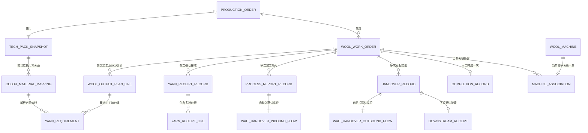
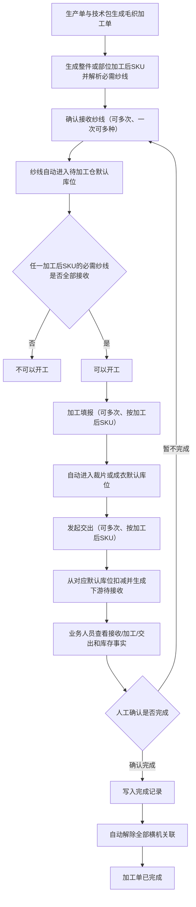
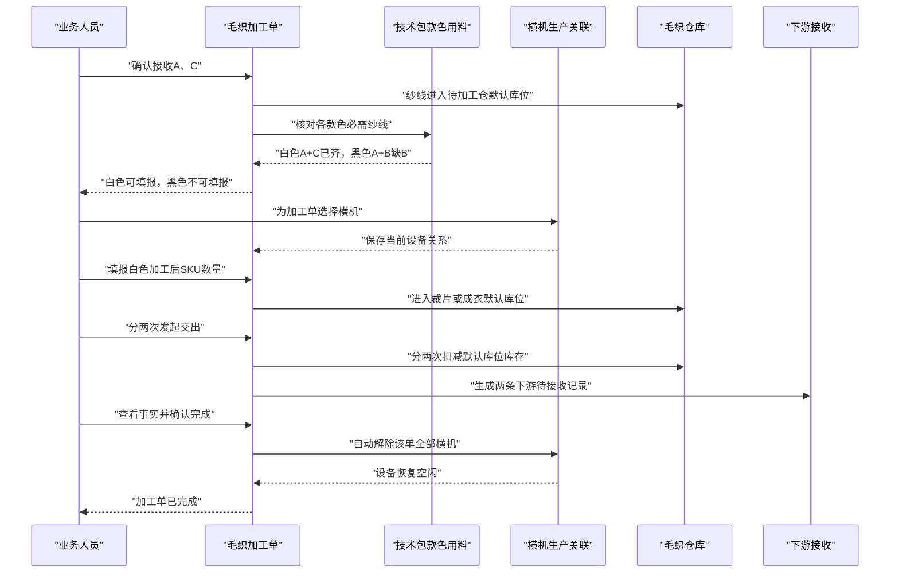

# 毛织管理事实型加工单重构设计

> 文档状态：业务已确认
>
> 设计日期：2026-07-30
>
> 业务确认日期：2026-07-30
>
> 复核确认日期：2026-07-30
>
> 设计范围：毛织加工单、横机生产关联、毛织仓库事实、PDA 执行及直接上下游
>
> 方案结论：采用方案 1，在毛织模块范围内干净重写，不在旧节点状态机上继续叠加兼容逻辑
>
> 确认结论：本文档作为后续实施、规格审查和业务验收的正式基线
>
> 当前阶段：主体实现已落地；2026-08-01 已按交出单、件数口径、款式图和扫码要求完成复核，并进一步纠正“把投入纱线误当成交出物料”的设计错误，仍须以最终规格审查、代码质量审查和浏览器验收结果作为完成依据

## 1. 文档目的

本设计解决的不是“修改几个按钮”，而是把毛织加工单从旧的固定工序节点模型，重构为以真实业务记录为核心的事实模型。

重构后，一个毛织加工单只围绕以下业务事实运行：

1. 确认接收纱线，可多次。
2. 加工填报，可多次。
3. 发起交出，可多次。
4. 业务人员主动完成加工单，只能一次。
5. 横机与加工单的关系独立动态维护，不再作为加工单状态节点。

本设计同时覆盖：

- 技术包中的款色用料关系如何成为开工判断依据。
- 毛织加工单列表、详情和操作弹窗。
- 横机设备与加工单的当前关联关系。
- 毛织待加工仓、待交出仓及 PDA 仓管页面。
- PDA 毛织执行任务。
- 任务生成、移动任务索引、交接记录、菜单、路由和专项检查。
- 旧“横机成片、缝盘、熨烫、包装、菲票打印”节点及相关代码、字段和文案的清理边界。

### 1.1 已确认业务基线

| 主题 | 最终结论 |
|---|---|
| 核心操作 | 确认接收、加工填报、发起交出均可多次；完成加工单由业务人员人工确认 |
| 加工前对象 | 技术包款色用料关系中的多种必需纱线 SKU |
| 整件加工后对象 | 成衣 SKU，单位为件 |
| 部位加工后对象 | 毛织部位 SKU，数量单位为件 |
| 部位计划量 | 对应颜色+尺码成衣 SKU 的计划件数，不按单件部位片数换算 |
| 开工判断 | 任一加工后 SKU 所需的全部必需纱线 SKU 均存在确认接收 |
| 纱线数量 | 不参与可加工数量换算 |
| 加工上限 | 单加工后 SKU 累计填报不超过自身计划量的 150% |
| 列表 Tab | “可以开工”等于当前至少有一个加工后 SKU 可继续填报；已齐料但全部达到 150% 时进入“不可以开工”并显示上限原因 |
| 默认库位 | 纱线、裁片、成衣各使用毛织工艺下唯一固定默认库位 |
| 库存联动 | 加工填报自动入库；发起交出自动扣库存 |
| 数量修改 | 完成前可直接修改数量并按差额调整库存；不提供撤销、作废或删除 |
| 完成冻结 | 完成后毛织来源记录只读，自动解除全部横机，不清除剩余库存；下游仍可确认接收并回写结果 |
| 交出对象 | 只交出本次加工形成的成衣或毛织部位；投入纱线是上游原料，不是交出对象，交出单不得展示投入纱线及其图片 |
| 横机状态 | 只保留空闲、生产中、维修、停用；删除已排产 |
| 设备异常 | 生产中设备维修或停用时，影响确认后自动解除关联 |
| 下游确认 | 保留实际接收和差异；确认后来源交出数量锁定 |
| 删除范围 | 删除毛织旧节点、菲票、统计、价格、已排产和独立完工入仓及其相关代码和文案 |

## 2. 逐行代码核查说明

### 2.1 核查方法

本设计先同步 CodeGraph 索引，再按以下顺序核查代码：

1. 用 CodeGraph 确认毛织模块文件、核心符号和影响范围。
2. 逐行阅读毛织领域文件和全部毛织 Web 页面。
3. 沿调用关系逐行阅读技术包、生产任务生成、PDA 执行、PDA 仓管和通用交接适配。
4. 逐行核对路由、菜单、主事件分发和专项检查脚本。
5. 对中文节点文案做全仓文字检索，区分毛织专属引用与其他业务正常使用。

复核完成时 CodeGraph 索引状态为最新，共 1,327 个文件、40,966 个节点、147,040 条关系边。`WoolWorkOrder` 两层影响范围涉及 96 个符号；`getWoolAllowedActions` 三层影响范围涉及 35 个符号，说明该改动必须同步处理 Web、PDA、仓库和通用任务适配，不能只修改毛织列表。

### 2.2 已逐行阅读的核心代码

以下行号基于本设计成文时的代码版本；后续实现造成行号变化时，以文件和符号名为准。

| 层级 | 文件与核查范围 | 当前代码事实 | 设计结论 |
|---|---|---|---|
| 毛织领域 | `src/data/fcs/wool-task-domain.ts` 全文 | 3,400 余行把单一纱线接收、固定节点、横机排产、菲票打印、仓库推导和 PDA 种子集中在一个文件 | 在毛织模块内重建事实模型；删除旧节点状态机及自动推进函数 |
| 毛织页面公共代码 | `src/pages/process-factory/wool/shared.ts` 全文 | 公共方法仍硬编码旧状态、价格格式化、统计卡片和自定义列表分页 | 删除毛织价格、旧状态和统计卡片辅助方法；标准列表改用公共列表组件，详情内小型记录表只保留最小分页能力 |
| 加工单列表 | `src/pages/process-factory/wool/work-orders.ts` 全文 | 1,500 余行同时承担列表、所有弹窗、仓库动作和旧节点自动推进 | 拆清列表、操作弹窗和事件处理；列表迁移至标准列表页组件 |
| 加工单详情 | `src/pages/process-factory/wool/work-order-detail.ts` 全文 | 页签直接包含“横机成片”“缝盘熨烫包装”“毛织菲票” | 改为业务概览、款色用料、接收记录、加工填报、交出记录、横机关联和操作记录 |
| 横机排产 | `src/pages/process-factory/wool/machine-schedule.ts` 全文 | 只展示“待横机排产”的加工单，要求机台数、起止日期和手输机号 | 整页改为“横机生产关联”，默认展示全部设备当前状态和当前加工单 |
| 横机设备 | `src/pages/process-factory/wool/machines.ts` 全文 | 设备档案页混有“查看横机排产”语义 | 保留设备档案职责；关联维护统一进入“横机生产关联” |
| 毛织菲票 | `src/pages/process-factory/wool/fei-tickets.ts` 全文 | 页面只服务于毛织菲票打印状态和打印操作 | 删除页面、菜单、路由和渲染器 |
| 毛织统计 | `src/pages/process-factory/wool/statistics.ts` 全文 | 所有统计都依赖旧节点和菲票打印状态 | 删除页面、菜单、路由、渲染器、Mock 数据和专项检查，不在列表增加统计卡片 |
| 毛织仓库 | `src/pages/process-factory/wool/warehouse.ts` 全文 | Web 仓库包含领料入仓、加工领料、回收入仓、完工入仓、交出确认，并调用加工单文件里的弹窗 | 仓库仅表达物理库存和流转事实；不得自动推进加工单状态 |
| PDA 执行 | `src/pages/pda-exec-detail.ts` 毛织渲染、前置判断和事件处理相关段落 | PDA 仍按接单、开工、横机里程碑、缝盘、熨烫、包装、菲票和自动完工运行 | 改为与 Web 同源的确认接收、加工填报、发起交出和人工完成 |
| PDA 接单 | `src/pages/pda-task-receive.ts:330-342, 1459-1492` | 毛织任务“确认接单”调用 `acceptWoolWorkOrder`，与本次“确认接收纱线”语义冲突 | 毛织加工单不再用接单状态门禁；毛织任务接收页不得把接单写成纱线接收 |
| PDA 待加工仓 | `src/pages/pda-warehouse-wait-process.ts` 毛织动作相关段落 | “加工领料”会自动完成领料、排机并启动横机成片 | 删除自动推进；仓库领用/退回即使保留，也只能形成独立库存事实 |
| PDA 待交出仓 | `src/pages/pda-warehouse-wait-handover.ts` 毛织动作相关段落 | “完工入仓”会循环完成所有旧节点；“交出确认”会自动打印菲票 | 删除自动完成旧节点和自动打印菲票 |
| PDA 仓管首页 | `src/pages/pda-warehouse.ts:36-38, 46-63, 172-189, 203-247` | 毛织快捷入口仍写“给横机使用”“完工入仓”“交出确认” | 改成与事实模型一致的仓库入口，不再表达加工节点 |
| 移动任务绑定 | `src/data/fcs/process-mobile-task-binding.ts:393-416, 740-846, 927-986` | 毛织任务被合入统一移动执行列表，并按加工单任务号校验绑定 | 保留任务绑定，但更换状态和动作投影 |
| 移动任务索引 | `src/data/fcs/mobile-execution-task-index.ts:225-244, 417-443` | 只投影单一 `yarnReceipt.yarnSku`，并投影菲票号 | 改为多纱线摘要；删除毛织菲票字段及投影 |
| PDA 交接事件 | `src/data/fcs/pda-handover-events.ts:1332-1363, 3746-3783` | 毛织领料和交出以静态种子并入通用交接头、明细 | 改为从多次接收记录和多次交出记录生成 |
| 工厂仓库概览 | `src/data/fcs/factory-mobile-warehouse.ts:93-124` | 以单一纱线收货、旧完工入仓和交出记录计算毛织仓库概览 | 改为按接收行与交出行汇总，避免按加工单数冒充物料行数 |
| 技术包类型 | `src/data/pcs-technical-data-version-types.ts:315-345` | 毛织工艺含 `requiresFeiTicket`、`packagingRequired` 等旧执行要求 | 删除毛织专属的菲票打印和包装节点配置；保留任务类型、交出对象等仍有效字段 |
| 技术包快照构建 | `src/data/fcs/production-tech-pack-snapshot-builder.ts:739-807, 1018-1048` | `alignSnapshotWithDemandSkuLines()` 会把首条款色用料关系复制给没有明确关系的颜色，且改写适用 SKU | 保留快照对生产单 SKU 的对齐能力，但必须标记“技术包原始关系/需求兜底关系”；毛织齐料只认技术包原始关系，不认兜底复制 |
| 技术包快照运行时 | `src/data/fcs/production-order-tech-pack-runtime.ts` 全文、`src/data/fcs/production-tech-pack-snapshot-types.ts` 全文 | 毛织领域实际从生产单冻结快照读取 BOM、款色用料和纸样，不直接读取技术包编辑态 | 加工单保存快照版本和来源行；已生成加工单不随技术包后续版本变化 |
| 技术包页面 | `src/pages/tech-pack/process-domain.ts:94-210, 532-646` | 毛织规则卡展示菲票规则、包装节点开关、固定交出说明 | 删除旧节点文案和开关；款色用料关系成为开工判断的唯一技术依据 |
| 技术包快照页 | `src/pages/fcs-production-tech-pack-snapshot.ts:430-465` | 执行要求列展示“打印毛织菲票”“毛织厂包装” | 删除两项毛织执行要求 |
| 技术包样例 | `src/data/pcs-technical-data-version-bootstrap.ts:204-265` | 样例写死熨烫、包装和打印菲票 | 改为接收、加工填报、交出语义 |
| 任务生成 | `src/data/fcs/process-tasks.ts:560-647, 903-1085` | 新毛织任务默认已接单、已开工、已上报横机里程碑，并只找第一条物料行 | 改为生成未加工的加工单，生成款色/SKU 计划行和全部必需纱线关系 |
| 运行时任务 | `src/data/fcs/runtime-process-tasks.ts` 毛织任务合成与投影相关段落 | `wool-task-domain.ts` 实际消费 `listRuntimeExecutionTasks()`；通用接单、价格和里程碑字段会被带入毛织加工单 | 保留通用任务分配关系，但不得把通用接单、价格或里程碑投影成毛织加工单状态和操作门禁 |
| 任务明细 | `src/data/fcs/task-detail-rows.ts:255-327` | 旧实现中部位毛织曾按纸样部位、成衣 SKU 和单件片数生成计划口径 | 明确加工后对象粒度；整件按成衣 SKU，部位按毛织部位 SKU，但部位计划数量、完工数量和交出数量均按颜色+尺码件数，不按单件部位片数换算 |
| 生产工艺产物 | `src/data/fcs/production-artifact-generation.ts:307-321` | 自动写入菲票和包装要求 | 删除旧要求的产物字段 |
| 里程碑配置 | `src/data/fcs/milestone-configs.ts:209-258` | 毛织配置明确要求“横机首批上报” | 删除毛织专属横机里程碑配置，避免 PDA 重新生成旧动作 |
| 工艺字典 | `src/data/fcs/process-craft-dict.ts` 毛织定义相关段落 | 毛织工艺备注仍写熨烫必有、包装按单、部位打印菲票 | 只清理毛织工艺定义中的旧描述；不得删除全局熨烫/包装工序 |
| 通用打印 | `src/pages/print/templates/label-print-template.ts` 毛织引用 | 通用标签模板直接读取毛织菲票打印记录 | 移除毛织打印数据源；其他业务标签打印保持不变 |
| 路由链接 | `src/data/fcs/fcs-route-links.ts:205-247` | 提供毛织菲票和横机排产链接 | 删除菲票链接；将横机排产链接改为横机生产关联链接 |
| 路由注册 | `src/router/routes-fcs.ts:146-153, 359-376, 539-540` | 注册毛织菲票、横机排产及详情路由 | 删除菲票、统计和旧横机排产路由；只注册新的横机生产关联路由，不保留旧路由兼容 |
| 异步渲染 | `src/router/route-renderers-fcs.ts:505-535` | 独立加载菲票页和横机排产页 | 删除菲票渲染器；排产渲染器更名 |
| 菜单 | `src/data/app-shell-config.ts:514-529` | 菜单包含“横机排产”“毛织菲票” | 改为“横机生产关联”，删除“毛织菲票” |
| 主事件分发 | `src/main-handlers/fcs-handlers.ts:213-215, 392-399` | 分别分发加工单、横机排产和设备事件 | 替换为加工单、横机生产关联、设备事件 |
| 毛织价格投影 | `src/data/fcs/wool-task-domain.ts:1049-1059, 2447-2453`、`src/data/fcs/page-adapters/task-execution-adapter.ts:308-313` | 价格由横机、缝盘、熨烫和包装分钟估算，并投影为标准价和派工价 | 删除毛织价格结构、估价、页面展示、移动任务投影和结算投影；不以 0 或“待维护”占位 |
| 横机状态 | `src/data/fcs/wool-task-domain.ts:52, 1657-1688`、`src/pages/process-factory/wool/machines.ts` | 包含空闲、已排产、生产中、维修、停用，并允许设备编辑页直接选择任一状态 | 删除“已排产”；生产中由当前关联派生，维修或停用生产中设备时二次确认并自动解除关联 |
| 毛织旧完工入仓 | `src/pages/process-factory/wool/work-orders.ts:939-1124` | `advanceWoolOrderToWarehouseInbound()` 会自动接单、领料、排机并循环完成旧节点 | 删除函数、完工入仓弹窗、按钮和事件；加工填报直接写入毛织待交出仓默认库位 |
| 专项检查 | `scripts/check-wool-internal-style-code.ts` 全文 | 仍强制列表渲染紧凑统计卡片 | 改为校验筛选联动的三类 Tab 数量，不再要求统计卡片 |
| 专项检查 | `scripts/check-wool-warehouse-unified-model.ts` 全文 | 强制存在加工领料、完工入仓、交出确认和对应 PDA 自动动作 | 按事实模型重写，禁止旧节点自动推进 |
| 列表治理 | `scripts/standard-list-page-baseline.json` | 毛织加工单仍在历史基线中 | 列表完成标准化后删除该基线条目，不得更新哈希绕过治理 |

### 2.3 当前实现与目标需求的根本冲突

#### 冲突一：接收对象错误

当前 `WoolWorkOrder` 只有一个 `yarnReceipt`。`resolveYarnReceipt()` 通过 `find()` 只取技术包中的第一条匹配纱线，后续确认收货也是覆盖这个单一对象。

这无法表达：

- 一次接收 A、B 两种纱线。
- 第一次接收 A，第二次接收 B。
- 同一纱线分多个送货批次到达。
- 黑色款需要 A、B，白色款需要 A、C 的共同纱线关系。

#### 冲突二：加工单状态被固定节点支配

当前状态由 `deriveWoolOrderStatus()` 根据“横机成片、缝盘、熨烫、包装、菲票打印、交出、仓库收货”串行推导。用户要求的三类可重复事实无法嵌入这条单向链路。

#### 冲突三：横机被当成加工节点和排期

当前 `scheduleWoolMachines()` 同时写排期记录、加工单状态和“横机成片”节点机号。机器关系不能独立转移、替换或在完成加工单时统一解除。

#### 冲突四：仓库动作会篡改加工事实

当前 Web/PDA 的“加工领料”和“完工入仓”会自动接单、自动确认领料、自动排机、自动完成所有节点。物理仓库事实和加工履约事实被混成同一个状态推进器。

#### 冲突五：上游默认把新单做成已开工

当前生产任务生成会把毛织任务默认设置为已接单、进行中、已有开工凭证和横机里程碑。新加工单从生成时就越过了真实的纱线确认接收门禁。

#### 冲突六：整件与部位毛织的加工后对象被混为成衣 SKU

旧实现和早期设计中，部位毛织任务明细曾按“毛织部位 + 成衣颜色尺码 + 单件片数”推导计划口径。新要求明确部位毛织的完工数量和交出数量也是颜色+尺码件数，因此不能再把计划量、150% 上限、库存和交出数量按单件片数换算。另一方面，若统一使用 `garmentSkuCode`，又会导致部位毛织的加工后对象失真。

#### 冲突七：旧价格依赖已删除节点

当前毛织价格由横机、缝盘、熨烫和包装分钟估算，并继续投影到移动任务的标准价和派工价。删除旧节点后继续保留价格字段会形成没有业务来源的虚假价格。

#### 冲突八：旧完工入仓会自动推进全部节点

当前 `advanceWoolOrderToWarehouseInbound()` 会从接单、领料、排机开始循环推进，直到完成横机、缝盘、熨烫、包装或菲票节点。新模型中加工填报本身即形成待交出仓入库事实，该旧函数及入口不能保留。

#### 冲突九：通用任务明细中的纱线身份不能作为开工来源

`src/data/fcs/task-detail-rows.ts` 当前生成物料候选时存在把 `item.id` 投影为 `materialCode` 的路径。毛织开工判断不得读取该通用明细字段推测纱线 SKU，必须直接使用生产单绑定的技术包快照和款色用料关系。

#### 冲突十：生产单快照会补造缺失颜色的款色用料关系

`alignSnapshotWithDemandSkuLines()` 当前对生产单中没有明确款色用料关系的颜色，复制技术包第一条关系并替换颜色和适用 SKU。该行为可用于通用原型数据对齐，但不能作为毛织开工证据，否则“技术包缺关系”会被误判为“纱线已配置”。

毛织解析必须能区分：

- 技术包原始、已确认的款色用料关系。
- 为通用展示补齐的需求兜底关系。

只有前者可以进入必需纱线集合。兜底关系不得让加工后 SKU 变成可填报。

#### 冲突十一：固定默认库位与毛织自建库区库位维护并存

当前毛织领域保存 `areas`、`locations`，Web 和 PDA 允许新增、编辑、删除库区库位并在每次操作时人工选位。目标规则是纱线、裁片、成衣分别使用唯一默认库位，两套规则同时保留会导致同一业务动作落入不同位置。

毛织模块必须删除自建库区库位维护和自动选位逻辑。核心三类操作只写固定默认库位；仓库独立调整或转移如需选择其他位置，应读取公共仓库位置主数据，不能重新建立毛织专属位置体系。

#### 冲突十二：“关联生产单”的页面名称与实际关联对象不一致

横机关系的真实目标是毛织加工单，不是笼统生产单；但业务入口名称已确认为“关联生产单”。当同一生产单生成多张毛织加工单时，仅选择生产单无法确定设备到底服务哪张加工单。

弹窗必须先选生产单，再定位具体毛织加工单：只有一张符合条件时自动选中；存在多张时必须再选具体加工单，然后才能选择设备。底层始终保存 `machineId + woolOrderId`。

### 2.4 再次复核补漏闭环

本次再次沿代码调用关系对正式文档做反向核查，新增闭环如下：

| 补漏项 | 代码证据 | 文档落点 |
|---|---|---|
| 技术包缺色关系会被兜底复制 | `production-tech-pack-snapshot-builder.ts` 的 `alignSnapshotWithDemandSkuLines()` | 5.2、5.4：增加关系来源标记，毛织只认原始关系 |
| 当前类型没有“纱线”枚举 | `TechnicalBomItemType`、`TechnicalColorMaterialMappingLine.materialType` | 5.2：只认明确关联且标记毛织用途的 BOM，不按名称推测 |
| 既有加工单可能被新技术包版本影响 | 毛织运行时直接读取生产单技术包快照 | 5.4、12.1：生成时冻结版本和来源行 |
| 固定默认库位与毛织位置 CRUD 冲突 | `WoolWarehouseArea/Location`、仓库 `locations` 页签和 Web/PDA 选位 | 11.1、14.2：删除毛织位置维护，核心操作不选位 |
| 新纱线退回容易误复用旧损耗回收 | `WoolYarnRecoveryRecord`、`recordWoolYarnRecovery()`、缝盘损耗推导 | 11.1、13、14.2：独立领用/退回记录，删除旧回收模型 |
| “关联生产单”不能唯一定位加工单 | 关系实际字段为 `woolOrderId` | 9.2：生产单后级联具体加工单 |
| 交出弹窗自由输入接收方会破坏路由 | PDA 当前维护 `woolHandoverReceiver` 文本 | 7.3、12.2：结构化去向只读带出 |
| 毛织公共代码仍携带旧状态和价格 | `wool/shared.ts` 的状态、金额、统计卡片、自定义表格方法 | 10、14：删除旧辅助代码并接入标准列表组件 |
| 通用任务接单会继续推进毛织 | `pda-task-receive.ts` 调用 `acceptWoolWorkOrder()` | 6.3、11.3、12.1：保留上游协作但不作为毛织门禁 |
| 完成弹窗块数表述错误 | 文档写“三块”但实际列出四块 | 8.2：明确为四块 |

## 3. 设计原则与边界

### 3.1 设计原则

1. 对象明确：加工前对象是技术包指定的多种纱线 SKU；加工后对象是整件成衣 SKU 或毛织部位 SKU。
2. 事实优先：接收、加工、交出和设备关联都保存独立记录。
3. 状态派生：列表状态和可操作性由记录计算，不靠人工推进节点。
4. 款色判断：开工门禁以“任一加工后 SKU 所需的全部必需纱线均有确认接收”为准。
5. 数量分离：纱线接收数量不参与可加工件数换算。
6. 多次操作：确认接收、加工填报和发起交出都允许多次。
7. 仓库同源：加工填报与待交出仓入库一次保存，发起交出与库存扣减一次保存。
8. 数量可改：加工单完成前允许直接修改确认接收、加工填报和未被下游确认的交出数量，库存只按新旧差额调整，并保留修改历史。
9. 人工收口：完成加工单不做数量充分性判断，由业务人员查看事实后二次确认。
10. 完成冻结：加工单完成后，毛织侧接收、填报、交出和设备关系只读；完成动作不清除剩余库存，也不阻断下游确认接收。
11. 设备独立：横机关联是当前生产关系，不是加工单状态。
12. 仓库独立：纱线领用、退回和剩余成品库存调整不代替业务人员填报加工进度。

### 3.2 本次明确删除的内容

以下内容在“毛织加工单语境”中全部删除：

- 横机成片节点及开始、上报、完成动作。
- 缝盘节点及开始、完成、损耗自动计算。
- 熨烫节点及开始、完成动作。
- 包装节点、是否需要包装节点和跳过包装动作。
- 菲票打印节点、待打印/已打印状态、打印/补打动作和毛织菲票页面。
- 毛织专属菲票号、菲票字段、菲票数据源和交出弹窗中的菲票内容。
- 毛织统计页面、菜单、路由、渲染器、Mock 数据和专项检查。
- 毛织价格结构、估价、标准价、派工价、差价原因、结算投影及页面文案。
- 横机“已排产”状态、筛选、Mock 数据、状态转换和文案。
- 独立“完工入仓”入口及其自动推进函数。
- 毛织专属库区库位新增、编辑、删除和每次业务操作人工选位。
- 缝盘损耗、可回收损耗、损耗纱线回收及其关联加工单推导。
- 由上述节点派生的里程碑、PDA 按钮、证据文案和自动推进函数。

以下内容不在删除范围：

- 全局工艺字典中的独立“熨烫”“包装”工序，因为其他业务仍可能使用。
- 其他模块的菲票生成、打印和流转。
- “整件毛织”“部位毛织”任务类型及其不同交出对象。
- 毛织以外模块的价格、统计、横机以外设备状态和仓库库位逻辑。

### 3.3 本次不做

- 不按纱线接收重量和单件用量计算最多可加工件数。
- 不做纱线分配、预占或在多个款色之间扣减。
- 不复制辅助工艺领域模型；复用其“按工艺和加工后对象类型定位默认库位”的统一仓库规则。
- 不建设真实后端、数据库或接口。
- 不重构毛织以外的工艺字典和仓库体系。

## 4. 业务对象与关系



### 4.1 毛织加工单

毛织加工单是一次毛织加工履约的业务主对象，保留：

- 加工单编号、任务编号。
- 生产单、款号、款名、内部货号。
- 整件毛织或部位毛织。
- 承接工厂。
- 计划开始、计划完成。
- 交出对象。
- 加工前纱线 SKU 集合。
- 加工后 SKU 计划行。
- 技术包快照版本和生成来源。

加工单不再直接保存：

- 单一纱线接收对象。
- 固定执行节点数组。
- 横机排产编号和计划机数。
- 菲票打印状态。
- 价格及结算字段。
- 单一累计完成数量和单一交出数量作为事实源。

### 4.2 加工前对象与加工后对象

每张毛织加工单必须同时明确：

- 加工前对象：技术包款色用料关系中属于该加工单的全部必需纱线 SKU。
- 加工后对象：加工填报、库存、交出和 150% 上限所共同使用的输出 SKU。

加工后对象按毛织类型区分：

| 毛织类型 | 加工后对象 | 计划数量来源 | 单位 |
|---|---|---|---|
| 整件毛织 | 成衣 SKU | 生产单对应成衣 SKU 的计划件数 | 件 |
| 部位毛织 | 毛织部位 SKU | 生产单对应颜色+尺码成衣 SKU 的计划件数 | 件 |

部位毛织不得继续只用成衣 SKU 作为加工后对象。加工后 SKU 生成规则固定为：

1. 技术包已经提供毛织部位 SKU 时，直接使用该编码。
2. 技术包没有独立编码时，原型按 `WP-{patternId}-{garmentSkuCode}` 生成稳定编码；相同纸样部位和成衣 SKU 始终得到同一编码。
3. `patternId` 或部位名称缺失时，不生成可填报计划行，页面显示“技术包毛织部位资料不完整”。
4. 生成后的部位 SKU 在加工填报、待交出仓、交出和下游接收中保持同一编码。

示例：黑色 M 码成衣计划 100 件，该颜色尺码需要袖片毛织加工，则黑色 M 码袖片加工后 SKU 的计划量为 100 件，累计加工填报上限为 150 件。单件所需片数可以作为技术资料展示，但不得参与毛织完工数量、交出数量和 150% 上限换算。

### 4.3 加工后 SKU 计划行

每个计划行至少包含：

- 加工后 SKU、加工后对象类型。
- 对应成衣 SKU。
- 毛织部位编码和名称，整件毛织为空。
- 颜色编码、颜色名称。
- 尺码。
- 计划数量和单位。
- 对应的必需纱线 SKU 集合。
- 累计加工填报数量。
- 累计交出数量。
- 当前是否可填报及缺少的纱线。

同一颜色有多个尺码 SKU 时，技术包款色用料关系复用于这些加工后 SKU；加工数量上限仍按每个加工后 SKU 自己的计划数量计算。

### 4.4 确认接收记录

一次确认接收是一张业务记录，可包含多条纱线：

- 接收记录编号。
- 送货单号或来源单号。
- 批次号。
- 接收时间、接收人。
- 凭证和备注。
- 多条纱线明细。

每条明细包含：

- 物料 SKU。
- 物料名称、颜色或规格。
- 实收数量和单位，可记录但不参与开工门禁。
- 差异说明。

确认接收只能选择本加工单技术包款色用料关系中的纱线 SKU，不能录入技术包外纱线。保存后，每条纱线明细自动进入“毛织待加工仓 / 纱线默认库位”，业务人员不选择库区库位。

记录不提供撤销、作废或删除。有效确认接收明细是已成功保存且实收数量大于 0 的明细；草稿、保存失败的数据和仅存在于技术包中的计划行都不算“有过确认接收”。加工单完成前允许直接修改实收数量；系统保存修改前数量、修改后数量、修改人、修改时间和修改原因，并按差额调整纱线默认库位库存。修改后不得使当前纱线库存小于零。

### 4.5 加工填报记录

一次加工填报只针对一个加工后 SKU，包含：

- 填报记录编号。
- 加工后 SKU、颜色、尺码和部位。
- 本次填报数量。
- 填报时间、填报人。
- 凭证和备注。
- 自动生成的待交出仓入库流水编号。

同一加工单可多次填报，同一加工后 SKU 也可多次填报。保存填报与写入默认库位必须是一次原子操作：

- 部位毛织自动进入“毛织待交出仓 / 裁片默认库位”。
- 整件毛织自动进入“毛织待交出仓 / 成衣默认库位”。
- 任一步失败，本次加工填报均不成立。

加工单完成前允许直接修改填报数量。系统按新旧差额调整对应默认库位；修改后的累计填报不得超过计划量的 150%，不得小于该加工后 SKU 已交出数量，也不得使对应默认库位库存小于零。

### 4.6 发起交出记录

一次发起交出只针对一个加工后 SKU，包含：

- 交出记录编号。
- 加工后 SKU、颜色、尺码和部位。
- 本次交出数量。
- 接收对象。
- 发起时间、发起人。
- 凭证和备注。
- 下游实际接收数量和时间，如下游已回写。
- 自动生成的待交出仓出库流水编号。

同一加工单可多次交出，同一加工后 SKU 也可多次交出。保存交出与扣减默认库位库存必须是一次原子操作。部位毛织扣减裁片默认库位，整件毛织扣减成衣默认库位。系统按加工后 SKU 计算可交出余额：取“该 SKU 默认库位有效库存”和“该 SKU 累计有效加工填报减累计有效交出”的较小值；余额不足时整次保存失败且不新增交出记录、不写库存流水。

下游确认接收前允许直接修改交出数量，系统按差额扣减或返还库存。增加数量时，增加量不得超过修改前同一加工后 SKU 的可交出余额，因此同时受该 SKU 未交出填报余额和默认库位有效库存限制；独立调高库存不能把累计有效交出修改到累计有效加工填报以上。下游确认接收后交出数量锁定；下游实际接收数量与交出数量不一致时保留差异，不自动恢复毛织库存。

### 4.7 完成记录

完成记录每个加工单最多一条：

- 完成人、完成时间。
- 完成确认备注。
- 确认当时的接收、加工、交出汇总快照。
- 自动解除的横机编号。

保存快照的目的，是避免下游后续回写、仓库后续调整后，无法还原当时业务人员看到的确认依据。

加工单完成后，毛织侧确认接收、加工填报、发起交出、数量修改和设备关联记录只读。已生成的下游待接收记录仍可由下游确认接收并回写实际接收数量、差异、接收人和接收时间，但不得反向修改毛织来源交出数量。完成时仍在待交出仓的裁片或成衣库存不清除，继续关联已完成加工单，只能通过仓库独立的库存调整或库存转移处理。

### 4.8 横机当前关联

横机关联表示“该设备当前正在为哪个毛织加工单生产”，不是排产节点。

关系约束：

- 一个加工单可关联多台横机。
- 一台横机当前最多关联一个加工单。
- 同一设备和加工单不能存在重复当前关系。
- 关联历史可作为操作记录保留，但当前页面只以当前关系为准。
- 业务入口可以叫“关联生产单”，但当前关系必须落到具体 `woolOrderId`，不能只保存生产单号。

横机只保留“空闲、生产中、维修、停用”四种状态。“生产中”由当前关联关系派生，不允许设备档案手工设置；“已排产”业务逻辑及相关代码全部删除。

## 5. 技术包到加工单的款色纱线解析

### 5.1 现有可用数据

技术包快照已经提供：

- `colorMaterialMappings`：款色用料关系。
- 每个款色的 `colorCode`、`colorName`。
- 每条关系的 `bomItemId`、`materialCode`、`materialName`、`materialType`。
- 每条关系的 `applicableSkuCodes`。
- BOM 中的 `usageProcessCodes`、`applicableSkuCodes` 和用量字段。

本次只使用“物料身份”和“适用款色/SKU”，不使用单耗和损耗率计算开工件数。

### 5.2 必需纱线解析规则

对加工单对应生产单的技术包快照执行：

1. 取得生产单的成衣 SKU 计划行，并按整件或部位规则生成加工后 SKU 计划行。
2. 按颜色匹配 `colorMaterialMappings`。
3. 只保留属于毛织/纱线的物料行：
   - 款色用料行必须能通过 `bomItemId`，或唯一的 `materialCode`，关联到 BOM 行。
   - 关联 BOM 的 `usageProcessCodes` 必须明确包含 `WOOL` 或 `PROC_WOOL`。
   - 当前 `TechnicalBomItemType` 和款色用料 `materialType` 都没有“纱线”枚举，因此不得靠“面料”类型、物料名称包含“纱”或第一条 BOM 进行推测。
   - 不得把同色关系中的包装、辅料或其他非毛织用途物料当作开工必需纱线。
4. 纱线身份必须使用款色用料关系明确指向的物料 SKU；不得使用整款 BOM 自动补齐或推测该颜色所需纱线。
5. 按 `applicableSkuCodes` 投影到对应成衣 SKU，再映射到整件或部位加工后 SKU。
6. 同一加工后 SKU 下按物料 SKU 去重。
7. 保存来源快照版本、关系行和 BOM 行引用，供详情追溯。

若某个加工后 SKU 没有解析出任何必需纱线，不能把空集合判定为“全部已接收”。该加工后 SKU 必须显示：

> 技术包缺少该款色的必需纱线关系，暂不可加工填报。

技术包发布前应校验：存在毛织工艺的款色，至少有一条已确认的款色用料行关联到标记为毛织用途的 BOM 物料。缺少 `materialCode`、找不到唯一 BOM、BOM 未标记毛织用途或关系仍为草稿时，均作为待完善项，不得由毛织模块自行猜测。

### 5.3 可加工判断

定义：

- `R`：该加工单全部确认接收记录中出现过的物料 SKU 集合。
- `Y(outputSku)`：某加工后 SKU 在技术包中要求的必需纱线 SKU 集合。

某加工后 SKU 已齐料，当且仅当：

1. `Y(outputSku)` 非空。
2. `Y(outputSku)` 中每一种纱线都存在于 `R`。

某加工后 SKU 当前可继续填报，当且仅当它已经齐料，且累计加工填报数量仍小于该 SKU 计划数量的 150%。

加工单属于“可以开工”，当且仅当至少一个加工后 SKU 当前可继续填报。这样“可以开工”Tab 与“当前可以点击加工填报”保持一致。若纱线已经齐全，但所有加工后 SKU 都已达到 150% 上限，则加工单归入“不可以开工”，原因显示“全部加工后 SKU 已达到填报上限”，不能误显示成缺纱线。

```text
加工后 SKU 已齐料 = 必需纱线集合非空 AND 必需纱线集合 ⊆ 已确认接收纱线集合
加工后 SKU 可继续填报 = 已齐料 AND 累计填报数量 < 计划数量 × 150%
加工单可以开工 = 存在至少一个加工后 SKU 可继续填报
```

示例：

| 款色 | 必需纱线 | 已确认接收 | 结果 |
|---|---|---|---|
| 黑色 | A、B | A | 黑色不可填报，缺 B |
| 白色 | A、C | A、C | 白色可填报 |
| 红色 | B、D | A、C | 红色不可填报，缺 B、D |

此时加工单进入“可以开工”Tab，因为白色满足纱线要求且仍有填报容量。系统不根据已接收纱线数量计算白色最多可做多少件；加工填报只受白色加工后 SKU 计划量 150% 的独立上限约束。

### 5.4 快照冻结与版本变化

毛织加工单只读取生成当时绑定到生产单的 `ProductionOrderTechPackSnapshot`：

- 加工后 SKU 计划、必需纱线、部位片数和来源引用在加工单生成时冻结。
- 保存 `sourceTechPackVersionId`、`sourceTechPackVersionCode`、款色用料关系行 ID 和 BOM 行 ID。
- 技术包后续发布新版本时，既有毛织加工单的齐料判断不静默变化。
- 如业务确需采用新版本，必须通过明确的“重建未发生业务的加工单”或后续独立变更流程处理；已有接收、加工、交出或完成记录的加工单不得自动重建。

生产单快照为通用展示生成的需求兜底关系必须带来源标记，例如 `mappingOrigin: 'TECH_PACK' | 'DEMAND_FALLBACK'`。毛织解析只接受 `TECH_PACK`。若不在公共类型中增加来源标记，则必须在毛织生成前保留并读取未经过兜底复制的原始技术包关系；两者必须选择其一，不能继续靠结果内容猜测来源。

## 6. 状态、分组与操作门禁

### 6.1 加工状态

加工单只保留三个加工状态：

| 状态 | 派生规则 |
|---|---|
| 未加工 | 未完成，且没有任何加工填报 |
| 加工中 | 未完成，且至少有一条加工填报或交出记录 |
| 已完成 | 已存在人工完成记录 |

确认接收本身不把加工状态改成“加工中”。

### 6.2 列表 Tab

列表只设三个互斥 Tab：

1. 可以开工：未完成，且至少一个加工后 SKU 当前可继续填报。
2. 不可以开工：未完成，且没有任何加工后 SKU 当前可继续填报；原因可能是必需纱线未齐，也可能是所有已齐料 SKU 均达到 150% 上限。
3. 已完成：已有完成记录。

每个 Tab 标签直接显示当前筛选条件下的数量，例如“可以开工 8”。不再增加重复的统计卡片。

搜索条件先作用于全量加工单，再计算三个 Tab 数量；切换 Tab 保留全部搜索条件。

### 6.3 操作显示规则

| 操作 | 显示条件 | 核心校验 |
|---|---|---|
| 详情 | 始终显示 | 无 |
| 确认接收 | 未完成 | 至少一条纱线明细；只能选择本单技术包必需纱线 |
| 加工填报 | 未完成且至少一个加工后 SKU 可继续填报 | 只能选已齐料且尚有 150% 容量的加工后 SKU |
| 发起交出 | 未完成且至少一个加工后 SKU 的可交出余额大于 0 | 本次交出不超过同一 SKU 的可交出余额；不同款色 SKU 的填报、交出和库存不得拼接 |
| 关联横机设备 | 未完成，且至少一个加工后 SKU 当前可继续填报或该单已有横机关联 | 维修、停用设备不可选择；即使全部 SKU 已达到上限，仍能进入弹窗解除现有关联 |
| 完成加工单 | 未完成且至少有一条交出记录 | 系统不判断是否足量，只要求二次确认 |

完成加工单后，毛织侧新增接收、加工填报、发起交出、数量编辑和设备关联操作全部锁定，只保留详情、仓库库存查看，以及对已生成下游待接收记录的正常确认接收。

通用生产任务中的工厂分配、接单或拒单属于上游任务协作事实，不是毛织加工单状态。毛织模块不得展示“确认接单”核心操作，也不得用通用 `acceptanceStatus` 阻止确认接收、加工填报或发起交出。

## 7. 三类可重复操作

### 7.1 确认接收

流程：

1. 用户点击“确认接收”。
2. 弹窗展示加工单、生产单、款号、技术包必需纱线和历史接收摘要。
3. 用户填写送货信息，并添加一条或多条纱线明细。
4. 保存后新增一条接收记录，不覆盖历史记录。
5. 系统重新计算每个加工后 SKU 的“已齐/缺料”状态和三个 Tab 数量。
6. 每条纱线明细自动进入“毛织待加工仓 / 纱线默认库位”。

弹窗防错：

- 默认只允许选择本加工单技术包涉及的纱线。
- 技术包外纱线不能录入该加工单。
- 不允许没有纱线明细的空记录。
- 同一次接收可填写多个 SKU。
- 数量可记录但不影响开工门禁。
- 接收数量必须大于 0。

### 7.2 加工填报

流程：

1. 用户点击“加工填报”。
2. 弹窗只列出必需纱线已经全部确认接收且尚有 150% 填报容量的加工后 SKU。
3. 每行显示计划量、150% 上限、历史累计填报、本次可填上限和缺料说明。
4. 用户选择一个加工后 SKU，填写本次数量和凭证。
5. 保存后新增加工填报记录，并自动将同一数量入到裁片或成衣默认库位。

数量规则：

```text
累计加工填报(outputSku) = 该加工后 SKU 所有加工填报数量之和
填报上限(outputSku) = 计划数量(outputSku) × 150%
本次填报数量 > 0
累计加工填报(outputSku) + 本次填报数量 ≤ 填报上限(outputSku)
```

整件和部位数量均按正整数填写。若计划量为奇数，150% 得到小数时，允许的最大整数取不超过该上限的整数。

缺少任一必需纱线时，该加工后 SKU 不出现在可选项中，并在弹窗下方“暂不可填报”区域说明缺少哪些纱线。

### 7.3 发起交出

流程：

1. 用户点击“发起交出”。
2. 弹窗逐个加工后 SKU 计算可交出余额，只列出余额大于 0 的加工后 SKU；独立库存调整形成的库存不能绕过同一 SKU 的加工填报余额。
3. 用户选择加工后 SKU，填写本次交出数量和凭证；接收对象按毛织类型和加工单既定去向自动带出，只读展示。
4. 保存后新增交出记录，并从裁片或成衣默认库位扣减同一数量。
5. 每次交出独立进入通用交接投影，等待下游确认接收。

数量规则：

```text
默认库位有效库存(outputSku) = 累计加工填报入库 - 累计交出出库 ± 独立库存调整/转移
未交出填报余额(outputSku) = 累计有效加工填报(outputSku) - 累计有效交出(outputSku)
可交出余额(outputSku) = min(默认库位有效库存(outputSku), 未交出填报余额(outputSku))
0 < 本次交出数量 ≤ 可交出余额(outputSku)
```

发起交出的前提自然包含“同一加工后 SKU 至少有一次有效加工填报”，因为没有该 SKU 的加工填报时可交出余额为 0。不同颜色或不同加工后 SKU 的加工填报与库存不得相互拼接。保存命令必须按输入的 `outputSkuCode` 再次计算并校验同一余额；无填报、余额为 0 或本次数量超出余额时，整次保存失败，不新增交出记录、不扣减库存。

接收对象不允许在弹窗中任意输入：

- 部位毛织固定为裁床待交出仓。
- 整件毛织固定为加工单上游已确定的后道工厂。
- 若加工单缺少具体接收对象标识，弹窗显示“交出去向未配置”，禁止保存，不能让操作人用自由文本绕过来源关系。

### 7.4 数量修改

确认接收、加工填报和发起交出记录都不提供撤销、作废或删除，只允许在业务边界内直接修改数量：

| 记录 | 可修改时间 | 修改后的同步结果 | 禁止条件 |
|---|---|---|---|
| 确认接收 | 加工单完成前 | 按差额调整纱线默认库位 | 修改后数量不大于 0，或调减后纱线库存小于 0 |
| 加工填报 | 加工单完成前 | 按差额调整裁片或成衣默认库位 | 修改后数量不大于 0、超过 150% 上限、累计填报小于累计交出，或调减后对应库存小于 0 |
| 发起交出 | 加工单完成前且下游未确认 | 按差额扣减或返还裁片/成衣默认库位 | 修改后数量不大于 0、增加量超过修改前同一 SKU 可交出余额，或下游已经确认 |

直接把数量改为 0 等同于变相撤销，因此不允许。每次修改必须填写修改原因，并保存记录编号、明细编号、对象 SKU、修改前数量、修改后数量、单位、修改人和修改时间。对象 SKU、毛织类型、接收方及原始来源不在数量编辑中变更。

## 8. 完成加工单

### 8.1 显示条件

只有至少存在一条交出记录时才显示“完成加工单”。

### 8.2 确认弹窗

弹窗按四块展示：

1. 确认接收情况：
   - 每种必需纱线是否接收。
   - 累计接收数量、批次、最近接收时间。
   - 各加工后 SKU 是否齐料及缺料。
2. 加工填报情况：
   - 每个 SKU 的计划数量。
   - 150% 上限。
   - 累计加工填报。
   - 与计划量的差异。
3. 发起交出情况：
   - 每个 SKU 累计加工、累计交出、尚未交出。
   - 各次交出及下游回写情况。
4. 待交出仓情况：
   - 裁片默认库位和成衣默认库位当前库存。
   - 完成后仍会保留的剩余库存。

弹窗明确提示：

> 系统仅展示当前业务事实，不判断该加工单是否应该完成。请业务人员核对后确认。

系统不因为缺料、加工少于计划、仍有未交出库存、存在纱线库存或下游尚未确认而阻止完成。

### 8.3 确认完成后的原子动作

一次确认内同时完成：

1. 写入完成记录和确认快照。
2. 加工状态变为已完成。
3. 锁定毛织侧确认接收、加工填报、发起交出、数量修改和重新关联设备；已生成的下游待接收记录仍可正常确认。
4. 删除该加工单的全部当前横机关联。
5. 被解除的横机状态改为空闲。
6. 写入完成和批量解除设备的操作记录。
7. 保留待加工仓与待交出仓现有库存，不自动清零、不自动交出。

若任何一步失败，本次完成不应只执行一半。原型实现以同一次内存存储更新表达原子性。

完成后的剩余库存继续关联已完成加工单，但不能再从加工单发起交出。后续处理只能使用仓库独立的库存调整或库存转移，并保留原因、操作人和流水。

## 9. 横机生产关联

### 9.1 页面定位

原“横机排产”改名为“横机生产关联”。该页面不是加工单状态页，而是设备当前生产关系工作台。

默认展示全部横机设备，每台一行：

- 设备编号、名称、机型、针型。
- 当前状态。
- 当前关联毛织加工单。
- 生产单、款号、内部货号。
- 关联时间、关联人。
- 操作：已关联设备可进入“编辑关联/解除关联”，空闲设备可从“关联生产单”统一维护；维修、停用设备只允许查看档案状态。

筛选：

- 生产单/加工单/款号关键字。
- 横机设备状态。
- 是否已关联。

右上角提供“关联生产单”。

### 9.2 两个维护入口

入口一：毛织加工单列表。

- 未完成且至少一个加工后 SKU 当前可继续填报时显示“关联横机设备”。
- 若加工单已有横机关联，即使全部加工后 SKU 已达到 150% 上限，也保留入口用于解除现有关联。
- 打开后当前加工单已关联设备默认选中。

入口二：横机生产关联页。

- 点击右上角“关联生产单”后，先选择生产单。
- 生产单只展示至少有一张满足以下任一条件的未完成毛织加工单：存在可继续填报的加工后 SKU，或当前仍有关联横机需要维护。
- 选定生产单后加载该生产单下符合条件的毛织加工单：
  - 只有一张时自动选中并只读展示。
  - 有多张时必须继续选择具体毛织加工单。
- 加工单选项显示加工单号、类型、款号、加工状态、齐料摘要和当前关联横机。
- 最后多选横机设备。
- 保存时仍以具体毛织加工单为目标，生产单只是业务检索的第一层。

两个入口调用同一套“保存整组关系”逻辑。

### 9.3 整组保存规则

弹窗所选设备集合是保存后的完整真相：

- 新选中的设备：新增关联。
- 原来已选且仍选中：保持关联。
- 原来已选但本次取消：解除关联并改为空闲。
- 已关联其他加工单但本次选中：提示将从原加工单转移，确认后完成转移。

跨单转移的二次确认必须绑定本次目标加工单、完整已选设备集合，以及每台受影响设备确认时的原加工单和关联时间。首次点击只展示影响并冻结该事实快照；再次确认前重新读取当前关系。设备已被其他操作转移、解除或重新关联时，提示“关联已变化，请重新确认”，本次保存不写关联、不写日志。业务人员改变生产单、具体加工单或任一设备勾选时，原二次确认立即失效。

生产中设备改为维修或停用采用同一原则：二次确认绑定设备、目标状态、档案基础状态及当前关联的加工单和关联时间；再次确认前事实变化则整次拒绝且零写入。业务人员改变目标状态时，原二次确认立即失效。

禁止只追加不移除，否则业务人员无法用一次保存表达当前真实机台集合。

### 9.4 设备状态联动

| 设备当前状态 | 是否可选 | 建立/保持关联后的状态 |
|---|---|---|
| 空闲 | 可选 | 生产中 |
| 生产中 | 可选，可保持或转移 | 生产中 |
| 维修 | 不可选，禁用展示 | 维修 |
| 停用 | 不可选，禁用展示 | 停用 |

解除关联后，设备自动变为空闲。完成加工单时批量解除也遵循同一规则。

“已排产”状态及其产生、筛选和展示逻辑全部删除。

设备档案页只允许业务人员手工选择“空闲、维修、停用”，“生产中”只能由当前关联关系派生。因此系统中不存在“生产中但没有当前加工单”的横机。

生产中的横机在设备档案页执行“登记维修”或“停用”时，先填写原因和必要信息。保存前显示影响确认弹窗，明确展示设备、当前毛织加工单、生产单、款号和关联时间。业务人员最终确认后，一次完成解除当前关联、修改为维修或停用、写入操作日志；任一步失败均不保存。维修或停用设备恢复可用时，由业务人员在设备档案页改为空闲；恢复为空闲不会自动建立任何加工单关联。

## 10. 页面详细设计

### 10.1 毛织加工单列表

页面顺序：

1. 标题和必要主操作。
2. 搜索条件。
3. 含数量的三个 Tab。
4. 标准列表表格。
5. 分页。

不显示统计卡片。

搜索字段：

- 加工单号/任务号。
- 生产单号。
- 款号/款名/内部货号。
- 承接工厂。
- 加工状态。
- 必需纱线 SKU。
- 计划日期范围。

表格列：

- 毛织加工单号，必需列。
- 生产单号。
- 款式/内部货号，必需列。
- 类型。
- 加工后 SKU 数。
- 计划数量摘要。
- 纱线接收摘要，必需防错列。
- 可填报加工后 SKU 摘要，必需防错列。
- 累计加工/累计交出。
- 当前关联横机。
- 加工状态。
- 计划完成时间。
- 操作，固定右侧。

列表必须使用 `renderStandardListPage`、`renderStandardListTable` 和 `renderTablePagination`，支持列排序、显示、顺序、冻结和按路由持久化。毛织加工单完成迁移后，从历史基线移除。

轻交互要求：

- Tab、筛选、分页和列偏好只局部刷新结果区。
- 弹窗打开关闭不整页重绘。
- 输入搜索使用防抖，不在每次输入时重绘整页。
- 交互响应目标不超过 200ms。
- 横机生产关联工作台的一次模型构建只能读取一次毛织事实存储；齐料、可维护性、当前关系和设备派生状态必须从同一份快照计算，避免同屏事实跨版本。
- 规模验收至少覆盖 600 张毛织加工单、600 台横机和 600 条当前关联，模型构建仍须低于 180ms。
- 标准列表组件的“跳过主页面重绘”必须是页面显式声明的局部事件契约，默认关闭。只有页面事件处理器确实完成表格、分页和列设置局部 DOM 更新时才可开启；毛织加工单、横机生产关联和横机设备三页显式开启，其他列表不能被共享组件静默改变重绘方式。

### 10.2 加工单详情

详情页签：

1. 业务概览。
2. 款色用料与开工判断。
3. 确认接收记录。
4. 加工填报记录。
5. 发起交出记录。
6. 横机关联。
7. 操作记录。

业务概览展示计划和事实汇总，不展示旧工序步骤条。

“款色用料与开工判断”逐加工后 SKU 展示：

- 加工后对象类型、加工后 SKU、对应成衣 SKU 和部位。
- 计划数量。
- 必需纱线。
- 每种纱线是否已确认接收。
- 缺少纱线。
- 是否可填报。
- 累计加工、累计交出和余额。

三个记录页签均分页，支持查看单次记录详情和凭证。

确认接收、加工填报和发起交出记录在满足数量修改边界时显示“修改数量”。弹窗只允许修改数量和修改原因；对象 SKU、来源、接收方和业务时间不随数量修改。记录详情展示完整数量修改历史。已完成加工单及下游已确认的交出记录不显示修改入口。

### 10.3 横机设备档案

“横机设备”继续作为设备主数据页，负责：

- 设备编号、名称、机型、针型。
- 设备档案状态。
- 维修、停用等设备管理事实。
- 跳转查看当前生产关联；链接携带经过 URL 编码的稳定 `machineId`，关联工作台只展示并定位该设备，离开后进入通用工作台时清除该定向条件。

该页不承担按加工单维护整组关联的主要职责，也不出现旧“横机排产节点”文案。

“横机生产关联”和“横机设备”都是本次调整的数据列表页，必须声明 `// @page-pattern: list`，使用 `renderStandardListPage`、`renderStandardListTable` 和 `renderTablePagination`。设备编号、当前状态、当前关联加工单和右侧操作列属于不可隐藏列；横向宽表在表格容器内滚动，不能让页面主体横向溢出。

### 10.4 已删除页面

“毛织统计”和“毛织菲票”页面不再属于毛织管理信息架构。对应菜单、路由、链接、渲染器、事件、Mock 数据和专项检查全部删除，不提供旧地址重定向。

## 11. 仓库与 PDA 联动

### 11.1 毛织待加工仓

确认接收保存后，按接收记录明细自动进入“毛织待加工仓 / 纱线默认库位”：

- 同一接收记录的多种纱线分别形成物料行。
- 同一纱线多次接收可累计展示，但明细保留批次。
- 库存按物料 SKU 和批次追溯；本期毛织不让业务人员选择库区库位。
- 修改接收数量时，按差额调整同一默认库位。

加工单开工判断只看必需纱线 SKU 是否存在确认接收记录，不读取待加工仓剩余数量。

待加工仓保留独立的“纱线领用”和“纱线退回”：

- 只更新仓库库存和流水。
- 不自动排机。
- 不自动创建加工填报。
- 不改变加工单状态。
- 支持同一加工单和纱线多次领用、退回。
- 领用必须关联未完成的毛织加工单和该加工单技术包中的纱线 SKU；从纱线默认库位扣减，不能超过该 SKU 当前库存。
- 退回必须关联原毛织加工单和同一纱线 SKU，回到纱线默认库位；同一加工单和纱线的累计退回不得超过累计领用。
- 加工单完成后不再新增纱线领用或退回；剩余纱线通过仓库独立调整或转移处理。
- 纱线领用和退回属于仓库记录，不属于加工单三类核心操作，不出现在加工单操作栏，也不改变“可以开工”判断。
- 领用、退回记录不使用核心业务记录的“直接修改数量”入口；仓库误差通过独立库存调整记录纠正，必须填写原因。
- 删除缝盘损耗、自动用量、损耗回收和剩余重量推导。

待加工仓库存唯一粒度为“加工单 + 纱线 SKU + 批次 + 纱线默认库位”。汇总行可合并展示同 SKU 数量，但详情和流水必须保留加工单、批次和来源接收明细，不能把不同加工单库存合成不可追溯的公共余额。

毛织仓库页面删除“库区管理/库位管理”页签以及新增、编辑、删除位置入口；删除毛织本地存储中的 `areas`、`locations` 和对应 CRUD。三个默认库位由固定配置或公共仓库位置主数据提供，不允许在毛织页面临时维护。

### 11.2 毛织待交出仓

待交出仓按辅助工艺现行统一规则，先按毛织工艺定位仓库，再按加工后对象类型定位唯一默认库位：

- 部位毛织使用裁片默认库位。
- 整件毛织使用成衣默认库位。

本期固定库位标识如下，页面不得动态随机选位：

| 用途 | 稳定标识 | 页面名称 |
|---|---|---|
| 纱线接收 | `WOOL-WP-YARN-DEFAULT` | 毛织待加工仓 / 纱线默认库位 |
| 部位毛织产出 | `WOOL-WH-CUT-DEFAULT` | 毛织待交出仓 / 裁片默认库位 |
| 整件毛织产出 | `WOOL-WH-GARMENT-DEFAULT` | 毛织待交出仓 / 成衣默认库位 |

加工填报保存后直接入对应默认库位，不再存在独立“完工入仓”操作。发起交出时直接从对应默认库位扣减库存，并生成一条独立的下游待接收记录。

待交出仓库存唯一粒度为“加工单 + 加工后 SKU + 对象类型 + 对应默认库位”。不同加工单、不同部位或不同颜色尺码不能只因 SKU 名称相近而合并。自动入库和自动出库不显示库位选择器。

待交出仓必须提供：

- 按加工单、生产单、加工后 SKU、对象类型和状态筛选的库存列表。
- 每条加工填报入库流水、交出出库流水和数量修改流水。
- 已完成加工单剩余库存的明确标识。
- 独立库存调整和库存转移，必须填写原因并保存操作人、时间和前后数量。
- 库存、入库流水、出库流水、调整流水和转移流水全部分页。

独立库存转移可以从默认库位转到公共仓库位置主数据中的其他启用位置，但不改变后续核心操作仍以默认库位为自动来源/目的地的规则。若库存已被转走，发起交出只能使用默认库位中仍存在的余额；系统不得自动跨库位扣减。

仓库内各库存和记录列表也必须使用标准列表组件契约；多页签仓库可以保留业务页签，但每个列表均需分页、列配置和右侧固定操作列，不再使用毛织 `shared.ts` 中的自定义整表渲染代替治理组件。

下游确认接收回写实际接收数量和差异，但不自动完成毛织加工单、不恢复毛织库存，也不限制业务人员人工完成。下游确认后，来源交出数量锁定。

### 11.3 PDA 毛织执行

PDA 毛织详情与 Web 共用同一事实和门禁：

- 确认接收。
- 加工填报。
- 发起交出。
- 满足显示条件时完成加工单。

不再出现：

- 确认接单后才能操作的毛织专属门禁。
- 开工、横机首批里程碑。
- 缝盘、熨烫、包装。
- 毛织菲票打印。
- 自动循环完成节点。

通用任务接收页若仍服务工厂分配协作，可以保留上游任务的接收结果，但不得调用毛织领域的“接单并推进加工单”命令，也不得把该结果伪装为纱线确认接收。PDA 毛织执行入口以具体毛织加工单事实为准。

PDA 首屏只展示加工单、可填报加工后 SKU、缺少纱线和当前主操作；完整记录放入详情。

Web 与 PDA 必须调用同一组领域命令。相同记录编号只保存一次，不能因两个入口重复点击生成重复接收、重复入库、重复交出或重复扣库存。

## 12. 上下游改造

### 12.1 上游生成

生产任务生成毛织加工单时：

1. 保留任务类型、工厂、生产单和交出对象。
2. 整件毛织从生产单成衣 SKU 计划行生成加工后 SKU，单位为件。
3. 部位毛织从毛织纸样部位和成衣 SKU 生成稳定的毛织部位 SKU；计划数量为该颜色+尺码成衣 SKU 的计划件数，单位为件，不按单件部位片数换算。
4. 从技术包款色用料关系生成每个加工后 SKU 的必需纱线集合。
5. 冻结生产单技术包快照版本、原始款色用料关系行和 BOM 行来源，不使用需求兜底复制关系。
6. 初始没有接收、加工、交出和完成记录。
7. 初始加工状态为未加工。
8. 初始位于“不可以开工”，除非 Mock 场景明确带入历史接收记录。
9. 不再自动写已接单、已开工、横机里程碑、菲票、包装或价格。

通用运行时任务仍可以保存承接工厂、分配方式和任务协作状态，但生成毛织加工单时不得把 `acceptanceStatus`、`startedAt`、旧里程碑或通用价格字段复制为毛织加工事实。毛织状态只能由加工填报和人工完成记录派生。

### 12.2 下游交接

每一条发起交出记录都可投影为通用交接记录：

- 来源加工单和任务。
- 加工后 SKU、对象类型、颜色、尺码和部位。
- 本次交出数量。
- 按加工单既定去向生成的接收方类型、稳定接收方 ID 和名称。
- 来源待交出仓出库流水。

部位毛织的接收方固定投影为裁床待交出仓，整件毛织的接收方固定投影为后道工厂。每次交出生成独立交接明细和下游确认记录。

接收方投影必须来自加工单已有的结构化去向，不能使用发起交出弹窗的自由文本。若整件毛织只配置了“后道工厂”类别但没有具体接收方 ID，交出操作应提示先完善加工单去向，不生成无法路由的交接记录。

同一加工单多次交出必须生成多个可区分的交接明细，不能继续用加工单级单一 `handoverOrderNo` 覆盖。

每次交出必须可以打印独立交出单。毛织不打印菲票，也不存在毛织菲票补打；毛织打印对象固定为“交出单”。交出单要求：

- A4 纸版式，业务标题为“毛织交出单”，可同时保留现场常用 `SURAT JALAN` 标识。
- 每张交出单绑定一条交出记录，展示交出单号、生产单、毛织加工单、款号款名、加工类型、交出时间、发起人、下游接收工厂。
- 明细数量按颜色+尺码展示“本次交出件数”；整件毛织和部位毛织均为件，不展示片数口径。
- 整件毛织接收方为后道工厂；部位毛织接收方为裁床工厂（裁床待交出仓）。
- 交出单必须使用标准二维码生成能力输出真实可扫描二维码，扫码信息至少绑定交出记录、生产单和毛织加工单；不得把装饰条纹或方格冒充条码、二维码。当前不要求条码，若后续增加条码，必须使用标准条码编码器并通过扫码验证。
- 正式打印按钮必须确认当前批次每张交出单的二维码 SVG 均已生成；任一页尚未生成时阻止打印并提示稍后重试，不能输出缺少追溯码的交出单。
- 款式图与 SPU 款式信息处于同一区块，每个 SPU 恰好展示一张来自款式档案/技术包快照的真实款式图，不另设独立“款式图片区”。
- 交出明细只展示本次加工形成的 `outputSkuCode`：整件毛织为成衣 SKU，部位毛织为毛织部位 SKU，并按颜色+尺码展示本次交出件数。
- 投入生产的纱线属于上游接收与加工门禁事实，不属于本次交出对象。交出单必须完整删除“本次交出对应物料”板块，不得展示投入纱线 SKU、纱线图片、接收纱线摘要或其他会把投入原料误解为交出对象的信息。
- 打印数据不保存、映射或校验仅供交出单使用的物料图片；缺少款式图时提示“需补真实款式图”并禁用正式打印，不能把缺图预览冒充正式打印通过。
- 毛织加工单列表操作栏在至少存在一条交出记录后显示“打印交出单”入口，该入口批量打印当前加工单全部交出记录；详情交出记录提供“打印本次交出单”，按 `handoverId` 精确打印单条。
- 批量路由为 `/fcs/craft/wool/work-orders/:woolOrderId/handover-print`，单条路由为 `/fcs/craft/wool/work-orders/:woolOrderId/handover-print/:handoverId`；指定记录不存在时显示明确空态，不回退为全部交出记录。

下游确认接收后保存实际接收数量、差异、接收人和接收时间。该结果只更新通用交接和毛织详情投影，不自动完成加工单、不恢复毛织库存。即使毛织加工单已经完成，既有下游待接收记录仍可确认；下游确认只追加接收结果，不得修改来源交出数量。

### 12.3 任务列表和绑定

保留毛织任务在移动执行列表中的来源绑定，但调整投影：

- 状态取新的未加工/加工中/已完成。
- 物料摘要支持多种纱线。
- 操作从事实门禁产生。
- 不把旧节点里程碑映射为统一移动任务里程碑。
- 不投影毛织标准价、派工价、差价原因、价格单位或结算价格。

## 13. 数据结构

以下为原型代码结构，不代表真实数据库设计：

```ts
type WoolProcessingStatus = 'UNPROCESSED' | 'PROCESSING' | 'COMPLETED'
type WoolOutputObjectType = 'GARMENT' | 'WOOL_PANEL'
type WoolQtyUnit = '件' | 'kg'

interface WoolOutputPlanLine {
  outputSkuCode: string
  outputObjectType: WoolOutputObjectType
  garmentSkuCode: string
  woolPartCode?: string
  woolPartName?: string
  colorCode: string
  colorName: string
  sizeCode: string
  plannedQty: number
  qtyUnit: '件'
  requiredYarnSkus: string[]
  sourceTechPackVersionId: string
  sourceTechPackVersionCode: string
  sourceColorMappingIds: string[]
  sourceBomItemIds: string[]
}

interface WoolYarnReceiptRecord {
  receiptId: string
  receiptNo: string
  woolOrderId: string
  deliveryNo?: string
  batchNo?: string
  receivedAt: string
  receivedBy: string
  lines: WoolYarnReceiptLine[]
  createdAt: string
  updatedAt: string
}

interface WoolYarnReceiptLine {
  lineId: string
  yarnSkuCode: string
  yarnName: string
  receivedQty: number
  qtyUnit: 'kg'
  warehouseInboundFlowId: string
}

interface WoolYarnIssueRecord {
  issueId: string
  issueNo: string
  woolOrderId: string
  yarnSkuCode: string
  batchNo?: string
  issuedQty: number
  qtyUnit: 'kg'
  warehouseOutboundFlowId: string
  issuedAt: string
  issuedBy: string
}

interface WoolYarnReturnRecord {
  returnId: string
  returnNo: string
  woolOrderId: string
  yarnSkuCode: string
  batchNo?: string
  returnedQty: number
  qtyUnit: 'kg'
  warehouseInboundFlowId: string
  returnedAt: string
  returnedBy: string
}

interface WoolProcessReportRecord {
  reportId: string
  woolOrderId: string
  outputSkuCode: string
  reportedQty: number
  reportedAt: string
  reportedBy: string
  warehouseInboundFlowId: string
  createdAt: string
  updatedAt: string
}

interface WoolDownstreamReceipt {
  receiptConfirmationId: string
  status: 'PENDING' | 'CONFIRMED'
  actualReceivedQty?: number
  differenceQty?: number
  receivedAt?: string
  receivedBy?: string
}

interface WoolHandoverRecord {
  handoverId: string
  woolOrderId: string
  outputSkuCode: string
  handoverQty: number
  qtyUnit: '件'
  receiverType: 'CUTTING_WAIT_HANDOVER_WAREHOUSE' | 'DOWNSTREAM_FACTORY'
  receiverId: string
  receiverName: string
  handedOverAt: string
  handedOverBy: string
  warehouseOutboundFlowId: string
  downstreamReceipt?: WoolDownstreamReceipt
  createdAt: string
  updatedAt: string
}

interface WoolQtyChangeLog {
  changeId: string
  recordType: 'YARN_RECEIPT' | 'PROCESS_REPORT' | 'HANDOVER'
  recordId: string
  recordLineId?: string
  objectSkuCode: string
  beforeQty: number
  afterQty: number
  qtyUnit: WoolQtyUnit
  reason: string
  changedAt: string
  changedBy: string
}

interface WoolWarehouseFlow {
  flowId: string
  woolOrderId: string
  flowType: 'INBOUND' | 'OUTBOUND' | 'ADJUSTMENT' | 'TRANSFER'
  businessType:
    | 'YARN_RECEIPT'
    | 'YARN_ISSUE'
    | 'YARN_RETURN'
    | 'PROCESS_REPORT'
    | 'HANDOVER'
    | 'STOCK_ADJUSTMENT'
    | 'STOCK_TRANSFER'
  warehouseMode: 'WAIT_PROCESS' | 'WAIT_HANDOVER'
  defaultLocationType: 'YARN' | 'CUT_PIECE' | 'GARMENT'
  defaultLocationId: 'WOOL-WP-YARN-DEFAULT' | 'WOOL-WH-CUT-DEFAULT' | 'WOOL-WH-GARMENT-DEFAULT'
  objectSkuCode: string
  batchNo?: string
  qty: number
  unit: WoolQtyUnit
  sourceRecordType: string
  sourceRecordId: string
  fromLocationId?: string
  toLocationId?: string
  reason?: string
  operatedAt: string
  operatedBy: string
}

interface WoolCompletionRecord {
  woolOrderId: string
  completedAt: string
  completedBy: string
  remark?: string
  confirmationSnapshot: WoolCompletionSnapshot
}

interface WoolCompletionSnapshot {
  yarnReceiptSummary: Array<{ yarnSkuCode: string; receivedQty: number; qtyUnit: 'kg' }>
  outputReadinessSummary: Array<{
    outputSkuCode: string
    requiredYarnSkus: string[]
    confirmedYarnSkus: string[]
    missingYarnSkus: string[]
  }>
  processReportSummary: Array<{ outputSkuCode: string; reportedQty: number; qtyUnit: '件' }>
  handoverSummary: Array<{
    handoverId: string
    outputSkuCode: string
    handoverQty: number
    qtyUnit: '件'
    downstreamActualReceivedQty?: number
    downstreamDifferenceQty?: number
    downstreamReceivedAt?: string
  }>
  waitProcessStockSummary: Array<{ yarnSkuCode: string; stockQty: number; qtyUnit: 'kg' }>
  waitHandoverStockSummary: Array<{ outputSkuCode: string; stockQty: number; qtyUnit: '件' }>
  releasedMachineIds: string[]
  // 新完成记录同时冻结业务编号和名称；字段可选只用于读取升级前历史快照
  releasedMachines?: Array<{ machineId: string; machineNo: string; machineName: string }>
}

interface WoolMachineAssociation {
  machineId: string
  woolOrderId: string
  associatedAt: string
  associatedBy: string
}

interface WoolMachineAssociationLog {
  logId: string
  machineId: string
  fromWoolOrderId?: string
  toWoolOrderId?: string
  action: 'ASSOCIATE' | 'TRANSFER' | 'UNASSOCIATE'
  reason: 'MANUAL_SAVE' | 'ORDER_COMPLETED' | 'MACHINE_REPAIR' | 'MACHINE_DISABLED'
  operatedAt: string
  operatedBy: string
}
```

领域查询与命令按职责分开：

- 查询：列加工单、算加工后 SKU 齐料、算 Tab、算可填报容量、算库存、列设备关系、列仓库流水。
- 命令：新增接收、修改接收数量、纱线领用、纱线退回、新增加工填报、修改加工填报数量、发起交出、修改交出数量、确认下游接收、完成加工单、保存整组设备关系、设备维修或停用、库存调整或转移。
- 新增或修改加工事实与仓库流水必须由同一个领域命令完成，页面不得分别写两份状态。
- 完成加工单时，快照必须同时保存解除设备 ID、设备编号和设备名称；详情优先显示冻结的业务字段，升级前历史快照仅以内部设备标识明确降级展示，禁止用当前设备档案反查覆盖历史。
- 页面不得再通过循环调用多个旧动作来“推进到目标状态”。
- 纱线领用累计量、退回累计量和当前库存都从记录与流水计算，不再从“横机开工用量”“缝盘损耗”或旧节点字段推导。
- 默认库位的库存键必须包含加工单和对象 SKU；纱线库存还要包含批次，加工后库存还要包含对象类型。

## 14. 文件级实施方案

### 14.1 重写

- `src/data/fcs/wool-task-domain.ts`：重建事实型模型、派生查询和 Mock 数据。
- `src/pages/process-factory/wool/work-orders.ts`：按标准列表页重写。
- `src/pages/process-factory/wool/work-order-detail.ts`：按事实页签重写。
- `src/pages/process-factory/wool/machine-associations.ts`：新建横机生产关联页，替代旧横机排产文件。
- `src/pages/process-factory/wool/machines.ts`：按四种设备状态和维修/停用影响确认重写相关区域。
- `src/pages/process-factory/wool/warehouse.ts`：按三个默认库位、领用退回、入出库和独立调整重写。
- `src/pages/process-factory/wool/shared.ts`：删除价格、旧状态、统计卡片和自定义标准列表辅助方法，只保留毛织详情页确有必要的轻量公共方法。
- `scripts/check-wool-warehouse-unified-model.ts`：重写验收口径。

### 14.2 删除

- `src/pages/process-factory/wool/fei-tickets.ts`。
- `src/pages/process-factory/wool/statistics.ts`。
- `src/pages/process-factory/wool/machine-schedule.ts`。
- 毛织菲票、统计和旧横机排产的路由、菜单、链接、异步渲染器和事件分发。
- 毛织专属里程碑配置。
- 通用标签模板中的毛织菲票打印数据源。
- 毛织菲票字段、状态、Mock 数据和交接投影。
- `WoolPriceInfo`、毛织估价、标准价、派工价、差价原因和结算价格投影。
- 横机“已排产”状态、筛选、Mock 数据和状态转换。
- `advanceWoolOrderToWarehouseInbound()`、完工入仓弹窗、按钮和事件。
- `WoolWarehouseArea`、`WoolWarehouseLocation`、毛织本地 `areas/locations`、库区库位维护页签及 CRUD。
- `WoolYarnRecoveryRecord`、`recordWoolYarnRecovery()`、缝盘损耗回收关联和可回收损耗推导；新“纱线退回”使用独立退回记录，不能复用这些旧结构。
- 旧节点状态、动作、仓库自动推进函数和毛织专属节点文案。

### 14.3 同步调整

- `src/data/pcs-technical-data-version-types.ts`、`src/data/fcs/tech-packs.ts`、`src/data/fcs/production-tech-pack-snapshot-builder.ts`、`src/data/fcs/production-tech-pack-snapshot-types.ts`、`src/data/fcs/production-order-tech-pack-runtime.ts`、`src/pages/tech-pack/context.ts`、`src/pages/tech-pack/events.ts`、技术包规则卡和快照页。
- `src/data/fcs/production-artifact-generation.ts`、`src/data/fcs/task-detail-rows.ts`、`src/data/fcs/process-tasks.ts`、`src/data/fcs/runtime-process-tasks.ts` 和生产任务适配。
- `src/pages/pda-exec.ts`、`src/pages/pda-exec-detail.ts`、`src/pages/pda-task-receive.ts`、`src/pages/pda-warehouse-wait-process.ts`、`src/pages/pda-warehouse-wait-handover.ts`、`src/pages/pda-warehouse.ts`。
- `src/data/fcs/pda-cutting-execution-source.ts`、`src/data/fcs/page-adapters/task-execution-adapter.ts`、`src/data/fcs/process-mobile-task-binding.ts`、`src/data/fcs/mobile-execution-task-index.ts`、`src/data/fcs/pda-handover-events.ts`。
- `src/data/fcs/factory-mobile-todos.ts` 与移动端待办投影。
- `src/data/fcs/factory-mobile-warehouse.ts` 与工厂移动仓库概览。
- `src/data/fcs/pda-task-scenario-matrix.ts`：删除接单、开工、横机关键节点的毛织场景说明，改为三类事实操作。
- 毛织内部货号、列表 Tab、仓库、旧文案清理专项检查。
- `src/main-handlers/fcs-handlers.ts`、`src/router/routes-fcs.ts`、`src/router/route-renderers-fcs.ts`、`src/data/app-shell-config.ts`、`src/data/fcs/fcs-route-links.ts`。
- 原型审查记录。

### 14.4 保留

- 毛织加工单和详情的对外路由。
- 整件毛织/部位毛织类型。
- 内部货号。
- 交出对象。
- 横机设备主数据。
- 技术包款色用料关系和生产单快照运行时。
- 辅助工艺现有按工艺和加工后对象类型定位默认库位的公共规则。
- 其他业务使用的熨烫、包装、菲票功能。
- 毛织以外模块的价格、统计和结算能力。

## 15. 本地 Mock 数据迁移

当前毛织领域使用 `higood-fcs-wool-domain-store-v1`。新模型与旧存储结构不兼容。

原型仓方案：

1. 使用新的 `higood-fcs-wool-domain-store-v2`。
2. 不编写复杂旧状态兼容层。
3. 首次进入时使用新的事实型 Mock 数据。
4. 只重置毛织本地存储，不影响其他模块。

### 15.1 同一 v2 键内新增横机规格字段的轻量迁移

任务 10 为横机主数据新增必填的“机型、针型”后，已经由新版页面写入、但创建时间早于该字段的合法 v2 快照不能直接判为无效并回退 Mock。否则用户已经形成的确认接收、加工填报、交出、仓库流水、数量修改、完成、横机关联、关联日志、操作日志和命令收据都会在页面上被 Mock 遮蔽。

读取 `higood-fcs-wool-domain-store-v2` 时必须按以下顺序处理：

1. 解析 JSON 后，先确认它具备 v2 的完整顶层结构：加工单为对象，十二类事实集合均为数组。错误 schema、缺少集合或集合类型错误的快照不进入迁移。
2. 只检查横机记录中缺失、空字符串或全空格的“机型、针型”；已有非空值必须原样保留。
3. 横机编号或横机 ID 能匹配当前 Mock 横机档案时，补入该档案的机型和针型；两者任一匹配即可，优先按稳定 ID 匹配。
4. 无法匹配的历史横机只补入确定性的合法兜底值“通用横机、常规针型”。本次同键迁移只提供确定性展示兜底，不代表系统推断出了真实设备规格，也不提供机型、针型编辑入口；真实设备规格需后续在设备主数据维护范围内核实并修正。
5. 除这两个字段外不得改变任何顶层集合、加工单字段、事实记录、日志、时间、操作人、数量或关联关系。
6. 补值后执行新版完整存储校验；校验通过才回写原 v2 键。首次读取最多回写一次，第二次读取必须幂等、零写入。
7. JSON 无法解析、顶层结构不是 v2、迁移后仍未通过完整校验的内容均不覆盖原值，继续按既有安全策略回退事实型 Mock。

这是一项同版本字段补齐，不恢复 v1 旧节点状态机，也不建立 v1 到 v2 的复杂业务迁移层。

Mock 数据至少覆盖：

1. 未接收任何纱线，不可开工。
2. 只接收 A，黑色需要 A+B，不可开工。
3. 黑色缺 B，但白色需要 A+C 且已齐，可以开工。
4. 一次接收多种纱线。
5. 同一纱线多次分批接收。
6. 多次加工填报，恰好达到 150% 上限。
7. 再填一件会超上限并被拒绝；若其他 SKU 也不可继续填报，该单进入“不可以开工”并显示达到上限。
8. 多次交出，仍有可交出余额。
9. 至少一次交出后人工完成，但计划仍有差异。
10. 完成时自动解除多台横机。
11. 空闲设备可关联，生产中设备可保持或转移。
12. 维修、停用设备禁用。
13. 生产中设备登记维修或停用时，确认后自动解除关联。
14. 一台生产中设备从旧加工单转移到新加工单。
15. 技术包缺少款色纱线关系，明确不可填报。
16. 部位毛织按部位 SKU 和颜色+尺码件数计算计划量及 150% 上限，不按片数计算。
17. 加工填报自动进入裁片或成衣默认库位。
18. 修改加工填报和交出数量后，库存按差额同步。
19. 下游确认后交出数量锁定并保留差异。
20. 完成加工单时仍有库存，库存保留并标记来源加工单已完成。
21. 技术包缺少某颜色原始款色用料关系，但快照存在需求兜底复制关系，该颜色仍明确不可填报。
22. 款色用料行未关联 BOM、缺物料 SKU 或 BOM 未标记毛织用途时，不推测为纱线。
23. 同一生产单存在整件和部位两张毛织加工单，“关联生产单”后必须落到具体加工单。
24. 纱线多次领用和退回，累计退回不能超过累计领用，且不改变加工单开工判断。
25. 毛织页面没有库区库位维护入口，核心操作也没有库位选择器。
26. 部位和整件交出对象自动带出；缺具体接收方时禁止交出。

## 16. 验收标准

### 16.1 领域规则

- [ ] 一张确认接收记录可包含多种纱线。
- [ ] 同一加工单可多次确认接收，历史不被覆盖。
- [ ] 只要任一加工后 SKU 的全部必需纱线均有确认接收且仍有 150% 填报容量，加工单即属于“可以开工”。
- [ ] 已齐料但全部加工后 SKU 均达到 150% 上限时属于“不可以开工”，并显示上限原因而非缺料原因。
- [ ] 不按接收数量或单件用量计算可加工件数。
- [ ] 缺少任一必需纱线的加工后 SKU 不可填报。
- [ ] 整件毛织按成衣 SKU 和件，部位毛织按毛织部位 SKU 和颜色+尺码件数。
- [ ] 部位毛织计划数量等于对应颜色+尺码成衣 SKU 的计划件数，不按单件部位片数换算。
- [ ] 单加工后 SKU 累计加工填报不超过计划数量的 150%。
- [ ] 单加工后 SKU 可交出余额取默认库位有效库存与“累计有效加工填报减累计有效交出”的较小值；本次新增或修改增加量不得超过操作前可交出余额，累计有效交出不得超过累计有效加工填报。
- [ ] 同一加工后 SKU 没有有效加工填报时不能发起交出；不同款色 SKU 的填报与库存不能拼接。
- [ ] 没有交出记录时不显示完成加工单。
- [ ] 完成加工单不做系统数量充分性判断。
- [ ] 加工单完成前允许直接修改数量并按差额调整库存。
- [ ] 下游确认后交出数量不可修改。
- [ ] 加工单完成后毛织侧接收、填报、交出、数量修改和设备关联只读。
- [ ] 加工单完成不阻断既有下游待接收记录确认；下游只能回写接收结果，不能修改来源交出数量。
- [ ] 毛织齐料只认技术包原始款色用料关系，不认生产单快照的需求兜底复制关系。
- [ ] 物料行缺少明确毛织用途或稳定物料 SKU 时，不按名称、类型或第一条 BOM 推测为纱线。
- [ ] 已生成加工单使用冻结快照；技术包发布新版本不会静默改变既有加工单齐料结果。
- [ ] 通用任务接单、开工时间、价格和里程碑不成为毛织加工单状态或操作门禁。

### 16.2 页面

- [ ] 列表只有“可以开工 / 不可以开工 / 已完成”三个含数量 Tab。
- [ ] 搜索条件同时影响三个 Tab 数量和当前结果。
- [ ] 列表没有重复统计卡片。
- [ ] 列表符合标准列表页治理并从历史基线移除。
- [ ] 详情不再出现旧节点页签、步骤条和操作。
- [ ] 毛织统计和毛织菲票页面、菜单及路由均不存在。
- [ ] 毛织页面和移动任务不展示任何价格。
- [ ] 所有记录列表有分页。
- [ ] 弹窗和 Tab 使用局部更新，操作响应不超过 200ms。
- [ ] 毛织加工单、横机生产关联、横机设备及仓库数据列表符合标准列表页组件和固定操作列要求。
- [ ] 毛织仓库不再提供库区库位新增、编辑或删除入口；核心操作不显示库位选择器。

### 16.3 横机

- [ ] 横机排产改为横机生产关联。
- [ ] 默认展示全部横机和当前状态。
- [ ] 两个入口共用整组保存逻辑。
- [ ] “关联生产单”先选生产单；一单多张毛织加工单时必须再选具体加工单。
- [ ] 维修、停用设备不可关联。
- [ ] 横机不存在“已排产”状态、筛选和文案。
- [ ] 建立或转移后设备为生产中。
- [ ] 解除后设备为空闲。
- [ ] 一台设备当前最多关联一个加工单。
- [ ] 完成加工单自动解除该单全部横机。
- [ ] 生产中设备登记维修或停用时，二次确认后自动解除关联。
- [ ] 横机主数据和两个列表都展示稳定机型、针型，空值被领域存储校验拒绝。
- [ ] 跨单转移和生产中设备状态修改的二次确认绑定当前关联事实；确认期间事实变化时提示重新确认并保持零写入。
- [ ] 改变生产单、具体加工单、设备选择或目标设备状态后，旧二次确认立即失效。
- [ ] 设备档案“查看当前生产关联”携带编码后的设备标识并定向唯一工作台。
- [ ] 关联工作台从单份存储快照计算；600 单、600 设备、600 关系的模型构建低于 180ms。

### 16.4 仓库与交接

- [ ] 确认接收自动进入毛织纱线默认库位。
- [ ] 待加工仓保留纱线领用和退回，但不影响开工门禁和加工状态。
- [ ] 纱线领用关联未完成加工单和技术包纱线，不能超过默认库位库存。
- [ ] 纱线退回关联原加工单和同一纱线，累计退回不超过累计领用。
- [ ] 加工填报与待交出仓入库一次保存。
- [ ] 部位毛织进入裁片默认库位，整件毛织进入成衣默认库位。
- [ ] 发起交出与对应默认库位扣减一次保存。
- [ ] 同一加工后 SKU 的默认库位库存不足或未交出填报余额不足时，不能发起交出或增加交出数量；增加量不得超过修改前可交出余额，独立库存调整不能把累计有效交出改到累计有效加工填报以上。
- [ ] 下游确认接收保留实际数量和差异，但不恢复毛织库存。
- [ ] 完成加工单不清除剩余库存。
- [ ] 完成后的剩余库存只能通过仓库独立调整或转移处理。
- [ ] 自动入库、自动出库只使用固定默认库位；库存转走后不会跨库位自动扣减。
- [ ] 部位、整件交出对象按加工单结构化去向只读带出，不允许自由文本改接收方。
- [ ] 加工单列表“打印交出单”批量输出全部交出记录；详情每条交出记录的“打印本次交出单”只输出对应 `handoverId`。
- [ ] 每页交出单的唯一款式图与 SPU 款式信息处于同一区块，不存在独立款式图片区或重复款式图。
- [ ] 交出明细只展示加工形成的成衣或毛织部位及其颜色、尺码、本次交出件数；整件毛织和部位毛织均不展示片数口径。
- [ ] 交出单不存在“本次交出对应物料”板块，不展示投入纱线 SKU、纱线图片或接收纱线摘要，也不存在仅供该板块使用的物料图片字段、映射和打印校验。
- [ ] 二维码由标准二维码组件生成并经浏览器扫码结构检查；不存在伪二维码或被命名为条码的装饰条纹。
- [ ] 缺少真实款式图时禁用正式打印，并提示需补真实款式图；不以投入纱线图片作为打印门禁。
- [ ] 毛织打印页、列表和详情均不出现菲票语义。

### 16.5 旧节点清理

- [ ] 毛织模块不再出现横机成片、缝盘、熨烫、包装节点。
- [ ] 毛织模块不再出现菲票打印状态、打印按钮和毛织菲票页面。
- [ ] 毛织模块不再存在毛织菲票号、菲票数据源和交出菲票字段。
- [ ] 技术包毛织规则不再配置菲票打印和包装节点。
- [ ] PDA 不再显示或自动推进旧节点。
- [ ] 仓库动作不再自动推进加工单。
- [ ] 毛织模块不再存在价格结构、估价和结算价格投影。
- [ ] 毛织模块不再存在独立完工入仓入口和自动推进函数。
- [ ] 毛织模块不再存在自建库区库位维护、旧缝盘损耗回收和可回收损耗推导。
- [ ] 全局其他业务的熨烫、包装和菲票能力不受影响。

### 16.6 必跑检查

实现阶段至少需要：

- `npm run check:list-page-governance`
- `npm run check:prototype-design-governance`
- 重写后的毛织专项检查
- 生产任务生成相关检查
- PDA 执行和仓库相关检查
- `npm run build`
- `codegraph sync`
- `codegraph status`
- `npm run workflow:verify -- --output <临时目录>/task-receipt.json`

并在 1366×768 和 1280×720 下检查列表、宽表内部滚动、右侧固定操作列、弹窗和 PDA 主操作。

## 17. 实施顺序

1. 重建毛织事实模型和 Mock 数据，并先写领域规则检查。
2. 改造技术包解析、加工后 SKU 生成和生产任务生成，确保整件/部位对象与计划量正确。
3. 建立纱线、裁片和成衣三个默认库位及同源库存流水。
4. 重写加工单列表、操作弹窗、数量修改和详情。
5. 重写横机生产关联、四种设备状态、维修/停用确认及完成自动解除。
6. 改造 Web/PDA 仓库、PDA 毛织执行和通用移动任务/交接适配。
7. 删除毛织菲票、统计、价格、已排产、完工入仓和全部旧节点代码、字段、路由、菜单、文案。
8. 更新专项检查、原型审查记录和治理基线。
9. 完成构建、CodeGraph 同步、浏览器交互和任务收据验证。

## 18. 最终业务流程





## 19. 设计结论

本次改造的核心不是把旧节点改名，而是取消“毛织加工单必须沿固定节点前进”的前提。

最终模型以四类业务记录和一类设备关系为中心：

- 接收记录回答“实际收到了什么纱线”。
- 加工填报回答“哪个加工后 SKU 实际做了多少，并进入哪个默认库位”。
- 交出记录回答“哪个加工后 SKU 实际交出了多少，并从哪个默认库位扣减”。
- 完成记录回答“业务人员何时基于当前事实确认收口”。
- 横机关联回答“哪些设备当前在为哪个加工单生产”。

技术包只负责定义各加工后 SKU 必须具备哪些纱线；系统只判断这些纱线是否存在确认接收，不把纱线数量换算为最多可加工件数。整件毛织按成衣 SKU 和件管理，部位毛织按毛织部位 SKU 和颜色+尺码件数管理。毛织模块不再保留旧节点、菲票、统计、价格、“已排产”或独立完工入仓逻辑，从而消除当前 Web、PDA、仓库和设备之间的状态耦合。
