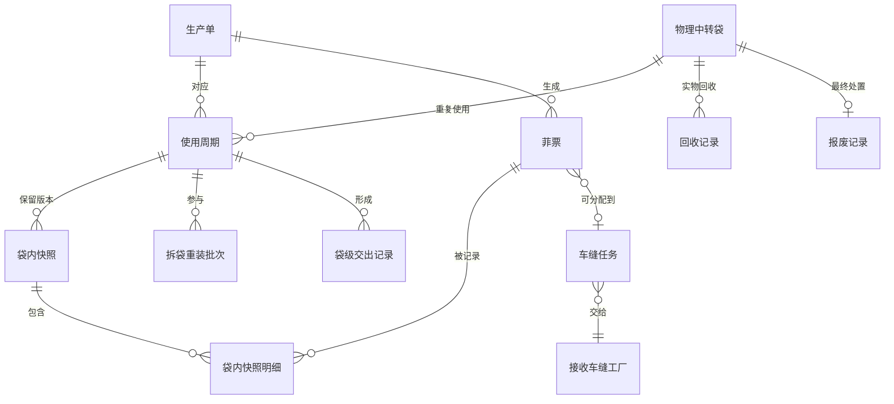
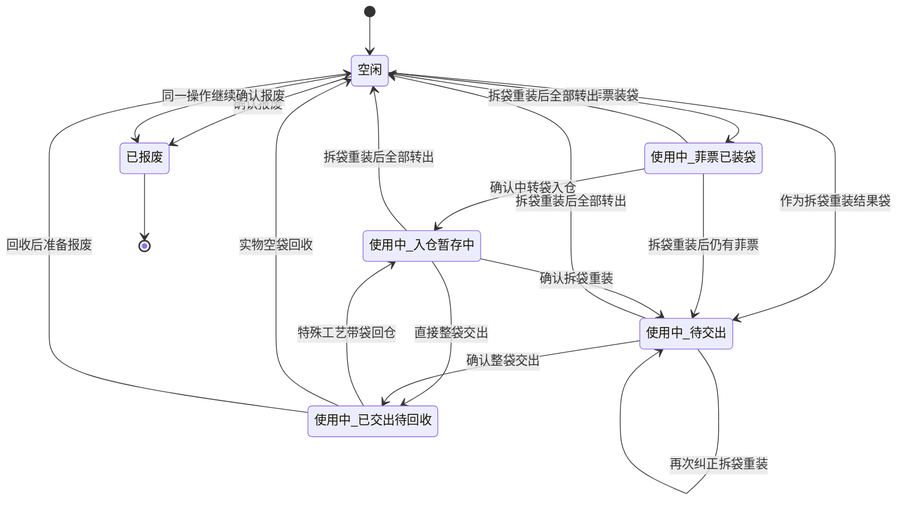
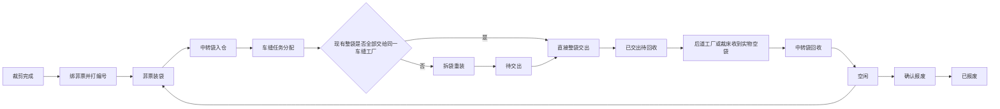

# 裁床中转袋拆袋重装、交出、回收与报废完整设计

## 1. 文档信息

| 项目 | 内容 |
| --- | --- |
| 文档日期 | 2026-08-01 |
| 文档状态 | 用户已确认业务设计；未开始实施，等待书面规格审查 |
| 适用系统 | PFOS、WLS、FCS |
| 适用端 | 裁床 Web、裁床仓管 PDA、中转袋扫码详情、受管回收节点 |
| 主要角色 | 裁床装袋人员、裁床仓管、交出人员、回收人员、主管、管理人员 |
| 上游对象 | 生产单、裁片单、铺布单、菲票、车缝任务分配结果、特殊工艺回仓记录 |
| 下游对象 | 裁床交出记录、接收车缝工厂、物理空袋回收、报废记录 |
| 设计目标 | 支持直接整袋交出和按车缝分配结果拆袋重装，保持中转袋三主状态闭环，并让 Web、PDA 和追溯详情读取同一事实 |

## 2. 文档替代关系

本设计是中转袋业务的新基线，替代以下旧文档中的冲突条款：

- `docs/superpowers/specs/2026-07-30-cutting-transfer-bag-three-status-design.md`
- `docs/superpowers/plans/2026-07-30-cutting-transfer-bag-three-status.md`
- `docs/prototype-review-records/2026-07-30-cutting-transfer-bag-three-status.md`

旧文档仍可用于查看当时的实现背景和历史决策，但以下内容不再有效：

1. 使用中只有 3 个流转阶段。
2. 使用中的中转袋可以直接报废。
3. 一个中转袋只能绑定一个车缝任务。
4. 装袋后不会再拆袋重装。
5. 车缝工厂接收、内部用袋和回写属于系统必须管理的闭环。
6. 物理袋不可使用时可以直接用一条报废事实关闭使用周期。
7. 既有自动检查通过即可证明新业务已经实现。

本设计继续保留旧文档中不冲突的规则：

- 中转袋主状态只有空闲、使用中、已报废。
- 菲票装袋和中转袋入仓是两个不同动作。
- 入仓只确认袋号、库区和库位，不重新编辑袋内菲票。
- 中转袋交出以完整物理袋为确认单位。
- 中转袋物理标签只保存稳定身份，实时状态通过扫码查询。
- Web 待交出仓保留单页工作台，业务动作在当前工作台内完成。
- 「中转袋交出」页签展示已经完成的交出记录，不展示未完成操作。

## 3. 业务背景和变更原因

裁床现场的基本流程是：

```text
铺布并完成裁剪
→ 绑菲票并打编号
→ 菲票装袋
→ 中转袋入仓
→ 车缝任务分配
→ 直接整袋交出，或者按分配结果拆袋重装后交出
→ 已交出待回收
→ 后道工厂或裁床实际收到空袋并回收
→ 空闲
```

旧业务曾假设：菲票一旦装入中转袋，后续不会拆袋，车缝任务分配必须服从既有装袋结果。

最新业务结论是：

- 车缝任务分配完成后，可以根据分配结果拆袋重装。
- 可以从多个来源袋取出菲票，再装入一个或多个结果袋。
- 结果袋可以复用本次来源袋，不强制使用新的空闲袋。
- 如果一个现有袋已经满足同一接收车缝工厂的要求，可以不拆袋，直接整袋交出。
- 拆袋重装和中转袋交出是两个独立确认动作。
- 拆袋重装完成后不再归仓、不再确认位置，直接进入待交出。

因此，这次变更不是增加一个页面按钮，而是重新建立以下事实：

- 菲票当前到底在哪个中转袋。
- 拆袋重装前后，每只袋分别有哪些菲票。
- 每只结果袋应交给哪个车缝工厂。
- 哪些袋已经交出、哪些袋已经实际回收、哪些袋可以再次使用。
- 线上记录与现场实物不一致时，如何安全纠正并保留历史。

## 4. 系统管理边界

### 4.1 系统负责管理的内容

系统负责管理裁床和受管回收节点能够观察、确认的事实：

- 中转袋稳定身份和袋码。
- 菲票装入哪个中转袋。
- 中转袋进入哪个裁床待交出仓库位。
- 车缝任务分配后，哪些菲票需要交给哪个车缝工厂。
- 拆袋重装时，菲票从哪些来源袋转入哪些结果袋。
- 裁床将哪个中转袋、哪些菲票交给哪个车缝工厂。
- 后道工厂或裁床何时实际收到空袋并完成回收。
- 何时、由谁、因为什么原因报废中转袋。
- 每只袋的当前状态、当前阶段、历史使用周期和完整操作记录。

### 4.2 系统不管理的内容

系统不管理车缝工厂内部及车缝工厂之间的中转袋流转：

- 不管理车缝工厂如何拆袋、清空袋或把裁片缝制成成衣。
- 不管理车缝工厂内部空闲袋池。
- 不管理多个车缝工厂之间的协作、借袋、调袋和分包。
- 不限制车缝工厂交给后道工厂的袋，必须是当前生产单曾经接收裁片的袋。
- 不要求车缝工厂在系统中记录成衣装入哪个中转袋。
- 不补造系统无法观察的外部流转记录。

系统在裁床交出时，只记录：

> 哪个中转袋、袋内哪些菲票，交给了哪个车缝工厂。

系统在后续回收时，只记录：

> 哪个受管节点实际收到哪只物理空袋，并由谁确认回收。

回收不能因为缺少车缝工厂内部流转记录而被阻断，也不能虚构袋在外部工厂之间的流转路线。

### 4.3 后道工厂和裁床的回收边界

正常情况下，中转袋随成衣到达后道工厂。后道工厂实际拆空后，可以执行中转袋回收，使袋变为空闲。

如果后道工厂没有执行回收，一般会把实物袋送回裁床。裁床实际收到空袋后，也可以单独执行回收。

如果裁床未先执行回收，直接在菲票装袋或拆袋重装时扫描该袋，系统可以提供「强制回收并继续使用」，但必须满足本设计的强制回收条件。

## 5. 核心业务对象和关系

### 5.1 物理中转袋

物理中转袋是可以重复使用的实体载具，具有长期稳定的袋码。

稳定身份不随以下内容变化：

- 当前状态。
- 当前阶段。
- 当前袋内菲票。
- 当前生产单。
- 当前车缝任务。
- 当前接收工厂。
- 当前库位。

### 5.2 使用周期

使用周期用于隔离同一只物理袋的不同使用批次。

一个使用周期从以下任一事实开始：

- 空闲袋确认菲票装袋。
- 拆袋重装中，空闲袋第一次成为非空结果袋。
- 拆袋重装中，某来源袋被清空后又装入另一个生产单的菲票。

使用周期在以下事实中结束：

- 拆袋重装后，袋内全部有效菲票已经转出，且该袋没有在本次操作中继续作为结果袋使用。
- 实物空袋完成回收。
- 已回收为空闲后，继续完成报废。

已报废不是一个可继续开启的新周期。

### 5.3 当前袋内关系

当前袋内关系回答：

> 某张有效菲票现在属于哪只中转袋。

它必须和历史装袋、历史重装、历史交出快照分开。

同一时刻：

- 一张有效菲票最多只能属于一个当前中转袋。
- 一个当前中转袋只能包含一个生产单的有效菲票。
- 一个生产单的菲票可以分布在多只中转袋。

### 5.4 历史快照

每次确认动作都要保存不可变快照：

- 装袋确认保存首次袋内快照。
- 拆袋重装保存全部来源袋操作前快照和全部结果袋操作后快照。
- 交出确认保存交出时的完整袋内快照。
- 回收不删除历史交出快照。

交出确认后，当前袋票关系解除，但交出快照永久保留。因此，系统仍然能够回答：

- 这只袋曾经交给哪个车缝工厂。
- 交出时袋内有哪些菲票。
- 每张菲票对应哪个生产单、裁片单、颜色、尺码、部位和数量。

### 5.5 车缝任务和接收工厂

车缝任务用于决定菲票最终交给哪个车缝工厂，不直接决定一只袋只能关联一个任务。

正确关系是：

- 一只袋可以包含多个车缝任务对应的菲票。
- 直接整袋交出时，袋内所有车缝任务必须指向同一个接收车缝工厂。
- 交出记录保存全部相关车缝任务和唯一的本次接收车缝工厂。
- 如果袋内菲票被分配给不同车缝工厂，必须先拆袋重装。

### 5.6 对象关系图



## 6. 主状态和流转阶段

### 6.1 三个主状态

中转袋主状态只能是：

1. 空闲。
2. 使用中。
3. 已报废。

| 主状态 | 判断口径 | 能否成为新装袋或重装结果袋 |
| --- | --- | --- |
| 空闲 | 没有未结束使用周期，物理袋可以投入下一次使用 | 可以 |
| 使用中 | 存在未结束使用周期，或者袋已交出但尚未实际回收 | 不可以直接作为新袋；按当前阶段执行下一步 |
| 已报废 | 已完成明确报废处置，只保留历史追溯 | 永远不可以 |

### 6.2 四个使用中阶段

只有主状态为「使用中」时，才显示流转阶段：

| 流转阶段 | 已完成事实 | 正常下一步 |
| --- | --- | --- |
| 菲票已装袋 | 已确认当前袋内菲票，但尚未确认入仓 | 中转袋入仓 |
| 入仓暂存中 | 已确认裁床待交出仓库区、库位 | 直接整袋交出，或按车缝分配结果拆袋重装 |
| 待交出 | 已完成拆袋重装，结果袋不再重新入仓 | 中转袋交出 |
| 已交出待回收 | 已形成袋级交出记录，物理袋尚未实际回收 | 中转袋回收；特殊工艺带袋回仓时可重新入仓 |

空闲和已报废的流转阶段统一显示「—」。

不增加以下主状态或流转阶段：

- 待清洗。
- 待维修。
- 可用。
- 已回写。
- 收货差异。
- 装袋中。
- 拆袋中。

页面草稿、扫码进度、差异、接收记录和异常提醒都不是中转袋主状态或流转阶段。

### 6.3 状态图



## 7. 动作资格矩阵

| 当前状态 / 阶段 | 可以执行 | 必须阻断或引导 |
| --- | --- | --- |
| 空闲 / — | 菲票装袋；作为拆袋重装结果袋；确认报废 | 入仓、交出、回收 |
| 使用中 / 菲票已装袋 | 中转袋入仓；转移全部或部分有效菲票 | 新装袋、直接交出、直接回收、直接报废 |
| 使用中 / 入仓暂存中 | 直接整袋交出；拆袋重装 | 新装袋、重复入仓、直接回收、直接报废 |
| 使用中 / 待交出 | 中转袋交出；交出前纠正拆袋重装 | 新装袋、入仓、直接回收、直接报废 |
| 使用中 / 已交出待回收 | 正常回收；强制回收并继续使用；特殊工艺带袋回仓；回收后继续报废 | 直接写报废事实、重复交出、普通入仓 |
| 已报废 / — | 查看主档和历史 | 所有流转动作、强制回收和再次使用 |

报废必须遵循：

- 只有空闲袋才能最终写入报废事实。
- 使用中的袋不能直接报废。
- 菲票已装袋、入仓暂存中或待交出的袋，必须先转移全部当前有效菲票，使袋变为空闲。
- 已交出待回收的袋，如果实物已在现场且不可继续使用，可以在同一个操作界面中依次写入「回收为空闲」和「报废」两条事实。
- 已报废袋永远不能强制回收。

## 8. 完整业务流程

### 8.1 主流程



流程中不存在「重装袋归位」或「重装后确认位置」。

### 8.2 菲票装袋

菲票装袋负责建立当前袋内关系：

1. 扫描或填写中转袋编号。
2. 系统读取袋的当前主状态和阶段。
3. 空闲袋可以继续装袋。
4. 已交出待回收的袋，可以进入「强制回收并继续装袋」确认。
5. 其他使用中阶段必须阻断，并提示先完成当前动作或转移菲票。
6. 已报废袋永久阻断。
7. 扫描或填写一张或多张有效菲票。
8. 第一张菲票确定本袋生产单；后续菲票必须属于同一生产单。
9. 确认后创建或继续正确的使用周期，保存袋内快照。
10. 袋变为「使用中 / 菲票已装袋」。

装袋页面不能用「历史上曾经装过袋」判断菲票不可用。必须读取菲票当前有效绑定。已经因交出、重装转出或历史周期结束而解除的关系，不得继续阻断新操作。

### 8.3 中转袋入仓

中转袋入仓只确认物理袋位置：

1. 扫描或填写中转袋编号。
2. 系统读取当前袋内快照。
3. 扫描或选择库区、货架和库位。
4. 入仓页面不重新扫描、增加、删除或编辑菲票。
5. 只有「使用中 / 菲票已装袋」可以完成普通入仓。
6. 确认后变为「使用中 / 入仓暂存中」。

特殊工艺带物理袋回仓也从「中转袋入仓」入口处理：

- 系统识别该袋存在未关闭的特殊工艺交出记录。
- 操作人员核对实物袋内菲票与原特殊工艺交出快照；一致时，系统依据该快照恢复当前袋票关系。
- 任一菲票已被其他当前关系占用、已经作废，或实物与快照不一致时，必须阻断回仓并进入差异核查，不能静默覆盖当前事实。
- 记录来源交出、特殊工艺工厂、回仓库位、操作人和时间。
- 袋从「已交出待回收」回到「入仓暂存中」。
- 只有菲票或裁片回仓、没有物理袋时，不改变任何中转袋状态和阶段。
- 只有物理空袋回到现场、没有菲票或裁片需要回仓时，应执行「中转袋回收」，不能用「中转袋入仓」代替回收。

PDA「待交出仓」不再单独设置「特殊工艺回仓」顶层入口。

### 8.4 车缝任务分配

车缝任务分配产生菲票到接收车缝工厂的业务归属：

- 每张菲票可以关联具体车缝任务。
- 同一只袋可以关联多个车缝任务。
- 系统按接收车缝工厂判断能否直接整袋交出。
- 车缝任务分配不能自动修改袋内关系。
- 只有用户明确确认拆袋重装，系统才改变菲票当前所在袋。

### 8.5 直接整袋交出

一只袋同时满足以下条件时，可以不拆袋，直接交出：

1. 当前阶段为入仓暂存中，或者已经拆袋重装完成并处于待交出。
2. 袋内全部有效菲票属于同一生产单。
3. 袋内全部有效菲票已经得到本次车缝分配结果。
4. 所有关联车缝任务指向同一个接收车缝工厂。
5. 交出时读取的袋内快照与当前有效袋内关系完全一致。
6. 袋不存在未完成的另一条交出记录。

同一袋可以关联多个车缝任务。交出记录保存全部相关任务，但本次接收方只有一个车缝工厂。

### 8.6 拆袋重装

拆袋重装支持：

- 多个来源袋转入一个结果袋。
- 多个来源袋转入多个结果袋。
- 一个来源袋拆成多个结果袋。
- 本次来源袋继续作为结果袋使用。
- 使用新的空闲袋作为结果袋。
- 在满足强制回收条件后，把已交出待回收但实物已经空置在现场的袋作为结果袋。

拆袋重装的操作顺序：

1. 扫描或填写一个或多个来源袋。
2. 系统展示每只来源袋的当前有效菲票。
3. 系统展示车缝任务和接收车缝工厂分配结果。
4. 用户按结果袋分组选择菲票。
5. 扫描或填写一个或多个结果袋。
6. 结果袋可以选择本次来源袋。
7. 系统逐袋校验生产单、接收工厂、菲票唯一性和数量守恒。
8. 用户确认重装。
9. 系统一次性保存全部来源袋操作前快照、菲票转移明细和全部结果袋操作后快照。
10. 所有非空结果袋变为「使用中 / 待交出」。
11. 被全部清空且未继续使用的来源袋变为空闲。
12. 页面返回待交出仓，不要求重新入仓或确认库位。

#### 8.6.1 结果袋规则

每个结果袋必须满足：

- 只包含一个生产单的有效菲票。
- 每张菲票只出现一次。
- 菲票数量和裁片数量与转移明细一致。
- 已报废袋不能使用。
- 与本次操作无关的使用中袋不能直接作为结果袋。
- 本次来源袋可以在操作中被清空后重新使用。

如果某个来源袋被清空后装入同一生产单的菲票，可以继续当前使用周期并保存新快照。

如果某个来源袋被清空后装入另一个生产单的菲票，系统必须在同一原子操作中结束旧周期并创建新周期，历史不得串账。

#### 8.6.2 数量守恒

拆袋重装必须满足：

```text
全部来源袋操作前的有效菲票集合
= 全部结果袋操作后的有效菲票集合
```

并且：

- 不能丢失菲票。
- 不能重复菲票。
- 不能增加不存在的菲票。
- 每张菲票的当前裁片数量在转移前后保持一致。
- 需要改变裁片数量时，必须由独立的裁片差异、报废或补料事实处理，不能借拆袋重装修改数量。

#### 8.6.3 原子性

拆袋重装必须一次成功或一次失败：

- 任一来源袋、结果袋、菲票或数量校验失败时，不改变任何袋内关系。
- 连续点击、PDA 重试或弱网重试不能形成重复转移。
- 成功提示只能在全部结果快照写入成功后显示。

### 8.7 中转袋交出

中转袋交出和拆袋重装是两个独立确认动作。

交出操作：

1. 扫描或填写一只中转袋。
2. 系统读取当前袋内快照、生产单、相关车缝任务和唯一接收车缝工厂。
3. 用户核对袋号、菲票张数、裁片数量和接收车缝工厂。
4. 确认整袋交出。
5. 系统形成一条不可变的袋级交出记录。
6. 袋变为「使用中 / 已交出待回收」。
7. 系统解除当前袋票绑定，交出快照转为历史责任记录。

交出后：

- 当前袋内有效菲票显示为空。
- 历史交出快照仍显示交出时的全部菲票。
- 生产单、裁片单、菲票、车缝任务和接收工厂仍可从交出记录追溯。
- 不能因为当前袋内关系已经解除，就把物理袋直接视为空闲；物理袋仍需实际回收。

### 8.8 中转袋回收

Web 和 PDA 都必须有独立的「中转袋回收」入口和操作界面。

回收页面只确认物理袋事实：

- 中转袋编号。
- 实物袋是否已经收到。
- 实物袋是否确认为空。
- 回收节点和位置。
- 回收人和回收时间。
- 正常回收或强制回收。
- 强制回收原因。
- 是否在回收后继续报废。

正常回收条件：

- 袋处于「使用中 / 已交出待回收」。
- 实物袋已经到达后道工厂或裁床等受管回收节点。
- 操作人员确认实物袋为空。
- 袋未报废。

确认后：

- 结束当前使用周期。
- 袋变为空闲。
- 保留历史装袋、重装和交出记录。
- 记录当前可观察的持有节点和位置，但不要求补齐外部车缝流转路线。

系统不要求核对该袋必须来自当前后道工厂对应的某个车缝任务，也不要求证明它是当前生产单原来使用的袋。

### 8.9 强制回收并继续使用

以下场景可以触发强制回收：

- 线上显示「已交出待回收」。
- 裁床或受管节点已经实际拿到空袋。
- 操作人员正在执行菲票装袋，或者正在把该袋作为拆袋重装结果袋。
- 前序节点没有完成系统回收。

强制回收必须：

1. 明确展示当前线上状态和最近一条交出记录。
2. 明确提示「只在实物袋已经为空时继续」。
3. 要求操作人员确认实物袋已收到、已清空。
4. 保存操作人、时间、节点和强制回收原因。
5. 先写入回收事实，使旧周期结束、袋变为空闲。
6. 再执行本次装袋或拆袋重装结果袋写入。

这两步可以在一个界面中完成，但事实顺序不能合并。

强制回收必须阻断：

- 已报废袋。
- 菲票已装袋的袋。
- 入仓暂存中的袋。
- 待交出的袋。
- 实物袋未到现场。
- 操作人员不能确认袋已清空。

上述 3 个使用中阶段如需换袋或报废，必须先通过拆袋重装转移全部当前有效菲票。

### 8.10 中转袋报废

Web 和 PDA 都必须有独立的「中转袋报废」入口和操作界面。

报废分为 2 种情况。

#### 8.10.1 空闲袋直接报废

- 扫描或填写空闲中转袋。
- 填写报废原因。
- 确认报废权限和操作人。
- 二次确认后写入报废事实。
- 袋变为已报废。

#### 8.10.2 已交出袋回收后报废

如果实物袋已经回到现场，但系统仍显示「已交出待回收」，且袋体无法继续使用：

1. 操作人员在报废页面确认实物袋已收到、已清空。
2. 填写报废原因。
3. 系统先写入回收事实，使袋变为空闲。
4. 系统再写入报废事实，使袋变为已报废。
5. 页面最终显示已报废，但详情必须显示两条独立事实。

#### 8.10.3 当前仍有有效菲票的袋

如果袋处于菲票已装袋、入仓暂存中或待交出：

- 报废页面不得直接提交。
- 系统展示当前有效菲票数量和生产单。
- 系统引导进入拆袋重装。
- 全部有效菲票转移完成、来源袋变为空闲后，才能再次进入报废操作。

报废不处理：

- 待清洗。
- 待维修。
- 接收数量差异。
- 菲票差异。
- 车缝工厂内部记录缺失。

这些内容不能成为中转袋主状态，也不能自动触发报废。

## 9. 事实记录和追溯设计

### 9.1 必须保留的事实

| 事实 | 必须记录的内容 |
| --- | --- |
| 菲票装袋 | 袋码、使用周期、生产单、全部菲票、裁片数量、操作人、时间 |
| 中转袋入仓 | 袋码、使用周期、来源装袋快照、库区、货架、库位、操作人、时间 |
| 拆袋重装 | 批次号、全部来源袋前快照、全部结果袋后快照、逐菲票转移、任务和接收工厂、操作人、时间 |
| 中转袋交出 | 袋码、使用周期、交出快照、全部相关车缝任务、接收车缝工厂、操作人、时间 |
| 特殊工艺带袋回仓 | 来源交出、物理袋、回仓位置、特殊工艺工厂、操作人、时间 |
| 中转袋回收 | 袋码、原使用周期、回收节点、空袋确认、正常或强制、原因、操作人、时间 |
| 中转袋报废 | 袋码、报废前空闲事实、原因、授权人、操作人、时间 |

### 9.2 当前关系和历史关系分离

系统必须分别提供：

- 当前袋内菲票。
- 最近一次装袋快照。
- 最近一次拆袋重装结果快照。
- 最近一次交出快照。
- 全部历史使用周期。

页面不能把历史交出快照中的菲票继续显示为当前袋内菲票。

### 9.3 中转袋详情

中转袋详情至少分区展示：

- 中转袋稳定身份。
- 当前主状态和流转阶段。
- 当前观察到的持有节点和位置。
- 当前使用周期。
- 当前袋内菲票。
- 菲票装袋记录。
- 入仓记录。
- 拆袋重装记录。
- 袋级交出记录。
- 特殊工艺带袋回仓记录。
- 物理回收记录。
- 报废记录。
- 历史使用周期。

所有明细列表必须分页。主状态、阶段、当前关系和历史快照必须使用不同标题，避免误解。

### 9.4 中转袋交出记录

「中转袋交出」页签只展示已经完成的交出事实：

- 交出记录号和交出单号。
- 中转袋编号。
- 生产单。
- 相关车缝任务。
- 接收车缝工厂。
- 交出菲票张数和裁片数量。
- 交出人和交出时间。
- 交出快照详情。

该页签不展示「交出装袋确认」按钮、待分拣任务或未完成操作卡片。

## 10. Web 页面设计

### 10.1 待交出仓工作台

裁床 Web 待交出仓保留一个工作台页面，顶部提供 6 个业务动作：

1. 菲票装袋。
2. 中转袋入仓。
3. 拆袋重装。
4. 中转袋交出。
5. 中转袋回收。
6. 中转袋报废。

动作都在当前工作台上下文中打开，不把工作台拆成 6 个互不关联的菜单页面。

- 菲票装袋、入仓、交出、回收和报废使用短弹窗。
- 拆袋重装使用当前页面内的宽弹窗或工作区，按来源袋、菲票分组、结果袋和确认结果分步展示。
- 弹窗提交失败时保持弹窗和用户输入，不整页刷新。
- 确认成功后只局部刷新受影响的列表、统计和详情。

### 10.2 记录页签

工作台记录区至少保留：

- 菲票装袋记录。
- 中转袋入仓记录。
- 待交出库存或袋列表。
- 中转袋交出记录。
- 特殊工艺回仓记录。
- 库位图。

拆袋重装记录、回收记录和报废记录可以在中转袋详情和对应动作结果中查看；如果工作台增加独立记录页签，必须展示完成事实，不得展示重复操作入口。

### 10.3 中转袋主列表

中转袋主列表继续使用标准列表页规范：

- 主状态筛选只有空闲、使用中、已报废。
- 流转阶段筛选只有菲票已装袋、入仓暂存中、待交出、已交出待回收。
- 摘要按物理袋去重统计。
- 当前袋内菲票和历史交出菲票分开显示。
- 危险操作固定在右侧操作栏，但只有满足资格时才显示。
- 使用中的袋不显示直接报废按钮。
- 所有列表分页，宽表在表格容器内横向滚动。

### 10.4 Web 手工填写

Web 的 6 个动作都必须支持手工填写或选择：

- 袋码可以扫描，也可以输入。
- 菲票可以扫描，也可以从当前可用菲票中选择。
- 库区和库位可以扫描，也可以从有效库位中选择。
- 车缝任务和接收工厂由分配结果带出，不允许自由造一个与分配无关的接收关系。
- 手工操作和 PDA 扫码写入相同事实，不形成第二套状态。

## 11. PDA 页面设计

### 11.1 入口位置

PDA 仓管首页进入「待交出仓」卡片后，显示以下 6 个入口：

1. 菲票装袋。
2. 中转袋入仓。
3. 拆袋重装。
4. 中转袋交出。
5. 中转袋回收。
6. 中转袋报废。

「菲票打编号」属于装袋前上游操作，不占用这 6 个中转袋入口。

「特殊工艺回仓」并入「中转袋入仓」，不占用独立顶层入口。

### 11.2 一页一个主动作

每个 PDA 深层页面只保留一个主确认动作：

| 页面 | 主动作 |
| --- | --- |
| 菲票装袋 | 确认装袋 |
| 中转袋入仓 | 确认入仓 |
| 拆袋重装 | 确认重装 |
| 中转袋交出 | 确认交出 |
| 中转袋回收 | 确认回收 |
| 中转袋报废 | 确认报废 |

辅助动作可以包括返回、重新扫描、查看袋内明细和叫主管，但不能与主按钮同等突出。

### 11.3 PDA 现场表达

PDA 不展示内部状态码、事实类型或复杂生命周期说明。

现场文案示例：

- 「这个袋子已经交出。实物袋已在你手上并且为空时，可以强制回收。」
- 「这个袋子还有 12 张菲票，请先去拆袋重装。」
- 「袋内菲票要交给 2 个工厂，请先拆袋重装。」
- 「这个袋子已经报废，不能继续使用。」
- 「重装成功，请继续交出。」

### 11.4 PDA 拆袋重装

PDA 拆袋重装按短步骤执行：

1. 扫来源袋。
2. 扫或确认要转移的菲票。
3. 扫结果袋。
4. 查看结果袋汇总。
5. 确认重装。

多来源、多结果场景可以循环扫描，但确认前必须汇总展示：

- 每个来源袋转出多少张菲票、多少片裁片。
- 每个结果袋装入多少张菲票、多少片裁片。
- 每个结果袋的生产单和接收车缝工厂。
- 哪些来源袋会在确认后变为空闲。

员工不需要手工计算数量守恒，系统自动判断并阻断错误。

### 11.5 扫码输入和手工兜底

PDA 以扫码为主，同时支持手工填写：

- 扫码枪输入后立即识别，不要求额外点击查询。
- 手工填写用于二维码损坏、扫码枪不可用等现场兜底。
- 手工填写必须经过与扫码相同的资格校验。
- 每次输入后只更新当前工作区，不整页刷新或丢失滚动位置。

## 12. 防错、异常和幂等

### 12.1 必须阻断的错误

系统必须阻断：

- 一个结果袋装入多个生产单的菲票。
- 同一菲票同时出现在多个结果袋。
- 来源菲票在重装结果中丢失。
- 使用无效、作废或不存在的菲票。
- 使用已报废中转袋。
- 把无关的使用中袋直接作为结果袋。
- 袋内菲票未全部分配却直接交出。
- 袋内菲票需要交给不同车缝工厂却直接交出。
- 使用中的袋直接报废。
- 实物袋未在现场时强制回收。
- 实物袋未确认清空时回收或回收后报废。
- 重复装袋、入仓、重装、交出、回收或报废。

### 12.2 异常处理

异常不能转成新主状态。页面通过动作提示处理：

- 当前关系不明确：阻断操作并提示主管核查历史。
- 实物袋为空但系统仍有历史菲票：区分当前关系和历史交出快照，不要求删除历史。
- 实物袋为空但当前仍有有效菲票：非已交出阶段必须先拆袋重装；不能直接回收。
- 外部流转记录缺失：不补造记录，实际空袋到达受管节点后按回收规则处理。
- 重复提交：返回已经成功的结果，不增加第二条事实。

### 12.3 幂等规则

所有确认动作必须有稳定的重复提交判断：

- 装袋按袋、使用周期和装袋确认识别。
- 入仓按袋、使用周期和当前入仓段识别。
- 拆袋重装按重装批次和完整来源、结果摘要识别。
- 交出按袋、使用周期和交出记录识别。
- 回收按袋和原使用周期识别。
- 报废按袋和最终报废事实识别。

Web 双击、PDA 重复扫码、回车加点击、浏览器重试和弱网重试不得生成第二条业务事实。

## 13. 历史数据和兼容处理

### 13.1 统一当前事实

当前代码存在旧中转袋运行账、裁床运行时事件账、Web 临时数据、PDA Mock 状态和车缝派工投影。

实施后：

- 中转袋主档和稳定袋码可以继续读取旧主档。
- 当前袋内关系、当前阶段、拆袋重装、交出、回收和报废以统一事实为准。
- Web 临时数据和 PDA Mock 只能作为页面输入或演示种子，不能决定最终状态。
- 旧状态字段只能做集中兼容读取，不能继续独立写当前状态。

### 13.2 历史「交出装袋确认」

历史「交出装袋确认」可以映射为历史重装结果快照，用于追溯：

- 来源袋。
- 目标袋。
- 当时处理的菲票。
- 当时关联的车缝任务。
- 操作人和时间。

但它不得：

- 继续生成新的同名操作。
- 自动被当作完整、可信的当前袋内关系。
- 在「中转袋交出」页签中显示为待处理任务。

### 13.3 历史多状态

旧状态统一映射到 3 个主状态和 4 个流转阶段。

无法唯一判断的历史数据：

- 保留原始记录。
- 页面主状态仍只能显示空闲、使用中、已报废。
- 页面不增加第四个阶段。
- 危险动作被阻断，并提供主管核查入口。

### 13.4 历史袋票绑定

历史装袋或交出记录不能永久锁住菲票。

判断菲票是否可装袋必须基于：

- 当前是否有有效袋内关系。
- 当前是否已作废。
- 当前是否已进入其他受管流程。

不能仅因为菲票历史上出现过「菲票装袋」事件就永久阻断。

## 14. 当前代码核查结论和改造边界

### 14.1 生命周期和事件事实

必须调整：

- `src/data/fcs/cutting/transfer-bag-lifecycle.ts`
- `src/data/fcs/cutting/cutting-runtime-event-ledger.ts`
- `src/pages/process-factory/cutting/wait-handover-runtime.ts`

当前问题：

- 流转阶段缺少待交出。
- 使用中各阶段允许直接报废。
- 事件账缺少多来源、多结果的拆袋重装事实。
- 袋内快照只读取最近一次首次装袋，不能反映重装结果。
- 回收和报废可以各自直接关闭周期，无法保证先回收再报废。

### 14.2 车缝分配和直接交出

必须调整：

- `src/data/fcs/cutting/sewing-dispatch.ts`
- `src/pages/process-factory/cutting/warehouse-hub.ts`
- `src/pages/pda-cutting-handover.ts`

当前问题：

- 仍把一只袋限制为一个车缝任务。
- Web 和 PDA 都以恰好一个任务判断能否整袋交出。
- 分配投影生成模拟目标袋号，未形成真实拆袋重装事实。
- Web 保留大量「交出装袋确认」旧渲染和旧说明。

### 14.3 Web 中转袋页面

必须调整：

- `src/pages/process-factory/cutting/transfer-bags.ts`
- `src/pages/process-factory/cutting/transfer-bags-model.ts`
- `src/pages/process-factory/cutting/transfer-bag-return-model.ts`
- `src/pages/process-factory/cutting/transfer-bags/state.ts`
- `src/pages/process-factory/cutting/transfer-bags/handlers.ts`
- `src/pages/process-factory/cutting/transfer-bags/detail.ts`
- `src/pages/process-factory/cutting/transfer-bags-projection.ts`

当前问题：

- 旧模型仍包含大量内部状态和单车缝任务周期字段。
- 旧规则仍允许多生产单混装。
- 主列表对多数非报废袋显示直接报废入口。
- 回收仍包含成衣数量、菲票数量、清洁和维修等复杂字段。
- 不可使用的袋在回收中会直接形成报废关闭，缺少回收和报废两条事实。
- 当前状态同时读取旧账和新事件投影，存在多套当前事实。

### 14.4 PDA 入口和执行页

必须调整：

- `src/pages/pda-cutting-wait-handover-actions.ts`
- `src/pages/pda-warehouse-wait-handover.ts`
- `src/pages/pda-cutting-inbound.ts`
- `src/pages/pda-cutting-handover.ts`
- `src/pages/pda-transfer-bag-detail.ts`
- `src/router/routes-pda.ts`
- `src/router/route-renderers.ts`
- `src/main-handlers/pda-handlers.ts`
- `src/main.ts`

建议把拆袋重装、回收和报废现场流程放入职责清晰的新 PDA 模块，避免继续把功能堆入现有超大交出文件。

当前问题：

- 「待交出仓」只有 5 个入口，包含菲票打编号和独立特殊工艺回仓，却缺少拆袋重装、回收和报废。
- PDA 装袋扫描已交出袋时只阻断，没有强制回收并继续使用。
- PDA 交出继续按单一车缝任务绑定。
- 中转袋扫码详情仍展示车缝接收确认动作，超出系统管理边界。
- 主事件分发存在专项直达分支和统一 PDA 分发，需要保证新页面只有一条实际写入路径。

### 14.5 自动检查和浏览器验收

必须调整或新增：

- `scripts/check-transfer-bag-three-status.ts`
- `scripts/check-pda-cutting-wait-handover-entry-routing.ts`
- `scripts/check-pda-cutting-inbound-workflow.ts`
- `scripts/check-pda-cutting-transfer-bag-handover.ts`
- `scripts/check-web-cutting-transfer-bag-actions.ts`
- `scripts/check-cutting-sewing-dispatch.ts`
- `tests/cutting-transfer-bag-simplified-statuses.spec.ts`
- `tests/cutting-wait-handover-web-modal.spec.ts`
- 相关中转袋列表、详情、导航和 PDA 交出 Playwright 用例。

当前旧检查全部通过，只能证明旧实现与旧合同一致。旧检查仍正向断言：

- 使用中允许直接报废。
- 使用中只有 3 个阶段。
- PDA 待交出仓恰好有 5 个入口。
- 一只袋只能绑定一个车缝任务。

这些断言必须先改成新业务门禁，不能作为新设计的完成证据。

### 14.6 明确不改的范围

本次不修改：

- 车缝工厂内部生产、用袋、成衣装袋和出厂流程。
- 多个车缝工厂之间的协作和分包流程。
- 后道成衣生产业务模型。
- 无关裁床页面、全局布局和技术栈。
- 真实后端、接口、权限系统和数据库。
- 中转袋物理二维码的稳定身份原则。

## 15. 验收场景

### 15.1 同一工厂、多车缝任务直接交出

1. `BAG-A` 内有同一生产单的 12 张菲票。
2. 其中 7 张分配给车缝任务 `SEW-01`，5 张分配给 `SEW-02`。
3. 两个任务都由车缝工厂甲接收。
4. 系统允许 `BAG-A` 直接整袋交出。
5. 交出记录保存 2 个车缝任务和车缝工厂甲。

### 15.2 不同工厂必须拆袋重装

1. `BAG-A` 内有 12 张菲票。
2. 其中 7 张交车缝工厂甲，5 张交车缝工厂乙。
3. 系统阻断直接整袋交出。
4. 用户把 7 张保留在 `BAG-A`，把 5 张转入空闲的 `BAG-B`。
5. 重装后 `BAG-A` 和 `BAG-B` 都进入待交出。
6. 两只袋分别交出给对应车缝工厂。

### 15.3 多来源袋合并并复用来源袋

1. `BAG-A` 和 `BAG-B` 装有同一生产单菲票。
2. 分配结果要求这些菲票全部交给同一车缝工厂。
3. 用户选择 `BAG-A`、`BAG-B` 为来源袋，并继续使用 `BAG-A` 作为结果袋。
4. 所有菲票转入 `BAG-A`，`BAG-B` 被清空。
5. `BAG-A` 进入待交出，`BAG-B` 变为空闲。

### 15.4 一个来源袋拆为多个结果袋

1. `BAG-A` 内菲票被分配给 2 个车缝工厂。
2. 用户保留一部分菲票在 `BAG-A`，另一部分转入 `BAG-B`。
3. 系统校验两个结果袋分别只有一个生产单，并分别只有一个接收车缝工厂。
4. 确认后两只袋都进入待交出。

### 15.5 正常回收

1. `BAG-A` 已交出给车缝工厂甲。
2. 后道工厂实际收到随成衣返回的空袋。
3. 后道仓管扫描 `BAG-A`，确认实物袋为空。
4. 系统完成回收，`BAG-A` 变为空闲。
5. 历史仍能看到裁床曾把哪些菲票交给车缝工厂甲。

### 15.6 裁床强制回收并装袋

1. `BAG-A` 线上显示已交出待回收。
2. 后道工厂已把实物空袋送回裁床，但未做系统回收。
3. 裁床装袋人员扫描 `BAG-A`。
4. 系统展示最近交出记录，并要求确认实物袋已收到、已清空。
5. 操作人员填写强制回收原因并确认。
6. 系统先写回收事实，再写新装袋事实。
7. `BAG-A` 最终显示使用中、菲票已装袋；旧交出历史仍保留。

### 15.7 当前有菲票的袋不能强制回收或报废

1. `BAG-A` 处于入仓暂存中，当前有 12 张有效菲票。
2. 用户在装袋、回收或报废页面扫描 `BAG-A`。
3. 系统阻断操作，展示当前生产单和菲票数量。
4. 系统引导用户进入拆袋重装。
5. 全部菲票转出后，`BAG-A` 变为空闲，才允许报废。

### 15.8 回收后报废

1. `BAG-A` 线上显示已交出待回收。
2. 现场已收到空袋，但袋体破裂无法使用。
3. 用户在报废页面确认实物袋已收到、已清空，并填写报废原因。
4. 系统依次生成回收记录和报废记录。
5. 最终状态为已报废。
6. 详情能够分别看到回收和报废两条事实。

### 15.9 外部流转不可见但允许回收

1. 裁床曾把 `BAG-A` 和菲票交给车缝工厂甲。
2. 车缝工厂之间发生系统不管理的协作或分包。
3. `BAG-A` 最终随成衣到达后道工厂。
4. 系统没有完整中间流转记录。
5. 后道工厂实际收到空袋后仍可完成回收。
6. 系统不虚构中间工厂和中间交接记录。

### 15.10 跨端一致和重复提交

1. Web 完成拆袋重装，PDA 立即看到结果袋处于待交出。
2. PDA 完成交出，Web 交出记录立即显示完整袋级快照。
3. PDA 连续点击确认或弱网重试，不新增第二条交出记录。
4. Web 回收后，PDA 再扫描同一袋时显示空闲。
5. 已报废袋在 Web 和 PDA 都永久阻断。

## 16. 验收门禁

### 16.1 业务门禁

- 主状态只能是空闲、使用中、已报废。
- 使用中阶段只能是菲票已装袋、入仓暂存中、待交出、已交出待回收。
- 一个当前袋只能包含一个生产单。
- 一个生产单可以使用多只袋。
- 一个袋可以关联多个车缝任务。
- 直接交出按接收车缝工厂一致性判断。
- 拆袋重装支持多来源、多结果和来源袋复用。
- 重装后不再入仓或确认位置。
- 交出后解除当前绑定并保留交出快照。
- 只有空闲袋才能最终报废。
- 强制回收只用于已交出待回收且实物空袋在现场的场景。
- Web 和 PDA 都有独立回收、报废入口。
- PDA 的 6 个入口全部位于待交出仓卡片内。
- 不管理车缝工厂内部用袋、协作和分包。

### 16.2 数据门禁

- 每张菲票最多只有一个当前袋。
- 拆袋重装前后菲票集合和裁片数量守恒。
- 每次重装保存来源前快照和结果后快照。
- 交出快照不可被后续回收、重装或复用覆盖。
- 当前关系、历史关系和外部不可观察记录明确分开。
- 回收后报废必须生成两条顺序明确的事实。
- 同一动作重复提交不得生成重复事实。

### 16.3 页面门禁

- Web 待交出仓 6 个动作均可操作。
- Web 仍为单页工作台和当前页弹窗或工作区。
- 中转袋交出页签只展示完成记录。
- 所有 Web 数据列表分页。
- PDA 每个执行页只有一个主动作。
- PDA 扫码和手工填写使用相同校验。
- 输入过程不触发整页重绘。
- 弹窗、扫码反馈和步骤切换只更新必要区域。
- 1366×768 为 Web 标准验收分辨率，1280×720 为最低可用分辨率。
- PDA 使用 390×844 等常见小屏验收，并检查扫码枪 Enter 输入。
- 任一按钮操作响应目标控制在 200 ms 以内。

### 16.4 交付证据门禁

实施完成后，不能只用 `npm run build` 或旧专项检查证明完成。必须建立：

```text
文档条款
→ 对应代码实现
→ 对应专项测试
→ 对应 Web / PDA 浏览器验收
→ CodeGraph 影响面与同步状态
→ 最终任务收据
```

旧检查的通过结果只作为实施前基线，不作为新业务验收。

## 17. 原型设计治理自查

| 检查项 | 设计结论 | 实施验收要求 |
| --- | --- | --- |
| 角色匹配 | Web 服务管理、追溯和仓管手工操作；PDA 服务现场扫码执行 | 页面不得把管理信息堆到 PDA 首屏 |
| 任务清晰度 | PDA 每页一个主动作 | 进入页面 3 秒内能判断扫什么、核对什么、点什么 |
| 信息架构 | PDA 6 个入口集中在待交出仓卡片 | 不新增平级仓管首页入口 |
| 页面模式 | Web 保留工作台，PDA 使用动作页 | 拆袋重装复杂步骤不应挤进普通小弹窗 |
| 中文文案 | 使用装袋、入仓、重装、交出、回收、报废等现场动作词 | 不展示内部英文状态码或「投影」「链路」等抽象词 |
| 数量表达 | 系统自动计算来源、结果和差异 | 所有数量带「张」「片」等单位，不让员工心算 |
| 扫码识别 | 袋、菲票、库位扫码优先，手工填写兜底 | 扫错立即阻断并说明下一步 |
| 防错 | 状态、生产单、工厂、唯一性、守恒和物理空袋共同校验 | 危险动作二次确认，错误不能只提醒不阻断 |
| 协作关系 | 裁床交出明确记录袋、菲票和接收车缝工厂 | 不要求外部车缝工厂维护系统内袋池 |
| 追溯 | 当前关系、操作快照、交出历史、回收、报废分层 | 任何复用不能覆盖旧周期历史 |
| 现场设备 | PDA 低信息密度、扫码优先；Web 低分辨率可用 | 检查按钮可见、滚动位置、扫码 Enter 和局部刷新 |
| 异常兜底 | 不增加异常主状态；通过阻断、引导和主管核查处理 | 不引入待清洗、待维修等新标签 |

## 18. 规格自检

### 18.1 完整性

本设计已经覆盖：

- 物理袋身份和使用周期。
- 当前袋内关系和历史快照。
- 3 个主状态和 4 个流转阶段。
- 菲票装袋和中转袋入仓。
- 车缝任务分配后的直接交出判断。
- 多来源、多结果和来源袋复用的拆袋重装。
- 拆袋重装与交出的独立确认。
- 特殊工艺带袋和无袋回仓。
- 正常回收、裁床回收和强制回收。
- 独立报废以及回收后报废。
- Web、PDA、扫码详情和主列表。
- 外部车缝工厂不受管边界。
- 历史数据兼容、幂等、防错和追溯。
- 当前代码影响范围、自动检查和浏览器验收。

### 18.2 内部一致性

- 「只有空闲袋才能最终报废」与「已交出袋不可使用时在一个页面回收后报废」不冲突，因为系统依次写入回收和报废两条事实。
- 「交出后解除当前袋票关系」与「物理袋仍为使用中」不冲突，因为当前内容关系和物理袋回收状态是两个不同事实。
- 「不管理车缝工厂内部流转」与「记录接收车缝工厂」不冲突，因为系统只记录裁床交出责任，不追踪外部工厂内部动作。
- 「重装后不再入仓」与「重装结果袋待交出」一致，页面不再要求库位。
- 「一个袋可以关联多个车缝任务」与「直接交给一个接收工厂」一致，判断依据是任务的接收工厂是否相同。

### 18.3 范围控制

本设计可以由一份实施计划覆盖，范围只包含裁床中转袋及直接关联的车缝分配、待交出仓、回收和追溯页面。

本设计不扩展到车缝工厂内部生产、成衣装袋、外部工厂协作、分包管理、真实后端或权限系统建设。

### 18.4 明确结论

文档不存在需要实施人员自行决定的业务分支。实施计划必须逐条引用本设计条款，不得重新采用旧设计中的 3 阶段、使用中直接报废、单车缝任务绑定或车缝工厂完整袋池管理规则。
