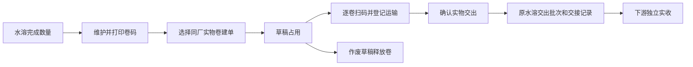

# 水溶待交出与交出单据

## 事实与边界

2026-09-14 用户明确要求补齐两个页面。线上截图确认待交出页具有加工厂切换、关键词、接收人、单据状态、可创建筛选、批量建单、卷码状态；单据页具有加工厂切换、关键词、状态、接收人、单号、卷数、长度、SKU 数、交出时间与操作。截图两页为空，不能据此推断线上隐藏弹窗或数据规则。

以当前 main 4e44bea5 的水溶加工单事实和染色交出页面为基础，复用标准列表和交出展示。独立水溶加工单使用自己的完成数量、物料单位、交出批次与下游实收；含水溶的染色加工单继续原染色流程，不能把中间水溶完成当作最终交出。

范围为两个管理列表、菜单/路由、建单、条码维护打印、扫码、运输、确认实物交出、作废草稿、详情、打印和直接关联入口。真实后端、批量改线上数据、新水溶工艺路线、其他加工厂不在范围。沿用现有可信工厂交接身份校验，未登录可管理建单/查看，确认实物交出需本厂交接员或管理员。

## 业务规则

1. 待交出来自已完成且尚有可交数量的水溶单。暂停、未派厂、未维护有效条码、未打印条码等阻断建单，并显示原因。
2. 单卷一条码；长度按原单业务单位保存，同时显示米/Yard 换算。非长度单位独立展示，不能把重量并入总长度。
3. 同厂多加工单可建一张交出单；不同厂必须分单。草稿占用具体卷，禁止重复建单、修改或删除已占用卷。
4. 建单不改变加工单的交出量，也不产生下游实收。扫码核对全部实物、保存运输资料后确认交出；实际提交原水溶交出批次和通用交接记录。
5. 交出后下游按原交接记录接收；页面展示实际接收值与记录。草稿可二次确认作废并释放卷；已交出不可按草稿作废。
6. 历史 PDA 交出必须能在单据页追溯；没有历史卷码时明确标记“历史未登记卷码”，不得把推算卷数冒充记录。
7. Mock 采用具名演示水溶订单和真实物料图片，保留原三条派厂/加工中/暂停案例，新增具体数量的待建、草稿与未打印案例。它们仅为原型场景，不能表述为真实工厂记录。

## 流程与验收场景

正常：两个同厂水溶单各选两卷建一张单，建单后交出仍为零；扫码、运输、可信身份确认后扣减可交数量，下游首次实收和后续实收累加且可追溯，刷新保留。
边界：错卷、重复扫码、不同厂、未打印、重复占用、超完成量、身份不符、草稿作废、重复确认、存储失败均不增加错误交出/实收；含水溶染色单不混入独立水溶列表。

## 实施工作包与需求矩阵

产品确认人：本任务用户（2026-09-14 请求）；技术验收：Codex。按当前分支实测填写验证证据，用户接受版本仍待用户回执。

| 编号 | 原子需求 / 来源 | 工作包及实现位置 | 自动化 | 页面证据 | 状态 |
|---|---|---|---|---|---|
| WOUT-001 | 截图两个菜单与路由 | 路由 / app-shell-config | 专项路由契约 | 两页1366/1280 | 已验证 |
| WOUT-002 | 待交出筛选、分页、列设置 | 复用 output-documents | 渲染/筛选 | 筛选、排序、分页、持久化 | 已验证 |
| WOUT-003 | 单据筛选和详情 | 同上 | 渲染契约 | 单据页与详情 | 已验证 |
| WOUT-004 | 独立水溶范围及具体 Mock | water-soluble-task-domain / output | 排除染色、场景数据 | 真实图片及数值 | 已验证 |
| WOUT-005 | 条码维护、有效量和打印 | water-soluble-output / barcode | 数量/占用契约 | 维护、打印预览 | 已验证 |
| WOUT-006 | 同厂多单建单及合入 | output domain | 数量、去重、厂别 | 批量建单与合入 | 已验证 |
| WOUT-007 | 建单只占用，作废释放 | output domain | 交出不变、释放 | 二次确认作废 | 已验证 |
| WOUT-008 | 逐卷扫码防错 | output domain | 错卷/重复阻断 | 扫码即时反馈 | 已验证 |
| WOUT-009 | 运输和可信工厂实物交出 | output + 原通用交接 | 身份/数量/幂等/失败回退 | 交接确认 | 已验证 |
| WOUT-010 | 下游实收与原单一致 | 原交接记录/水溶批次 | 分次实收契约 | 刷新详情实收 | 已验证 |
| WOUT-011 | 原单/任务/需求/SPU/物料同源 | output view | 来源字段契约 | 同列图文/详情/打印 | 已验证 |
| WOUT-012 | 历史通用交接记录可查 | output domain | 历史投影去重 | 历史标记 | 已验证 |
| WOUT-013 | 独立单位和长度换算 | 复用打印/汇总 | 米/Yard/非长度 | 打印合计 | 已验证 |
| WOUT-014 | 打印条码和交出单 | barcode / dispatch-print | 内容映射 | A4 PDF、条码 | 已验证 |
| WOUT-015 | 本地持久化和染色回归 | 同源存储/共享展示 | 冷恢复/原专项 | 往返染色水溶 | 已验证 |
| WOUT-016 | 双轮验收与交付门禁 | 专项+审查记录 | 类型/构建/治理/CodeGraph | 命名页面最终版本 | 已验证 |

实施依赖：先补同源产出类型及水溶事实，再接入共享列表/条码/打印，最后补命名场景和路由。每项验证后将本表状态、实际命令、证据路径写入审查记录；最后正向检查需求覆盖，反向检查 diff 不越界。

## 实现与证据登记（2026-09-14）

验证版本为 `codex/water-soluble-handover-pages`、基线 `4e44bea5` 后本任务变更；最终全部文件内容由任务收据绑定。产品确认人为本次用户，技术验收为 Codex，用户接受版本不作代签。

| 编号 | 实际实现文件/符号 | 自动化证据 | 页面/打印证据 |
| --- | --- | --- | --- |
| WOUT-001 | src/data/app-shell-config.ts；src/router/routes-fcs.ts、route-renderers-fcs.ts；src/main-handlers/fcs-handlers.ts | menu-routes、浏览器命名路由 | pending-1366.png、documents-1366.png |
| WOUT-002 | src/pages/process-factory/dyeing/output-documents.ts：renderWaterSolublePendingHandoverPage、handleDyeOutputEvent | browser-results.json；标准列表治理模板 | pending-1366.png、pending-1280.png |
| WOUT-003 | 同文件：renderWaterSolubleHandoverDocumentsPage、detail | browser-results.json | documents-1366.png、documents-1280.png、actual-receipt.png |
| WOUT-004 | src/data/fcs/water-soluble-output-demos.ts：addWaterOutputDemoOrders；water-soluble-task-domain.ts | domain.log；water-pda.log来源唯一及绑定 | pending-1366.png；每单240/180/120/160米 |
| WOUT-005 | src/data/fcs/water-soluble-output.ts：saveWaterOutputRolls、markWaterOutputRolls；src/pages/process-factory/dyeing/water-output-barcode.ts | domain.log：超量/精度/占用/打印 | browser-results.json、barcodes.pdf |
| WOUT-006 | water-soluble-output.ts：createWaterDispatchDocument | domain.log：跨厂/合入/去重 | browser-results.json：两个加工单建单、同加工单两卷合入 |
| WOUT-007 | water-soluble-output.ts：isWaterRollAvailable、finishWaterDispatchDocument | domain.log：建单不改变交出、作废释放 | browser-results.json：作废确认 |
| WOUT-008 | water-soluble-output.ts：scanWaterDispatchRoll | domain.log：错卷、重复卷 | browser-results.json：扫码枪Enter及提示 |
| WOUT-009 | water-soluble-output.ts：saveWaterDispatchTransport、finishWaterDispatchDocument；pda-handover-events.ts原建单/交出 | domain.log：身份/状态/数量/回退 | created-detail.png、shipped-detail.png |
| WOUT-010 | src/data/fcs/pda-handover-events.ts：receivePreparationHandoverForTask、persistPdaHandoverState；原水溶批次 | domain.log：两次实收、冷恢复、存储失败；partial.log | actual-receipt.png，刷新后240米 |
| WOUT-011 | water-soluble-output.ts：listWaterOutputRows；process-order-image-manifest.ts；process-order-three-axis-view.ts；water-soluble-orders.ts回跳 | domain.log字段及图片路径；water-pages.log | 列表、详情、dispatch.pdf；浏览器原单回跳 |
| WOUT-012 | water-soluble-output.ts：listWaterDispatchDocuments | domain.log：历史原记录投影、不重复建量 | historical-detail.png |
| WOUT-013 | src/pages/process-factory/dyeing/dispatch-print.ts：dyeDispatchQuantities | domain.log：非长度不计入米、Yard换算 | dispatch.pdf、barcodes.pdf |
| WOUT-014 | dispatch-print.ts：renderDyeDispatchPrint；water-output-barcode.ts | domain.log打印映射；浏览器PDF | dispatch.pdf一页A4；barcodes.pdf两页100×70mm |
| WOUT-015 | water-soluble-task-domain.ts原存储/事务；water-soluble-output.ts；process-output-types.ts、process-output-view.ts共享类型；dyeing-task-domain.ts类型别名 | domain.log冷恢复/损坏拒绝；dye-gap.log染色回归 | browser-results.json染色/水溶往返 |
| WOUT-016 | scripts/check-water-soluble-output.ts；scripts/check-water-soluble-pda.ts；docs/prototype-review-records/2026-09-14-water-soluble-output.md | task-receipt.json、workflow.log | browser-results.json及本表全部适用证据 |

上述证据均位于 `/private/tmp/water-output-acceptance/`。检查不适用项：新增PDA界面、拍照/上传和弱网界面，本次未新增这些能力；现有身份及接收事实由领域入口回归验证。

正向追踪：截图两页、业务规则1～7、正常与边界场景分别覆盖WOUT-001～016。反向追踪：新增共享类型仅为复用既有染色展示；共享交接改动仅补齐水溶原事实持久化和准备工艺分次实收原事务；没有引入新后端、新库存账、其他工厂页面或部署配置。
